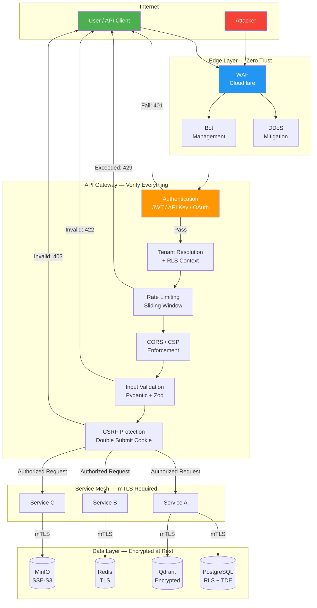
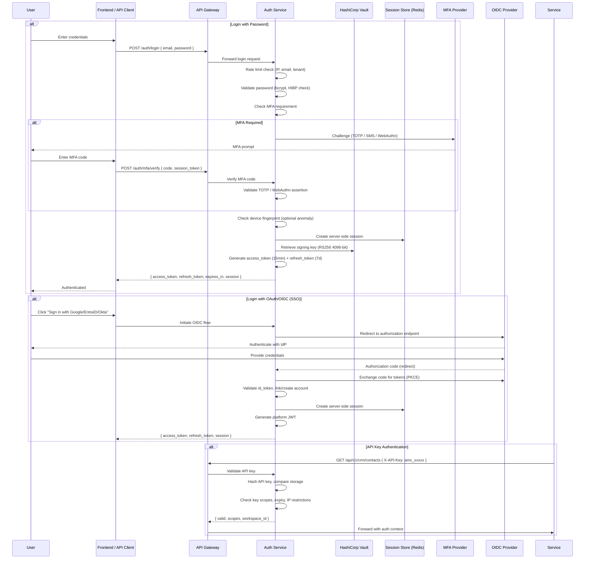
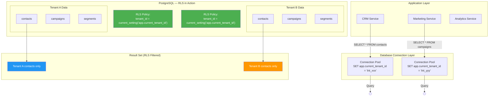
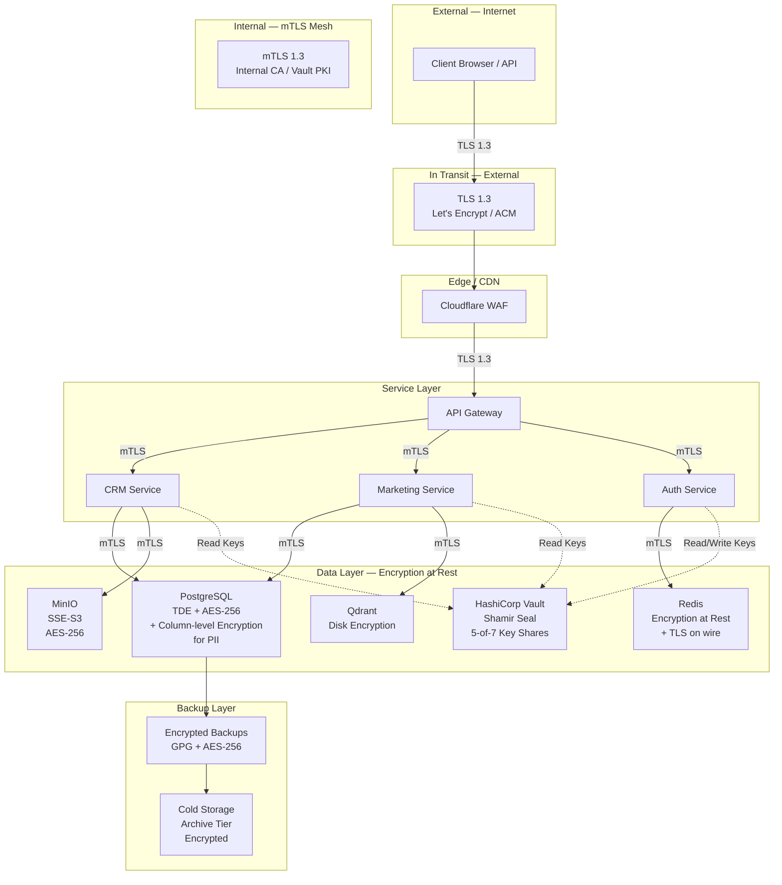
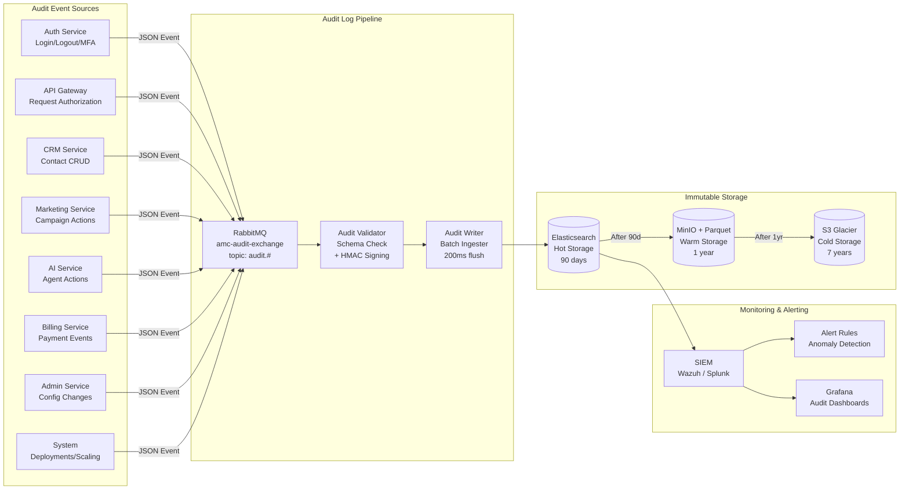
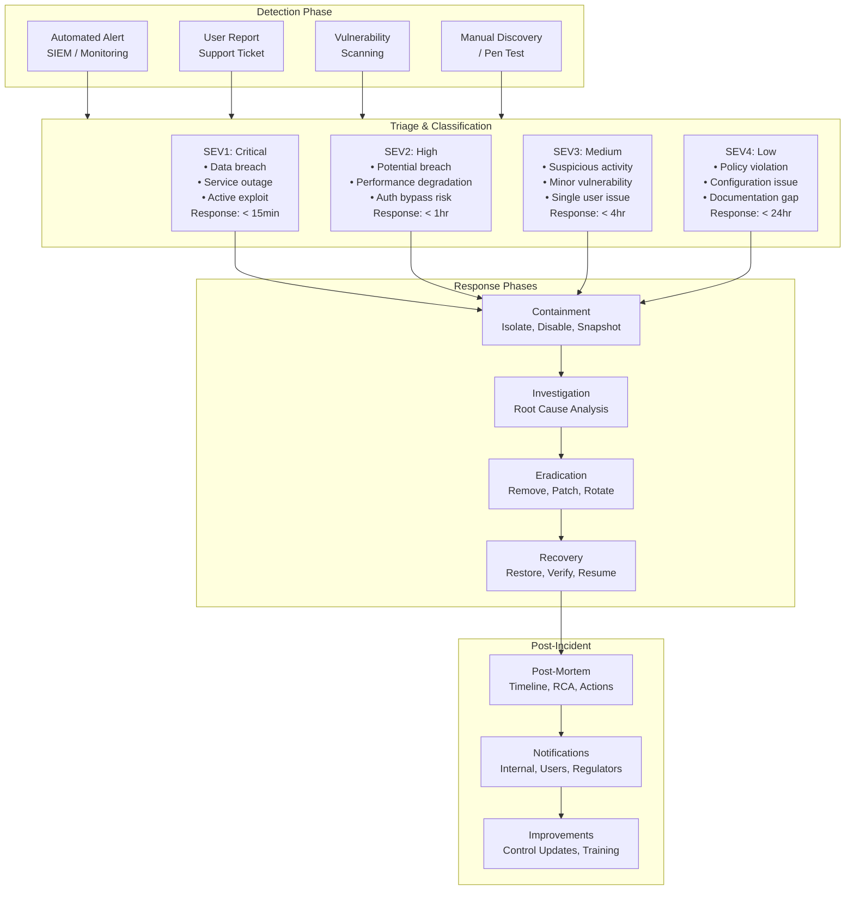

# Volume 10: Security Architecture and Compliance

> **Document Version:** 1.0  
> **Classification:** Internal — Security & Engineering  
> **Date:** June 2026  
> **Author:** Security Engineering Team  
> **Status:** ✅ Complete  
> **Applies To:** Aegis Marketing Cloud (AMC) — All Modules & Services

---

## Table of Contents

1. [Security Philosophy & Guiding Principles](#1-security-philosophy--guiding-principles)
2. [Threat Model (STRIDE per Module)](#2-threat-model-stride-per-module)
3. [Authentication Security](#3-authentication-security)
4. [Authorization & Access Control](#4-authorization--access-control)
5. [Data Security](#5-data-security)
6. [Network Security](#6-network-security)
7. [Application Security](#7-application-security)
8. [Secrets Management](#8-secrets-management)
9. [Audit Logging](#9-audit-logging)
10. [Compliance Framework](#10-compliance-framework)
11. [Incident Response Plan](#11-incident-response-plan)
12. [Security Monitoring & Alerting](#12-security-monitoring--alerting)
13. [Third-Party Security](#13-third-party-security)
14. [Security Checklists](#14-security-checklists)

---

## 1. Security Philosophy & Guiding Principles

### 1.1 Security Vision

AMC's security program is built on the premise that **trust is the foundation of the platform**. As a multi-tenant SaaS platform handling PII (email, phone, IP addresses), marketing campaign data, billing information (via Stripe), and AI-processed content, security is not a feature — it is an architectural invariant.

### 1.2 Core Principles

#### Zero Trust Architecture (Never Trust, Always Verify)

AMC operates on a zero-trust model: no entity — user, service, or network — is trusted by default. Every request is authenticated, authorized, and encrypted regardless of origin.



**Zero Trust enforcement points:**

| Control Point | Mechanism | Verification |
|--------------|-----------|-------------|
| Edge / CDN | Cloudflare WAF + Bot Management | TLS 1.3, certificate validation, bot score |
| API Gateway | Auth middleware | Every request validated (JWT, API Key, or OAuth session) |
| Service-to-Service | mTLS | Mutual certificate validation every 30 days |
| Database | RLS + `app.current_tenant_id` | Every query scoped by policy |
| Object Storage | IAM-style bucket policies | Every access validated against policy |
| Message Queue | TLS + SASL | Every connection authenticated |
| Cache | Redis ACL + TLS | Every command authorized |

#### Defense in Depth (Multiple Security Layers)

No single security control is relied upon. If one layer is breached, subsequent layers provide protection.

```
Layer 1: Edge Security
├── Cloudflare WAF (OWASP Top 10 ruleset)
├── DDoS mitigation (L3/L4/L7)
├── Bot management (challenge + rate limit)
└── TLS 1.3 termination

Layer 2: Application Security
├── Input validation (Pydantic / Zod)
├── Output encoding (React XSS prevention)
├── CSRF tokens (Double Submit Cookie)
├── CSP headers (strict-dynamic)
├── CORS (origin allowlisting)
├── Rate limiting (sliding window)
├── Request size limiting
└── SSRF prevention (URL allowlist)

Layer 3: Authentication & Authorization
├── JWT (RS256, 15min access token)
├── MFA (TOTP / WebAuthn / SMS fallback)
├── RBAC (role-permission matrix)
├── RLS (database-level tenant isolation)
├── API key scoping
└── Session management (server-side)

Layer 4: Data Security
├── TLS 1.3 in transit (external + internal mTLS)
├── AES-256 at rest (TDE + column-level)
├── PII classification and column encryption
├── Data masking for support agents
├── Encrypted backups
└── Secure deletion (overwrite + disk encryption)

Layer 5: Monitoring & Response
├── Audit logging (immutable, HMAC-chained)
├── SIEM integration (anomaly detection)
├── DAST/SAST scanning (CI/CD pipeline)
├── Penetration testing (quarterly)
├── Incident response plan
└── Bug bounty program
```

#### Least Privilege (Minimum Access Required)

Every user, service, and system component operates with the minimum permissions necessary to perform its function.

- **Users:** Assigned to roles with granular permissions (module:action:scope). No user can elevate their own privileges.
- **Services:** Service accounts have scoped API keys with specific module access. AI agents operate under user-inherited permissions with explicit tool access.
- **Database:** Service accounts connect with roles that have only required table permissions. RLS ensures row-level scoping.
- **Infrastructure:** IAM roles grant only required cloud actions. No human has direct production access without audit trail.

#### Privacy by Design (Data Protection Built into Architecture)

Privacy is embedded into every architectural decision, not bolted on after the fact.

- **Data minimization:** AMC collects only data necessary for marketing operations. Custom fields are classified at creation (PII vs. non-PII).
- **Purpose limitation:** Data is processed only for the purpose it was collected. AI agents cannot repurpose contact data for anything other than the explicitly authorized campaign.
- **Storage limitation:** Data retention policies are enforced at the database level. Expired data is automatically purged.
- **Consent management:** Every contact record tracks consent status, consent timestamp, and consent source. AI processing requires explicit consent.
- **Tenant isolation:** Underpins privacy — one tenant cannot access another tenant's data under any circumstance.

#### Secure by Default (Secure Configuration Out of the Box)

Default configurations are the most secure configuration. Users must opt in to reduced security.

- **New workspaces:** All security features enabled by default (MFA optional for members, required for admins).
- **API endpoints:** Require authentication by default. Public endpoints are explicitly marked and reviewed.
- **File uploads:** Scanned for malware, limited to safe types, stored in isolated buckets.
- **Integrations:** OAuth scopes default to read-only. Write access requires explicit user confirmation.
- **New users:** Created with viewer role. Privilege escalation requires workspace admin approval.

#### Assume Breach (Design for Compromise Detection and Containment)

AMC's architecture assumes that a breach will occur and is designed to detect, contain, and recover from compromise.

- **Blast radius containment:** Tenant isolation ensures a compromise in one workspace cannot affect others. Service segmentation limits lateral movement.
- **Detection:** Comprehensive audit logging (immutable, HMAC-chained) combined with SIEM-based anomaly detection.
- **Containment:** Automated response playbooks (isolate tenant, disable user, revoke tokens) trigger on defined signals.
- **Recovery:** Immutable infrastructure + encrypted backups enable rapid recovery. Database point-in-time recovery (PITR) to any point in the last 30 days.
- **Forensics:** Snapshot-based forensic capture of compromised environments preserves evidence without destroying production data.

---

## 2. Threat Model (STRIDE per Module)

### 2.1 Methodology

AMC applies the STRIDE threat modeling framework to every module and service. Each threat is categorized, assessed for severity (CVSS 3.1), and assigned a mitigation strategy.

**STRIDE categories:**

| Category | Definition | Example |
|----------|-----------|---------|
| **S**poofing | Impersonating a user, service, or system | Forging a JWT, stealing API keys |
| **T**ampering | Modifying data or code in transit or at rest | SQL injection, modifying campaign content |
| **R**epudiation | Denying an action occurred without proof | Deleting contacts without audit trail |
| **I**nformation Disclosure | Exposing data to unauthorized parties | Tenant data leak through API |
| **D**enial of Service | Disrupting service availability | Resource exhaustion, DDoS |
| **E**levation of Privilege | Gaining unauthorized access level | Tenant escalation, role escalation |

### 2.2 Module-by-Module Threat Analysis

#### Core Modules

| Module | Threat | Category | CVSS | Attack Vector | Mitigation |
|--------|--------|----------|------|---------------|------------|
| **CRM** | Attacker accesses contacts of another tenant via API parameter manipulation | I | 9.1 | Modify `tenant_id` in API request | RLS enforces tenant scoping; API does not accept `tenant_id` as parameter; authorization middleware validates workspace membership |
| **CRM** | Attacker creates contacts with malicious payloads in custom fields | T | 6.1 | XSS in custom field value | Input validation (Pydantic); output encoding; CSP prevents script execution |
| **CRM** | Insider threat exports all contacts to personal storage | I | 7.4 | Bulk export API | Rate limiting on export; audit logging of all exports; data loss prevention (DLP) alerts on >1000 records exported in 5min |
| **CRM** | Deleted contacts recovered from backups without authorization | E | 5.0 | Access to backup storage | Encrypted backups with separate key; backup access requires MFA + justification; automated backup integrity verification |
| **Marketing** | Campaign email sent to wrong tenant's contact list | I | 8.5 | Cross-tenant campaign assignment | Campaign-contact join enforces same-workspace constraint; segment queries scoped by RLS; approval workflow for campaign launch |
| **Marketing** | Attacker tampers with campaign content mid-flight | T | 7.5 | Man-in-the-middle on campaign config | mTLS between services; immutable campaign versioning; checksum verification on send |
| **Marketing** | DoS via massive campaign send request | D | 6.5 | API spam | Campaign launch rate limited per workspace; concurrency limits on email sending; queue-based dispatch |
| **Projects** | Task assigned to user in different workspace | E | 8.0 | User ID manipulation in assignment API | Workspace membership verification before assignment; RLS on task tables |
| **Projects** | File upload in task contains malware | T | 7.3 | Malicious file upload | File type validation (magic bytes); ClamAV scanning; size limits (10MB default); isolated storage bucket |
| **Knowledge** | AI agent exposes sensitive knowledge base content to unauthorized user | I | 8.2 | Prompt injection or privilege escalation | AI agent operates with user's permissions; knowledge base RLS scoped; agent audit logging; content classification for sensitivity |
| **Knowledge** | Attacker modifies knowledge base content to influence AI behavior | T | 7.8 | Unauthorized edit of KB | Version-controlled KB (immutable history); edit requires editor role; approval workflow for published content |

#### Infrastructure Services

| Module | Threat | Category | CVSS | Attack Vector | Mitigation |
|--------|--------|----------|------|---------------|------------|
| **Auth Service** | JWT forged with weak or exposed signing key | S | 10.0 | RSA private key leak | RS256 with 4096-bit key; key rotation every 90 days; Vault-stored keys; key access audited |
| **Auth Service** | Brute force password attack | S | 6.5 | Repeated login attempts | Rate limiting (per IP, per email, per tenant); account lockout after 5 failures; MFA bypass not possible for password-only |
| **Auth Service** | Refresh token theft leads to session hijacking | S | 7.2 | XSS or token storage vulnerability | Refresh tokens stored server-side; rotation on each use; limited to 7-day window; device fingerprint for anomaly detection |
| **Billing Service** | Attacker accesses another tenant's billing history | I | 9.0 | URL manipulation in billing API | RLS on billing tables; Stripe API keys are tenant-scoped; billing webhooks verified by Stripe signature |
| **Billing Service** | Payment information leakage via logs | I | 7.5 | Logs containing card data | Stripe tokenizes all card data; AMC never handles raw card numbers; PII scrubber on all log output; no sensitive data in structured logs |
| **Notification Service** | Email notification sent to wrong recipient | I | 7.8 | Recipient field manipulation | Notification template resolved from contact record; RLS on contact queries; double-opt-in confirmation for critical notifications |
| **Notification Service** | SMS flood via unauthenticated notification endpoint | D | 6.0 | Unauthenticated notification trigger | All notification endpoints require authentication; per-workspace rate limits on SMS sending |
| **Media Service** | Malicious image contains steganographic payload | I | 5.5 | Uploaded image with embedded data | Image reprocessing strips metadata; malware scanning; file type enforcement |
| **Media Service** | DoS via oversized image processing | D | 6.5 | Large file upload | Upload size limits (50MB default); processing timeout; queue-based processing prevents resource exhaustion |
| **Admin Service** | Admin bypasses tenant isolation for system-wide query | E | 9.5 | Direct database access or admin API abuse | Admin actions require MFA; audit logged with full context; admin API uses dedicated role with scope-limited access; break-glass procedure requires two-person rule |
| **AI Service** | Prompt injection causes AI agent to execute unauthorized actions | E | 8.8 | Crafted prompt in campaign content | Agent tool registry with explicit allowlist; human-in-the-loop for destructive actions; agent action audit trail; rate limits on agent actions |
| **AI Service** | AI model output contains PII from training data | I | 6.5 | Model memorization | RAG-only approach (no fine-tuning on tenant data); output filtering for PII patterns; AI response audit logging |
| **Automation (n8n)** | Workflow executes with elevated privileges via credential theft | E | 9.0 | Stored credentials in n8n | n8n credentials stored encrypted at rest; AMC integration uses scoped API keys; workflow approval workflow; audit log of all workflow executions |
| **Automation (n8n)** | Workflow infinite loop causes DoS | D | 6.0 | Poorly designed workflow | Workflow execution timeout (max 30min); recursion detection; per-workspace execution concurrency limits |

#### Data Layer Threats

| Component | Threat | Category | CVSS | Attack Vector | Mitigation |
|-----------|--------|----------|------|---------------|------------|
| **PostgreSQL** | SQL injection via ORM bypass | T | 8.0 | Raw SQL execution | Parameterized queries enforced; ORM-only policy; SAST checks for raw SQL; database user has no TRUNCATE/DROP permissions |
| **PostgreSQL** | Data exfiltration via database backup | I | 7.5 | Backup file theft | Backup encryption (AES-256); backup storage isolated in VPC; backup access requires MFA |
| **Redis** | Cache poisoning via unauthenticated connection | T | 7.0 | Redis exposed without auth | Redis ACL required; TLS in transit; bind to private subnet only; no sensitive PII in cache (only IDs and non-PII data) |
| **MinIO** | Unauthorized access to object storage | I | 8.5 | Misconfigured bucket policy | Bucket policies enforced per tenant; SSE-S3 encryption; access logs sent to SIEM; periodic policy audit |
| **Qdrant** | Vector search returns data from another tenant | I | 9.0 | Missing collection isolation | Collection-per-tenant enforced by middleware; API key validation before each query; no cross-collection search |
| **RabbitMQ** | Message queue eavesdropping | I | 6.5 | Unencrypted message broker | TLS for all connections; SASL authentication; VPC isolation; messages encrypted at rest (ERM plugin) |

### 2.3 Trust Boundaries

The following trust boundaries exist within AMC's architecture, each enforced by specific security controls:

```
Trust Boundary 1: Internet → Cloudflare Edge
  Controls: WAF, DDoS mitigation, TLS 1.3, bot management

Trust Boundary 2: Cloudflare Edge → API Gateway
  Controls: mTLS between Cloudflare and origin, IP allowlisting

Trust Boundary 3: API Gateway → Service Layer
  Controls: mTLS, JWT validation, authorization middleware, rate limiting

Trust Boundary 4: Service Layer → Data Layer
  Controls: mTLS, IAM policies, database user permissions, RLS

Trust Boundary 5: Service Layer → AI Layer
  Controls: mTLS, API key scoping, tool registry allowlist

Trust Boundary 6: Internal Service → Internal Service
  Controls: mTLS, service mesh authorization policies
```

### 2.4 Threat Mitigation Summary

| Mitigation Type | Controls | Coverage |
|----------------|----------|----------|
| **Preventative** | WAF, input validation, auth, RBAC, RLS, encryption | All threats |
| **Detective** | Audit logging, SIEM, anomaly detection, intrusion detection | All modules |
| **Corrective** | Incident response, backup restore, automated containment | All services |
| **Deterrent** | Penetration testing, bug bounty, security reviews | Full stack |
| **Compensating** | MFA, rate limiting, account lockout, data masking | Auth, API, UI |

---

## 3. Authentication Security

### 3.1 Authentication Architecture Overview

AMC uses a **multi-factor, multi-method authentication system** supporting JWT (primary), OAuth 2.0 / OIDC (enterprise SSO), and API keys (automation). The authentication service is a standalone microservice (`auth-service`) with its own dedicated database for credentials and sessions.



### 3.2 JWT Implementation

| Parameter | Specification |
|-----------|--------------|
| **Algorithm** | RS256 (RSA PKCS#1 v1.5 with SHA-256) |
| **Key Size** | 4096 bits |
| **Key Storage** | HashiCorp Vault (transit secrets engine) |
| **Key Rotation** | Every 90 days; immediate rotation on suspected compromise |
| **Key Per Environment** | Separate key pairs for dev, staging, production |
| **Access Token TTL** | 15 minutes |
| **Refresh Token TTL** | 7 days |
| **Refresh Token Rotation** | Yes — old refresh token invalidated on use |
| **Token Issuer** | `amc.io/auth` |
| **Token Audience** | `amc.io/api` |

**JWT Payload Structure:**

```json
{
  "sub": "usr_2f8a3b1c9d",
  "iss": "amc.io/auth",
  "aud": "amc.io/api",
  "iat": 1718200000,
  "exp": 1718200900,
  "ws_id": "ws_4e5f6a7b8c",
  "tenant_id": "tnt_1a2b3c4d5e",
  "roles": ["workspace_admin", "campaign_manager"],
  "scopes": ["crm:contact:read:workspace", "crm:contact:write:workspace", "marketing:campaign:read:workspace", "marketing:campaign:write:workspace"],
  "mfa": true,
  "auth_method": "password|oauth|apikey"
}
```

**Token Validation Middleware:**

```python
# middleware/auth.py
@dataclass
class TokenPayload:
    sub: str
    iss: str
    aud: str
    exp: int
    iat: int
    ws_id: str
    tenant_id: str
    roles: list[str]
    scopes: list[str]
    mfa: bool
    auth_method: str

class AuthMiddleware:
    """Validates JWT or API key on every request. Sets request context."""

    PUBLIC_PATHS = {
        "/health", "/metrics", "/docs", "/openapi.json",
        "/auth/login", "/auth/register", "/auth/mfa/verify",
        "/auth/oauth/authorize", "/auth/oauth/callback",
        "/auth/password/reset", "/auth/password/reset/confirm",
    }

    async def __call__(self, request: Request, call_next: ASGIApp):
        if request.url.path in self.PUBLIC_PATHS:
            return await call_next(request)

        auth_header = request.headers.get("Authorization", "")
        api_key = request.headers.get("X-API-Key", "")

        if auth_header.startswith("Bearer "):
            token = auth_header[7:]
            payload = await self._validate_jwt(token)
        elif api_key:
            payload = await self._validate_api_key(api_key)
        else:
            raise HTTPException(status_code=401, detail="Authentication required")

        # Verify token not revoked
        if await self._is_revoked(payload.sub, payload.exp):
            raise HTTPException(status_code=401, detail="Token revoked")

        # Set request context
        request.state.user = UserContext(
            user_id=payload.sub,
            workspace_id=payload.ws_id,
            tenant_id=payload.tenant_id,
            roles=payload.roles,
            scopes=payload.scopes,
            mfa_verified=payload.mfa,
            auth_method=payload.auth_method,
        )

        return await call_next(request)
```

### 3.3 Password Policies

| Policy | Requirement | Enforcement |
|--------|-------------|-------------|
| **Minimum Length** | 12 characters | Enforced at registration and password change |
| **Maximum Length** | 128 characters | Enforced at input |
| **Complexity** | Must contain 3 of 4: uppercase, lowercase, digit, special character | Enforced at registration |
| **Breach Check** | Checked against Have I Been Pwned (HIBP) API via k-anonymity model | Enforced at registration and password change; password rejected if breached |
| **Password History** | Last 10 passwords prohibited | Enforced at password change |
| **Password Expiry** | 90 days (optional, tenant-configurable) | Configurable per workspace policy |
| **Common Passwords** | Blocklist of top 10,000 common passwords | Enforced at registration |
| **Reset Token** | 128-bit random, single-use, 1-hour expiry | Enforced by auth service |

```python
# lib/password_policy.py
import re
import hashlib
import httpx

PASSWORD_MIN_LENGTH = 12
PASSWORD_MAX_LENGTH = 128
COMPLEXITY_REGEX = re.compile(
    r'^(?:(?=.*[a-z])(?=.*[A-Z])(?=.*\d)|'
    r'(?=.*[a-z])(?=.*[A-Z])(?=.*[^a-zA-Z\d])|'
    r'(?=.*[a-z])(?=.*\d)(?=.*[^a-zA-Z\d])|'
    r'(?=.*[A-Z])(?=.*\d)(?=.*[^a-zA-Z\d])).+$'
)

async def validate_password(password: str) -> list[str]:
    """Validate password against policy. Returns list of violations."""
    violations = []

    if len(password) < PASSWORD_MIN_LENGTH:
        violations.append(f"Password must be at least {PASSWORD_MIN_LENGTH} characters")

    if not COMPLEXITY_REGEX.match(password):
        violations.append("Password must contain 3 of 4: uppercase, lowercase, digit, special character")

    # HIBP check via k-anonymity (only first 5 chars of SHA-1 hash sent)
    sha1_hash = hashlib.sha1(password.encode()).hexdigest().upper()
    prefix, suffix = sha1_hash[:5], sha1_hash[5:]
    async with httpx.AsyncClient() as client:
        resp = await client.get(f"https://api.pwnedpasswords.com/range/{prefix}")
        if resp.status_code == 200:
            hashes = [line.split(":")[0] for line in resp.text.splitlines()]
            if suffix in hashes:
                violations.append("Password has been exposed in a data breach")

    return violations
```

### 3.4 Password Hashing

| Parameter | Specification |
|-----------|--------------|
| **Algorithm** | bcrypt |
| **Cost Factor** | 12 (2^12 = 4,096 rounds) |
| **Salt** | Automatic (16 bytes, embedded in output) |
| **Library** | `bcrypt` (Python) / `bcryptjs` (Node.js) |
| **Upgrade Policy** | Re-hash on next login if cost factor < 12 |

```python
import bcrypt

def hash_password(password: str) -> str:
    """Hash password with bcrypt, cost factor 12."""
    return bcrypt.hashpw(
        password.encode("utf-8"),
        bcrypt.gensalt(rounds=12)
    ).decode("utf-8")

def verify_password(password: str, hashed: str) -> bool:
    """Verify password against bcrypt hash."""
    return bcrypt.checkpw(
        password.encode("utf-8"),
        hashed.encode("utf-8")
    )
```

### 3.5 Multi-Factor Authentication (MFA)

| Method | Support | Enrollment | Fallback |
|--------|---------|------------|----------|
| **TOTP** (Time-based One-Time Password) | Primary | QR code scan (Google Authenticator, Authy, 1Password) | Backup codes (10 x single-use, 8-character) |
| **SMS** (SMS OTP) | Fallback | Phone number verification | TOTP recommended; SMS used only when TOTP unavailable |
| **WebAuthn/FIDO2** | Hardware security key | Platform authenticator (Touch ID, Windows Hello) or YubiKey | TOTP fallback for lost keys |

**MFA Enforcement Matrix:**

| User Type | MFA Policy |
|-----------|-----------|
| Workspace Admin | **Required** — cannot disable |
| Campaign Manager | Required (configurable per workspace) |
| Content Creator | Optional (recommended) |
| Viewer | Optional |
| API Only | Not applicable (uses API keys) |
| AMC Staff (Support) | **Required** — hardware security key (WebAuthn) + TOTP |
| AMC Staff (Engineering) | **Required** — hardware security key (WebAuthn) + TOTP |

**MFA Implementation:**

```python
# services/auth/mfa.py
import pyotp
import qrcode
import io
import base64

class MFAService:
    """Multi-factor authentication service."""

    def generate_totp_secret(self) -> tuple[str, str]:
        """Generate TOTP secret and provisioning URI."""
        secret = pyotp.random_base32()
        totp = pyotp.TOTP(secret)
        uri = totp.provisioning_uri(
            name="AMC",
            issuer_name="Aegis Marketing Cloud"
        )
        return secret, uri

    def verify_totp(self, secret: str, code: str) -> bool:
        """Verify TOTP code with 30s window (allows 1 step skew)."""
        totp = pyotp.TOTP(secret)
        return totp.verify(code, valid_window=1)

    def generate_backup_codes(self, count: int = 10) -> list[str]:
        """Generate single-use backup codes, stored as bcrypt hashes."""
        import secrets
        codes = []
        for _ in range(count):
            code = secrets.token_hex(4)  # 8-char hex
            codes.append(code.upper())
        return codes

    def verify_webauthn(self, credential_id: bytes, assertion: dict) -> bool:
        """Verify WebAuthn assertion against stored credential.
        
        Uses webauthn-lib library for full RPID, challenge, origin validation.
        """
        from webauthn import verify_authentication_response
        from webauthn.helpers.structs import AuthenticationCredential

        credential = AuthenticationCredential.parse(assertion)
        result = verify_authentication_response(
            credential=credential,
            expected_challenge=self._get_challenge(credential_id),
            expected_rp_id="amc.io",
            expected_origin="https://app.amc.io",
            credential_public_key=self._get_public_key(credential_id),
            credential_current_sign_count=self._get_sign_count(credential_id),
        )
        return result.verified
```

### 3.6 OAuth 2.0 / OpenID Connect

| Parameter | Specification |
|-----------|--------------|
| **Supported Providers** | Google Workspace, Microsoft Entra ID, Okta, Any OIDC-compliant IdP |
| **Grant Type** | Authorization Code with PKCE |
| **PKCE** | Required (S256 code challenge method) |
| **State Parameter** | Required (anti-CSRF, 128-bit random, single-use) |
| **Nonce** | Required (replay protection, embedded in id_token) |
| **Redirect URI Validation** | Exact match against allowlist; no open redirectors |
| **Token Storage** | Server-side session; never expose OAuth tokens to client |
| **IdP Linking** | One AMC account can link multiple IdP identities |

**OAuth Configuration Example:**

```python
OAUTH_PROVIDERS = {
    "google": {
        "authorize_url": "https://accounts.google.com/o/oauth2/v2/auth",
        "token_url": "https://oauth2.googleapis.com/token",
        "jwks_url": "https://www.googleapis.com/oauth2/v3/certs",
        "scopes": ["openid", "email", "profile"],
        "redirect_uri": "https://app.amc.io/auth/oauth/callback/google",
    },
    "azure": {
        "authorize_url": "https://login.microsoftonline.com/{tenant}/oauth2/v2.0/authorize",
        "token_url": "https://login.microsoftonline.com/{tenant}/oauth2/v2.0/token",
        "jwks_url": "https://login.microsoftonline.com/{tenant}/discovery/v2.0/keys",
        "scopes": ["openid", "email", "profile"],
        "redirect_uri": "https://app.amc.io/auth/oauth/callback/azure",
    },
    "okta": {
        "authorize_url": "https://{domain}.okta.com/oauth2/default/v1/authorize",
        "token_url": "https://{domain}.okta.com/oauth2/default/v1/token",
        "jwks_url": "https://{domain}.okta.com/oauth2/default/v1/keys",
        "scopes": ["openid", "email", "profile"],
        "redirect_uri": "https://app.amc.io/auth/oauth/callback/okta",
    },
}
```

### 3.7 Session Management

| Parameter | Specification |
|-----------|--------------|
| **Session Store** | Redis (server-side, encrypted at rest) |
| **Session ID** | 256-bit random (via `secrets.token_urlsafe(32)`) |
| **Session Binding** | Bound to user + IP + user-agent + device fingerprint (optional) |
| **Session TTL** | 8 hours (sliding, reset on activity) |
| **Absolute Timeout** | 24 hours (re-authentication required) |
| **Concurrent Sessions** | Max 5 per user (configurable per workspace) |
| **Rotation on Privilege Escalation** | Session invalidated, new session created |
| **Revocation** | Immediate — session deleted from Redis; blacklist propagated in < 1s |
| **Session Cookie** | `__Secure-amc-session`; `HttpOnly`, `Secure`, `SameSite=Lax`; `Path=/api` |

```python
# services/auth/session.py
class SessionManager:
    """Server-side session management."""

    SESSION_TTL = 8 * 3600  # 8 hours (sliding)
    ABSOLUTE_TTL = 24 * 3600  # 24 hours (absolute)
    MAX_CONCURRENT = 5

    async def create_session(
        self, user_id: str, workspace_id: str,
        ip: str, user_agent: str, device_fingerprint: str | None = None
    ) -> str:
        """Create server-side session, return session ID."""
        # Enforce concurrent session limit
        sessions = await self._get_user_sessions(user_id)
        if len(sessions) >= self.MAX_CONCURRENT:
            # Revoke oldest session
            oldest = min(sessions, key=lambda s: s["created_at"])
            await self._revoke(oldest["session_id"])

        session_id = secrets.token_urlsafe(32)
        session_data = {
            "user_id": user_id,
            "workspace_id": workspace_id,
            "ip": ip,
            "user_agent": user_agent,
            "device_fingerprint": device_fingerprint,
            "created_at": int(time.time()),
            "last_activity": int(time.time()),
            "mfa_verified": True,
        }
        await self.redis.setex(
            f"session:{session_id}",
            self.ABSOLUTE_TTL,
            json.dumps(session_data)
        )
        return session_id

    async def rotate_on_elevation(self, session_id: str) -> str:
        """Invalidate old session, create new one (privilege escalation)."""
        old_session = await self.get_session(session_id)
        if old_session:
            await self._revoke(session_id)
        return await self.create_session(
            user_id=old_session["user_id"],
            workspace_id=old_session["workspace_id"],
            ip=old_session["ip"],
            user_agent=old_session["user_agent"],
        )
```

### 3.8 API Key Security

| Parameter | Specification |
|-----------|--------------|
| **Prefix** | `amc_` (detectable key type without revealing full key) |
| **Length** | 48 characters (256-bit random, base62 encoded) |
| **Storage** | SHA-256 hashed (bcrypt for additional cost) |
| **Visible Once** | Key shown only at creation (full key); thereafter only last 4 chars |
| **Scope Restriction** | Module-specific (`crm:contact:read`, `marketing:campaign:write`) |
| **IP Restriction** | Optional — bind key to specific IP/CIDR ranges |
| **Expiration** | Optional — key auto-expires after configurable period |
| **Rotation Policy** | Recommend 90-day rotation; auto-rotate for Enterprise tier |
| **Max Keys Per User** | 10 (configurable per workspace) |

```python
# services/auth/api_keys.py
import secrets
import hashlib

class APIKeyManager:
    """API key generation, storage, and validation."""

    KEY_PREFIX = "amc_"
    KEY_LENGTH = 48
    KEY_CHARS = "0123456789ABCDEFGHIJKLMNOPQRSTUVWXYZabcdefghijklmnopqrstuvwxyz"

    def generate_key(self) -> tuple[str, str]:
        """Generate API key and return (full_key, key_hash)."""
        raw = ''.join(secrets.choice(self.KEY_CHARS) for _ in range(self.KEY_LENGTH))
        full_key = f"{self.KEY_PREFIX}{raw}"
        key_hash = hashlib.sha256(full_key.encode()).hexdigest()
        return full_key, key_hash

    def hash_key(self, key: str) -> str:
        """Hash a full key for comparison."""
        return hashlib.sha256(key.encode()).hexdigest()

    async def validate_key(
        self, key: str, required_scope: str, ip: str
    ) -> KeyContext | None:
        """Validate API key, check scope and IP restrictions."""
        key_hash = self.hash_key(key)
        stored = await self._get_stored_key(key_hash)
        if not stored:
            return None

        # Check expiration
        if stored["expires_at"] and stored["expires_at"] < time.time():
            return None

        # Check IP restriction
        if stored["allowed_ips"]:
            if not self._ip_allowed(ip, stored["allowed_ips"]):
                return None

        # Check scope
        if not self._scope_satisfies(required_scope, stored["scopes"]):
            return None

        return KeyContext(
            key_id=stored["id"],
            user_id=stored["user_id"],
            workspace_id=stored["workspace_id"],
            scopes=stored["scopes"],
        )
```

### 3.9 Login Rate Limiting

| Dimension | Limit | Window | Action |
|-----------|-------|--------|--------|
| **Per IP** | 10 attempts | 1 minute | Block for 5 minutes after exceeded |
| **Per Email** | 5 attempts | 1 minute | Block for 15 minutes after exceeded |
| **Per Tenant (workspace)** | 50 attempts | 1 minute | Block for 5 minutes after exceeded |
| **Per Global** | 500 attempts | 1 minute | Emergency block; notify security team |

```python
# middleware/rate_limit.py
class LoginRateLimiter:
    """Multi-dimensional rate limiting for login endpoints."""

    async def check_login_rate_limit(self, ip: str, email: str, tenant_id: str):
        """Check all rate limit dimensions. Raises HTTPException if exceeded."""
        checks = [
            ("ip", ip, 10, 60, 300),        # 10 req/min → 5min block
            ("email", email, 5, 60, 900),    # 5 req/min → 15min block
            ("tenant", tenant_id, 50, 60, 300),  # 50 req/min → 5min block
        ]

        for dimension, key, max_attempts, window, block_duration in checks:
            redis_key = f"ratelimit:login:{dimension}:{key}"
            count = await self.redis.incr(redis_key)
            if count == 1:
                await self.redis.expire(redis_key, window)
            if count > max_attempts:
                # Block
                block_key = f"ratelimit:block:{dimension}:{key}"
                await self.redis.setex(block_key, block_duration, "1")
                raise HTTPException(
                    status_code=429,
                    detail=f"Too many login attempts. Try again in {block_duration // 60} minutes."
                )
```

### 3.10 Account Lockout

| Parameter | Specification |
|-----------|--------------|
| **Failed Attempts Threshold** | 5 consecutive failed logins |
| **Lockout Duration** | 15 minutes (automatic unlock) |
| **Lockout Escalation** | After 3 lockouts within 24h → 24-hour lockout + admin notification |
| **Failed Attempts Counter** | Reset on successful login or after 1 hour of inactivity |
| **Admin Unlock** | Workspace admins can unlock users (audit logged) |
| **Notification** | User notified via email after each lockout; admin notified after escalation |

### 3.11 Device Fingerprinting (Optional, Anomaly Detection)

Device fingerprinting is **optional** and used solely for anomaly detection, not authentication. Users are informed via privacy notice.

| Signal | Collection | Storage |
|--------|-----------|---------|
| User-Agent | Browser header | SHA-256 hashed, no raw UA stored |
| Screen Resolution | JavaScript API | Stored as generalized category |
| Timezone | JavaScript `Intl.DateTimeFormat` | Raw value |
| Language | `navigator.language` | Raw value |
| WebGL Vendor | `canvas.getContext('webgl')` | Generalized (GPU family, not specific) |
| Platform | `navigator.platform` | Raw value |

**Anomaly Detection Rules:**

- Login from unrecognized device + new geographic region → MFA challenge
- Login from device with fingerprint matching known attacker pattern → Block + alert
- Rapid device fingerprint changes in single session → Terminate session + alert

---

## 4. Authorization & Access Control

### 4.1 RBAC Model

AMC implements a **Role-Based Access Control (RBAC)** system with hierarchical roles and granular permission definitions. Permissions are evaluated at every API endpoint, every database query, and every action — including AI agent actions.

```mermaid
graph TB
    subgraph Users["Users"]
        U1["User A"]
        U2["User B"]
        U3["User C"]
    end

    subgraph Roles["Predefined Roles"]
        R1["Workspace Admin<br/>(Full Access)"]
        R2["Campaign Manager<br/>(Marketing + CRM)"]
        R3["Content Creator<br/>(Content + Knowledge)"]
        R4["Viewer<br/>(Read Only)"]
        R5["API Only<br/>(API Key Auth)"]
    end

    subgraph Permissions["Permission Definitions"]
        P1["crm:contact:read:workspace"]
        P2["crm:contact:write:workspace"]
        P3["crm:contact:delete:workspace"]
        P4["marketing:campaign:read:workspace"]
        P5["marketing:campaign:write:workspace"]
        P6["marketing:campaign:launch"]
        P7["content:create:workspace"]
        P8["content:publish"]
        P9["knowledge:read:workspace"]
        P10["knowledge:write:workspace"]
        P11["settings:billing:read"]
        P12["settings:workspace:admin"]
        P13["analytics:read:workspace"]
        P14["automation:workflow:write"]
        P15["ai:agent:invoke"]
    end

    U1 --> R1
    U2 --> R2
    U3 --> R3

    R1 --> P1
    R1 --> P2
    R1 --> P3
    R1 --> P4
    R1 --> P5
    R1 --> P6
    R1 --> P7
    R1 --> P8
    R1 --> P9
    R1 --> P10
    R1 --> P11
    R1 --> P12
    R1 --> P13
    R1 --> P14
    R1 --> P15

    R2 --> P1
    R2 --> P2
    R2 --> P3
    R2 --> P4
    R2 --> P5
    R2 --> P6
    R2 --> P13
    R2 --> P14
    R2 --> P15

    R3 --> P7
    R3 --> P8
    R3 --> P9
    R3 --> P10
    R3 --> P13

    R4 --> P1
    R4 --> P4
    R4 --> P7
    R4 --> P9
    R4 --> P13

    R5 --->|"Scoped API Keys"| P1
    R5 --->|"Scoped API Keys"| P4
    R5 --->|"Scoped API Keys"| P13
```



### 4.2 Permission Definitions

Permissions follow the format: `{module}:{action}:{scope}:{owner}`

| Component | Values | Description |
|-----------|--------|-------------|
| **Module** | `crm`, `marketing`, `content`, `knowledge`, `projects`, `analytics`, `automation`, `ai`, `settings`, `billing`, `admin` | System module |
| **Action** | `create`, `read`, `write`, `delete`, `launch`, `publish`, `invoke`, `admin`, `export`, `import` | Allowed operation |
| **Scope** | `own`, `workspace`, `tenant` | Data scope (own records, workspace-wide, tenant-wide) |
| **Owner** (optional) | `any`, `assigned` | Additional constraint on ownership |

**Complete Permission Matrix:**

| Permission ID | Role Access | Endpoint Pattern |
|---------------|-------------|-----------------|
| `crm:contact:read:own` | Viewer, Content Creator, Campaign Manager, Admin | `GET /api/v1/crm/contacts/:id` |
| `crm:contact:read:workspace` | Campaign Manager, Admin | `GET /api/v1/crm/contacts` |
| `crm:contact:write:own` | Content Creator | `PATCH /api/v1/crm/contacts/:id` |
| `crm:contact:write:workspace` | Campaign Manager, Admin | `POST /api/v1/crm/contacts`, `PUT /api/v1/crm/contacts/:id` |
| `crm:contact:delete:workspace` | Campaign Manager, Admin | `DELETE /api/v1/crm/contacts/:id` |
| `crm:contact:import` | Campaign Manager, Admin | `POST /api/v1/crm/contacts/import` |
| `crm:contact:export` | Campaign Manager, Admin | `GET /api/v1/crm/contacts/export` |
| `crm:segment:read:workspace` | Viewer, Campaign Manager, Admin | `GET /api/v1/crm/segments` |
| `crm:segment:write:workspace` | Campaign Manager, Admin | `POST /api/v1/crm/segments` |
| `marketing:campaign:read:workspace` | Viewer, Campaign Manager, Admin | `GET /api/v1/marketing/campaigns` |
| `marketing:campaign:write:workspace` | Campaign Manager, Admin | `POST/PUT /api/v1/marketing/campaigns` |
| `marketing:campaign:delete:workspace` | Admin | `DELETE /api/v1/marketing/campaigns/:id` |
| `marketing:campaign:launch` | Campaign Manager, Admin | `POST /api/v1/marketing/campaigns/:id/launch` |
| `marketing:email:send:workspace` | Campaign Manager, Admin | `POST /api/v1/marketing/emails/send` |
| `marketing:email:template:write:workspace` | Content Creator, Campaign Manager, Admin | `POST /api/v1/marketing/templates` |
| `content:create:workspace` | Content Creator, Admin | `POST /api/v1/content` |
| `content:read:workspace` | Viewer, Content Creator, Campaign Manager, Admin | `GET /api/v1/content` |
| `content:write:workspace` | Content Creator, Admin | `PUT /api/v1/content/:id` |
| `content:publish` | Content Creator, Campaign Manager, Admin | `POST /api/v1/content/:id/publish` |
| `knowledge:read:workspace` | All roles | `GET /api/v1/knowledge` |
| `knowledge:write:workspace` | Content Creator, Admin | `POST/PUT /api/v1/knowledge` |
| `knowledge:delete:workspace` | Admin | `DELETE /api/v1/knowledge/:id` |
| `projects:task:read:own` | All roles | `GET /api/v1/projects/tasks/:id` |
| `projects:task:read:workspace` | Campaign Manager, Admin | `GET /api/v1/projects/tasks` |
| `projects:task:write:workspace` | Content Creator, Campaign Manager, Admin | `POST/PUT /api/v1/projects/tasks` |
| `analytics:read:workspace` | All roles | `GET /api/v1/analytics` |
| `analytics:export` | Campaign Manager, Admin | `GET /api/v1/analytics/export` |
| `automation:workflow:read:workspace` | Viewer, Campaign Manager, Admin | `GET /api/v1/automation/workflows` |
| `automation:workflow:write:workspace` | Campaign Manager, Admin | `POST/PUT /api/v1/automation/workflows` |
| `automation:workflow:activate` | Campaign Manager, Admin | `POST /api/v1/automation/workflows/:id/activate` |
| `ai:agent:invoke` | Campaign Manager, Admin | `POST /api/v1/ai/agents/:id/invoke` |
| `settings:workspace:read` | Admin | `GET /api/v1/settings/workspace` |
| `settings:workspace:admin` | Admin | `PUT /api/v1/settings/workspace` |
| `settings:member:manage` | Admin | `POST/DELETE /api/v1/settings/members` |
| `billing:read` | Admin | `GET /api/v1/billing` |
| `billing:manage` | Admin | `POST /api/v1/billing` |

### 4.3 Predefined Roles

| Role | Description | Permissions Included |
|------|-------------|---------------------|
| **Workspace Admin** | Full administrative access to workspace | All permissions in the workspace scope |
| **Campaign Manager** | Manages campaigns, contacts, segments, and automation | CRM (CRUD + import/export), Marketing (CRUD + launch), Content (read), Analytics (read + export), Automation (CRUD + activate), AI (invoke) |
| **Content Creator** | Creates and manages content and knowledge base | CRM (read own), Content (CRUD + publish), Knowledge (CRUD), Projects (task write), Analytics (read) |
| **Viewer** | Read-only access to workspace data | CRM (read), Marketing (read), Content (read), Knowledge (read), Analytics (read), Projects (read own) |
| **API Only** | Automation/integration only; no UI access | Scoped via API key configuration; typically CRM + Marketing read/write |

### 4.4 Row-Level Security (RLS) Implementation

RLS is the **primary enforcement mechanism** for tenant isolation in the database. Every tenant-scoped table has a `tenant_id` column with an RLS policy that automatically scopes all queries.



**RLS Policy Definition:**

```sql
-- Enable RLS on all tenant-scoped tables
ALTER TABLE crm.contacts ENABLE ROW LEVEL SECURITY;
ALTER TABLE crm.segments ENABLE ROW LEVEL SECURITY;
ALTER TABLE marketing.campaigns ENABLE ROW LEVEL SECURITY;
ALTER TABLE marketing.email_templates ENABLE ROW LEVEL SECURITY;
ALTER TABLE marketing.lists ENABLE ROW LEVEL SECURITY;
ALTER TABLE content.documents ENABLE ROW LEVEL SECURITY;
ALTER TABLE knowledge.articles ENABLE ROW LEVEL SECURITY;
ALTER TABLE projects.tasks ENABLE ROW LEVEL SECURITY;
ALTER TABLE projects.projects ENABLE ROW LEVEL SECURITY;
ALTER TABLE analytics.reports ENABLE ROW LEVEL SECURITY;
ALTER TABLE automation.workflows ENABLE ROW LEVEL SECURITY;

-- Create RLS policy function
CREATE OR REPLACE FUNCTION app.current_tenant_id()
RETURNS TEXT AS $$
BEGIN
    RETURN current_setting('app.current_tenant_id', TRUE);
END;
$$ LANGUAGE plpgsql IMMUTABLE;

-- Standard RLS policy for all tenant-scoped tables
CREATE POLICY tenant_isolation ON crm.contacts
    FOR ALL
    USING (tenant_id = app.current_tenant_id())
    WITH CHECK (tenant_id = app.current_tenant_id());

CREATE POLICY tenant_isolation ON marketing.campaigns
    FOR ALL
    USING (tenant_id = app.current_tenant_id())
    WITH CHECK (tenant_id = app.current_tenant_id());

CREATE POLICY tenant_isolation ON content.documents
    FOR ALL
    USING (tenant_id = app.current_tenant_id())
    WITH CHECK (tenant_id = app.current_tenant_id());

-- ... repeat for all tenant-scoped tables

-- Admin bypass role (for support, with audit trail)
CREATE POLICY admin_bypass ON crm.contacts
    FOR ALL
    USING (current_user = 'amc_admin' OR tenant_id = app.current_tenant_id());

-- Read-only policy for viewer role
CREATE POLICY read_only ON crm.contacts
    FOR SELECT
    USING (tenant_id = app.current_tenant_id());
```

**Application-Level RLS Context:**

```python
# middleware/tenant.py
class TenantContextMiddleware:
    """Sets app.current_tenant_id on every database connection."""

    async def __call__(self, request: Request, call_next: ASGIApp):
        # Extract tenant_id from authenticated user context
        tenant_id = request.state.user.tenant_id if hasattr(request.state, 'user') else None

        if tenant_id:
            # Set session-level setting for RLS
            async with get_db_pool().acquire() as conn:
                await conn.execute(
                    "SET SESSION app.current_tenant_id = $1",
                    tenant_id
                )

        return await call_next(request)
```

### 4.5 Tenant Isolation Guarantees

| Layer | Isolation Mechanism | Verification |
|-------|---------------------|--------------|
| **Database** | PostgreSQL RLS | Automated RLS audit query (weekly) verifies no cross-tenant data returned |
| **Cache (Redis)** | Key namespace `tenant:{id}:{key}` | Application code never uses unnamespaced keys |
| **Vector Store (Qdrant)** | Collection per tenant | Collection isolation verified at create/query time |
| **Object Storage (MinIO)** | Bucket per tenant with IAM policy | Cross-tenant access denied by IAM policy; verified weekly |
| **Message Queue (RabbitMQ)** | Virtual host per tenant | Vhost isolation; exchanges/queues namespaced |
| **API Gateway** | Token authorization | JWT contains `tenant_id` verified at middleware level |
| **AI Memory** | Agent instance per tenant | Agent state isolated; memory collection per tenant |
| **n8n Workflows** | Workflow ownership tag | Execution context tenant-scoped; no cross-tenant data access |

**RLS Audit Script (Run Weekly):**

```sql
-- Verify RLS is enabled on all tenant-scoped tables
SELECT
    schemaname,
    tablename,
    rowsecurity,
    hasindexes,
    hasrules,
    hastriggers
FROM pg_tables
WHERE schemaname IN ('crm', 'marketing', 'content', 'knowledge', 'projects', 'analytics', 'automation')
    AND tablename NOT IN ('migrations', 'seeders')
ORDER BY schemaname, tablename;

-- Verify no cross-tenant access is possible
-- (This query is run with specific tenant context, then with different tenant context)
-- Both runs must return only data for the respective tenant
SELECT
    (SELECT COUNT(*) FROM crm.contacts) as contacts,
    (SELECT COUNT(*) FROM marketing.campaigns) as campaigns,
    (SELECT COUNT(*) FROM content.documents) as documents;
```

### 4.6 Cross-Workspace Access Control

Users can belong to multiple workspaces. Each membership has a separate role. Cross-workspace data access is strictly prohibited.

```sql
CREATE TABLE workspace_memberships (
    id UUID PRIMARY KEY DEFAULT gen_random_uuid(),
    user_id UUID NOT NULL REFERENCES users(id),
    workspace_id UUID NOT NULL REFERENCES workspaces(id),
    role_id UUID NOT NULL REFERENCES roles(id),
    status TEXT NOT NULL DEFAULT 'active' CHECK (status IN ('active', 'suspended', 'invited')),
    created_at TIMESTAMPTZ NOT NULL DEFAULT NOW(),
    updated_at TIMESTAMPTZ NOT NULL DEFAULT NOW(),
    UNIQUE(user_id, workspace_id)
);

-- All data queries join through workspace_memberships
-- Example: Get all contacts visible to current user
SELECT c.*
FROM crm.contacts c
JOIN workspace_memberships wm ON c.workspace_id = wm.workspace_id
WHERE wm.user_id = current_user_id()
  AND wm.status = 'active'
  AND c.tenant_id = app.current_tenant_id();
```

### 4.7 API Endpoint Authorization Enforcement

Every API endpoint must have an authorization check that validates the user's role/permissions against the required permission for that endpoint.

```python
# middleware/authorization.py
from functools import wraps
from typing import Callable

def require_permission(permission: str):
    """Decorator that checks user has required permission before endpoint execution."""
    def decorator(endpoint: Callable):
        @wraps(endpoint)
        async def wrapper(*args, **kwargs):
            request = kwargs.get('request') or args[0]
            user_scopes = request.state.user.scopes

            if not _has_permission(permission, user_scopes):
                raise HTTPException(
                    status_code=403,
                    detail=f"Missing required permission: {permission}"
                )

            # Audit log the authorization decision
            await audit_log(
                event="authorization.check",
                user_id=request.state.user.user_id,
                workspace_id=request.state.user.workspace_id,
                resource=request.url.path,
                permission=permission,
                granted=True,
            )

            return await endpoint(*args, **kwargs)
        return wrapper
    return decorator

def _has_permission(required: str, granted: list[str]) -> bool:
    """Check if required permission is satisfied by granted permissions.
    
    Supports wildcard matching: crm:contact:write → matches crm:contact:write:workspace
    """
    required_parts = required.split(':')
    for granted_perm in granted:
        granted_parts = granted_perm.split(':')
        # Exact match
        if granted_parts == required_parts:
            return True
        # Wildcard: admin:all matches everything
        if granted_parts[-1] == 'all' or granted_perm == 'admin:*':
            return True
        # Prefix match (e.g., crm:* matches any CRM action)
        if all(
            gp == '*' or gp == rp
            for gp, rp in zip(granted_parts, required_parts)
        ):
            return True
    return False

# Usage example:
@router.get("/api/v1/crm/contacts")
@require_permission("crm:contact:read:workspace")
async def list_contacts(request: Request):
    """List contacts for the current workspace."""
    return await contact_service.list_contacts(
        workspace_id=request.state.user.workspace_id
    )
```

### 4.8 Service-to-Service Auth (mTLS)

All internal service-to-service communication uses **mutual TLS (mTLS)** with short-lived certificates.

| Parameter | Specification |
|-----------|--------------|
| **Protocol** | mTLS 1.3 |
| **Certificate Authority** | Internal CA (Vault PKI secrets engine) |
| **Certificate TTL** | 30 days |
| **Certificate Rotation** | Automatic via sidecar (30d refresh) |
| **SPIFFE Identity** | `spiffe://amc.io/ns/{namespace}/svc/{service_name}` |
| **Authorization** | Service identity → allowlist per service |

**Service Mesh Policy Example:**

```hcl
# Service mesh authorization policy
# Service A (CRM) → Service B (Database)
allow = {
  source = "spiffe://amc.io/ns/production/svc/crm-service"
  target = "spiffe://amc.io/ns/production/svc/database-proxy"
  ports  = [5432]
}

# Service A (CRM) → Service C (Auth)
allow = {
  source = "spiffe://amc.io/ns/production/svc/crm-service"
  target = "spiffe://amc.io/ns/production/svc/auth-service"
  ports  = [8000]
}
```

---

## 5. Data Security

### 5.1 Encryption Architecture Overview



### 5.2 Encryption at Rest

| Data Store | Encryption Method | Key Management | Key Rotation |
|------------|------------------|---------------|--------------|
| **PostgreSQL** | TDE (Transparent Data Encryption) + Column-level AES-256 for PII | HashiCorp Vault (transit engine) | TDE key: annual; Column keys: 90 days |
| **Redis** | Redis on-disk encryption (AES-256) | Encrypted at filesystem level | On node rotation |
| **MinIO (Object Storage)** | SSE-S3 (AES-256) per object | MinIO KMS integrated with Vault | 90 days |
| **Qdrant (Vector Store)** | Disk-level encryption (LUKS) | LUKS key stored in Vault | On node rotation |
| **RabbitMQ** | At-rest encryption plugin (ERM) | Vault-managed key | 90 days |
| **Backups** | GPG symmetric AES-256 | Vault-stored backup passphrase | 90 days |

**Column-Level Encryption for PII:**

```python
# lib/column_encryption.py
from cryptography.fernet import Fernet
from cryptography.hazmat.primitives import hashes
from cryptography.hazmat.primitives.kdf.hkdf import HKDF
import base64

class ColumnEncryption:
    """Per-column encryption for sensitive PII fields."""

    def __init__(self, vault_client):
        self.vault = vault_client

    async def get_column_key(self, tenant_id: str, column: str) -> bytes:
        """Derive a column-specific encryption key from tenant master key."""
        master_key = await self.vault.read(f"transit/keys/{tenant_id}")
        # Derive column-specific key using HKDF
        hkdf = HKDF(
            algorithm=hashes.SHA256(),
            length=32,
            salt=None,
            info=f"column-encryption:{column}".encode(),
        )
        return base64.urlsafe_b64encode(hkdf.derive(master_key))

    async def encrypt_value(self, tenant_id: str, column: str, value: str) -> str:
        """Encrypt a PII value for storage."""
        key = await self.get_column_key(tenant_id, column)
        cipher = Fernet(key)
        return cipher.encrypt(value.encode()).decode()

    async def decrypt_value(self, tenant_id: str, column: str, encrypted: str) -> str:
        """Decrypt a PII value for authorized use."""
        key = await self.get_column_key(tenant_id, column)
        cipher = Fernet(key)
        return cipher.decrypt(encrypted.encode()).decode()
```

**Database Schema for Encrypted PII:**

```sql
-- Contacts table with encrypted PII columns
CREATE TABLE crm.contacts (
    id UUID PRIMARY KEY DEFAULT gen_random_uuid(),
    tenant_id UUID NOT NULL REFERENCES tenants(id),
    workspace_id UUID NOT NULL REFERENCES workspaces(id),

    -- Non-PII fields (plaintext)
    first_name TEXT NOT NULL,
    last_name TEXT NOT NULL,
    company TEXT,
    job_title TEXT,
    source TEXT,
    status TEXT NOT NULL DEFAULT 'active',

    -- PII fields (encrypted at column level)
    email_encrypted TEXT NOT NULL,      -- AES-256-GCM encrypted
    phone_encrypted TEXT,               -- AES-256-GCM encrypted (optional)
    ip_address_encrypted TEXT,          -- AES-256-GCM encrypted
    custom_fields_encrypted JSONB,      -- Encrypted JSONB of custom fields

    -- Metadata
    created_at TIMESTAMPTZ NOT NULL DEFAULT NOW(),
    updated_at TIMESTAMPTZ NOT NULL DEFAULT NOW(),

    -- Indexes for query (on hashed/plaintext, never on encrypted directly)
    email_hash TEXT,                    -- SHA-256 hash for duplicate detection
    phone_hash TEXT,                    -- SHA-256 hash for deduplication
);

-- Create index on hashed email for fast lookup
CREATE INDEX idx_contacts_email_hash ON crm.contacts(email_hash);
CREATE INDEX idx_contacts_tenant ON crm.contacts(tenant_id);

-- Enable RLS
ALTER TABLE crm.contacts ENABLE ROW LEVEL SECURITY;
CREATE POLICY tenant_isolation ON crm.contacts
    FOR ALL
    USING (tenant_id = app.current_tenant_id())
    WITH CHECK (tenant_id = app.current_tenant_id());
```

### 5.3 Encryption in Transit

| Path | Protocol | Certificate | Validity |
|------|----------|-------------|----------|
| **Client → CDN/Edge** | TLS 1.3 | Let's Encrypt (public CA) | 90 days |
| **CDN → Origin (API Gateway)** | TLS 1.3 | Internal CA or Let's Encrypt | 90 days |
| **Service → Service (internal)** | mTLS 1.3 | Internal CA (Vault PKI) | 30 days |
| **Service → Database** | TLS 1.3 | Internal CA | 30 days |
| **Service → Cache** | TLS 1.3 | Internal CA | 30 days |
| **Service → Object Storage** | TLS 1.3 | Internal CA | 30 days |
| **Service → Message Queue** | TLS 1.3 | Internal CA | 30 days |
| **Service → Vector Store** | TLS 1.3 | Internal CA | 30 days |
| **Admin → Bastion** | SSH + Tunnel (WireGuard) | User key + MFA | Session-based |

**HSTS Configuration:**

```
Strict-Transport-Security: max-age=31536000; includeSubDomains; preload
```

### 5.4 Key Management

AMC uses **HashiCorp Vault** as the central key management system (KMS) for all encryption keys.

| Key Type | Storage | Rotation | Access Control |
|----------|---------|----------|----------------|
| **TLS Certificates** | Vault PKI secrets engine | Auto-renew 30 days | Service identity (mTLS) |
| **JWT Signing Keys** | Vault Transit secrets engine | 90 days | Auth service only |
| **Database TDE Key** | Vault Transit secrets engine | 1 year | Database proxy only |
| **Column Encryption Keys** | Vault Transit secrets engine (tenant-derived) | 90 days | Per-service scoped |
| **Backup Encryption Key** | Vault KV + Shamir seal | 90 days | Break-glass (2-person rule) |
| **API Key Hashing Salt** | Vault KV | 90 days | Auth service only |
| **Third-Party API Keys** | Vault KV (tenant-specific encrypted) | 90 days or on breach | Per-service scoped |

**Vault Configuration:**

```hcl
# Enable Transit secrets engine for encryption-as-a-service
vault secrets enable transit

# Create tenant encryption key
vault write -f transit/keys/tnt_1a2b3c4d5e type=rsa-4096

# Create column encryption key
vault write transit/keys/column-encryption type=aes256-gcm96

# Enable PKI for internal mTLS
vault secrets enable pki
vault write pki/root/generate/internal common_name=amc.internal ttl=87600h

# Create service role for short-lived certificates
vault write pki/roles/internal-service \
    allowed_domains=amc.internal \
    allow_subdomains=true \
    max_ttl=720h \
    generate_lease=true

# Backup encryption key
vault write secret/backup/key value=$(openssl rand -base64 32)
```

**Key Rotation Policy:**

```python
class KeyRotationScheduler:
    """Automated key rotation with zero-downtime rotation."""

    ROTATION_SCHEDULE = {
        "jwt_signing": {"interval_days": 90, "grace_period_hours": 48},
        "column_encryption": {"interval_days": 90, "grace_period_hours": 24},
        "backup_encryption": {"interval_days": 90, "grace_period_hours": 0},
        "tde_master": {"interval_days": 365, "grace_period_hours": 72},
        "tls_certificates": {"interval_days": 30, "grace_period_hours": 0},
    }

    async def rotate_key(self, key_name: str):
        """Rotate a key with zero-downtime procedure."""
        schedule = self.ROTATION_SCHEDULE[key_name]
        logger.info(f"Starting rotation for {key_name}")

        # 1. Generate new key in Vault (old key remains active)
        await self.vault.write(f"transit/keys/{key_name}/rotate")

        # 2. Re-encrypt data with new key (background job)
        if key_name == "column_encryption":
            await self._re_encrypt_columns()

        # 3. Update application config to use new key version
        await self._update_key_version(key_name)

        # 4. Wait grace period, then retire old key
        if schedule["grace_period_hours"] > 0:
            await asyncio.sleep(schedule["grace_period_hours"] * 3600)
            await self.vault.write(f"transit/keys/{key_name}/config", min_decryption_version=2)

        logger.info(f"Rotation complete for {key_name}")
```

### 5.5 PII Identification and Classification

AMC classifies data into sensitivity levels at the schema and field level.

| Classification | Definition | Examples | Protection |
|---------------|------------|----------|------------|
| **Public** | Non-sensitive, intended for public display | Company name, job title, workspace name | TLS in transit |
| **Internal** | Sensitive business data, not for external sharing | Campaign performance, project tasks, content drafts | TLS + RBAC + audit log |
| **Confidential** | Personal data with privacy implications | Contact first/last name, email (encrypted), phone (encrypted) | TLS + column encryption + RBAC + audit log + data masking |
| **Restricted** | Highly sensitive data with regulatory requirements | IP address, billing history, AI agent prompts with PII | TLS + column encryption + strict RBAC + full audit + limited retention + GDPR/CCPA controls |

**PII Identification at Schema Creation:**

```python
# lib/pii_classification.py
from enum import Enum

class SensitivityLevel(Enum):
    PUBLIC = "public"
    INTERNAL = "internal"
    CONFIDENTIAL = "confidential"
    RESTRICTED = "restricted"

class PIIField:
    """Marks a field as containing PII with specific classification."""

    def __init__(self, field_name: str, sensitivity: SensitivityLevel, pii_category: str = None):
        self.field_name = field_name
        self.sensitivity = sensitivity
        self.pii_category = pii_category  # e.g., "email", "phone", "ip", "custom"

# Schema-level PII declaration
class ContactSchema(BaseModel):
    first_name: str = Field(description="Contact first name")
    last_name: str = Field(description="Contact last name")
    email: PIIField = PIIField("email", SensitivityLevel.CONFIDENTIAL, "email")
    phone: PIIField | None = PIIField("phone", SensitivityLevel.CONFIDENTIAL, "phone")
    ip_address: PIIField | None = PIIField("ip_address", SensitivityLevel.RESTRICTED, "ip")
    company: str = Field(description="Company name")
    custom_fields: dict = Field(default_factory=dict, description="Custom fields (may contain PII)")
```

### 5.6 Data Masking

Support agents and AI agents see **masked** versions of PII data unless explicitly authorized.

| Role | PII Visibility | Masking Rule |
|------|---------------|--------------|
| **Workspace Admin** | Full unmasked | N/A (owns the data) |
| **Campaign Manager** | Full unmasked | N/A (needs data for campaigns) |
| **Content Creator** | Masked | `email: j***@example.com`, `phone: +1-***-***-1234` |
| **Viewer** | Masked | `email: j***@example.com`, `phone: +1-***-***-1234` |
| **AMC Support (Level 1)** | Masked | `email: j***@example.com`, `phone: +1-***-***-1234` |
| **AMC Support (Level 2)** | Unmasked with justification | Requires workspace admin approval + audit |
| **AI Agent (Marketing)** | Masked | Agent operates on masked data; trigger events use anonymous IDs |

```python
# lib/data_masking.py
import re

class DataMasker:
    """Masks PII data based on user role and field type."""

    def mask_email(self, email: str) -> str:
        """Mask email: user@domain.com → u***@domain.com"""
        if not email or "@" not in email:
            return email
        local, domain = email.split("@", 1)
        return f"{local[0]}***@{domain}"

    def mask_phone(self, phone: str) -> str:
        """Mask phone: +1-555-123-4567 → +1-***-***-4567"""
        if not phone:
            return phone
        # Keep country code and last 4 digits
        cleaned = re.sub(r'[\s\-\(\)]', '', phone)
        if len(cleaned) >= 4:
            return cleaned[:-4].replace(cleaned[:-4], '*' * len(cleaned[:-4])) + cleaned[-4:]
        return phone

    def mask_ip(self, ip: str) -> str:
        """Mask IP: 192.168.1.100 → 192.168.1.***"""
        if not ip:
            return ip
        parts = ip.split('.')
        if len(parts) == 4:
            return f"{parts[0]}.{parts[1]}.{parts[2]}.***"
        return ip

    def get_masked_contact(self, contact: dict, user_role: str) -> dict:
        """Return contact with PII masked based on user role."""
        # Admins and campaign managers see full data
        if user_role in ("workspace_admin", "campaign_manager"):
            return contact

        # Other roles get masked data
        masked = contact.copy()
        if "email" in masked:
            masked["email"] = self.mask_email(masked["email"])
        if "phone" in masked:
            masked["phone"] = self.mask_phone(masked["phone"])
        if "ip_address" in masked:
            masked["ip_address"] = self.mask_ip(masked["ip_address"])
        return masked
```

### 5.7 Secure Data Deletion

| Method | Implementation | Verification |
|--------|---------------|--------------|
| **Soft Delete** | `deleted_at` timestamp + `is_deleted` flag | Record hidden from queries, recoverable within 30 days |
| **Hard Delete** | `DELETE FROM table WHERE id = $1` | Record removed; cascade to related data |
| **GDPR Erasure** | `DELETE` + `UPDATE` nullify PII fields + `VACUUM` | All PII fields nullified; foreign keys preserved for integrity |
| **Secure Overwrite** | `pg_repack` or `VACUUM FULL` to overwrite disk | Overwritten before free; disk encryption ensures data unrecoverable |
| **Backup Expungement** | Delete encrypted backup file from object storage | Backup-level restore point removed; 30-day retention for legal hold |

**GDPR Deletion Workflow:**

```python
# services/compliance/gdpr_deletion.py
class GDPRDeletionService:
    """Handles GDPR right to erasure requests."""

    async def delete_user_data(self, user_id: str, workspace_id: str):
        """Permanently delete all data for a user (GDPR Article 17)."""

        # 1. Verify identity (MFA required for deletion)
        if not await self._verify_mfa(user_id):
            raise HTTPException(403, "MFA required for data deletion")

        # 2. Audit log the deletion request
        await audit_log(
            event="gdpr.erasure.requested",
            user_id=user_id,
            workspace_id=workspace_id,
            timestamp=datetime.utcnow(),
        )

        # 3. Nullify PII fields (preserve foreign key integrity)
        async with get_db_pool().acquire() as conn:
            # User profile
            await conn.execute("""
                UPDATE users
                SET email = 'deleted-' || id,
                    first_name = '[Deleted]',
                    last_name = '[Deleted]',
                    phone_encrypted = NULL,
                    is_deleted = TRUE,
                    deleted_at = NOW()
                WHERE id = $1
            """, user_id)

            # Contact PII fields (where contact was created by this user)
            await conn.execute("""
                UPDATE crm.contacts
                SET email_encrypted = NULL,
                    phone_encrypted = NULL,
                    ip_address_encrypted = NULL,
                    custom_fields_encrypted = NULL
                WHERE created_by = $1
            """, user_id)

            # Remove session data
            await conn.execute("DELETE FROM sessions WHERE user_id = $1", user_id)

        # 4. Revoke all tokens
        await token_revocation_service.revoke_all_user_tokens(user_id)

        # 5. Remove from AI agent memory
        await memory_service.delete_user_memory(user_id)

        # 6. Notify user
        await notification_service.send_email(
            to=...,
            template="gdpr_deletion_confirmed",
            context={"user_id": user_id, "timestamp": datetime.utcnow().isoformat()}
        )

        # 7. Log completion
        await audit_log(
            event="gdpr.erasure.completed",
            user_id=user_id,
            workspace_id=workspace_id,
        )
```

### 5.8 Database Backup Encryption

| Parameter | Specification |
|-----------|--------------|
| **Encryption Algorithm** | AES-256-GCM (via `gpg --symmetric`) |
| **Key** | 256-bit random, stored in Vault (Shamir-sealed) |
| **Backup Frequency** | Every 6 hours (full), every 5 minutes (WAL) |
| **Encryption at Rest** | Backups stored encrypted in MinIO (SSE-S3) |
| **Integrity Check** | SHA-256 checksum verified after each backup |
| **Restore Test** | Automated monthly restore to staging environment |
| **Retention** | 30 daily backups + 12 monthly + 7 yearly |

**Backup Encryption Script:**

```bash
#!/bin/bash
# backup/encrypt_backup.sh
# Encrypts a PostgreSQL dump for secure storage

BACKUP_FILE=$1
ENCRYPTED_FILE="${BACKUP_FILE}.gpg"

# Fetch encryption key from Vault
ENCRYPTION_KEY=$(vault read -field=value secret/backup/key)

# Encrypt with AES-256-GCM
gpg --symmetric \
    --cipher-algo AES256 \
    --digest-algo SHA256 \
    --s2k-count 65011712 \
    --batch \
    --passphrase "$ENCRYPTION_KEY" \
    --output "$ENCRYPTED_FILE" \
    "$BACKUP_FILE"

# Generate checksum
sha256sum "$ENCRYPTED_FILE" > "${ENCRYPTED_FILE}.sha256"

# Upload to MinIO
mc cp "$ENCRYPTED_FILE" "minio/backups/database/"
mc cp "${ENCRYPTED_FILE}.sha256" "minio/backups/database/"

# Remove local files
rm "$BACKUP_FILE" "$ENCRYPTED_FILE" "${ENCRYPTED_FILE}.sha256"
```

### 5.9 Object Storage Encryption

MinIO encryption is configured with **SSE-S3** (Server-Side Encryption with S3-Managed Keys) integrated with Vault.

```yaml
# docker-compose.minio.yml
services:
  minio:
    image: minio/minio:latest
    command: server /data --console-address ":9001"
    environment:
      MINIO_ROOT_USER: ${MINIO_ROOT_USER}
      MINIO_ROOT_PASSWORD: ${MINIO_ROOT_PASSWORD}
      MINIO_KMS_VAULT_ENDPOINT: https://vault:8200
      MINIO_KMS_VAULT_ENGINE: transit
      MINIO_KMS_VAULT_KEY: minio-sse-key
      MINIO_KMS_VAULT_AUTH_TYPE: approle
      MINIO_KMS_VAULT_APPROLE_ID: ${VAULT_APPROLE_ID}
      MINIO_KMS_VAULT_APPROLE_SECRET: ${VAULT_APPROLE_SECRET}
    volumes:
      - minio_data:/data
    networks:
      - data_network
```

**File Upload Security Flow:**

```python
# services/media/file_upload.py
class FileUploadService:
    """Secure file upload with validation, scanning, and encrypted storage."""

    ALLOWED_TYPES = {
        # Images
        'image/jpeg': [b'\xff\xd8\xff'],
        'image/png': [b'\x89PNG\r\n\x1a\n'],
        'image/webp': [b'RIFF'],
        'image/svg+xml': [b'<svg', b'<?xml'],
        'image/gif': [b'GIF87a', b'GIF89a'],
        # Documents
        'application/pdf': [b'%PDF'],
        'text/csv': [b'\xef\xbb\xbf', None],  # BOM or no BOM
        'application/vnd.openxmlformats-officedocument.spreadsheetml.sheet': [b'PK\x03\x04'],
        'application/vnd.openxmlformats-officedocument.wordprocessingml.document': [b'PK\x03\x04'],
    }

    MAX_FILE_SIZE = 50 * 1024 * 1024  # 50MB
    MAX_IMAGE_SIZE = 20 * 1024 * 1024  # 20MB

    async def upload_file(
        self, file: UploadFile, user: UserContext, workspace_id: str
    ) -> FileMetadata:
        """Validate, scan, encrypt, and store a file."""

        # 1. Size validation
        if file.size > self.MAX_FILE_SIZE:
            raise HTTPException(413, "File exceeds maximum size")

        # 2. Content-type validation
        if file.content_type not in self.ALLOWED_TYPES:
            raise HTTPException(415, "File type not allowed")

        # 3. Magic byte validation
        content = await file.read(1024)
        valid_magic = any(
            content.startswith(sig) if sig else True
            for sig in self.ALLOWED_TYPES[file.content_type]
        )
        if not valid_magic:
            raise HTTPException(415, "File content does not match declared type")

        # 4. Malware scanning (ClamAV)
        is_clean = await self._scan_for_malware(content)
        if not is_clean:
            await audit_log(event="file.upload.malware_detected", ...)
            raise HTTPException(422, "File contains malware")

        # 5. Encrypt and store in MinIO (SSE-S3)
        bucket = f"workspace-{workspace_id}"
        object_key = f"uploads/{uuid.uuid4()}/{file.filename}"

        await self.minio_client.put_object(
            bucket_name=bucket,
            object_name=object_key,
            data=BytesIO(content),
            length=file.size,
            content_type=file.content_type,
            sse=SSE_S3(),
        )

        # 6. Return metadata
        return FileMetadata(
            id=str(uuid.uuid4()),
            bucket=bucket,
            key=object_key,
            size=file.size,
            content_type=file.content_type,
            uploaded_by=user.user_id,
            uploaded_at=datetime.utcnow(),
        )
```

---

## 6. Network Security

### 6.1 Network Segmentation

AMC's infrastructure is divided into three distinct network segments, each with strictly controlled ingress and egress.

```
┌─────────────────────────────────────────────────────────────────┐
│                         Internet                                 │
│                         │                                        │
│                   ┌─────▼──────┐                                 │
│                   │ Cloudflare  │  WAF, DDoS, Bot Management     │
│                   │ Edge        │  TLS 1.3 Termination            │
│                   └─────┬──────┘                                 │
│                         │ 443 (HTTPS)                             │
├─────────────────────────┼─────────────────────────────────────────┤
│                  Public Subnet (10.0.1.0/24)                      │
│  ┌──────────────────────┼──────────────────────────────────┐      │
│  │                      ▼                                  │      │
│  │          ┌─────────────────────┐                        │      │
│  │          │ Load Balancer (443) │  AWS ALB / HAProxy     │      │
│  │          └─────────┬───────────┘                        │      │
│  │                    │                                    │      │
│  │          ┌─────────▼───────────┐                        │      │
│  │          │ API Gateway (8000)  │  FastAPI               │      │
│  │          │ Frontend (3000)     │  Next.js               │      │
│  │          └─────────────────────┘                        │      │
│  └──────────────────────────────────────────────────────────┘      │
│                         │                                          │
│                         │ mTLS (internal)                          │
├─────────────────────────┼──────────────────────────────────────────┤
│                  Private Subnet (10.0.2.0/24)                      │
│  ┌──────────────────────┼──────────────────────────────────┐      │
│  │                      ▼                                  │      │
│  │  ┌──────────────────────────────────────────┐           │      │
│  │  │        Service Layer (mTLS Mesh)          │           │      │
│  │  │  ┌──────────┐ ┌──────────┐ ┌──────────┐  │           │      │
│  │  │  │  CRM     │ │Marketing│ │  Auth    │  │           │      │
│  │  │  │  Service │ │ Service │ │ Service  │  │           │      │
│  │  │  └──────────┘ └──────────┘ └──────────┘  │           │      │
│  │  │  ┌──────────┐ ┌──────────┐ ┌──────────┐  │           │      │
│  │  │  │  Content │ │Analytics│ │   AI     │  │           │      │
│  │  │  │  Service │ │ Service │ │ Service  │  │           │      │
│  │  │  └──────────┘ └──────────┘ └──────────┘  │           │      │
│  │  └──────────────────────────────────────────┘           │      │
│  │                         │                                │      │
│  └─────────────────────────┼────────────────────────────────┘      │
│                            │ mTLS (internal)                        │
├────────────────────────────┼─────────────────────────────────────────┤
│                    Data Subnet (10.0.3.0/24)                        │
│  ┌─────────────────────────┼────────────────────────────────┐      │
│  │                         ▼                                │      │
│  │  ┌──────────┐  ┌──────────┐  ┌──────────┐  ┌──────────┐ │      │
│  │  │PostgreSQL│  │  Redis   │  │  MinIO   │  │  Qdrant  │ │      │
│  │  │  :5432   │  │  :6379   │  │  :9000   │  │  :6333   │ │      │
│  │  └──────────┘  └──────────┘  └──────────┘  └──────────┘ │      │
│  │  ┌──────────┐  ┌──────────┐                              │      │
│  │  │ RabbitMQ │  │  Vault   │                              │      │
│  │  │  :5672   │  │  :8200   │                              │      │
│  │  └──────────┘  └──────────┘                              │      │
│  └──────────────────────────────────────────────────────────┘      │
└─────────────────────────────────────────────────────────────────────┘
```

### 6.2 Firewall Rules / Security Groups

| Tier | Ingress | Egress | Notes |
|------|---------|--------|-------|
| **Public Subnet** | 443 (HTTPS) from `0.0.0.0/0` (via Cloudflare IPs only) | 443 to private subnet services | Cloudflare IP allowlist only |
| **Private Subnet** | 443 (mTLS) from public subnet, 8200 (Vault) from services, 22 (SSH) from bastion | 443 to data subnet, 443 to external APIs (via NAT) | No direct internet access |
| **Data Subnet** | 5432 (PG) from services, 6379 (Redis) from services, 9000 (MinIO) from services, 6333 (Qdrant) from services, 5672 (RabbitMQ) from services, 8200 (Vault) from services | None | No outbound internet; no inbound from internet |
| **Bastion Subnet** | 22 (SSH) from admin VPN IPs only | 22 (SSH) to private subnet | MFA required; full audit log |
| **Management Subnet** | 443 from admin VPN IPs (K8s API, monitoring dashboards) | Any | Admin access only |

### 6.3 API Gateway WAF Rules

Cloudflare WAF is configured with custom rules for the AMC API Gateway.

| Rule | Category | Action | Description |
|------|----------|--------|-------------|
| SQL Injection | OWASP Top 10 | Block | Detect SQL injection attempts in query parameters, body, and headers |
| Cross-Site Scripting | OWASP Top 10 | Block | Detect reflected and stored XSS attempts |
| Path Traversal | OWASP Top 10 | Block | Detect `../`, `%2e%2e/`, and similar traversal patterns |
| Remote File Inclusion | OWASP Top 10 | Block | Detect RFI attempts |
| Local File Inclusion | OWASP Top 10 | Block | Detect LFI attempts |
| Command Injection | OWASP Top 10 | Block | Detect OS command injection |
| Sensitive Data Exposure | Custom | Log + Alert | Detect credit card patterns, AWS keys, etc. in request bodies |
| Rate Limiting (User) | Custom | Block | 200 requests/minute per user |
| Rate Limiting (IP) | Custom | Block | 500 requests/minute per IP |
| Country Block | Custom | Block | Block traffic from embargoed/sanctioned countries |
| Bot Challenge | Custom | JS Challenge | Challenge suspicious bot traffic |
| API Key Validation | Custom | Block | Block requests with malformed API keys |

**Cloudflare WAF Configuration (via API):**

```json
{
  "rules": [
    {
      "description": "Block SQL Injection",
      "expression": "waf.sql_injection",
      "action": "block",
      "priority": 1
    },
    {
      "description": "Block XSS",
      "expression": "waf.xss",
      "action": "block",
      "priority": 2
    },
    {
      "description": "Rate Limit - Per User (200/min)",
      "expression": "http.request.uri.path matches \"^/api/v1/\"",
      "action": "block",
      "rate_limit": {
        "characteristics": ["cf.unique_user_id"],
        "requests_per_period": 200,
        "period": 60
      },
      "priority": 10
    },
    {
      "description": "Block known bad IPs",
      "expression": "ip.src in { $threat_intel_feeds }",
      "action": "block",
      "priority": 999
    }
  ]
}
```

### 6.4 DDoS Protection

| Layer | Protection | Configuration |
|-------|------------|---------------|
| **L3/L4 (Network)** | Cloudflare DDoS | Automatic detection and mitigation; rate limit 1000 pps per IP |
| **L7 (Application)** | Cloudflare WAF + Rate Limiting | Adaptive rate limiting based on traffic patterns |
| **CDN Caching** | Cloudflare Cache | Static assets cached at edge; API responses cached with TTL |
| **Origin Protection** | Cloudflare Proxy (Orange Cloud) | Origin IP never exposed; proxied through Cloudflare |
| **Scaling** | Auto-scaling group | Horizontal pod autoscaling based on CPU/memory/request count |

### 6.5 Internal Service Mesh with mTLS

All internal communication uses mTLS with service-specific certificates.

**Service Mesh Requirements:**

- Every service has a unique **SPIFFE identity** (SPIFFE = Secure Production Identity Framework for Everyone)
- All inter-service HTTP/gRPC connections require mTLS 1.3
- Certificates are short-lived (30 days) and auto-renewed via sidecar
- Access policies are defined per service pair

**Service Identity:**

```yaml
# service-mesh/identities.yaml
services:
  api-gateway:
    spiffe_id: spiffe://amc.io/ns/production/svc/api-gateway
    port: 8000
  crm-service:
    spiffe_id: spiffe://amc.io/ns/production/svc/crm-service
    port: 8001
  marketing-service:
    spiffe_id: spiffe://amc.io/ns/production/svc/marketing-service
    port: 8002
  auth-service:
    spiffe_id: spiffe://amc.io/ns/production/svc/auth-service
    port: 8003
  billing-service:
    spiffe_id: spiffe://amc.io/ns/production/svc/billing-service
    port: 8004
  notification-service:
    spiffe_id: spiffe://amc.io/ns/production/svc/notification-service
    port: 8005
  ai-service:
    spiffe_id: spiffe://amc.io/ns/production/svc/ai-service
    port: 8006
  database-proxy:
    spiffe_id: spiffe://amc.io/ns/production/svc/database-proxy
    port: 5432
```

**Access Policy:**

```hcl
# service-mesh/policies.hcl
# Database access — only specific services can connect
allow {
  source = "spiffe://amc.io/ns/production/svc/api-gateway"
  target = "spiffe://amc.io/ns/production/svc/database-proxy"
  port   = 5432
}
allow {
  source = "spiffe://amc.io/ns/production/svc/crm-service"
  target = "spiffe://amc.io/ns/production/svc/database-proxy"
  port   = 5432
}
allow {
  source = "spiffe://amc.io/ns/production/svc/marketing-service"
  target = "spiffe://amc.io/ns/production/svc/database-proxy"
  port   = 5432
}

# Auth service is only accessible to api-gateway and other services via defined endpoints
allow {
  source = "spiffe://amc.io/ns/production/svc/api-gateway"
  target = "spiffe://amc.io/ns/production/svc/auth-service"
  port   = 8003
}
allow {
  source = "spiffe://amc.io/ns/production/svc/crm-service"
  target = "spiffe://amc.io/ns/production/svc/auth-service"
  port   = 8003
}
```

### 6.6 Egress Filtering

Outbound traffic from the private subnet is strictly controlled.

| Destination | Purpose | Protocol | Restriction |
|-------------|---------|----------|-------------|
| API endpoints (Stripe, SendGrid, Twilio, etc.) | Third-party integrations | HTTPS (443) | URL allowlist only |
| Cloudflare API | Configuration | HTTPS (443) | Management IPs only |
| NTP (pool.ntp.org) | Time synchronization | NTP (123) | N/A |
| DNS (internal resolver) | Name resolution | DNS (53) | Internal only |
| Package registries (PyPI, npm) | Build/deploy | HTTPS (443) | CI/CD only |
| Container registries | Image pull | HTTPS (443) | CI/CD only |

**Egress Firewall Rules:**

```hcl
# Terraform: egress_firewall.tf
resource "aws_network_acl" "private_egress" {
  vpc_id = aws_vpc.main.id

  egress {
    protocol   = "tcp"
    rule_no    = 100
    action     = "allow"
    cidr_block = "0.0.0.0/0"
    from_port  = 443
    to_port    = 443
  }

  egress {
    protocol   = "udp"
    rule_no    = 200
    action     = "allow"
    cidr_block = "0.0.0.0/0"
    from_port  = 123
    to_port    = 123
  }

  egress {
    protocol   = "udp"
    rule_no    = 300
    action     = "allow"
    cidr_block = "10.0.0.0/8"
    from_port  = 53
    to_port    = 53
  }

  # Deny all other egress
  egress {
    protocol   = "-1"
    rule_no    = 65535
    action     = "deny"
    cidr_block = "0.0.0.0/0"
    from_port  = 0
    to_port    = 0
  }
}
```

### 6.7 Bastion Host / VPN Access

Admin access to production infrastructure is strictly controlled through a bastion host + VPN.

| Access Method | Authentication | Authorization | Audit |
|---------------|---------------|---------------|-------|
| **WireGuard VPN** | User key + MFA | Admin-level role only | Connection logged |
| **SSH Bastion** | SSH key + MFA | Bastion IP allowlisted | Session recording |
| **Cloud Console** | SSO + MFA | IAM role with audit | All actions logged |
| **K8s API** | OIDC + MFA | RBAC + namespace restriction | All commands logged |

---

## 7. Application Security

### 7.1 Input Validation Framework

| Layer | Framework | Configuration |
|-------|-----------|---------------|
| **Frontend** | Zod | Schema-based validation with `z.string().email()`, `z.string().min(1)`, etc. |
| **API** | Pydantic v2 | Strict validation with `model_config = {"extra": "forbid"}` |

**Pydantic Validation Example:**

```python
from pydantic import BaseModel, EmailStr, Field, field_validator
from typing import Optional

class CreateContactRequest(BaseModel):
    """Strictly validated request model for contact creation."""

    model_config = {"extra": "forbid"}  # Reject unknown fields

    first_name: str = Field(..., min_length=1, max_length=100)
    last_name: str = Field(..., min_length=1, max_length=100)
    email: EmailStr
    phone: Optional[str] = Field(None, pattern=r'^\+[1-9]\d{1,14}$')  # E.164 format
    company: Optional[str] = Field(None, max_length=200)
    custom_fields: Optional[dict] = None

    @field_validator('first_name', 'last_name')
    @classmethod
    def no_html(cls, v: str) -> str:
        """Reject HTML content to prevent XSS."""
        import re
        if re.search(r'<[^>]*>', v):
            raise ValueError('HTML content is not allowed')
        return v.strip()

    @field_validator('custom_fields')
    @classmethod
    def validate_custom_fields(cls, v: Optional[dict]) -> Optional[dict]:
        """Ensure custom fields don't contain executable content."""
        if v:
            for key, value in v.items():
                if isinstance(value, str) and len(value) > 5000:
                    raise ValueError(f'Custom field {key} exceeds maximum length')
        return v
```

**Frontend Zod Validation:**

```typescript
// frontend/schemas/contact.ts
import { z } from 'zod';

export const CreateContactSchema = z.object({
  firstName: z.string().min(1, 'First name is required').max(100),
  lastName: z.string().min(1, 'Last name is required').max(100),
  email: z.string().email('Invalid email address'),
  phone: z.string().regex(/^\+[1-9]\d{1,14}$/, 'Invalid phone format (E.164)').optional(),
  company: z.string().max(200).optional(),
  customFields: z.record(z.string(), z.union([z.string(), z.number(), z.boolean()])).optional(),
}).strict();

export type CreateContactInput = z.infer<typeof CreateContactSchema>;
```

### 7.2 Output Encoding (XSS Prevention)

All user-generated content is encoded before rendering. AMC uses **React's built-in JSX escaping** which automatically encodes to string content. For rich text (HTML content via rich text editor), a strict allowlist is applied.

| Content Type | Encoding Strategy | Library |
|-------------|------------------|---------|
| Text content (names, descriptions) | React JSX auto-escape | N/A (built-in) |
| Rich text (HTML from editor) | Sanitize allowlist | DOMPurify |
| URLs (links, images) | URL validation + encoding | `encodeURI()` + allowlist |
| JSON in script tags | `JSON.stringify` + encoding | `JSON.parse` on read |
| User-generated markdown | Sanitize HTML output | `marked` + DOMPurify |
| File names | Strip path separators + encode | Custom sanitizer |

**DOMPurify Configuration:**

```typescript
// frontend/lib/sanitize.ts
import DOMPurify from 'dompurify';

const SANITIZE_CONFIG = {
  ALLOWED_TAGS: [
    'p', 'br', 'b', 'i', 'u', 'em', 'strong', 'a', 'ul', 'ol', 'li',
    'h1', 'h2', 'h3', 'h4', 'h5', 'h6', 'blockquote', 'pre', 'code',
    'table', 'thead', 'tbody', 'tr', 'th', 'td', 'hr', 'span', 'div',
    'img', 'figure', 'figcaption',
  ],
  ALLOWED_ATTR: [
    'href', 'target', 'rel', 'src', 'alt', 'title', 'class', 'id',
    'width', 'height', 'style',
  ],
  ALLOW_DATA_ATTR: false,
  ADD_ATTR: ['target'],
  FORBID_TAGS: ['script', 'style', 'iframe', 'object', 'embed', 'form', 'input'],
  FORBID_ATTR: ['onerror', 'onload', 'onclick', 'onmouseover', 'onfocus'],
};

export function sanitizeHtml(dirty: string): string {
  return DOMPurify.sanitize(dirty, SANITIZE_CONFIG);
}
```

### 7.3 CSRF Protection

AMC implements the **Double Submit Cookie** pattern for CSRF protection on state-changing requests.

| Parameter | Specification |
|-----------|--------------|
| **Pattern** | Double Submit Cookie |
| **Cookie Name** | `__Secure-amc-csrf` |
| **Header Name** | `X-CSRF-Token` |
| **Cookie Attributes** | `HttpOnly`, `Secure`, `SameSite=Strict`, `Path=/api` |
| **Token Length** | 128-bit random (32 char hex) |
| **Token Per Session** | Unique per session |
| **Validation** | Server compares cookie value vs header value |
| **Safe Methods** | GET, HEAD, OPTIONS exempt |
| **State-Changing Methods** | POST, PUT, PATCH, DELETE require CSRF |

```python
# middleware/csrf.py
class CSRFMiddleware:
    """Double Submit Cookie CSRF protection."""

    SAFE_METHODS = {"GET", "HEAD", "OPTIONS", "TRACE"}
    CSRF_COOKIE = "__Secure-amc-csrf"

    async def __call__(self, request: Request, call_next: ASGIApp):
        if request.method in self.SAFE_METHODS:
            return await call_next(request)

        # Check CSRF token
        csrf_cookie = request.cookies.get(self.CSRF_COOKIE)
        csrf_header = request.headers.get("X-CSRF-Token")

        if not csrf_cookie or not csrf_header:
            raise HTTPException(status_code=403, detail="CSRF token missing")

        if not secrets.compare_digest(csrf_cookie, csrf_header):
            # Log potential CSRF attack
            await audit_log(event="security.csrf_validation_failed", ...)
            raise HTTPException(status_code=403, detail="CSRF token mismatch")

        return await call_next(request)
```

### 7.4 Content Security Policy (CSP)

```python
# middleware/csp.py
CSP_HEADER = {
    "default-src": "'self'",
    "script-src": [
        "'self'",
        "'strict-dynamic'",
        "'unsafe-inline'",  # Fallback for older browsers
        "https://app.amc.io",
        "https://cdn.amc.io",
    ],
    "style-src": [
        "'self'",
        "'unsafe-inline'",  # Required for Next.js CSS-in-JS
        "https://fonts.googleapis.com",
    ],
    "img-src": [
        "'self'",
        "https://cdn.amc.io",
        "https://*.amc.io",
        "data:",  # For inline images
        "blob:",  # For file previews
    ],
    "font-src": [
        "'self'",
        "https://fonts.gstatic.com",
    ],
    "connect-src": [
        "'self'",
        "https://api.amc.io",
        "https://wss.amc.io",  # WebSocket
        "https://cdn.amc.io",
    ],
    "frame-ancestors": "'self'",
    "base-uri": "'self'",
    "form-action": "'self'",
    "object-src": "'none'",
    "upgrade-insecure-requests": "",
}

async def csp_middleware(request: Request, call_next: ASGIApp):
    response = await call_next(request)
    csp_value = "; ".join(
        f"{key} {' '.join(value)}" if isinstance(value, list) else f"{key} {value}"
        for key, value in CSP_HEADER.items()
    )
    response.headers["Content-Security-Policy"] = csp_value
    return response
```

### 7.5 CORS Configuration

CORS is configured restrictively. For white-label deployments, custom domains are added to the allowlist.

```python
# middleware/cors.py
from fastapi.middleware.cors import CORSMiddleware

CORS_ORIGINS = [
    "https://app.amc.io",
    "https://*.amc.io",
    # Enterprise white-label domains (added dynamically)
    # "https://marketing.example.com",
]

CORS_CONFIG = {
    "allow_origins": CORS_ORIGINS,
    "allow_origin_regex": r"^https://([a-z0-9]+\.)*amc\.io$",
    "allow_credentials": True,
    "allow_methods": ["GET", "POST", "PUT", "PATCH", "DELETE", "OPTIONS"],
    "allow_headers": [
        "Authorization",
        "Content-Type",
        "X-API-Key",
        "X-CSRF-Token",
        "X-Request-ID",
        "X-Correlation-ID",
    ],
    "expose_headers": [
        "X-Request-ID",
        "X-RateLimit-Limit",
        "X-RateLimit-Remaining",
        "X-RateLimit-Reset",
    ],
    "max_age": 3600,  # 1 hour preflight cache
}

def configure_cors(app):
    app.add_middleware(CORSMiddleware, **CORS_CONFIG)
```

### 7.6 SQL Injection Prevention

AMC uses **parameterized queries** through SQLAlchemy ORM and asyncpg. Raw SQL is strictly prohibited in application code.

```python
# ✅ Safe: ORM query with parameterized filtering
async def get_contacts_by_segment(segment_id: UUID, workspace_id: UUID):
    query = """
        SELECT c.*
        FROM crm.contacts c
        JOIN crm.segment_members sm ON c.id = sm.contact_id
        WHERE sm.segment_id = $1
          AND c.workspace_id = $2
          AND c.tenant_id = app.current_tenant_id()
    """
    return await db.fetch(query, segment_id, workspace_id)

# ❌ Unsafe: NEVER use string formatting for SQL
async def get_contacts_by_segment_unsafe(segment_id: str, workspace_id: str):
    # This would be caught by SAST and rejected in code review
    query = f"SELECT * FROM crm.contacts WHERE id = '{segment_id}'"  # NEVER DO THIS
    return await db.fetch(query)
```

**SAST Rules for SQL Injection Prevention:**

```yaml
# .semgrep/rules/sql-injection.yaml
rules:
  - id: sql-injection-string-format
    patterns:
      - pattern: |
          f"...{...}..."
      - pattern-regex: (SELECT|INSERT|UPDATE|DELETE|DROP|ALTER|CREATE)
    message: "SQL injection risk: use parameterized queries instead of string formatting"
    severity: ERROR

  - id: sql-injection-concatenation
    patterns:
      - pattern: |
          $QUERY + $USER_INPUT
      - pattern-regex: (SELECT|INSERT|UPDATE|DELETE)
    message: "SQL injection risk: string concatenation with SQL query"
    severity: ERROR
```

### 7.7 File Upload Security

| Control | Implementation | Configuration |
|---------|---------------|---------------|
| **Type Validation** | Magic byte verification | MIME type allowlist |
| **Malware Scanning** | ClamAV (clamd) | Auto-scan on upload; quarantine on detection |
| **Size Limits** | Pre-upload check + streaming | 50MB max (general), 20MB max (images) |
| **Safe Storage** | MinIO isolated bucket | `workspace-{id}/uploads/{uuid}/{filename}` |
| **Content Disposition** | Force download | `Content-Disposition: attachment` for uploaded files |
| **Filename Sanitization** | Strip path separators | Allow only alphanumeric + `._-` |
| **Thumbnail Generation** | Server-side | Images re-encoded on server; EXIF data stripped |

### 7.8 Rate Limiting

AMC uses a **sliding window** rate limiter with per-endpoint, per-user, and per-IP dimensions.

| Dimension | Default Limit | Enterprise Limit | Window |
|-----------|---------------|------------------|--------|
| **Per User (API)** | 200 requests | 1000 requests | 1 minute |
| **Per IP** | 500 requests | 2000 requests | 1 minute |
| **Per Endpoint (login)** | 10 requests | 20 requests | 1 minute |
| **Per Endpoint (export)** | 5 requests | 20 requests | 1 minute |
| **Per Endpoint (AI invoke)** | 30 requests | 150 requests | 1 minute |
| **Per Workspace** | 2000 requests | 10000 requests | 1 minute |

```python
# middleware/rate_limiter.py
class SlidingWindowRateLimiter:
    """Sliding window counter rate limiter using Redis sorted sets."""

    async def check_rate_limit(
        self,
        key: str,
        max_requests: int,
        window_seconds: int = 60
    ) -> bool:
        """Check if request is within rate limit. Returns True if allowed."""
        now = time.time()
        window_start = now - window_seconds
        redis_key = f"ratelimit:{key}"

        async with self.redis.pipeline() as pipe:
            # Remove expired entries
            await pipe.zremrangebyscore(redis_key, 0, window_start)
            # Count requests in window
            await pipe.zcard(redis_key)
            # Add current request
            await pipe.zadd(redis_key, {str(now): now})
            # Set TTL
            await pipe.expire(redis_key, window_seconds)
            results = await pipe.execute()

        count = results[1]  # zcard result
        return count <= max_requests

    async def get_remaining(self, key: str, max_requests: int) -> int:
        """Get remaining requests in current window."""
        now = time.time()
        window_start = now - 60
        redis_key = f"ratelimit:{key}"
        count = await self.redis.zcount(redis_key, window_start, now)
        return max(0, max_requests - count)
```

### 7.9 Request Size Limiting

| Location | Limit | Action |
|----------|-------|--------|
| **API Gateway (body)** | 10MB | 413 Payload Too Large |
| **File Upload** | 50MB | 413 Payload Too Large |
| **Query Parameters** | 10KB total | 414 URI Too Long |
| **Headers** | 16KB total | 431 Request Header Fields Too Large |
| **Rate Limit Headers** | N/A | `X-RateLimit-*` headers on all responses |

### 7.10 Server-Side Request Forgery (SSRF) Prevention

SSRF attacks are prevented through URL allowlisting, input validation, and network-level controls.

```python
# lib/ssrf_protection.py
from urllib.parse import urlparse

class SSRFProtection:
    """Prevents Server-Side Request Forgery attacks."""

    ALLOWED_HOSTS = {
        # Third-party APIs
        "api.stripe.com",
        "api.sendgrid.com",
        "api.twilio.com",
        "api.hubapi.com",
        "api.salesforce.com",
        "oauth2.googleapis.com",
        "api.pwnedpasswords.com",
        # Internal services
        "vault.amc.internal",
        "consul.amc.internal",
        # Cloud provider metadata
        # Metadata endpoints are EXPLICITLY blocked
    }

    BLOCKED_HOSTS = {
        "169.254.169.254",  # AWS/GCP metadata
        "169.254.170.2",    # AWS ECS metadata
        "metadata.google.internal",
        "metadata.cloud.google.internal",
        "100.100.100.200",  # Alibaba metadata
    }

    BLOCKED_SCHEMES = {"file", "ftp", "gopher", "dict", "ldap"}

    @classmethod
    async def validate_url(cls, url: str) -> bool:
        """Validate URL for SSRF safety. Returns True if safe."""
        parsed = urlparse(url)

        # Check scheme
        if parsed.scheme in cls.BLOCKED_SCHEMES:
            return False

        # Check host
        hostname = parsed.hostname.lower()
        if hostname in cls.BLOCKED_HOSTS:
            return False

        # Check for IP-based blocking (private, loopback, link-local)
        if await cls._is_private_ip(hostname):
            return False

        # Check against allowlist (if configured for this context)
        # For outbound integrations, strict allowlist is enforced
        return True

    @classmethod
    async def _is_private_ip(cls, hostname: str) -> bool:
        """Check if hostname resolves to a private/internal IP."""
        import ipaddress
        import socket
        try:
            ips = socket.getaddrinfo(hostname, 80)
            for addr in ips:
                ip = ipaddress.ip_address(addr[4][0])
                if ip.is_private or ip.is_loopback or ip.is_link_local:
                    return True
        except (socket.gaierror, ValueError):
            pass
        return False
```

---

## 8. Secrets Management

### 8.1 Secrets Storage Architecture

AMC uses **HashiCorp Vault** as the primary secrets management system in production, with environment variable fallback for local development.

```
┌────────────────────────────────────────────────────────────┐
│                     HashiCorp Vault                         │
│                                                            │
│  ┌──────────────────────┐  ┌──────────────────────┐        │
│  │   KV Secrets Engine   │  │   Transit Engine      │        │
│  │   (encrypted storage) │  │   (encryption-as-a-service)   │
│  │                       │  │                       │        │
│  │  • Database creds     │  │  • JWT signing keys   │        │
│  │  • API keys           │  │  • Column encryption   │        │
│  │  • Third-party tokens │  │  • Backup encryption   │        │
│  │  • Encryption keys    │  │  • TLS certificates    │        │
│  └──────────────────────┘  └──────────────────────┘        │
│                                                            │
│  ┌──────────────────────────────────────────────────┐      │
│  │             PKI Secrets Engine                    │      │
│  │  • Internal CA for mTLS certificates              │      │
│  │  • Short-lived certs (30-day TTL)                 │      │
│  │  • Auto-renewal via sidecar                       │      │
│  └──────────────────────────────────────────────────┘      │
│                                                            │
│  Shamir Seal: 5-of-7 key shares                            │
│  Auto-unseal: AWS KMS (backup)                             │
└────────────────────────────────────────────────────────────┘
```

### 8.2 Secret Rotation Policy

| Secret Type | Rotation Interval | Rotation Trigger | Max Overlap |
|-------------|------------------|-----------------|-------------|
| **Database Password** | 90 days | Manual + automated | 1 hour (no downtime) |
| **JWT Signing Key** | 90 days | Automated | 48 hours (grace period) |
| **Column Encryption Key** | 90 days | Automated | 24 hours (re-encrypt) |
| **Third-Party API Keys** | 90 days | Manual (vendor-dependent) | 24 hours |
| **TLS Certificates** | 30 days | Automated (auto-renew) | 0 (always fresh) |
| **Backup Encryption Key** | 90 days | Automated | 0 (key rotation script) |
| **SSH Keys** | 180 days | Manual | 24 hours |
| **Vault Tokens** | 30 days | Automated (lease-based) | 0 (lease expiry) |

**Automated Secret Rotation Script:**

```python
# infra/rotate_secrets.py
class SecretRotator:
    """Automated secret rotation with zero-downtime."""

    ROTATION_JOBS = {
        "database_password": {
            "interval": 90,
            "handler": "rotate_database_password",
            "requires_downtime": False,
        },
        "jwt_signing_key": {
            "interval": 90,
            "handler": "rotate_jwt_key",
            "requires_downtime": False,
        },
        "third_party_keys": {
            "interval": 90,
            "handler": "rotate_third_party_keys",
            "requires_downtime": False,
        },
    }

    async def rotate_database_password(self):
        """Rotate database password with zero-downtime procedure."""
        # 1. Generate new password
        new_password = secrets.token_urlsafe(32)

        # 2. Update database to accept both old and new password
        await self.db.execute(f"ALTER USER app_user PASSWORD '{new_password}'")

        # 3. Update Vault with new password
        await self.vault.write("secret/data/database/primary", {
            "url": self._build_url(new_password)
        })

        # 4. Trigger application reload (graceful, one pod at a time)
        await self._rolling_reload()

        # 5. Verify new connections use new password
        await self._verify_connections()

        # 6. Remove old password from database
        # (Database handles this automatically on ALTER USER)

    async def rotate_jwt_key(self):
        """Rotate JWT signing key with grace period."""
        # 1. Generate new key pair in Vault
        await self.vault.write("transit/keys/jwt-signing/rotate")

        # 2. New tokens use new key; old tokens validated with old key
        # (Vault transit engine supports multiple key versions)

        # 3. After grace period, retire old key version
        await asyncio.sleep(48 * 3600)  # 48-hour grace period
        await self.vault.write(
            "transit/keys/jwt-signing/config",
            min_decryption_version=2,
        )
```

### 8.3 CI/CD Secrets

Secrets are **never** stored in code or committed to version control.

| Secret Type | Injection Method | Storage |
|-------------|-----------------|---------|
| **Build-time secrets** (npm tokens, PyPI tokens) | GitHub Actions Secrets | Encrypted at rest by GitHub |
| **Deploy-time secrets** (database URL, API keys) | Vault Agent sidecar | Vault (injected at deploy) |
| **Runtime secrets** (third-party credentials) | Vault Agent sidecar | Vault (auto-renewed) |
| **K8s secrets** (for legacy integration) | Sealed Secrets (Bitnami) | Encrypted in Git; decrypted by controller |

**GitHub Actions Workflow with Secrets:**

```yaml
# .github/workflows/deploy.yml
name: Deploy to Staging
on:
  push:
    branches: [develop]

jobs:
  deploy:
    runs-on: ubuntu-latest
    environment: staging
    steps:
      - uses: actions/checkout@v4

      # Secrets are never in code; injected via GitHub Actions Secrets
      - name: Build and Push Docker Image
        run: |
          docker build \
            --build-arg BUILD_NUMBER=${{ github.run_number }} \
            -t amc/staging:${{ github.sha }} \
            .
          docker push amc/staging:${{ github.sha }}

      - name: Deploy to Staging
        run: |
          # Vault agent handles secret injection at runtime
          vault agent -config=vault-agent.hcl &
          docker stack deploy -c docker-compose.staging.yml amc-staging
        env:
          VAULT_ADDR: ${{ secrets.VAULT_ADDR }}
          VAULT_ROLE_ID: ${{ secrets.VAULT_ROLE_ID }}
          VAULT_SECRET_ID: ${{ secrets.VAULT_SECRET_ID }}
```

### 8.4 Database Connection String Security

```python
# lib/database.py
class DatabaseManager:
    """Secure database connection management with rotating credentials."""

    async def get_connection_url(self) -> str:
        """Get current database URL from Vault."""
        secret = await self.vault.read("secret/data/database/primary")
        return secret["data"]["url"]

    async def create_pool(self):
        """Create database connection pool with secure credentials."""
        url = await self.get_connection_url()

        # Use PgBouncer for connection pooling (limits concurrent connections)
        self.pool = await asyncpg.create_pool(
            dsn=url,
            min_size=5,
            max_size=50,
            max_inactive_connection_lifetime=300,
            # Enforce TLS
            ssl="require",
            # Statement timeout (prevent runaway queries)
            command_timeout=30,
        )

    async def refresh_pool(self):
        """Refresh pool with new credentials after rotation."""
        await self.pool.close()
        await self.create_pool()
```

### 8.5 Third-Party API Keys (Tenant-Specific Encryption)

Each workspace's third-party API keys are encrypted with a workspace-specific key.

```python
# services/integrations/tenant_secrets.py
class TenantAPIKeyManager:
    """Manages tenant-specific third-party API keys."""

    async def store_integration_key(
        self,
        tenant_id: str,
        workspace_id: str,
        integration: str,
        api_key: str,
    ):
        """Encrypt and store a tenant's third-party API key."""
        # Encrypt with tenant-specific key
        encrypted_key = await self.column_encryption.encrypt_value(
            tenant_id,
            f"integration:{integration}",
            api_key,
        )

        # Store in database (not in Vault — too many tenants for Vault KV)
        await self.db.execute("""
            INSERT INTO integration_credentials
                (tenant_id, workspace_id, integration, encrypted_key)
            VALUES ($1, $2, $3, $4)
            ON CONFLICT (tenant_id, workspace_id, integration)
            DO UPDATE SET encrypted_key = $4, updated_at = NOW()
        """, tenant_id, workspace_id, integration, encrypted_key)

    async def get_integration_key(
        self,
        tenant_id: str,
        workspace_id: str,
        integration: str,
    ) -> str | None:
        """Decrypt and return a tenant's third-party API key."""
        row = await self.db.fetchrow("""
            SELECT encrypted_key
            FROM integration_credentials
            WHERE tenant_id = $1
              AND workspace_id = $2
              AND integration = $3
        """, tenant_id, workspace_id, integration)

        if not row:
            return None

        return await self.column_encryption.decrypt_value(
            tenant_id,
            f"integration:{integration}",
            row["encrypted_key"],
        )
```

### 8.6 No Secrets in Logs, Errors, or Client-Side Code

```python
# lib/secrets_scrubber.py
import re

class SecretsScrubber:
    """Scrub sensitive data from logs and error messages."""

    PATTERNS = {
        "api_key": re.compile(r'(?i)(api[_-]?key|apikey|api_secret)[=:]["\']?[A-Za-z0-9_\-]{16,}'),
        "jwt": re.compile(r'eyJ[A-Za-z0-9_\-]+\.[A-Za-z0-9_\-]+\.[A-Za-z0-9_\-]+'),
        "password": re.compile(r'(?i)(password|passwd|pwd)[=:]["\']?[^&\s]{4,}'),
        "token": re.compile(r'(?i)(token|bearer|secret|credential)[=:]["\']?[A-Za-z0-9_\-]{8,}'),
        "credit_card": re.compile(r'\b(?:4[0-9]{12}(?:[0-9]{3})?|5[1-5][0-9]{14}|3[47][0-9]{13})\b'),
        "private_key": re.compile(r'-----BEGIN (RSA|EC|DSA|OPENSSH) PRIVATE KEY-----'),
    }

    @classmethod
    def scrub(cls, text: str) -> str:
        """Replace sensitive patterns with [REDACTED]."""
        for name, pattern in cls.PATTERNS.items():
            text = pattern.sub(f'[{name.upper()}_REDACTED]', text)
        return text

    @classmethod
    def scrub_event(cls, event: dict) -> dict:
        """Recursively scrub sensitive fields from a log event."""
        SENSITIVE_KEYS = {
            'password', 'secret', 'token', 'api_key', 'api_secret',
            'private_key', 'access_key', 'refresh_token', 'authorization',
        }
        scrubbed = {}
        for key, value in event.items():
            if key.lower() in SENSITIVE_KEYS:
                scrubbed[key] = '[REDACTED]'
            elif isinstance(value, dict):
                scrubbed[key] = cls.scrub_event(value)
            elif isinstance(value, str):
                scrubbed[key] = cls.scrub(value)
            else:
                scrubbed[key] = value
        return scrubbed

# Usage in logging middleware:
logger.info(SecretsScrubber.scrub_event({
    "event": "api.request",
    "user_id": user_id,
    "headers": {"Authorization": "Bearer eyJ...", "X-API-Key": "amc_abc123"},
}))
# → Authorization and API key are [REDACTED]
```

---

## 9. Audit Logging

### 9.1 Audit Log Architecture



### 9.2 What to Log

| Category | Events | Examples |
|----------|--------|---------|
| **Authentication Events** | Login success/failure, logout, MFA challenge, token refresh, password change | `auth.login.success`, `auth.login.failed`, `auth.mfa.challenged`, `auth.token.refreshed`, `auth.password.changed` |
| **Authorization Decisions** | Permission checks, RBAC evaluation, RLS violations | `authz.permission.granted`, `authz.permission.denied`, `authz.rls.violation` |
| **Data Mutations** | CRUD operations on all data entities | `crm.contact.created`, `crm.contact.updated`, `crm.contact.deleted`, `marketing.campaign.launched` |
| **Admin Actions** | Configuration changes, workspace settings, user management | `admin.workspace.config.updated`, `admin.user.role.changed`, `admin.workspace.deleted` |
| **AI Agent Actions** | Agent invocations, tool usage, content generation, memory access | `ai.agent.invoked`, `ai.agent.tool.executed`, `ai.agent.memory.read`, `ai.agent.content.generated` |
| **Billing Changes** | Plan changes, payment method updates, invoice events | `billing.plan.changed`, `billing.payment.succeeded`, `billing.invoice.created` |
| **Security Events** | Rate limit exceeded, suspicious activity, threat detection | `security.rate_limit.exceeded`, `security.suspicious_login`, `security.xss_detected`, `security.csrf_violation` |
| **Export Events** | Data exports, API bulk operations | `data.export.completed`, `data.export.downloaded`, `data.bulk.operation` |
| **Integration Events** | Third-party API calls, webhook receipts, sync operations | `integration.webhook.received`, `integration.api.called`, `integration.sync.completed` |
| **System Events** | Deployments, scaling events, configuration changes | `system.deployment.started`, `system.deployment.completed`, `system.scaling.event` |

### 9.3 Log Format

Every audit log entry is structured JSON with a standardized schema:

```json
{
  "version": "1.0",
  "uuid": "evt_2f8a3b1c9d0e4a5b6c7d8e9f",
  "timestamp": "2026-06-19T14:30:00.000Z",
  "correlation_id": "corr_abc123def456",
  "trace_id": "tp_7a8b9c0d1e2f",
  "span_id": "span_3a4b5c6d7e",
  "event": "crm.contact.deleted",
  "severity": "info",
  "tenant_id": "tnt_1a2b3c4d5e",
  "workspace_id": "ws_4e5f6a7b8c",
  "user_id": "usr_2f8a3b1c9d",
  "session_id": "sess_8a7b6c5d4e",
  "user_role": "campaign_manager",
  "action": "delete",
  "resource_type": "contact",
  "resource_id": "ct_9i8u7y6t5r",
  "resource_attributes": {
    "contact_count": 1,
    "is_bulk_operation": false
  },
  "request": {
    "method": "DELETE",
    "path": "/api/v1/crm/contacts/ct_9i8u7y6t5r",
    "ip_address": "203.0.113.42",
    "user_agent": "Mozilla/5.0 ...",
    "referer": "https://app.amc.io/crm/contacts"
  },
  "result": "success",
  "result_details": "Contact deleted, associated campaigns unlinked",
  "duration_ms": 45,
  "changes": {
    "before": {
      "status": "active",
      "list_count": 3
    },
    "after": null
  },
  "metadata": {
    "compliance_tags": ["gdpr", "ccpa"],
    "data_classification": "confidential"
  },
  "hmac": "a1b2c3d4e5f6a7b8c9d0e1f2..."
}
```

**Audit Log Schema (Python):**

```python
# lib/audit/schema.py
from pydantic import BaseModel, Field
from typing import Optional, Any
from enum import Enum
from datetime import datetime
import uuid

class EventSeverity(str, Enum):
    DEBUG = "debug"
    INFO = "info"
    WARNING = "warning"
    ERROR = "error"
    CRITICAL = "critical"

class AuditEvent(BaseModel):
    """Standardized audit event schema."""

    version: str = "1.0"
    uuid: str = Field(default_factory=lambda: f"evt_{uuid.uuid4().hex[:20]}")
    timestamp: datetime = Field(default_factory=datetime.utcnow)
    correlation_id: str
    trace_id: Optional[str] = None
    span_id: Optional[str] = None
    event: str
    severity: EventSeverity = EventSeverity.INFO

    # Context
    tenant_id: str
    workspace_id: str
    user_id: str
    session_id: Optional[str] = None
    user_role: Optional[str] = None

    # Resource
    action: str  # create, read, update, delete, launch, export, etc.
    resource_type: str  # contact, campaign, segment, etc.
    resource_id: Optional[str] = None
    resource_attributes: Optional[dict] = None

    # Request context
    request: Optional[dict] = None

    # Result
    result: str  # success, failure, denied
    result_details: Optional[str] = None
    duration_ms: Optional[int] = None

    # Changes (before/after for mutations)
    changes: Optional[dict] = None

    # Compliance
    metadata: Optional[dict] = None

    # Integrity
    hmac: Optional[str] = None  # Computed after serialization

    class Config:
        use_enum_values = True
```

### 9.4 Log Storage

| Tier | Storage | Retention | Access Pattern | Encryption |
|------|---------|-----------|---------------|------------|
| **Hot** | Elasticsearch (OpenSearch) | 90 days | Real-time search, SIEM queries, dashboards | TLS + disk encryption |
| **Warm** | MinIO (Parquet format) | 1 year | Infrequent query, compliance reviews | SSE-S3 |
| **Cold** | Cloud Archive (S3 Glacier / MinIO Transition) | 7 years | Regulatory requests, legal hold | AES-256 (GPG) |

**Immutable Storage Guarantee:**

```python
# lib/audit/writer.py
class AuditLogWriter:
    """Writes audit events to immutable storage."""

    async def write_event(self, event: AuditEvent):
        """Write audit event with integrity protection."""

        # 1. Validate schema
        validated = AuditEvent(**event)

        # 2. Compute HMAC for tamper detection
        hmac_key = await self.vault.read("secret/data/audit/hmac-key")
        serialized = validated.model_dump_json(exclude={"hmac"})
        validated.hmac = hmac.new(
            hmac_key.encode(),
            serialized.encode(),
            hashlib.sha256,
        ).hexdigest()

        # 3. Write to immutable queue
        # RabbitMQ queue is configured as append-only with no consumer delete
        await self.queue.publish(
            exchange="amc-audit",
            routing_key=f"audit.{validated.event}",
            body=validated.model_dump_json(),
            properties={
                "delivery_mode": 2,  # Persistent
                "content_type": "application/json",
            }
        )

        # 4. Write to HMAC chain for verifiable log integrity
        await self._append_to_chain(validated)

    async def _append_to_chain(self, event: AuditEvent):
        """Append event hash to HMAC chain for verifiable integrity."""
        chain_key = f"audit:chain:{event.tenant_id}:{event.timestamp.strftime('%Y-%m-%d')}"

        # Get previous hash
        prev_hash = await self.redis.get(f"{chain_key}:last") or "0" * 64

        # Compute chain hash
        chain_input = f"{prev_hash}{event.uuid}{event.timestamp.isoformat()}{event.hmac}"
        chain_hash = hashlib.sha256(chain_input.encode()).hexdigest()

        # Store chain link
        link = {
            "uuid": event.uuid,
            "timestamp": event.timestamp.isoformat(),
            "prev_hash": prev_hash,
            "chain_hash": chain_hash,
            "event_hmac": event.hmac,
        }
        await self.redis.rpush(chain_key, json.dumps(link))
        await self.redis.set(f"{chain_key}:last", chain_hash)
```

### 9.5 Log Retention and Archival

```python
# infra/audit_retention.py
class AuditRetentionManager:
    """Manages audit log lifecycle from hot → warm → cold storage."""

    async def archive_hot_to_warm(self):
        """Move audit logs older than 90 days from Elasticsearch to MinIO."""
        cutoff = datetime.utcnow() - timedelta(days=90)

        # 1. Query Elasticsearch for old events
        old_events = await self.es.search(
            index="audit-logs-*",
            body={
                "query": {
                    "range": {"timestamp": {"lt": cutoff.isoformat()}}
                },
                "size": 10000,
                "sort": [{"timestamp": "asc"}],
            }
        )

        # 2. Convert to Parquet and compress
        df = pd.DataFrame([hit["_source"] for hit in old_events["hits"]["hits"]])
        parquet_buffer = BytesIO()
        df.to_parquet(parquet_buffer, compression="snappy")

        # 3. Encrypt and upload to MinIO
        encrypted = await self.encrypt(parquet_buffer.getvalue())
        archive_key = f"audit/warm/{cutoff.strftime('%Y/%m/%d')}/events.parquet.gpg"
        await self.minio.put_object(
            bucket="amc-audit-archive",
            object_name=archive_key,
            data=BytesIO(encrypted),
            length=len(encrypted),
        )

        # 4. Delete from Elasticsearch (with reindex first)
        await self.es.delete_by_query(
            index="audit-logs-*",
            body={"query": {"range": {"timestamp": {"lt": cutoff.isoformat()}}}},
        )

        # 5. Verify archive integrity
        await self.verify_archive(archive_key)
```

### 9.6 Log Monitoring (SIEM Integration)

```yaml
# siem/alert-rules.yaml
rules:
  - name: multiple-failed-logins
    description: "Alert on 10+ failed logins for same user within 5 minutes"
    severity: high
    query: >
      event: auth.login.failed
      | stats count by user_id
      | where count >= 10
      | eval window = 5min
    action: notify_security_team

  - name: unusual-data-export
    description: "Alert on >1000 records exported in 5 minutes"
    severity: medium
    query: >
      event: data.export.completed
      | stats sum(resource_attributes.record_count) by user_id, workspace_id
      | where sum >= 1000
      | eval window = 5min
    action: notify_workspace_admin

  - name: rls-violation-attempt
    description: "Alert on potential cross-tenant access attempts"
    severity: critical
    query: >
      event: authz.rls.violation
      | stats count by user_id, tenant_id
      | where count >= 1
    action: notify_security_team_immediately

  - name: suspicious-api-pattern
    description: "Alert on unusual API access pattern (e.g., rapid resource enumeration)"
    severity: medium
    query: >
      event: authz.permission.denied
      | stats count by user_id, request.path
      | where count >= 20
      | eval window = 1min
    action: rate_limit_user

  - name: ai-agent-abnormal-behavior
    description: "Alert on AI agent accessing unusual resources"
    severity: high
    query: >
      event: ai.agent.tool.executed
      AND resource_type NOT IN (contact, segment, campaign, content, knowledge)
      | stats count by agent_id, tool_name
      | where count >= 5
    action: pause_agent + notify
```

### 9.7 Tamper-Proof Logs (HMAC Chain)

Audit logs are protected against tampering through an **HMAC chain** — each log entry contains the HMAC of the previous entry, creating a cryptographically linked chain.

```python
# lib/audit/verifier.py
class AuditChainVerifier:
    """Verifies the integrity of the audit log HMAC chain."""

    async def verify_chain(self, tenant_id: str, date: str) -> bool:
        """Verify the integrity of an entire day's audit log chain."""
        chain_key = f"audit:chain:{tenant_id}:{date}"
        links = await self.redis.lrange(chain_key, 0, -1)

        if not links:
            return True  # No events, chain is valid

        # Verify chain from first to last
        prev_hash = "0" * 64
        for link_json in links:
            link = json.loads(link_json)

            # Recompute chain hash
            chain_input = f"{prev_hash}{link['uuid']}{link['timestamp']}{link['event_hmac']}"
            expected_hash = hashlib.sha256(chain_input.encode()).hexdigest()

            if expected_hash != link["chain_hash"]:
                logger.error(f"Chain integrity violation at {link['uuid']}")
                return False

            prev_hash = link["chain_hash"]

        # Also verify individual event HMACs
        for link in links:
            link = json.loads(link)
            event_data = await self._get_event(link["uuid"])
            if event_data:
                hmac_key = await self.vault.read("secret/data/audit/hmac-key")
                serialized = json.dumps(event_data, exclude={"hmac"})
                expected_hmac = hmac.new(
                    hmac_key.encode(), serialized.encode(), hashlib.sha256
                ).hexdigest()
                if expected_hmac != link["event_hmac"]:
                    logger.error(f"Event HMAC violation at {link['uuid']}")
                    return False

        return True

    async def prove_integrity(self, start_time: datetime, end_time: datetime) -> dict:
        """Generate integrity proof for compliance auditors."""
        # Return all chain links in the time period for independent verification
        chains = []
        current = start_time
        while current <= end_time:
            key = f"audit:chain::{current.strftime('%Y-%m-%d')}"
            links = await self.redis.lrange(key, 0, -1)
            chains.extend([json.loads(l) for l in links])
            current += timedelta(days=1)

        return {
            "start_time": start_time.isoformat(),
            "end_time": end_time.isoformat(),
            "chain_count": len(chains),
            "first_hash": chains[0]["prev_hash"] if chains else None,
            "last_hash": chains[-1]["chain_hash"] if chains else None,
            "chains": chains,
        }
```

### 9.8 User Activity Audit Trail

Every user action is recorded in a per-user timeline accessible through the UI and API.

```sql
-- User activity timeline queries
CREATE MATERIALIZED VIEW audit.user_timeline AS
SELECT
    user_id,
    workspace_id,
    timestamp,
    event,
    resource_type,
    resource_id,
    result,
    duration_ms,
    json_build_object(
        'action', action,
        'details', result_details,
        'changes', changes
    ) as details
FROM audit.events
WHERE tenant_id = app.current_tenant_id()
ORDER BY timestamp DESC;

-- User-facing query
SELECT *
FROM audit.user_timeline
WHERE user_id = 'usr_2f8a3b1c9d'
  AND timestamp >= NOW() - INTERVAL '90 days'
ORDER BY timestamp DESC
LIMIT 50;
```

---

## 10. Compliance Framework

### 10.1 Compliance Overview

AMC targets the following compliance certifications and regulatory frameworks:

| Framework | Status | Target Date | Scope |
|-----------|--------|-------------|-------|
| **SOC 2 Type II** | In progress | Q1 2027 | Security, Availability, Processing Integrity, Confidentiality, Privacy |
| **GDPR** | Compliant | GA (2026) | EU data subjects, data processing agreements |
| **CCPA/CPRA** | Compliant | GA (2026) | California residents, data sale opt-out |
| **CAN-SPAM** | Compliant | GA (2026) | Commercial email, unsubscribe mechanism |
| **HIPAA** | Not in scope | NA | Not applicable (no PHI processed) |
| **PCI DSS** | Out of scope | NA | Stripe handles all card processing |

### 10.2 SOC 2 Type II

SOC 2 compliance is built into AMC's operational processes and infrastructure. Evidence collection is automated wherever possible.

| Trust Service Criteria | AMC Controls | Evidence Collection |
|------------------------|--------------|-------------------|
| **Security** | WAF, RBAC, MFA, encryption, audit logging, IDS/IPS | Automated log collection, vulnerability scan reports, access reviews |
| **Availability** | HA architecture, auto-scaling, backup/restore, incident response | Uptime metrics, backup verification logs, incident reports |
| **Processing Integrity** | Input validation, event-driven architecture, idempotency keys | Processing logs, error rates, reconciliation reports |
| **Confidentiality** | Encryption at rest/transit, RLS, data masking, access controls | Encryption configuration audit, access logs, confidentiality agreements |
| **Privacy** | Privacy by design, consent management, data retention, GDPR/CCPA controls | Privacy policy, consent records, deletion logs, DPA |

**SOC 2 Evidence Collection (Automated):**

```yaml
# soc2/evidence-collection.yaml
evidence_collectors:
  - name: access-control-audit
    schedule: weekly
    collects:
      - "Active user roles and permissions report"
      - "Recent privilege escalations"
      - "Inactive user accounts (>90 days)"
    source: "auth_service database"
    output: "soc2/evidence/access-control/"

  - name: vulnerability-scanning
    schedule: daily
    collects:
      - "SAST scan results (Semgrep)"
      - "DAST scan results (OWASP ZAP)"
      - "Dependency scan results (Snyk)"
      - "Container scan results (Trivy)"
    source: "CI/CD pipeline"
    output: "soc2/evidence/vulnerability-scanning/"

  - name: change-management
    schedule: per-deployment
    collects:
      - "Deployment approval documentation"
      - "Code review records"
      - "Deployment changelog"
      - "Rollback procedure verification"
    source: "GitHub + CI/CD"
    output: "soc2/evidence/change-management/"

  - name: incident-response
    schedule: per-incident
    collects:
      - "Incident report"
      - "Root cause analysis"
      - "Timeline of actions"
      - "Post-mortem documentation"
    source: "Incident management system"
    output: "soc2/evidence/incident-response/"

  - name: data-encryption
    schedule: monthly
    collects:
      - "TLS certificate validity report"
      - "Database encryption verification"
      - "Key rotation logs"
      - "Backup encryption verification"
    source: "Infrastructure monitoring"
    output: "soc2/evidence/data-encryption/"
```

### 10.3 GDPR Compliance

AMC is designed to comply with the General Data Protection Regulation (GDPR) for EU data subjects.

#### Right to Access (Article 15)

Users can request a complete export of all their personal data.

```python
# services/compliance/gdpr_access.py
class GDPRDataAccessService:
    """Handles GDPR Article 15 — Right to Access requests."""

    async def export_user_data(self, user_id: str, workspace_id: str) -> bytes:
        """Export all personal data for a user in machine-readable format (JSON)."""
        async with get_db_pool().acquire() as conn:
            # User profile
            user = await conn.fetchrow("SELECT * FROM users WHERE id = $1", user_id)

            # Contact data (PII fields decrypted)
            contacts = await conn.fetch("""
                SELECT id, first_name, last_name,
                       decrypt(email_encrypted) as email,
                       decrypt(phone_encrypted) as phone,
                       company, created_at
                FROM crm.contacts
                WHERE created_by = $1
            """, user_id)

            # Audit log entries
            audit_entries = await conn.fetch("""
                SELECT timestamp, event, resource_type, action
                FROM audit.events
                WHERE user_id = $1
                  AND tenant_id = $2
                ORDER BY timestamp DESC
                LIMIT 1000
            """, user_id, self._get_tenant_id(user_id))

            # Sessions
            sessions = await conn.fetch("""
                SELECT created_at, last_activity, ip_address
                FROM sessions
                WHERE user_id = $1
            """, user_id)

            export_data = {
                "export_date": datetime.utcnow().isoformat(),
                "user": dict(user) if user else None,
                "contacts": [dict(c) for c in contacts],
                "audit_log": [dict(a) for a in audit_entries],
                "sessions": [dict(s) for s in sessions],
                "ai_memory": await self._get_ai_memory(user_id),
            }

        return json.dumps(export_data, indent=2, default=str).encode("utf-8")
```

#### Right to Erasure (Article 17)

See [Section 5.7 — Secure Data Deletion](#57-secure-data-deletion) for the GDPR deletion workflow.

#### Right to Data Portability (Article 20)

Data exports are provided in JSON and CSV formats with a clearly documented schema.

| Data Category | Format | Fields Exported | Encryption |
|---------------|--------|----------------|------------|
| User Profile | JSON | Name, email, role, preferences | TLS in transit |
| Contacts | JSON, CSV | First name, last name, email, phone, company, custom fields | TLS in transit; phone/email decrypted for export |
| Campaigns | JSON | Name, status, schedule, content, metrics | TLS in transit |
| Content | JSON | Title, body, status, version history | TLS in transit |
| Audit Log | JSON | Timestamp, event, action, resource | TLS in transit |

#### Right to Restrict Processing (Article 18)

Users can restrict AI processing of their data.

```python
# services/compliance/processing_restriction.py
class ProcessingRestrictionService:
    """Handles GDPR Article 18 — Right to Restrict Processing."""

    RESTRICTION_SCOPES = {
        "ai_processing": "Restrict AI agent access to my data",
        "analytics": "Restrict usage analytics collection",
        "marketing": "Restrict marketing campaign inclusion",
    }

    async def set_restriction(
        self, user_id: str, scope: str, restricted: bool
    ):
        """Set or remove a processing restriction."""
        await self.db.execute("""
            INSERT INTO processing_restrictions
                (user_id, scope, restricted, created_at)
            VALUES ($1, $2, $3, NOW())
            ON CONFLICT (user_id, scope)
            DO UPDATE SET restricted = $3, updated_at = NOW()
        """, user_id, scope, restricted)

        if restricted:
            # Remove user data from AI memory
            if scope == "ai_processing":
                await memory_service.delete_user_memory(user_id)

        await audit_log(
            event="gdpr.restriction.updated",
            user_id=user_id,
            resource_attributes={"scope": scope, "restricted": restricted},
        )
```

#### Consent Management

```sql
CREATE TABLE consent_records (
    id UUID PRIMARY KEY DEFAULT gen_random_uuid(),
    user_id UUID NOT NULL REFERENCES users(id),
    workspace_id UUID NOT NULL REFERENCES workspaces(id),

    -- Consent types
    cookie_preferences JSONB NOT NULL DEFAULT '{
        "necessary": true,
        "functional": false,
        "analytics": false,
        "marketing": false
    }',
    marketing_consent BOOLEAN NOT NULL DEFAULT false,
    ai_processing_consent BOOLEAN NOT NULL DEFAULT false,

    -- Metadata
    consent_version TEXT NOT NULL,
    consent_timestamp TIMESTAMPTZ NOT NULL DEFAULT NOW(),
    consent_source TEXT NOT NULL,  -- 'ui', 'api', 'signup', 'email'
    ip_address TEXT,
    user_agent TEXT,

    UNIQUE(user_id, workspace_id)
);
```

#### Data Processing Agreement (DPA) Generation

DPAs are dynamically generated for each enterprise workspace.

```python
# services/compliance/dpa_generator.py
class DPAGenerator:
    """Generates Data Processing Agreements for enterprise customers."""

    DPA_TEMPLATE = """
    DATA PROCESSING AGREEMENT

    Between: {customer_name} ("Controller")
    And: Aegis Marketing Cloud, Inc. ("Processor")

    Effective Date: {effective_date}

    1. SCOPE OF PROCESSING
    The Processor will process the following categories of personal data:
    - Contact information (name, email, phone, address)
    - Marketing preferences and consent records
    - Campaign interaction data
    - Analytics and usage data

    2. DATA SUBJECTS
    - Customer's contacts, leads, and prospects
    - Customer's employees and agents

    3. PROCESSING INSTRUCTIONS
    The Processor shall process personal data only on documented instructions
    from the Controller, unless required to do so by applicable law.

    4. SUB-PROCESSORS
    {subprocessors}

    5. DATA SUBJECT RIGHTS
    The Processor shall assist the Controller in fulfilling its obligations
    to respond to data subject requests under the GDPR.

    6. SECURITY MEASURES
    - Encryption at rest (AES-256) and in transit (TLS 1.3)
    - Multi-tenant isolation via PostgreSQL Row-Level Security
    - Access controls with Role-Based Access Control
    - Audit logging with tamper-proof HMAC chain
    - Incident response procedures with 72-hour notification

    7. DATA BREACH NOTIFICATION
    The Processor shall notify the Controller within 48 hours of becoming
    aware of a personal data breach.

    8. DATA RETENTION AND DELETION
    Upon termination of the Agreement, the Processor shall delete all
    personal data within 30 days, subject to legal retention requirements.

    9. GOVERNING LAW
    This DPA shall be governed by the laws of {governing_law}.

    SIGNED:
    _______________              _______________
    Controller                   Processor
    """

    async def generate_dpa(self, workspace_id: str, customer_name: str) -> str:
        """Generate a workspace-specific DPA."""
        return self.DPA_TEMPLATE.format(
            customer_name=customer_name,
            effective_date=datetime.utcnow().strftime("%B %d, %Y"),
            subprocessors=self._format_subprocessors(),
            governing_law="the State of Delaware, USA",
        )
```

#### Data Breach Notification Workflow

```python
# services/compliance/breach_notification.py
class BreachNotificationService:
    """Handles GDPR Article 33/34 — Data breach notification."""

    async def notify_breach(
        self,
        breach: BreachRecord,
        affected_tenants: list[str],
        affected_users: list[str],
    ):
        """Notify affected parties of a data breach within 72 hours."""

        # 1. Notify Data Protection Authorities (Article 33)
        await self._notify_dpa(
            breach_description=breach.description,
            affected_data_categories=breach.data_categories,
            approximate_affected_count=len(affected_users),
            containment_measures=breach.containment_measures,
            dpa_contact=self._get_dpa_contact(),
        )

        # 2. Notify affected data subjects (Article 34)
        for user_id in affected_users:
            user = await self._get_user(user_id)
            if user.get("gdpr_applies"):
                await notification_service.send_email(
                    to=user["email"],
                    template="data_breach_notification",
                    context={
                        "breach_date": breach.detected_at.strftime("%B %d, %Y"),
                        "data_affected": ", ".join(breach.data_categories),
                        "actions_taken": breach.containment_measures,
                        "recommended_actions": "Reset password, enable MFA",
                        "contact_info": "security@amc.io",
                    },
                )

        # 3. Log all notifications for compliance
        for notification in self._sent_notifications:
            await audit_log(
                event="compliance.breach_notification.sent",
                notification_type=notification["type"],
                recipient=notification["recipient"],
                breach_id=breach.id,
            )
```

### 10.4 CCPA Compliance

| CCPA Right | AMC Implementation | Status |
|------------|-------------------|--------|
| **Right to Know** | `GET /api/v1/compliance/ccpa/know` returns all data collected, shared, and sold | ✅ |
| **Right to Delete** | `POST /api/v1/compliance/ccpa/delete` initiates deletion workflow (15-day SLA) | ✅ |
| **Right to Opt-Out** | `POST /api/v1/compliance/ccpa/opt-out` — AMC does not sell data, but honors opt-out | ✅ |
| **Non-Discrimination** | No service denial, price change, or reduced quality for CCPA exercise | ✅ |

**CCPA Deletion Workflow:**

```python
# services/compliance/ccpa.py
class CCPAComplianceService:
    """Handles CCPA compliance requirements."""

    async def ccpa_delete(self, user_id: str, workspace_id: str):
        """Initiate CCPA deletion workflow (15-day SLA)."""
        # Similar to GDPR deletion but with CCPA-specific logging
        await audit_log(
            event="ccpa.deletion.requested",
            user_id=user_id,
            workspace_id=workspace_id,
        )

        # Schedule deletion (CCPA allows 15 business days)
        deletion_date = datetime.utcnow() + timedelta(days=15)

        await self.db.execute("""
            INSERT INTO compliance_requests
                (user_id, workspace_id, framework, request_type, scheduled_deletion, status)
            VALUES ($1, $2, 'ccpa', 'delete', $3, 'scheduled')
        """, user_id, workspace_id, deletion_date)

        return {"status": "scheduled", "estimated_completion": deletion_date.isoformat()}
```

### 10.5 CAN-SPAM Compliance

| CAN-SPAM Requirement | AMC Implementation |
|----------------------|-------------------|
| **Unsubscribe Mechanism** | One-click unsubscribe in every email (via List-Unsubscribe header + link) |
| **10-Day Honor** | Unsubscribes processed immediately, not within 10 business days (exceeds requirement) |
| **Physical Address** | Workspace physical address in email footer (configured in workspace settings) |
| **Subject Line Accuracy** | Subject line validation on campaign launch (no deceptive subjects) |
| **Opt-In Records** | Consent timestamp, source, and IP recorded for every contact |

**Email Unsubscribe Implementation:**

```python
# services/email/unsubscribe.py
class UnsubscribeService:
    """CAN-SPAM compliant unsubscribe mechanism."""

    async def process_unsubscribe(
        self, email_hash: str, campaign_id: str, source: str
    ):
        """Process unsubscribe request — honored immediately."""
        # 1. Add to unsubscribe list
        await self.db.execute("""
            INSERT INTO unsubscribe_list (email_hash, campaign_id, source, unsubscribed_at)
            VALUES ($1, $2, $3, NOW())
            ON CONFLICT (email_hash) DO NOTHING
        """, email_hash, campaign_id, source)

        # 2. Update contact preference
        await self.db.execute("""
            UPDATE crm.contacts
            SET marketing_consent = false,
                consent_updated_at = NOW()
            WHERE email_hash = $1
        """, email_hash)

        # 3. Record consent event
        await audit_log(
            event="marketing.unsubscribe.processed",
            resource_type="contact",
            resource_attributes={"email_hash": email_hash, "campaign_id": campaign_id},
        )

    async def check_unsubscribed(self, email_hash: str) -> bool:
        """Check if an email has unsubscribed from all marketing."""
        result = await self.db.fetchval("""
            SELECT EXISTS(
                SELECT 1 FROM unsubscribe_list
                WHERE email_hash = $1
            )
        """, email_hash)
        return result
```

**Email Headers for CAN-SPAM Compliance:**

```python
# services/email/headers.py
def build_email_headers(campaign: Campaign, workspace: Workspace) -> dict:
    """Build email headers with CAN-SPAM compliance."""
    return {
        "List-Unsubscribe": f"<{campaign.unsubscribe_url}>",
        "List-Unsubscribe-Post": "List-Unsubscribe=One-Click",
        "List-ID": f"{campaign.name} <{campaign.id}>",
        "Precedence": "bulk",
        "Feedback-ID": f"{campaign.id}:{workspace.id}:amc",
        # Physical address (CAN-SPAM requirement)
        "X-AMC-Physical-Address": workspace.physical_address,
        # Subject line (validated for accuracy on campaign creation)
        "Subject": campaign.subject,
    }
```

### 10.6 Email Authentication (SPF, DKIM, DMARC)

AMC configures email authentication for all sending domains.

| Protocol | Configuration | Purpose |
|----------|---------------|---------|
| **SPF** | `v=spf1 include:amc.io include:sendgrid.net ~all` | Authorized senders |
| **DKIM** | 2048-bit RSA key, selector `amc2026` | Email signing and verification |
| **DMARC** | `v=DMARC1; p=quarantine; rua=mailto:dmarc@amc.io; ruf=mailto:dmarc@amc.io; pct=100` | Policy for unauthenticated email |

**DKIM Key Generation:**

```bash
#!/bin/bash
# Generate DKIM key pair
openssl genrsa -out dkim_private.key 2048
openssl rsa -in dkim_private.key -pubout -out dkim_public.key

# Add to DNS (via provider API or manual)
DNS_RECORD="amc2026._domainkey IN TXT \"v=DKIM1; h=sha256; k=rsa; p=$(grep -v '-----' dkim_public.key | tr -d '\n')\""
```

**DMARC Monitoring:**

```python
# services/email/dmarc_monitor.py
class DMARCMonitor:
    """Monitor DMARC reports for email authentication issues."""

    async def process_dmarc_report(self, report: dict):
        """Process incoming DMARC aggregate report."""
        if report["policy_evaluated"]["disposition"] == "fail":
            # Check if it's a legitimate failure or spoofing attempt
            if report["identifier"]["header_from"] != "amc.io":
                # Possible spoofing — alert security team
                await audit_log(
                    event="email.dmarc.spoofing_detected",
                    severity="high",
                    resource_attributes={
                        "header_from": report["identifier"]["header_from"],
                        "source_ip": report["source_ip"],
                        "dkim_result": report["policy_evaluated"]["dkim"],
                        "spf_result": report["policy_evaluated"]["spf"],
                    },
                )
```

### 10.7 Compliance Evidence Collection (Automated for SOC 2)

```python
# soc2/collector.py
class SOC2EvidenceCollector:
    """Automated evidence collection for SOC 2 audit."""

    COLLECTION_JOBS = {
        "daily": [
            "vulnerability_scans",
            "access_log_review",
            "system_availability",
        ],
        "weekly": [
            "user_access_review",
            "change_management_review",
            "backup_verification",
            "intrusion_detection_review",
        ],
        "monthly": [
            "encryption_key_rotation",
            "vendor_security_review",
            "penetration_test_review",
            "security_training_completion",
        ],
        "quarterly": [
            "penetration_test_report",
            "risk_assessment",
            "business_continuity_test",
            "third_party_due_diligence",
        ],
    }

    async def collect_evidence(self):
        """Run all scheduled evidence collection jobs."""
        today = datetime.utcnow()
        for period, jobs in self.COLLECTION_JOBS.items():
            if self._should_run(period, today):
                for job in jobs:
                    await self._run_job(job)
                    await self._store_evidence(job)

    async def _run_job(self, job_name: str):
        """Execute evidence collection for a specific job."""
        collector = getattr(self, f"_collect_{job_name}")
        evidence = await collector()
        evidence_path = f"soc2/evidence/{datetime.utcnow().strftime('%Y/%m/%d')}/{job_name}.json"
        await self.minio.put_object(
            bucket="amc-compliance-evidence",
            object_name=evidence_path,
            data=json.dumps(evidence, indent=2),
        )
```

---

## 11. Incident Response Plan

### 11.1 Incident Severity Levels



| Level | Name | Definition | Response Time | Examples |
|-------|------|------------|---------------|----------|
| **SEV1** | Critical | Active data breach, complete service outage, active exploitation | < 15 minutes | RLS bypass discovered, database compromised, active DDoS taking down platform |
| **SEV2** | High | Potential data access by unauthorized party, significant degradation, authentication bypass risk | < 1 hour | Suspicious login pattern suggesting credential stuffing, encryption key compromise, tenant isolation concern |
| **SEV3** | Medium | Suspicious activity, minor vulnerability, single-user issue | < 4 hours | XSS in custom field, unusual API pattern, single workspace performance issue |
| **SEV4** | Low | Policy violation, configuration drift, documentation gap | < 24 hours | Employee security training not completed, outdated SSL certificate (non-prod), access review not completed |

### 11.2 Response Team Structure

| Role | Responsibility | Primary | Escalation |
|------|---------------|---------|------------|
| **Incident Commander** | Coordinates response, makes decisions, communicates | On-call Security Engineer | CISO |
| **Technical Lead** | Technical investigation, containment, eradication | On-call SRE | Engineering Director |
| **Communications Lead** | Internal/external communications, regulatory notifications | Security PM | VP of Operations |
| **Subject Matter Expert** | Domain-specific expertise (auth, database, AI) | Service owner | Engineering Manager |
| **Legal Counsel** | Legal guidance, regulatory compliance, breach notification | General Counsel | Board of Directors |

### 11.3 Detection Phase

**Automated Detection Sources:**

- SIEM alert rules (see [Section 9.6](#96-log-monitoring-siem-integration))
- Anomaly detection (failed logins, unusual data volume, geographic anomalies)
- Vulnerability scanning (SAST/DAST findings — see [Section 12](#12-security-monitoring--alerting))
- WAF alerts (SQL injection, XSS, path traversal attempts)
- Rate limit violations (potential brute force or DoS)
- Endpoint detection and response (EDR) on infrastructure
- Dependency scanning alerts (critical CVEs)

**User-Reported Detection:**

- Support tickets tagged as security-related
- HackerOne bug bounty submissions
- Customer-reported suspicious activity
- Vendor-disclosed vulnerabilities

**Initial Triage Checklist:**

```
□ Verify incident is real (not false positive)
□ Determine incident severity (SEV1-SEV4)
□ Assign Incident Commander
□ Create incident channel (#incident-YYYYMMDD-##)
□ Begin timeline documentation
□ Collect initial evidence (logs, screenshots, network captures)
□ Determine if customer data is affected
□ Notify on-call team members
```

### 11.4 Containment Phase

**Immediate Containment Actions:**

```python
# incident_response/containment.py
class IncidentContainment:
    """Immediate containment actions for security incidents."""

    async def isolate_tenant(self, tenant_id: str):
        """Isolate a compromised tenant to prevent blast radius expansion."""
        # 1. Revoke all active sessions for tenant
        await self.db.execute("""
            DELETE FROM sessions
            WHERE tenant_id = $1
        """, tenant_id)

        # 2. Revoke all API keys for tenant
        await self.db.execute("""
            UPDATE api_keys
            SET is_revoked = TRUE
            WHERE tenant_id = $1
        """, tenant_id)

        # 3. Block tenant at API Gateway (via rate limit blocklist)
        await self.redis.setex(f"tenant:blocked:{tenant_id}", 86400, "1")

        # 4. Isolate tenant database data (mark as isolated)
        await self.db.execute("""
            UPDATE tenants
            SET isolation_status = 'isolated',
                isolated_at = NOW()
            WHERE id = $1
        """, tenant_id)

        # 5. Snapshot tenant data for forensics
        await self._snapshot_tenant_data(tenant_id)

        # 6. Notify workspace admins
        await self._notify_workspace_admins(tenant_id)

        await audit_log(
            event="incident.tenant.isolated",
            tenant_id=tenant_id,
            severity="critical",
        )

    async def disable_user(self, user_id: str):
        """Disable a compromised user account."""
        await self.db.execute("""
            UPDATE users
            SET is_active = FALSE,
                disabled_at = NOW(),
                disabled_reason = 'incident_response'
            WHERE id = $1
        """, user_id)

        # Revoke all tokens
        await self.db.execute("DELETE FROM sessions WHERE user_id = $1", user_id)
        await self.db.execute("""
            UPDATE api_keys SET is_revoked = TRUE WHERE user_id = $1
        """, user_id)

        await audit_log(
            event="incident.user.disabled",
            user_id=user_id,
            severity="high",
        )

    async def revoke_all_tokens(self, tenant_id: str):
        """Revoke all tokens for a tenant (for key compromise scenarios)."""
        # Add JWT token IDs to revocation list
        await self.db.execute("""
            INSERT INTO token_revocation (jti, revoked_at)
            SELECT jti, NOW()
            FROM tokens
            WHERE tenant_id = $1 AND expires_at > NOW()
        """, tenant_id)

        # Clear sessions
        await self.db.execute("DELETE FROM sessions WHERE tenant_id = $1", tenant_id)

        # Rotate tenant-specific encryption keys
        await key_rotation_service.rotate_tenant_keys(tenant_id)
```

**Containment Strategy by Incident Type:**

| Incident Type | Containment Action | Time Target |
|---------------|-------------------|-------------|
| **Active Data Breach** | Isolate affected tenant(s), revoke tokens, enable WAF block, snapshot for forensics | 5 minutes |
| **Service Outage (Security-related)** | Failover to secondary region, roll back last deployment, block malicious IPs | 10 minutes |
| **Account Compromise** | Disable user, revoke sessions, rotate API keys, notify user | 5 minutes |
| **Ransomware/Malware** | Isolate affected system from network, snapshot for forensics, block egress | 5 minutes |
| **DDoS** | Enable Cloudflare mitigation, increase rate limits, scale up | 5 minutes |
| **Data Exposure (non-breach)** | Enable additional access controls, disable public access, notify data owner | 30 minutes |

### 11.5 Eradication Phase

**Eradication Actions:**

```
□ Remove compromised user access (MFA reset, password reset, session revoke)
□ Patch vulnerability that was exploited
□ Rotate all secrets that may have been exposed
  □ Database credentials
  □ JWT signing keys
  □ Third-party API keys
  □ Encryption keys
  □ Internal TLS certificates
□ Remove malware/backdoors from affected systems
□ Rebuild compromised systems from known-good images
□ Verify no persistence mechanisms remain
□ Update WAF rules to block exploit attempts
```

**Secret Rotation During Incident:**

```python
# incident_response/eradication.py
class IncidentEradication:
    """Eradication actions after security incident."""

    async def rotate_exposed_secrets(self, tenant_id: str = None):
        """Rotate all secrets that may have been exposed in an incident."""
        rotation_actions = []

        # 1. Rotate database credentials (zero-downtime)
        rotation_actions.append(self.rotate_database_credentials())

        # 2. Rotate JWT signing keys (with immediate old key revocation)
        rotation_actions.append(self.rotate_jwt_keys(immediate=True))

        # 3. Rotate third-party API keys (workspace-specific if tenant provided)
        if tenant_id:
            rotation_actions.append(
                self.rotate_third_party_keys_for_tenant(tenant_id)
            )
        else:
            rotation_actions.append(self.rotate_all_third_party_keys())

        # 4. Rotate encryption keys
        rotation_actions.append(self.rotate_column_encryption_keys(tenant_id))

        # 5. Rotate internal TLS certificates
        rotation_actions.append(self.rotate_internal_certificates())

        # Execute all rotations concurrently
        results = await asyncio.gather(*rotation_actions, return_exceptions=True)

        # Verify all rotations completed
        for name, result in zip(
            ["database", "jwt", "third_party", "column_encryption", "tls"],
            results,
        ):
            if isinstance(result, Exception):
                logger.error(f"Secret rotation failed for {name}: {result}")
                # Escalate — partial rotation could leave system compromised
                await self._escalate_rotation_failure(name, result)

        # Log all rotations
        await audit_log(
            event="incident.secrets_rotated",
            severity="critical",
            resource_attributes={
                "rotations": list(zip(
                    ["database", "jwt", "third_party", "column_encryption", "tls"],
                    ["success"] * len(results),
                )),
                "tenant_id": tenant_id,
            },
        )
```

### 11.6 Recovery Phase

**Recovery Actions:**

```
□ Restore affected systems from known-good backup
  □ Verify backup integrity before restore
  □ Restore to clean environment (not over potentially compromised system)
  □ Validate data integrity after restore
□ Verify patched vulnerability is no longer exploitable
  □ Run targeted penetration test on patched component
  □ Confirm WAF blocks exploit payload
□ Gradually resume service
  □ Restore tenant isolation (remove block)
  □ Re-enable user accounts with new credentials
  □ Enable API keys with new keys
□ Monitor for recurrence
  □ Increase logging verbosity on affected components
  □ Deploy additional monitoring rules
  □ Increase alert sensitivity for 72 hours
□ Communicate recovery to stakeholders
```

**Recovery from Backup:**

```python
# incident_response/recovery.py
class IncidentRecovery:
    """Recovery procedures after security incident."""

    async def restore_from_backup(
        self, tenant_id: str, restore_point: datetime
    ):
        """Restore tenant data from point-in-time backup."""
        # 1. Create a new isolated environment
        restore_env = await self._create_restore_environment()

        # 2. Restore database to point-in-time
        await self._restore_database(
            restore_env=restore_env,
            tenant_id=tenant_id,
            restore_point=restore_point,
        )

        # 3. Verify data integrity
        integrity_check = await self._verify_restore_integrity(restore_env, tenant_id)
        if not integrity_check["passed"]:
            return {"status": "failed", "errors": integrity_check["errors"]}

        # 4. Restore object storage data
        await self._restore_object_storage(tenant_id, restore_point)

        # 5. Re-encrypt tenant data with new keys
        await key_rotation_service.re_encrypt_tenant_data(tenant_id, restore_env)

        # 6. Promote restore environment to production
        await self._promote_to_production(
            restore_env=restore_env,
            tenant_id=tenant_id,
        )

        # 7. Verify service health
        health = await self._verify_tenant_health(tenant_id)
        return {
            "status": "recovered" if health["healthy"] else "degraded",
            "restore_point": restore_point.isoformat(),
            "health": health,
        }
```

### 11.7 Post-Mortem Phase

**Post-Mortem Template:**

```markdown
# Incident Post-Mortem

## Incident ID: INC-2026-###
## Severity: SEV#
## Date: YYYY-MM-DD
## Duration: X hours Y minutes

## Executive Summary
[1-2 paragraph summary of what happened, impact, and resolution]

## Timeline
| Time (UTC) | Event |
|------------|-------|
| HH:MM | Detection |
| HH:MM | Triage & classification |
| HH:MM | Containment |
| HH:MM | Investigation started |
| HH:MM | Root cause identified |
| HH:MM | Eradication |
| HH:MM | Recovery started |
| HH:MM | Service restored |
| HH:MM | Post-mortem initiated |

## Root Cause Analysis
[Detailed description of what went wrong and why]

### Contributing Factors
1. **Factor 1:** [Description]
2. **Factor 2:** [Description]

## Impact
- **Users affected:** [Count]
- **Tenants affected:** [Count]
- **Data compromised:** [Yes/No/Unknown]
- **Data categories affected:** [Categories]
- **Downtime:** [Duration]
- **Financial impact:** [Estimated cost]

## Detection
- How was this incident detected?
- Could detection have been faster?
- What detection gaps exist?

## Containment
- Was containment effective?
- Could containment have been faster?
- What containment improvements are needed?

## Corrective Actions

| # | Action | Owner | Due Date | Status |
|---|--------|-------|----------|--------|
| 1 | [Action] | [Owner] | [Date] | [Open/In Progress/Closed] |
| 2 | [Action] | [Owner] | [Date] | [Open/In Progress/Closed] |

## Lessons Learned
1. What went well?
2. What went wrong?
3. What should be improved?

## Appendices
- Evidence artifacts
- Communication logs
- Technical details
```

### 11.8 Communication Plan

| Audience | Communication | Timing | Channel | Template |
|----------|---------------|--------|---------|----------|
| **Internal Team** | Incident notification | Immediate | Slack #incidents | `[SEV#] Incident detected: {summary}` |
| **Internal Team** | Status updates | Every 30 min (SEV1), 2hr (SEV2) | Slack #incidents | `Update: {what we know, what we're doing}` |
| **Affected Users** | Notification | Within 24 hours (SEV1), 72 hours (SEV2) | Email + In-app | `Security Incident Notification` |
| **Regulators (DPA)** | Breach notification | Within 72 hours (GDPR) | Formal notice | GDPR Article 33 notification |
| **Public** | Status page | Immediate | `status.amc.io` | `Investigating: {description}` |
| **Public** | Post-incident report | Within 7 days | Blog + email | `Post-Incident Report: {title}` |

**Communication Templates:**

```
Internal — Initial Notification:
--------------------------------------------------
🚨 [SEV1] Active Security Incident Detected

Time: {timestamp}
Description: {brief description}
Current action: {containment/eradication/recovery}
Incident Commander: {name}
Channel: #incident-{date}-{number}

All hands on deck. Non-incident work may be deprioritized.
--------------------------------------------------

User — Breach Notification:
--------------------------------------------------
Subject: Security Incident Notification — Aegis Marketing Cloud

Dear {user_name},

We are writing to inform you of a security incident that may affect your data.

What happened: {description}
When it happened: {timestamp}
What data was affected: {data_categories}
What we have done: {actions_taken}
What you should do: {user_actions}

We take your data security seriously. We apologize for any concern this may cause.

If you have questions, please contact security@amc.io.

Sincerely,
Aegis Marketing Cloud Security Team
--------------------------------------------------
```

### 11.9 Tabletop Exercise Schedule

| Exercise | Frequency | Scenario | Participants |
|----------|-----------|----------|--------------|
| **Auth Compromise** | Quarterly | SSO provider compromised, attacker has OAuth tokens | Security, Engineering, Support |
| **Data Breach** | Bi-annual | RLS bypass discovered, attacker accessed 500 contact records | Full incident response team + Legal |
| **Ransomware** | Annual | Database encrypted, attacker demands payment | Security, SRE, Exec, Legal |
| **DDoS** | Annual | Platform unavailable for 30 minutes due to DDoS | SRE, Security, Comms |
| **Insider Threat** | Bi-annual | Employee exfiltrating data via API | Security, HR, Legal |
| **AI Safety** | Quarterly | AI agent executes unauthorized campaign | AI team, Security, Marketing |
| **GDPR Breach** | Annual | 72-hour notification drill | Security, Legal, Comms |
| **Full Recovery** | Annual | Complete platform recovery from backup | SRE, Security, Engineering |

---

## 12. Security Monitoring & Alerting

### 12.1 Intrusion Detection

| Detection Signal | Data Source | Alert Rule | Severity | Response |
|-----------------|-------------|-----------|----------|----------|
| **Failed logins (high volume)** | Auth service logs | >10 failed logins/user/5min | High | Rate limit, notify user |
| **Failed logins (vertical brute force)** | Auth service logs | >100 failed logins/email in 10min | Critical | Block IP, notify security |
| **API key use (new IP)** | API gateway logs | API key used from IP not in allowlist | Medium | Notify key owner |
| **JWT token replay** | API gateway logs | Same JWT used from 2+ IPs within TTL | Critical | Revoke token, disable user |
| **Unusual API pattern** | API gateway logs | >100 404s in 1min (enumeration) | High | Rate limit, WAF block |
| **Data exfiltration** | API gateway + DB | >1000 records exported in 5min | High | Notify workspace admin, alert security |
| **Suspicious SQL** | Database audit | Unusual query patterns | Medium | Log, alert DBA |
| **Malware detected** | ClamAV | Infected file upload | Critical | Quarantine file, alert security |

### 12.2 Anomaly Detection

| Anomaly | Detection Method | Data Source | Alert |
|---------|-----------------|-------------|-------|
| **Login from unusual location** | Geo-IP comparison with user history | Auth service logs | Medium — MFA challenge |
| **Login from new device** | Device fingerprint comparison | Auth service + frontend | Low — MFA challenge (optional) |
| **Unusual time of access** | Hour-of-day histogram | API gateway logs | Low — flag for review |
| **Unusual data access volume** | Rolling average + std deviation | API gateway + DB logs | High — notify workspace admin |
| **Parallel logins (impossible travel)** | Geographic distance vs time | Auth service logs | Critical — disable user |
| **Unusual AI agent behavior** | Agent action pattern analysis | AI service logs | Medium — pause agent |
| **Unusual billing pattern** | Billing event frequency | Billing service logs | High — notify billing team |

```python
# monitoring/anomaly_detection.py
class AnomalyDetector:
    """Real-time anomaly detection for security events."""

    async def analyze_login_location(self, user_id: str, ip: str) -> AnomalyScore:
        """Check if login location is anomalous for this user."""
        # Get user's login history locations
        recent_logins = await self.db.fetch("""
            SELECT DISTINCT ip_address, country
            FROM audit.events
            WHERE event = 'auth.login.success'
              AND user_id = $1
              AND timestamp > NOW() - INTERVAL '30 days'
        """, user_id)

        if not recent_logins:
            return AnomalyScore(score=0.0, flags=[])

        # Geo-IP lookup on current IP
        current_geo = await self.geo_ip_service.lookup(ip)

        # Check if any previous login was from same country
        known_countries = {r["country"] for r in recent_logins if r["country"]}
        if current_geo.country not in known_countries:
            return AnomalyScore(
                score=0.7,
                flags=[f"Login from new country: {current_geo.country}"],
            )

        # Check impossible travel
        for prev in recent_logins:
            if prev["country"] and prev["country"] != current_geo.country:
                prev_geo = await self.geo_ip_service.lookup(prev["ip_address"])
                distance = self._haversine_distance(
                    prev_geo.lat, prev_geo.lon,
                    current_geo.lat, current_geo.lon,
                )
                if distance > 500 and ...:  # Time between logins < distance/1000 hours
                    return AnomalyScore(
                        score=0.95,
                        flags=["Impossible travel detected"],
                    )

        return AnomalyScore(score=0.0, flags=[])
```

### 12.3 Vulnerability Scanning (DAST/SAST in CI/CD)

| Scan Type | Tool | Schedule | Scope | Policy |
|-----------|------|----------|-------|--------|
| **SAST** (Static Analysis) | Semgrep | Every commit (PR) | All Python + TypeScript code | Block on critical/high findings |
| **SAST** (Full) | Semgrep | Daily (nightly) | All code + dependencies | Report to security team |
| **DAST** (Dynamic) | OWASP ZAP | Weekly | All API endpoints + frontend | Block on critical findings |
| **Dependency Scan** | Dependabot | Daily | All dependencies (npm, pip) | Auto-PR on critical CVEs |
| **Dependency Scan** | Snyk | Per commit + weekly | All dependencies + transitive | Block on critical/high with exploit |
| **Container Scan** | Trivy | Per image build | All container images | Block on critical/high CVEs |
| **Infrastructure Scan** | Checkov / tfsec | Per PR (IaC) | Terraform, Docker Compose | Block on critical/high misconfigs |
| **Secret Scan** | GitLeaks | Every commit | All code (pre-commit hook) | Block on any secret detected |

**CI/CD Integration:**

```yaml
# .github/workflows/security-scan.yml
name: Security Scan
on:
  pull_request:
    branches: [main, develop]
  push:
    branches: [main, develop]

jobs:
  sast:
    runs-on: ubuntu-latest
    steps:
      - uses: actions/checkout@v4
      - name: Run Semgrep
        uses: semgrep/semgrep-action@v1
        with:
          config: p/default
          severity: ERROR,WARNING
          audit_on: push

  dependency-scan:
    runs-on: ubuntu-latest
    steps:
      - uses: actions/checkout@v4
      - name: Snyk Scan
        uses: snyk/actions/python@master
        env:
          SNYK_TOKEN: ${{ secrets.SNYK_TOKEN }}
        with:
          command: test
          args: --severity-threshold=high

  container-scan:
    runs-on: ubuntu-latest
    steps:
      - uses: actions/checkout@v4
      - name: Build image
        run: docker build -t amc:test .
      - name: Trivy scan
        uses: aquasecurity/trivy-action@master
        with:
          image-ref: amc:test
          format: table
          exit-code: 1
          severity: CRITICAL,HIGH
```

### 12.4 Dependency Scanning

| Tool | Integration | Policy | Notifications |
|------|-------------|--------|---------------|
| **Dependabot** | GitHub native | Auto-PR on any vulnerability | PR assigned to code owners |
| **Snyk** | GitHub + API | Block CI on critical/high with proof-of-concept exploit | Slack #security-alerts |
| **Safety** (Python) | CI pipeline | Block on known vulnerabilities | CI failure notification |

**Dependency Update SLA:**

| Severity | Update Deadline | Exceptions |
|----------|----------------|------------|
| **Critical** (CVSS 9.0+) | 24 hours | Must be patched or mitigated; temporary WAF rule if patch unavailable |
| **High** (CVSS 7.0–8.9) | 7 days | Automated PR with review |
| **Medium** (CVSS 4.0–6.9) | 30 days | Included in next sprint |
| **Low** (CVSS 0–3.9) | 90 days | Included in next release |

### 12.5 Container Scanning

```yaml
# trivy/trivy-config.yaml
scan:
  scanners:
    - vuln
    - secret
    - misconfig
  severity:
    - CRITICAL
    - HIGH
    - MEDIUM
  vulnerability:
    list-all-pkgs: true
    ignore-unfixed: false
  secret:
    allow-rule: null
  misconfiguration:
    include-non-failures: true

# CI failure policy
failure-policy:
  - severity: CRITICAL
    count: ">=1"      # Fail on any critical
  - severity: HIGH
    count: ">=3"      # Fail on 3+ high
```

### 12.6 Penetration Testing Schedule

| Test Type | Frequency | Scope | Team |
|-----------|-----------|-------|------|
| **External Penetration Test** | Quarterly | All external-facing services (API, frontend, auth) | External third-party |
| **Internal Penetration Test** | Quarterly | Internal services, service mesh, database | Internal security + external |
| **Automated DAST** | Monthly | All API endpoints, OWASP Top 10 | Automated (OWASP ZAP) |
| **Red Team Exercise** | Annually | Full-scope simulation including social engineering | External red team |
| **Bug Bounty** | Continuous | Public program (see below) | Global researcher community |

### 12.7 Bug Bounty Program

| Parameter | Specification |
|-----------|--------------|
| **Platform** | HackerOne |
| **Scope** | `*.amc.io` (all subdomains), public API, mobile app |
| **Out of Scope** | Third-party services, physical security, social engineering |
| **Minimum Payout** | $500 |
| **Maximum Payout** | $50,000 (for RCE or data breach) |
| **Response SLA** | First response within 24 hours, triage within 72 hours |
| **Safe Harbor** | Researchers protected under safe harbor policy |

**Bounty Payouts by Severity:**

| Severity | CVSS Range | Minimum Payout | Maximum Payout |
|----------|------------|----------------|----------------|
| **Critical** | 9.0–10.0 | $10,000 | $50,000 |
| **High** | 7.0–8.9 | $3,000 | $10,000 |
| **Medium** | 4.0–6.9 | $1,000 | $3,000 |
| **Low** | 0.1–3.9 | $500 | $1,000 |

---

## 13. Third-Party Security

### 13.1 Vendor Security Assessment Process

All third-party vendors that process AMC data undergo a security assessment before engagement.

```
Vendor Onboarding Security Process:
1. Initial Due Diligence
   □ Security questionnaire completed
   □ SOC 2 / ISO 27001 certification reviewed
   □ Third-party risk score calculated (BitSight / SecurityScorecard)
   □ Data classification reviewed (what data does vendor process?)

2. Contract Review
   □ Data Processing Agreement (DPA) signed
   □ Business Associate Agreement (BAA) if applicable
   □ SLA with security requirements reviewed
   □ Right to audit clause confirmed
   □ Breach notification terms confirmed (≤72 hours)

3. Technical Integration Review
   □ Authentication method reviewed (OAuth, API keys, mTLS)
   □ Data flow diagram completed
   □ Encryption requirements confirmed
   □ Rate limits and quotas confirmed
   □ Logging and monitoring plan reviewed

4. Ongoing Monitoring
   □ Quarterly security scorecard review
   □ Annual SOC 2 / ISO 27001 review
   □ Continuous breach monitoring
   □ Incident notification testing
```

### 13.2 Sub-Processors List

| Sub-Processor | Service | Data Processed | Location | Certification | DPA Signed |
|---------------|---------|---------------|----------|---------------|------------|
| **Stripe** | Payment processing | Payment method tokens, billing info, invoice data | US (data may be processed globally) | PCI DSS Level 1, SOC 2 | ✅ |
| **Amazon Web Services (AWS)** | Cloud infrastructure (compute, storage, network) | All AMC data at rest and in transit | us-east-1 (primary), eu-west-1 (EU) | SOC 2, ISO 27001, FedRAMP | ✅ |
| **SendGrid (Twilio)** | Email delivery | Email addresses, email content, delivery metrics | US + EU (data residency options) | SOC 2, ISO 27001, HIPAA | ✅ |
| **Twilio** | SMS delivery | Phone numbers, SMS content | US + EU | SOC 2, ISO 27001 | ✅ |
| **Cloudflare** | CDN, WAF, DDoS protection | Request metadata, IP addresses, cached content | Global edge network | SOC 2, ISO 27001, PCI DSS | ✅ |
| **HashiCorp (Vault)** | Secrets management | Encryption keys, credentials (self-hosted) | AMC infrastructure | SOC 2 (Vault Cloud), SOC 2 (self-hosted) | N/A (self-hosted) |
| **Datadog** | Monitoring and observability | Metrics, logs (scrubbed of PII), traces | US, EU | SOC 2, ISO 27001, FedRAMP | ✅ |
| **NVIDIA** | AI inference (NIM) | AI prompts, model outputs (no PII in prompts) | AMC GPU infrastructure | SOC 2 | N/A (self-hosted) |
| **GitHub** | Code hosting, CI/CD | Source code, CI/CD logs (no production data) | US | SOC 2, ISO 27001, FedRAMP | ✅ |
| **Slack** | Internal communication | Incident notifications, alerts (no PII) | US, EU | SOC 2, ISO 27001 | ✅ |
| **Google Workspace** | Email, documents, calendar | Business communications (no customer data) | US, EU | SOC 2, ISO 27001, FedRAMP | ✅ |

### 13.3 Vendor Security Requirements

All vendors must meet minimum security requirements:

| Requirement | Mandatory | Documentation |
|-------------|-----------|---------------|
| **SOC 2 Type II** (or equivalent) | Yes | Latest report (within 12 months) |
| **Data Encryption** (at rest + in transit) | Yes | Encryption policy documentation |
| **Breach Notification** | Yes, ≤72 hours | Incident response plan |
| **Data Processing Agreement** | Yes | Signed DPA |
| **Right to Audit** | Yes (for critical vendors) | Contract clause |
| **Data Residency** | As required by tenant data | Data center locations |
| **Sub-processor Notification** | Yes | Sub-processor list |
| **Security Incident Response** | Yes | Incident response plan |
| **Background Checks** | Yes (for employees with data access) | HR policy |
| **Penetration Testing** | Yes, annual | Latest test report |

### 13.4 Integration Security

| Integration Type | Auth Method | Data Scope | Approval |
|----------------|-------------|------------|----------|
| **OAuth 2.0 / OIDC** | Authorization code + PKCE | Read-only by default; write requires explicit consent | User approved via consent screen |
| **API Key** | Bearer token in header | Scoped per integration; minimum necessary permissions | Workspace admin approved |
| **Webhook** | HMAC signature verification | Event payload only (no write) | Configurable per workspace |
| **Custom Integration** | mTLS or API key | Custom scope definition | Reviewed by security team |

**OAuth Consent Screen:**

```python
# services/integrations/oauth_consent.py
class OAuthConsentService:
    """OAuth consent management for third-party integrations."""

    async def build_consent_screen(
        self, client_id: str, requested_scopes: list[str]
    ) -> ConsentScreen:
        """Build consent screen showing exactly what third-party can access."""
        client = await self._get_client(client_id)

        scope_descriptions = {
            "crm:contact:read": "View your contacts",
            "crm:contact:write": "Create and update contacts",
            "crm:contact:delete": "Delete contacts",
            "marketing:campaign:read": "View your campaigns",
            "marketing:campaign:write": "Create and update campaigns",
            "marketing:campaign:launch": "Launch campaigns",
            "analytics:read": "View analytics data",
        }

        return ConsentScreen(
            client_name=client["name"],
            client_logo=client.get("logo_url"),
            requested_permissions=[
                {"scope": s, "description": scope_descriptions.get(s, s)}
                for s in requested_scopes
            ],
            data_access_summary=self._summarize_access(requested_scopes),
            recommended=not any(
                s in DELEGATION_SCOPES for s in requested_scopes
            ),
        )
```

---

## 14. Security Checklists

### 14.1 Pre-Launch Security Checklist

This checklist must be completed before any new workspace is created on the platform.

```
□ Workspace Security Defaults
  □ MFA required for admin users
  □ Password policy enforced (12+ chars, complexity, HIBP check)
  □ Session timeout configured (default: 8h sliding, 24h absolute)
  □ Rate limits configured per workspace tier
  □ API key rotation policy configured
  □ Audit logging enabled for all events

□ Data Protection
  □ PII fields identified and classified in workspace schema
  □ Column-level encryption configured for PII fields
  □ Data retention policy configured
  □ Consent management flows configured
  □ Data export/import endpoints configured with rate limits
  □ GDPR deletion workflow tested

□ Network Security
  □ WAF rules applied to workspace endpoints
  □ CORS origins configured (workspace custom domain if applicable)
  □ CDN caching configured
  □ TLS 1.3 enforced

□ Monitoring
  □ Audit logging enabled and streaming to SIEM
  □ Alert rules configured for workspace
  □ Workspace admin notification preferences set
  □ Usage quotas configured

□ Compliance
  □ DPA signed (Enterprise tier)
  □ Data processing records created
  □ Consent management configured
  □ CAN-SPAM physical address configured (if sending email)
  □ SPF/DKIM/DMARC configured for custom sending domain
```

### 14.2 Pre-Deployment Checklist (Every Release)

```
□ Code Security
  □ All SAST findings resolved (no critical/high)
  □ All dependency scan findings resolved (no critical/high)
  □ Secret scan passed (no secrets in code)
  □ Code review completed with security focus
  □ API endpoint authorization verified
  □ Input validation confirmed for new/modified endpoints

□ Infrastructure Security
  □ Terraform plan reviewed (no security regressions)
  □ Container image scanned (Trivy: no critical/high)
  □ IaC security scan passed (Checkov/tfsec)
  □ WAF rules updated for new endpoints
  □ CORS configuration updated if new origins added

□ Configuration Security
  □ Feature flags validated
  □ Rate limits configured for new endpoints
  □ Audit events added for new mutations
  □ Secrets rotated (if any credentials changed)
  □ Database migration reviewed (no data exposure)

□ Deployment Security
  □ Rollback plan documented
  □ Database migration has rollback script
  □ Staging deployment passed smoke tests
  ✅ Production deployment approved by security team
```

### 14.3 Code Review Security Checklist

```
□ Authentication
  □ New endpoints require authentication (unless explicitly public)
  □ Token validation includes expiry check
  □ No hardcoded credentials, API keys, or tokens
  □ Password fields use password input type

□ Authorization
  □ Endpoint has authorization check (@require_permission)
  □ RLS policy exists for new database tables
  □ No manual tenant_id filtering in application code
  □ Cross-workspace data access prevented
  □ Role escalation not possible

□ Input Validation
  □ All user inputs validated (Pydantic/Zod)
  □ HTML/script content rejected or sanitized
  □ File uploads validated by type and magic bytes
  □ SQL injection prevented (parameterized queries only)
  □ SSRF protection applied to outbound URLs

□ Output Encoding
  □ User content encoded for HTML context
  □ JSON responses do not leak sensitive data
  □ Error messages do not reveal stack traces or internals
  □ CSP headers present

□ Data Protection
  □ PII fields identified and encrypted at column level
  □ No sensitive data in logs or error messages
  □ Data masking applied for non-admin roles
  □ Audit events created for data mutations

□ Cryptography
  □ TLS 1.3 enforced for all connections
  □ No custom crypto implementations
  □ Approved algorithms only (AES-256-GCM, RSA-4096, SHA-256)
  □ Keys fetched from Vault, not from config files
```

### 14.4 Infrastructure Review Checklist

```
□ Network
  □ Security groups configured with least privilege
  □ No public subnets contain databases or caches
  □ Egress filtering in place for private subnets
  □ VPC flow logs enabled
  □ Bastion/VPN access requires MFA
  □ No 0.0.0.0/0 ingress (except Cloudflare IPs)

□ Compute
  □ Container images scanned for vulnerabilities
  □ No containers run as root
  □ Resource limits configured (CPU, memory)
  □ Read-only filesystem where possible
  □ Health check endpoints defined
  □ Auto-scaling configured with rate limits

□ Data
  □ Database encryption at rest enabled
  □ Redis ACL configured
  □ Object storage buckets not publicly accessible
  □ Backup encryption enabled
  □ Backup retention policy configured
  □ Point-in-time recovery configured (30 days)

□ Secrets
  □ No secrets in environment variables (CI/CD)
  □ Vault policies follow least privilege
  ✅ AppRole authentication configured for services
  □ Secrets rotation schedule documented
  □ Audit logging enabled for Vault access

□ Monitoring
  □ Prometheus metrics exposed
  □ Grafana dashboards configured
  □ Alert rules defined and tested
  □ Audit logs shipping to SIEM
  □ Incident response runbook accessible
```

### 14.5 Incident Response Drill Checklist

```
□ Pre-Drill Preparation
  □ Scenario defined and participants notified
  □ Communication channels set up
  □ Timeline document prepared
  □ Observers assigned (notetakers, timekeepers)
  □ Clean environment ready (no actual impact)

□ During Drill
  □ Detection acknowledged within target time
  □ Incident Commander declared
  □ Incident severity classified correctly
  □ Containment actions initiated
  □ Communication templates used
  □ Timeline being updated in real-time
  □ Escalation followed correctly

□ Post-Drill
  □ Timeline finalized
  □ Root cause identified
  □ Corrective actions documented
  □ Drill report completed
  □ Improvements identified for:
    □ Detection
    □ Containment
    □ Communication
    □ Tooling
    □ Documentation
  □ Improvements tracked in ticketing system
  □ Lessons learned shared with team
```

---

## Appendix A: Key Management Reference

| Key Name | Algorithm | Length | Storage | Rotation | Access |
|----------|-----------|--------|---------|----------|--------|
| JWT Signing Key | RSA (RS256) | 4096-bit | Vault Transit | 90 days | Auth service |
| Column Encryption Key | AES-256-GCM | 256-bit | Vault Transit (tenant-derived) | 90 days | CRM, Marketing, Content services |
| Database TDE Key | AES-256 | 256-bit | Vault Transit | 1 year | Database proxy |
| Backup Encryption Key | AES-256 | 256-bit | Vault KV (Shamir-sealed) | 90 days | Backup service (break-glass) |
| mTLS CA Key | ECDSA (P-384) | 384-bit | Vault PKI | 10 years (CA), 30 days (leaf) | All services |
| API Key Hash Salt | HMAC-SHA256 | 256-bit | Vault KV | 90 days | Auth service |
| Redis Password | Random | 256-bit | Vault KV | 90 days | Cache proxy |
| MinIO SSE Key | AES-256 | 256-bit | Vault Transit | 90 days | MinIO service |
| RabbitMQ ERM Key | AES-256 | 256-bit | Vault Transit | 90 days | RabbitMQ service |

## Appendix B: Security Headers Reference

| Header | Value | Purpose |
|--------|-------|---------|
| `Strict-Transport-Security` | `max-age=31536000; includeSubDomains; preload` | Enforce HTTPS |
| `Content-Security-Policy` | `default-src 'self'; script-src 'self' 'strict-dynamic' 'unsafe-inline'; ...` | Prevent XSS |
| `X-Content-Type-Options` | `nosniff` | Prevent MIME sniffing |
| `X-Frame-Options` | `DENY` | Prevent clickjacking |
| `X-XSS-Protection` | `0` | Disable legacy XSS filter (CSP handles it) |
| `Referrer-Policy` | `strict-origin-when-cross-origin` | Limit referrer leakage |
| `Permissions-Policy` | `camera=(), microphone=(), geolocation=(), interest-cohort=()` | Restrict API access |
| `Cache-Control` | `no-store, no-cache, must-revalidate` | Prevent sensitive data caching |
| `Cross-Origin-Embedder-Policy` | `require-corp` | Prevent cross-origin embedding |
| `Cross-Origin-Opener-Policy` | `same-origin` | Isolate cross-origin windows |
| `Cross-Origin-Resource-Policy` | `same-origin` | Prevent cross-origin resource loading |

## Appendix C: Security Tooling Reference

| Tool | Purpose | Integration | Configuration File |
|------|---------|-------------|-------------------|
| **Semgrep** | SAST — Python/TS static analysis | GitHub Actions | `.semgrep/rules/` |
| **OWASP ZAP** | DAST — API endpoint scanning | GitHub Actions (weekly) | `zap/` |
| **Trivy** | Container image vulnerability scanner | Docker build (pre-push) | `trivy/trivy-config.yaml` |
| **Snyk** | Dependency vulnerability scanner | GitHub Actions (per commit) | `.snyk` |
| **Dependabot** | Dependency updates | GitHub native | `.github/dependabot.yml` |
| **Checkov** | IaC security scanner | Terraform PR | `.checkov.yml` |
| **GitLeaks** | Secret scanner | Pre-commit hook | `.gitleaks.toml` |
| **ClamAV** | Malware scanner for file uploads | API middleware | `clamav/` |
| **Wazuh** | SIEM — security event monitoring | Audit log pipeline | `wazuh/` |
| **Grafana** | Security dashboards | Audit log + Prometheus | `grafana/dashboards/` |
| **HashiCorp Vault** | Secrets and key management | All services | `vault/policies/` |
| **Cloudflare WAF** | Web application firewall | Edge / CDN | Managed ruleset + custom |

---

> **End of Volume 10: Security Architecture and Compliance**  
> 
> Next → **Volume 11: Testing Strategy (Unit, Integration, E2E, Performance)**  
> 
> *This document is a living artifact. Security controls should be reviewed and updated as the platform evolves. All significant security changes require a Security Impact Assessment (SIA) and Architecture Decision Record (ADR).*
