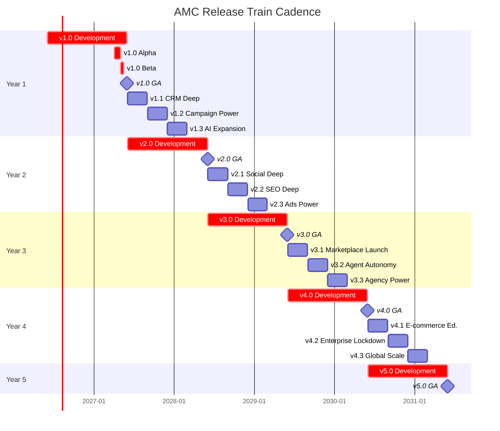
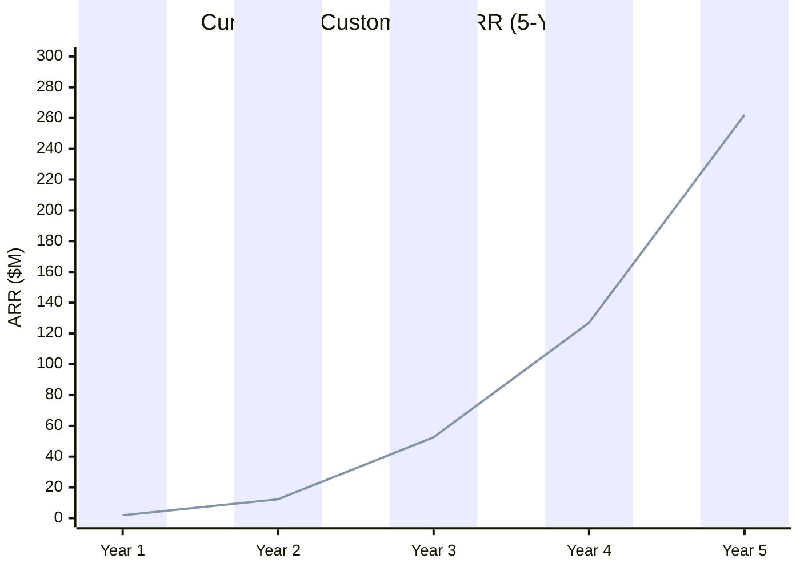
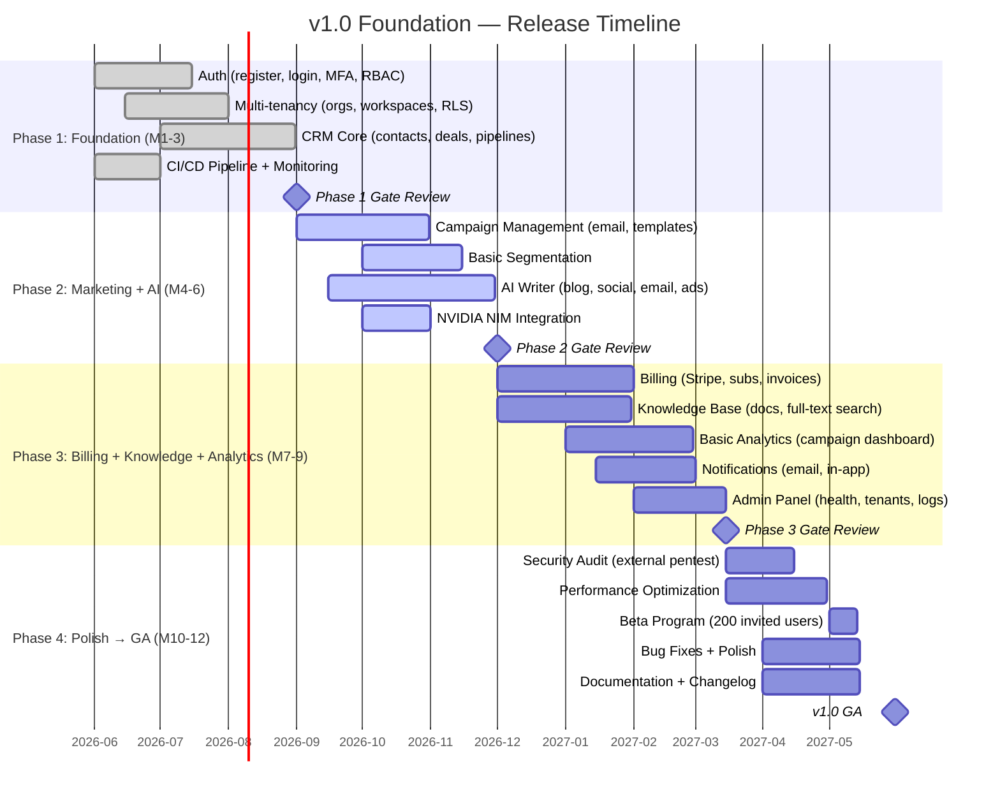
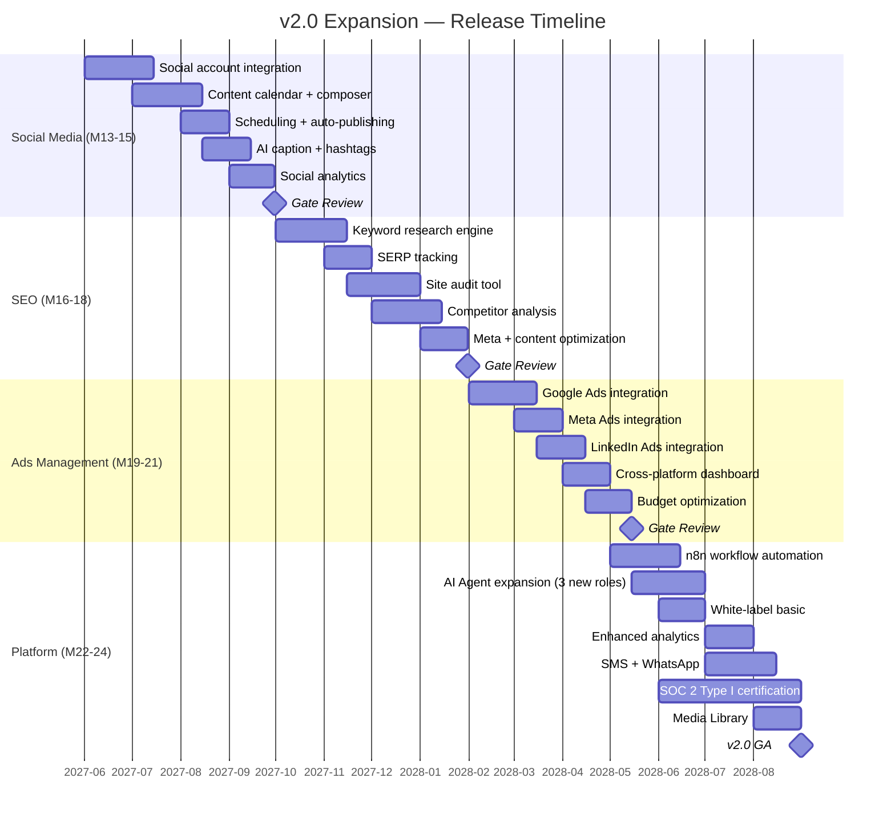
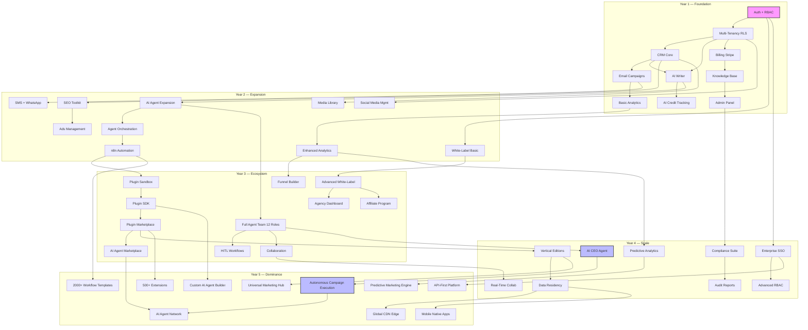
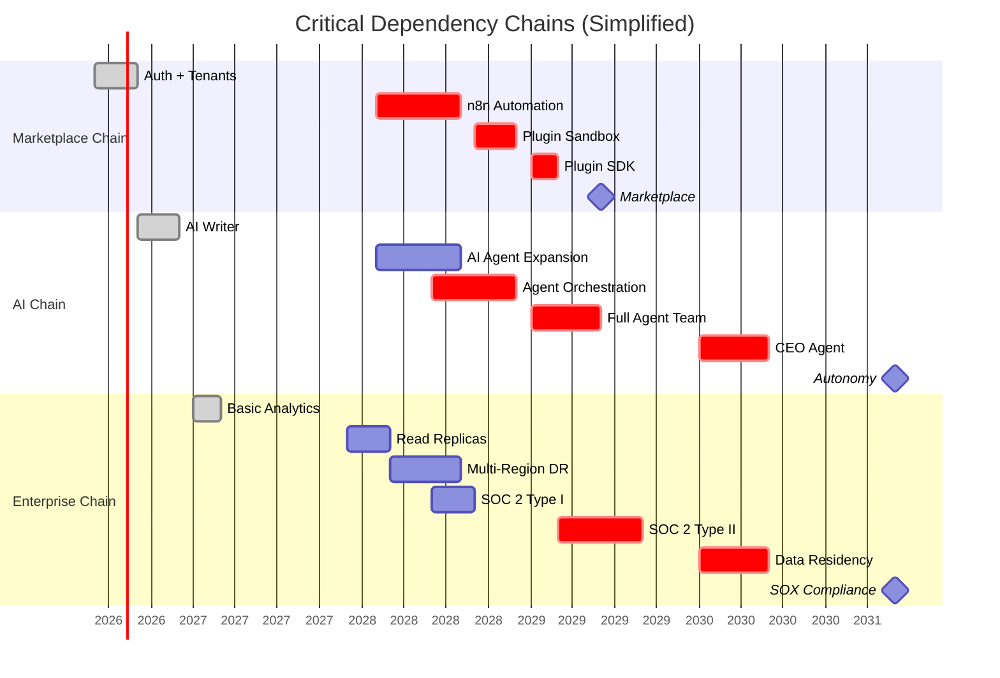

# Volume 15: Product Roadmap — v1.0 Through v5.0

> **Document Version:** 1.0  
> **Classification:** Internal — Executive & Product  
> **Date:** June 2026  
> **Author:** Product Strategy Team  
> **Status:** ✅ Approved  
> **Alignment:** Volume 1 (Vision & Business Goals), Volume 2 (PRD — MoSCoW), Volume 4 (System Architecture)

---

## Table of Contents

1. [Roadmap Philosophy](#1-roadmap-philosophy)
2. [Release Cadence](#2-release-cadence)
3. [Theme Overview (5-Year Horizon)](#3-theme-overview-5-year-horizon)
4. [v1.0 — Foundation (Months 1–12)](#4-v10--foundation-months-1-12)
5. [v1.1 — CRM Deepening (Month 3)](#5-v11--crm-deepening-month-3)
6. [v1.2 — Campaign Power (Month 6)](#6-v12--campaign-power-month-6)
7. [v1.3 — AI Expansion (Month 9)](#7-v13--ai-expansion-month-9)
8. [v2.0 — Expansion (Months 13–24)](#8-v20--expansion-months-13-24)
9. [v2.1 — Social Deep (Month 15)](#9-v21--social-deep-month-15)
10. [v2.2 — SEO Deep (Month 18)](#10-v22--seo-deep-month-18)
11. [v2.3 — Ads Power (Month 21)](#11-v23--ads-power-month-21)
12. [v3.0 — Ecosystem (Months 25–36)](#12-v30--ecosystem-months-25-36)
13. [v3.1 — Marketplace Launch (Month 28)](#13-v31--marketplace-launch-month-28)
14. [v3.2 — Agent Autonomy (Month 32)](#14-v32--agent-autonomy-month-32)
15. [v3.3 — Agency Power (Month 36)](#15-v33--agency-power-month-36)
16. [v4.0 — Scale (Months 37–48)](#16-v40--scale-months-37-48)
17. [v4.1 — E-commerce Edition (Month 40)](#17-v41--e-commerce-edition-month-40)
18. [v4.2 — Enterprise Lockdown (Month 44)](#18-v42--enterprise-lockdown-month-44)
19. [v4.3 — Global Scale (Month 48)](#19-v43--global-scale-month-48)
20. [v5.0 — Dominance (Months 49–60)](#20-v50--dominance-months-49-60)
21. [Feature Flag / Phased Rollout Strategy](#21-feature-flag--phased-rollout-strategy)
22. [Dependency Mapping](#22-dependency-mapping)
23. [Risks & Mitigations (Roadmap-Specific)](#23-risks--mitigations-roadmap-specific)
24. [Post-v5.0 Vision](#24-post-v50-vision)

---

## 1. Roadmap Philosophy

### 1.1 Time-Based Releases — Not Scope-Based

AMC ships on a **calendar-driven cadence**, not a scope-driven one. The train leaves the station on the scheduled date. Features that miss the train wait for the next release. This philosophy ensures:

- **Predictability** — Customers and stakeholders know exactly when releases land.
- **Quality gates** — Every release passes the same bar; nothing ships half-baked.
- **Forced prioritization** — Scope creeps into the next release naturally.
- **Continuous value delivery** — No 18-month "big bang" releases.

> **"Slow is smooth, smooth is fast. Ship small, ship often, ship on time."** — AMC Product Principle #1

### 1.2 Customer Feedback Drives Prioritization

Every release is informed by a weighted triage of:

| Input Source | Weight | Frequency |
|---|---|---|
| Customer feature requests (in-app widget) | 40% | Continuous |
| NPS / CSAT survey verbatims | 20% | Quarterly |
| Churn interviews | 15% | Monthly |
| Competitive intelligence | 10% | Monthly |
| Internal strategic initiatives | 10% | Per release |
| Executive directive | 5% | Exceptional only |

The **Customer Advisory Board (CAB)** — formed at v1.0 GA — meets quarterly to review the roadmap and advocate for their cohorts. CAB members represent all target personas: freelancers, SMBs, agencies, mid-market, and enterprise.

### 1.3 Technical Debt Is a Feature of the Roadmap, Not an Accident

Technical debt is **budgeted** in every release, never an afterthought. Each major release allocates:

| Release Type | Tech Debt Budget | Purpose |
|---|---|---|
| Major (vX.0) | 20% of engineering capacity | Architectural rewrites, migrations, deprecations |
| Minor (vX.Y) | 15% of engineering capacity | Refactoring, test debt, documentation |
| Patch (vX.Y.Z) | 10% of engineering capacity | Hot-ticket tech debt, lint/format CI improvements |

This prevents the "we'll fix it later" trap. Debt is tracked as Jira epics with explicit SLAs based on severity:

| Debt Class | SLA | Example |
|---|---|---|
| **Class-A** (blocks delivery) | Resolve within 1 minor release | Monolith DB connection pool exhaustion |
| **Class-B** (slows velocity) | Resolve within 2 minor releases | Missing API integration tests |
| **Class-C** (cosmetic/ergonomic) | Resolve within 4 minor releases | Outdated README, unoptimized queries |

### 1.4 Build with the End State in Mind

Every line of code written in v1.0 must be compatible with the v5.0 architecture vision. This means:

- **Service boundaries are designed for eventual decomposition** — even if they start in a monolith, the module boundaries reflect future microservice splits.
- **Multi-tenancy is baked in, not bolted on** — Row-Level Security (RLS) in PostgreSQL from day one.
- **AI layer is abstracted** — NVIDIA NIM is the primary provider but the interface supports OpenAI, Anthropic, and open-source models interchangeably.
- **Event-driven architecture from the start** — RabbitMQ event bus introduced in v2.0, but event schemas are designed in v1.0.
- **API-first design** — Every UI action goes through a REST/GraphQL endpoint; there are no hidden database calls.
- **Data residency ready** — All tenant data includes a `region` field from v1.0, even when only one region exists.

---

## 2. Release Cadence

### 2.1 Release Hierarchy

```
Major (vX.0) ── annual ── brand-new capabilities, architecture milestones
    ├── Minor (vX.1) ── quarterly ── deep-dive on prior major features
    ├── Minor (vX.2) ── quarterly ── continue deepening
    ├── Minor (vX.3) ── quarterly ── polish + prep for next major
    │
    ├── Patch (vX.Y.1) ── biweekly ── bug fixes, security patches, perf
    ├── Patch (vX.Y.2) ── biweekly ── critical bug fixes
    └── Hotfix (vX.Y.Z-hfN) ── hours ── emergency production issues
```

### 2.2 Detailed Cadence Table

| Release Type | Frequency | Engineering Window | QA/Stabilization | Go/No-Go Decision |
|---|---|---|---|---|
| **Major (vX.0)** | Annually (Q4) | 10 months | 6 weeks (Alpha 4wk → Beta 2wk) | E-14 days: Release Manager + CTO |
| **Minor (vX.1)** | Q1 (Month 3) | 8 weeks | 2 weeks (Beta 1wk → RC 1wk) | E-7 days: Product Director |
| **Minor (vX.2)** | Q2 (Month 6) | 8 weeks | 2 weeks (Beta 1wk → RC 1wk) | E-7 days: Product Director |
| **Minor (vX.3)** | Q3 (Month 9) | 8 weeks | 2 weeks (Beta 1wk → RC 1wk) | E-7 days: Product Director |
| **Patch** | Biweekly (Thu) | — | 2 days regression test | E-1 day: Engineering Lead |
| **Hotfix** | As needed (hours) | — | Automated test suite + manual smoke | On-call Engineer + CTO (async) |

### 2.3 Release Train Visual



### 2.4 Alpha / Beta / GA Lifecycle

Every major release follows a three-phase lifecycle:

| Phase | Duration | Audience | Criteria |
|---|---|---|---|
| **Alpha** | 4 weeks | Internal team + 50 invited design partners | Feature-complete; known bugs documented; core flows working |
| **Beta** | 2 weeks | 200 opt-in customers (NDA) | Blockers resolved; all critical paths verified; performance baselines met |
| **Release Candidate (RC)** | 1 week | Full engineering + QA | Blocker bugs = 0; regression pass ≥ 99%; load test at 2x expected traffic |
| **General Availability (GA)** | — | All customers | RC passed; docs published; changelog finalized; support team briefed |

### 2.5 Version Numbering Convention

```
v<MAJOR>.<MINOR>.<PATCH>[-<PRERELEASE>]

MAJOR = Annual release with new themes, architecture milestones, breaking API changes
MINOR = Quarterly release with feature additions, no breaking API changes
PATCH = Biweekly bug fixes, security patches, performance improvements
PRERELEASE = alpha, beta, rc (e.g., v2.0.0-beta.1)

Examples:
  v1.0.0-alpha.1  — First alpha of v1.0
  v1.0.0-beta.2   — Second beta of v1.0
  v1.0.0          — GA
  v1.1.0          — First quarterly minor
  v1.1.1          — First patch after v1.1
  v1.1.3-hf.1     — Hotfix on top of v1.1.3
```

---

## 3. Theme Overview (5-Year Horizon)

### 3.1 Year-by-Year Theme Summary

| Year | Roadmap Theme | Focus | Target Customers | ARR Target | Engineering Focus |
|---|---|---|---|---|---|
| **Year 1** (2026–2027) | Foundation — "Build the Core" | CRM, Email, AI Writer, Multi-tenancy | Freelancer + Small Business | $1.9M | Monolith with well-defined service boundaries |
| **Year 2** (2027–2028) | Expansion — "Add the Channels" | Social, SEO, Ads, Automation | Small Business + Agency | $12.3M | Multi-region, event-driven, agent orchestration |
| **Year 3** (2028–2029) | Ecosystem — "Open the Platform" | Marketplace, Plugin SDK, Agent Marketplace | Agency + Mid-Market | $52.6M | Plugin sandbox, CloudEvents, agent autonomy |
| **Year 4** (2029–2030) | Scale — "Verticalize & Enterprise" | Vertical editions, RBAC, Compliance, Global | Mid-Market + Enterprise | $127M | Active-active regions, HIPAA, data residency |
| **Year 5** (2030–2031) | Dominance — "AI Autonomy & Global" | Full AI autonomy, agent network, native apps | Enterprise + Global | $262M | Provider-agnostic AI, agent economy, IPO readiness |

### 3.2 Cumulative Growth Trajectory



### 3.3 Feature Category Evolution

| Feature Category | v1.0 | v2.0 | v3.0 | v4.0 | v5.0 |
|---|---|---|---|---|---|
| **CRM** | Core CRM | + Lead scoring, custom fields | + AI deal forecasting | + Vertical CRM schemas | + Predictive CRM |
| **Email Marketing** | Campaigns, templates | + A/B testing, advanced segments | + Multi-channel sequences | + Transactional email | + AI-optimized sending |
| **AI Agents** | Content Writer | + SEO Specialist, Email Marketer | + All 12 agent roles | + CEO Agent | + Autonomous agent network |
| **Social Media** | — | Calendar, scheduling, publishing | + Social listening | + AI auto-posting | + Cross-platform AI orchestration |
| **SEO** | — | Keyword research, SERP tracking | + Content optimization AI | + Enterprise SEO suite | + Predictive SEO engine |
| **Ads** | — | Google, Meta, LinkedIn ads | + Budget optimization | + Cross-platform AI bidding | + Fully autonomous ad buying |
| **Marketplace** | — | — | SDK, plugin marketplace, revenue sharing | + 200+ extensions | + 500+ extensions |
| **Enterprise** | — | SOC 2 Type I | SOC 2 Type II | SSO, RBAC, HIPAA, verticals | SOX, data residency, IPO |
| **Mobile** | — | — | — | — | iOS + Android native apps |

---

## 4. v1.0 — "Foundation" (Months 1–12)

### 4.1 Theme Statement

> **"Build the core platform that replaces 5 separate tools for freelancers and small businesses."**

v1.0 is the Minimum Viable Product (MVP). It is deliberately scoped to solve the most painful marketing workflow integrations for the least-served market segment. We are not building for everyone — we are building for the solopreneur and small team who currently juggles 5+ subscriptions.

### 4.2 Business Targets

| Metric | Target |
|---|---|
| Paying customers at GA | 500 |
| Annual Recurring Revenue (ARR) | $1,900,000 |
| Average Revenue Per Account (ARPA) | $3,800/yr ($317/mo) |
| Customer Acquisition Cost (CAC) | $1,200 |
| Net Revenue Retention (NRR) | 110% |
| Monthly Active Workspaces (MAW) | ≥ 400 |
| NPS at GA | ≥ 40 |

### 4.3 Target Persona

| Attribute | Freelancer | Small Business |
|---|---|---|
| **Company size** | 1 person | 2–25 employees |
| **Marketing budget** | $200–500/mo | $1,000–5,000/mo |
| **Current tool stack** | 3–5 tools | 5–10 tools |
| **Pain point** | Too many subscriptions, no integration | Disconnected data, reporting is manual |
| **Technical skill** | Low — wants templates | Low-medium — needs guided workflows |
| **Key decision driver** | Price + all-in-one simplicity | Time savings + ROI visibility |

### 4.4 Key Features

#### 4.4.1 Authentication & Security

| Feature | Description | Priority (MoSCoW) |
|---|---|---|
| Email/password registration & login | Standard auth flow with email verification | Must-Have |
| Multi-Factor Authentication (MFA) | TOTP-based 2FA via authenticator app | Should-Have |
| Role-Based Access Control (RBAC) | Admin, Manager, Member, Viewer roles | Must-Have |
| Session management | JWT-based, configurable expiry, device tracking | Must-Have |
| Password reset flow | Email-based secure reset | Must-Have |
| Social login (Google, GitHub) | OAuth convenience login | Could-Have |
| API key generation | Personal access tokens for API access | Could-Have |

#### 4.4.2 Multi-Tenancy (Workspaces & Teams)

| Feature | Description | Priority |
|---|---|---|
| Organization creation | Self-service org setup with billing | Must-Have |
| Workspace creation | Multi-workspace per org (dev/staging/prod) | Must-Have |
| Team management | Invite, remove, role assignment | Must-Have |
| Permission templates | Role presets (Admin, Editor, Viewer) | Should-Have |
| Activity feed | Per-workspace audit trail of user actions | Should-Have |
| Tenant isolation | PostgreSQL Row-Level Security (RLS) enforced | Must-Have |

#### 4.4.3 CRM

| Feature | Description | Priority |
|---|---|---|
| Contact management | CRUD, merge, dedup, tags, custom fields | Must-Have |
| Company management | Organization records linked to contacts | Must-Have |
| Deal management | Custom pipelines, stages, deal value | Must-Have |
| Activity tracking | Calls, emails, meetings logged per contact | Should-Have |
| Task management | To-dos assigned to team members | Should-Have |
| Notes & attachments | Rich text notes with file uploads | Should-Have |
| Lead scoring (rule-based) | Points based on activity + profile fields | Could-Have |
| Bulk import/export | CSV, XLSX round-trip | Should-Have |

#### 4.4.4 Campaign Management

| Feature | Description | Priority |
|---|---|---|
| Email campaign creation | Drag-and-drop composer + HTML editor | Must-Have |
| Email templates library | 20+ starter templates | Must-Have |
| Basic segmentation | By tags, custom fields, list membership | Must-Have |
| Campaign scheduling | Date/time send with timezone support | Should-Have |
| A/B testing (subject line) | Basic subject line A/B split | Could-Have |
| Landing page builder (basic) | Single-page editor, custom domain | Could-Have |

#### 4.4.5 AI Suite

| Feature | Description | Priority |
|---|---|---|
| AI Writer — Blog | Long-form blog post generation (500–3,000 words) | Must-Have |
| AI Writer — Social | Short-form captions for Twitter, LinkedIn, Facebook | Must-Have |
| AI Writer — Email | Email body generation with tone control | Must-Have |
| AI Writer — Ad Copy | Headline + body for Google/Facebook/Meta ads | Should-Have |
| Brand voice configuration | Tone, vocabulary, do/don't lists | Should-Have |
| Content history & versioning | Full revision history per generated piece | Could-Have |
| AI credit usage tracking | Per-workspace consumption dashboard | Must-Have |

#### 4.4.6 Basic Analytics

| Feature | Description | Priority |
|---|---|---|
| Campaign metrics dashboard | Send rate, open rate, click rate, bounce rate | Must-Have |
| Simple charting | Line + bar charts for time-series comparison | Must-Have |
| CSV export | Raw data export for external analysis | Should-Have |
| Scheduled email reports | Weekly/monthly PDF delivery | Could-Have |

#### 4.4.7 Billing (Stripe Integration)

| Feature | Description | Priority |
|---|---|---|
| Subscription tiers | Free (limited), Starter ($29/mo), Professional ($99/mo) | Must-Have |
| Stripe checkout flow | PCI-compliant payment processing | Must-Have |
| Invoice management | Auto-generated PDF invoices | Must-Have |
| Billing portal | Plan changes, payment method, history | Must-Have |
| Coupon management | Discount codes, trial extensions | Should-Have |
| Usage-based billing | Per-credit AI usage add-ons | Could-Have |
| Dunning & recovery | Failed payment retries + notifications | Should-Have |

#### 4.4.8 Notifications

| Feature | Description | Priority |
|---|---|---|
| Email notifications | Campaign results, billing, team invites | Must-Have |
| In-app notifications | Bell icon panel, real-time via WebSocket | Must-Have |
| Notification preferences | Per-channel opt-in/out per event type | Should-Have |
| Digest mode | Daily/weekly summary instead of instant | Could-Have |

#### 4.4.9 Knowledge Base

| Feature | Description | Priority |
|---|---|---|
| Document management | Folder-based CRUD for marketing documents | Must-Have |
| Rich text editor | Markdown + WYSIWYG dual mode | Must-Have |
| Basic full-text search | PostgreSQL built-in text search | Must-Have |
| Brand guidelines storage | Central brand asset reference | Should-Have |
| Qdrant vector search | Semantic search across documents | Could-Have |

#### 4.4.10 Admin Panel

| Feature | Description | Priority |
|---|---|---|
| System health dashboard | Service uptime, DB connections, queue depth | Must-Have |
| Tenant management | View all tenants, usage metrics, status | Must-Have |
| Audit log viewer | Searchable event stream | Must-Have |
| Feature flag management | Toggle features per tenant | Should-Have |
| Background job monitor | View job queue, retry failed jobs | Should-Have |

### 4.5 Architecture Milestones

| Milestone | Timeline | Description |
|---|---|---|
| **Docker Compose → Docker Swarm** | Month 6 | Initial monolith deployment transitions to orchestrated multi-container setup with service discovery and secrets management |
| **PostgreSQL RLS Multi-Tenancy** | Month 2 | Row-Level Security policies applied to all tenant-scoped tables; connection pooling via PgBouncer |
| **Basic Hermes Agent Integration** | Month 5 | Content Writer and Marketing Director agents operational; agents access CRM and campaign data via internal API |
| **NVIDIA NIM Integration** | Month 4 | Primary AI inference provider deployed; abstracted behind `AIModelProvider` interface for future provider swaps |
| **CI/CD Pipeline (Blue-Green Deploy)** | Month 3 | GitHub Actions → Docker Build → push to registry → blue-green swap in Swarm; zero-downtime deploys |
| **Prometheus + Grafana Monitoring** | Month 3 | Service metrics, business metrics, alerting rules, dashboards per service |
| **PostgreSQL Read Replicas** | Month 10 | Analytics queries routed to read replicas; primary nodes reserved for transactional workloads |

### 4.6 Release Timeline (Detailed)



| Phase | Duration | Deliverables | Gate Criteria |
|---|---|---|---|
| **Phase 1: Foundation** | Months 1–3 | Auth, tenants, CRM, CI/CD | All P0+P1 must-have features passing integration tests |
| **Phase 2: Marketing + AI** | Months 4–6 | Campaigns, AI Writer, NIM integration | AI content quality score ≥ 4.0/5 in blind eval; campaign send error rate < 1% |
| **Phase 3: Billing + Knowledge** | Months 7–9 | Billing, KB, Analytics, Admin | Stripe integration end-to-end tested; no P0 security findings |
| **Phase 4: Polish → GA** | Months 10–12 | Security audit, perf, beta, docs | All alpha/beta blockers resolved; load test at 5,000 concurrent users; pentest cleared |

### 4.7 v1.0 Feature Flag / Phased Rollout Plan

| Feature | Flag Name | Rollout Strategy | GA Status |
|---|---|---|---|
| AI Writer | `feat-ai-writer` | 100% open in Beta | ✅ On by default |
| MFA | `feat-mfa` | Opt-in via settings | ✅ On by default |
| Landing page builder | `feat-landing-pages` | 25% → 50% → 100% over 3 weeks | ✅ On by default |
| Advanced segmentation | `feat-advanced-seg` | Invite-only in v1.0, full in v1.1 | 🚩 Flag off for free tier |

---

## 5. v1.1 — "CRM Deepening" (Month 3)

### 5.1 Overview

| Attribute | Value |
|---|---|
| **Version** | v1.1.0 |
| **Release Date** | 2026-09-01 (Month 3) |
| **Theme** | Deepen CRM capabilities based on early customer feedback |
| **Engineering Capacity** | 8 weeks (July – August) |

### 5.2 Feature List

| Feature | Description | Priority | Est. Effort |
|---|---|---|---|
| **Advanced pipeline management** | Drag-and-drop pipeline stages, win/loss reasons, stage probability override | P1 | 3 weeks |
| **Custom fields** | Per-workspace custom field definitions: text, number, date, dropdown, multi-select, URL | P1 | 2 weeks |
| **Lead scoring (rule-based)** | Configurable score rules: email opens, form fills, page visits, custom actions | P1 | 3 weeks |
| **Email templates library** | 50+ categorized templates (welcome, follow-up, promotion, re-engagement) | P1 | 2 weeks |
| **Import/export (CSV, XLSX)** | Bulk import with field mapping, dedup detection; export with column selection | P1 | 2 weeks |
| **Activity timeline per contact** | Unified feed of emails, calls, notes, deals, status changes | P2 | 1 week |
| **Deal stage automation** | Auto-advance deals based on trigger conditions | P2 | 2 weeks |

### 5.3 Key Metrics

| Metric | v1.0 Baseline | v1.1 Target |
|---|---|---|
| CRM active users | 300 | 600 |
| Deals created/week | 1,200 | 3,500 |
| Custom fields created | — | 500+ |
| Leads imported (total) | — | 50,000+ |

---

## 6. v1.2 — "Campaign Power" (Month 6)

### 6.1 Overview

| Attribute | Value |
|---|---|
| **Version** | v1.2.0 |
| **Release Date** | 2026-12-01 (Month 6) |
| **Theme** | Elevate email campaigns to professional-grade marketing tool |
| **Engineering Capacity** | 8 weeks (October – November) |

### 6.2 Feature List

| Feature | Description | Priority | Est. Effort |
|---|---|---|---|
| **A/B testing** | Test subject lines, preview text, sender name, send time; statistical significance calculator | P1 | 3 weeks |
| **Advanced segmentation** | Multi-condition segments (AND/OR/NOT), behavioral triggers, time-window conditions | P1 | 3 weeks |
| **Email analytics** | Opens, clicks, bounces, unsubscribes, spam complaints, geolocation, device/browser stats | P1 | 2 weeks |
| **Landing page builder (basic)** | Drag-and-drop editor, 10 templates, custom domain (CNAME), basic form capture | P1 | 3 weeks |
| **Campaign scheduling** | Timezone-aware scheduling, send-time optimization, recurring campaigns | P1 | 2 weeks |
| **Suppression lists** | Global + per-campaign suppression, auto-suppress unsubscribes and bounces | P2 | 1 week |

### 6.3 Key Metrics

| Metric | v1.1 Baseline | v1.2 Target |
|---|---|---|
| Campaigns sent/month | 5,000 | 25,000 |
| Average open rate | — | ≥ 22% |
| Average click-through rate | — | ≥ 3.5% |
| Landing pages created | — | 500+ |

---

## 7. v1.3 — "AI Expansion" (Month 9)

### 7.1 Overview

| Attribute | Value |
|---|---|
| **Version** | v1.3.0 |
| **Release Date** | 2027-03-01 (Month 9) |
| **Theme** | Expand AI capabilities beyond the foundational writer |
| **Engineering Capacity** | 8 weeks (January – February) |

### 7.2 Feature List

| Feature | Description | Priority | Est. Effort |
|---|---|---|---|
| **SEO Writer agent** | Generates SEO-optimized blog posts with keyword targeting, meta descriptions, internal link suggestions | P1 | 3 weeks |
| **Image prompt generator** | Generates optimized prompts for DALL-E, Stable Diffusion, Midjourney | P1 | 1 week |
| **Video script generator** | Generates short-form (30s/60s) and long-form video scripts with scene breakdowns | P1 | 2 weeks |
| **AI content history & versioning** | Full version tree per document; diff viewer, rollback, fork | P1 | 2 weeks |
| **Brand voice configuration** | Per-workspace brand voice profiles: tone, vocabulary, do/don't list, reference style | P1 | 2 weeks |
| **AI credit usage tracking** | Per-user + per-workspace dashboard; usage alerts, top-up auto-purchase | P1 | 1 week |
| **Content rewriter** | Rewrite existing content in different tone, length, or format | P2 | 1 week |
| **Multi-language generation** | Generate content in 12+ languages with native-quality output | P2 | 2 weeks |

### 7.3 AI Model Provider Matrix (v1.3)

| Capability | Primary Provider | Fallback Provider |
|---|---|---|
| Blog/SEO generation | NVIDIA NIM (Llama 3 70B) | OpenAI GPT-4o |
| Social/short-form | NVIDIA NIM (Llama 3 8B) | Anthropic Claude Haiku |
| Image prompts | Anthropic Claude Sonnet | OpenAI GPT-4o |
| Video scripts | OpenAI GPT-4o | NVIDIA NIM (Llama 3 70B) |
| Rewriting/summarization | Anthropic Claude Haiku | NVIDIA NIM (Llama 3 8B) |

### 7.4 Key Metrics

| Metric | v1.2 Baseline | v1.3 Target |
|---|---|---|
| AI generations/month | — | 100,000+ |
| Active AI users | — | 80% of monthly actives |
| Content approval rate (no edits) | — | ≥ 60% |
| Brand voice configured | — | 200+ workspaces |

---

## 8. v2.0 — "Expansion" (Months 13–24)

### 8.1 Theme Statement

> **"Add social, SEO, and ad management — replace 10+ separate tools for growing businesses and agencies."**

v2.0 transforms AMC from an email + CRM platform into a multi-channel marketing command center. Every major digital marketing channel is managed from a single pane of glass.

### 8.2 Business Targets

| Metric | Target |
|---|---|
| Paying customers at GA | 2,500 |
| Annual Recurring Revenue (ARR) | $12,300,000 |
| Average Revenue Per Account (ARPA) | $4,920/yr ($410/mo) |
| Customer Acquisition Cost (CAC) | $1,000 |
| Net Revenue Retention (NRR) | 115% |
| Monthly Active Workspaces (MAW) | ≥ 2,000 |
| NPS at GA | ≥ 45 |

### 8.3 Target Persona

| Attribute | Small Business | Agency |
|---|---|---|
| **Company size** | 2–25 employees | 3–50 employees |
| **Clients managed** | 1 (own business) | 5–50 |
| **Marketing budget** | $2,000–10,000/mo | $10,000–100,000/mo total |
| **Current tool stack** | 8–15 tools | 15–25 tools |
| **Pain point** | Channel fragmentation, reporting overhead | Multi-client reporting is manual, margins squeezed |
| **Key decision driver** | Consolidation savings + time back | White-label + agency-scale features |

### 8.4 New Features (Beyond v1.x Foundation)

#### 8.4.1 Social Media Management

| Feature | Description | Priority |
|---|---|---|
| Social account integration | Connect Facebook, Instagram, Twitter/X, LinkedIn, TikTok, Pinterest | Must-Have |
| Content calendar | Drag-and-drop calendar view, bulk upload, draft queue | Must-Have |
| Post composer | Cross-platform composer with per-channel preview | Must-Have |
| Scheduling & auto-publishing | Timezone-aware queue; auto-publish at optimal times | Must-Have |
| Social analytics | Per-channel engagement, followers, reach, impressions | Must-Have |
| AI caption generation | Platform-aware caption + hashtag generation | Should-Have |
| Auto hashtag suggestions | Trending + relevant hashtag recommendations | Should-Have |
| AI reply assistant | Suggested replies for common engagement scenarios | Could-Have |

#### 8.4.2 SEO Toolkit

| Feature | Description | Priority |
|---|---|---|
| Keyword research | Search volume, difficulty, CPC, trend analysis; 50M+ keyword database | Must-Have |
| SERP tracking | Daily rank tracking per keyword/location/device | Must-Have |
| Competitor analysis | Domain comparison, keyword gap analysis, content gap | Should-Have |
| Site audit | Crawl-based technical SEO analysis (200+ checks) | Must-Have |
| Meta tag management | Bulk meta title/description editor with AI suggestions | Should-Have |
| Content optimization | Real-time content scoring against top 10 SERP results | Should-Have |
| Internal linking suggestions | AI-driven internal link recommendations | Could-Have |

#### 8.4.3 Ads Management

| Feature | Description | Priority |
|---|---|---|
| Google Ads integration | Campaign, ad group, keyword, ad management | Must-Have |
| Meta Ads integration | Campaign, ad set, ad creative management | Must-Have |
| LinkedIn Ads integration | Sponsored content, text ads, InMail campaigns | Must-Have |
| Cross-platform dashboard | Unified spend, impressions, clicks, conversions | Must-Have |
| Campaign budget optimization | AI-recommended budget allocation across platforms | Should-Have |
| Ad creative A/B testing | Cross-platform creative testing with statistical analysis | Should-Have |
| Audience building | Unified audience builder synced to all platforms | Could-Have |

#### 8.4.4 AI Agent Expansion

| Agent Role | Capabilities | Availability |
|---|---|---|
| **SEO Specialist** | Keyword research, content brief generation, SERP analysis, ranking recommendations | v2.0 GA |
| **Email Marketer** | Campaign strategy, send-time optimization, segment suggestion, subject line A/B | v2.0 GA |
| **Ads Manager** | Budget recommendation, audience suggestion, creative briefs, performance alerts | v2.0 GA |
| Marketing Director (upgraded) | Cross-channel strategy, resource allocation, high-level campaign calendar | v2.0 GA |

#### 8.4.5 n8n Workflow Automation

| Feature | Description | Priority |
|---|---|---|
| Visual workflow builder | Drag-and-drop nodes; triggers, actions, conditions | Must-Have |
| 100+ workflow templates | Pre-built automations for common marketing workflows | Should-Have |
| Trigger nodes | Schedule, webhook, form submission, CRM event, AI agent | Must-Have |
| Action nodes | Send email, create contact, post to social, update ad bid | Must-Have |
| Conditional logic | IF/ELSE branches, wait nodes, loops | Must-Have |
| Error handling | Retry logic, error notifications, fallback actions | Should-Have |
| Webhook management | Incoming + outgoing webhooks with secret authentication | Should-Have |

#### 8.4.6 Basic White-Label

| Feature | Description | Priority |
|---|---|---|
| Custom domain | Point custom domain to AMC instance (CNAME) | Must-Have |
| Logo replacement | Upload agency logo for all branded surfaces | Must-Have |
| Brand color customization | Primary/accent color overrides in UI | Should-Have |
| Custom email templates | Agency-branded email footers and templates | Should-Have |

#### 8.4.7 Enhanced Analytics

| Feature | Description | Priority |
|---|---|---|
| Cross-channel dashboard | Email + social + SEO + ads in a single view | Must-Have |
| AI insights engine | Natural language insights: "Why did open rates drop?" | Should-Have |
| Custom report builder | Drag-and-drop metric selection, scheduled PDF delivery | Should-Have |
| Revenue analytics | Campaign-attributed revenue, ROI per channel | Should-Have |

#### 8.4.8 SMS + WhatsApp Channels

| Feature | Description | Priority |
|---|---|---|
| SMS campaigns | Send + track SMS via Twilio integration | Should-Have |
| WhatsApp Business API | Opt-in management, message templates, analytics | Should-Have |
| Multi-channel sequences | Email → SMS → WhatsApp nurture sequences | Could-Have |

#### 8.4.9 Media Library

| Feature | Description | Priority |
|---|---|---|
| Image upload & management | Upload, tag, search images; CDN-hosted | Must-Have |
| Video upload & transcoding | Upload, auto-transcode for web, thumbnail generation | Should-Have |
| Brand asset management | Logos, fonts, brand guidelines in one repository | Should-Have |
| AI tag generation | Auto-tag uploaded assets with descriptive labels | Could-Have |

### 8.5 Architecture Milestones

| Milestone | Timeline | Description |
|---|---|---|
| **Multi-region deployment** (primary + DR) | Month 18 | Active in us-east-1; DR replica in us-west-2; automatic failover tested quarterly |
| **Read replicas for analytics** | Month 14 | Analytics queries routed to dedicated read replicas; < 100ms query time for 99% of dashboards |
| **Enhanced agent orchestration** | Month 16 | Multi-agent collaboration: agents can delegate tasks to other agents and share context |
| **Qdrant cluster** | Month 15 | Sharded Qdrant cluster for vector search across all workspaces; semantic search < 200ms |
| **RabbitMQ event bus** | Month 14 | Event-driven architecture for async processing; supports 10,000+ events/sec |
| **SOC 2 Type I audit** | Month 22 | Controls documentation, evidence collection, auditor engagement; report by Month 24 |
| **n8n embedded deployment** | Month 20 | n8n running as an internal microservice; custom nodes for AMC actions |

### 8.6 Release Timeline



| Phase | Duration | Deliverables |
|---|---|---|
| **Phase 1: Social** | Months 13–15 | Connect and manage all major social platforms from one calendar |
| **Phase 2: SEO** | Months 16–18 | Full keyword-to-content optimization workflow |
| **Phase 3: Ads** | Months 19–21 | Google, Meta, LinkedIn ad campaign management |
| **Phase 4: Platform** | Months 22–24 | n8n, agents, white-label, SMS, analytics, SOC 2 |

---

## 9. v2.1 — "Social Deep" (Month 15)

### 9.1 Overview

| Attribute | Value |
|---|---|
| **Version** | v2.1.0 |
| **Release Date** | 2027-09-01 (Month 15) |
| **Theme** | Deepen social media capabilities with AI-powered content generation and listening |
| **Engineering Capacity** | 8 weeks (July – August 2027) |

### 9.2 Feature List

| Feature | Description | Priority | Est. Effort |
|---|---|---|---|
| **AI caption generation** | Platform-aware captions with tone, length, and hashtag optimization per channel | P1 | 2 weeks |
| **Auto hashtag suggestions** | Trending + brand-relevant hashtag recommendations; custom hashtag sets per campaign | P1 | 2 weeks |
| **AI reply assistant** | Suggested replies for comments, DMs, mentions; tone-consistent with brand voice | P1 | 3 weeks |
| **Social listening (brand mention tracking)** | Track brand mentions across platforms; sentiment analysis; competitor mentions | P1 | 4 weeks |
| **Multi-account management per channel** | Manage multiple brand accounts per social platform within one workspace | P1 | 2 weeks |
| **Post performance predictions** | AI predicts engagement before posting; recommends optimal posting time | P2 | 2 weeks |
| **Content approval workflow** | Draft → Review → Approve → Schedule workflow with team notifications | P2 | 2 weeks |

### 9.3 Key Metrics

| Metric | v2.0 Baseline | v2.1 Target |
|---|---|---|
| Social accounts connected | 2,500 | 8,000 |
| Posts published/month | 25,000 | 100,000 |
| AI caption adoption rate | — | ≥ 60% of posts |
| Social listening queries active | — | 1,000+ |

---

## 10. v2.2 — "SEO Deep" (Month 18)

### 10.1 Overview

| Attribute | Value |
|---|---|
| **Version** | v2.2.0 |
| **Release Date** | 2027-12-01 (Month 18) |
| **Theme** | Deepen SEO toolkit with AI-powered content optimization and technical SEO automation |
| **Engineering Capacity** | 8 weeks (October – November 2027) |

### 10.2 Feature List

| Feature | Description | Priority | Est. Effort |
|---|---|---|---|
| **Schema markup generator** | Visual schema builder (Article, FAQ, Product, Review, LocalBusiness, etc.); auto-inject via tag manager | P1 | 3 weeks |
| **Meta description/title generator** | AI generates 5+ variations per page; preview in SERP simulator | P1 | 2 weeks |
| **Internal linking suggestions** | AI analyzes content graph; suggests contextual internal links with anchor text | P1 | 3 weeks |
| **Backlink analysis** | Backlink profile import via Ahrefs/Moz API; tracking, disavow file generation | P1 | 3 weeks |
| **Content optimization recommendations** | Real-time content scoring against top 10 SERP; actionable improvements | P1 | 3 weeks |
| **Keyword rank alerts** | Automated alerts when keyword positions change significantly | P2 | 1 week |
| **Content brief generation** | SEO specialist agent produces detailed content briefs with H2/H3 structure, FAQ targets | P2 | 2 weeks |

### 10.3 Key Metrics

| Metric | v2.0 Baseline | v2.2 Target |
|---|---|---|
| Keywords tracked | 100,000 | 1,000,000+ |
| Sites audited/month | 500 | 5,000 |
| Content optimization suggestions applied | — | 50,000+ |
| Schema markups generated | — | 10,000+ |

---

## 11. v2.3 — "Ads Power" (Month 21)

### 11.1 Overview

| Attribute | Value |
|---|---|
| **Version** | v2.3.0 |
| **Release Date** | 2028-03-01 (Month 21) |
| **Theme** | Transform ads management with AI-optimized budget, creative, and audience |
| **Engineering Capacity** | 8 weeks (January – February 2028) |

### 11.2 Feature List

| Feature | Description | Priority | Est. Effort |
|---|---|---|---|
| **Campaign budget optimization** | AI recommends optimal budget split across campaigns/channels; auto-adjust based on performance | P1 | 4 weeks |
| **Ad creative A/B testing** | Statistical engine for cross-platform creative testing; automatically surfaces winners | P1 | 3 weeks |
| **Audience building** | Unified audience builder; sync to Google Ads, Meta, LinkedIn simultaneously | P1 | 3 weeks |
| **Performance comparison (cross-platform)** | Side-by-side comparison of cost metrics (CPA, CPM, CTR, ROAS) by channel | P1 | 2 weeks |
| **Automated bid adjustments** | Rule-based + AI bid adjustments by device, location, time, audience segment | P1 | 3 weeks |
| **Ad fatigue detection** | Detects creative fatigue (declining CTR, rising frequency); auto-pauses and suggests refresh | P2 | 2 weeks |
| **Budget pacing dashboard** | Visual budget burn vs. plan; daily pacing alerts | P2 | 1 week |

### 11.3 Key Metrics

| Metric | v2.0 Baseline | v2.3 Target |
|---|---|---|
| Ad accounts managed | 1,000 | 5,000 |
| Monthly ad spend managed | $5M | $50M+ |
| AI-optimized campaigns | — | 60% of all campaigns |
| Average CPA improvement via optimization | — | 15% reduction |

---

## 12. v3.0 — "Ecosystem" (Months 25–36)

### 12.1 Theme Statement

> **"Open the platform — marketplace, plugins, AI agent marketplace, and full agency autonomy."**

v3.0 transforms AMC from a product into a **platform**. Third-party developers can build and sell plugins and AI agents. Agencies can fully white-label AMC as their own offering. The AI agent team becomes complete with all 12 roles operational.

### 12.2 Business Targets

| Metric | Target |
|---|---|
| Paying customers at GA | 8,000 |
| Annual Recurring Revenue (ARR) | $52,600,000 |
| Average Revenue Per Account (ARPA) | $6,575/yr ($548/mo) |
| Marketplace GMV (annualized) | $5M+ |
| Customer Acquisition Cost (CAC) | $800 |
| Net Revenue Retention (NRR) | 120% |
| Monthly Active Workspaces (MAW) | ≥ 6,500 |
| NPS at GA | ≥ 50 |

### 12.3 Target Persona

| Attribute | Agency | Mid-Market |
|---|---|---|
| **Company size** | 5–100 employees | 50–500 employees |
| **Clients managed** | 10–200 | 1 (own business) |
| **Marketing budget** | $50K–500K/mo total | $20K–100K/mo |
| **Current tool stack** | 15–30 tools | 10–20 tools |
| **Pain point** | Margins squeezed by tool costs; need to differentiate | Complexity of coordinating multi-channel campaigns |
| **Key decision driver** | White-label + marketplace revenue share | AI automation + team collaboration |

### 12.4 New Features

#### 12.4.1 Marketplace

| Feature | Description | Priority |
|---|---|---|
| Plugin marketplace | Browse, install, and manage 3rd-party plugins | Must-Have |
| AI Agent marketplace | Browse community-built AI agents | Must-Have |
| Template marketplace | Campaign, workflow, landing page templates | Must-Have |
| Workflow marketplace | Pre-built n8n workflow templates | Must-Have |
| Developer publishing portal | Submit, version, and manage plugin listings | Must-Have |
| Marketplace billing | Revenue sharing (70/30 developer/AMC split); automatic payouts | Must-Have |
| Plugin review & approval | Automated + manual review pipeline | Must-Have |
| Listing analytics | Developer dashboard: installs, revenue, ratings | Should-Have |

#### 12.4.2 Plugin SDK

| Feature | Description | Priority |
|---|---|---|
| Python SDK | First-class Python plugin development kit with examples | Must-Have |
| TypeScript SDK | TypeScript/JavaScript plugin development kit | Must-Have |
| Plugin sandbox | Secure, isolated execution environment (Firecracker microVMs) | Must-Have |
| API client libraries | Auto-generated client for AMC REST + GraphQL APIs | Must-Have |
| Plugin lifecycle hooks | Install, uninstall, upgrade, config change callbacks | Must-Have |
| Documentation + examples | Comprehensive SDK docs with 5+ reference plugins | Should-Have |

#### 12.4.3 Full Agent Team (All 12 Roles)

| # | Agent Role | Function | Available Since |
|---|---|---|---|
| 1 | **Marketing Director** | Orchestrates strategy, assigns tasks to other agents | v1.0 |
| 2 | **Content Writer** | Blog, social, email, ad copy generation | v1.0 |
| 3 | **SEO Specialist** | Keyword research, content optimization, technical SEO | v2.0 |
| 4 | **Email Marketer** | Campaign strategy, send optimization, list segmentation | v2.0 |
| 5 | **Ads Manager** | Budget optimization, audience building, bid management | v2.0 |
| 6 | **Social Media Manager** | Content calendar, posting, engagement, listening | v2.1 |
| 7 | **Analytics Agent** | Data analysis, insight generation, anomaly detection | v3.0 |
| 8 | **Customer Success Agent** | Onboarding, health scoring, churn prediction | v3.0 |
| 9 | **Sales Assistant** | Lead qualification, follow-up sequences, meeting scheduling | v3.0 |
| 10 | **Project Manager** | Campaign timeline, task assignment, deadline tracking | v3.0 |
| 11 | **Support Agent** | Ticket triage, knowledge base answers, escalation | v3.0 |
| 12 | **CEO Agent** | Full autonomous marketing department oversight | v4.0 |

#### 12.4.4 Human-in-the-Loop Workflows

| Feature | Description | Priority |
|---|---|---|
| Approval gates | Insert human approval steps in AI agent workflows | Must-Have |
| Review dashboards | Unified queue of items awaiting human review | Must-Have |
| Feedback loop | Human edits fed back to agent for learning | Should-Have |
| Escalation paths | Configurable escalation when agent confidence is low | Should-Have |
| Compliance hold | Pause execution for compliance review (regulated industries) | Could-Have |

#### 12.4.5 Funnel Builder

| Feature | Description | Priority |
|---|---|---|
| Visual funnel canvas | Drag-and-drop funnel stages with channel assignment | Must-Have |
| Multi-channel funnels | Email → Social → SMS → Ads coordinated sequences | Must-Have |
| Funnel analytics | Per-stage conversion rates, drop-off, velocity | Must-Have |
| AI funnel optimization | AI suggests funnel improvements based on performance data | Should-Have |
| Funnel templates | 20+ pre-built industry funnel templates | Should-Have |

#### 12.4.6 Advanced White-Label

| Feature | Description | Priority |
|---|---|---|
| Full branding | Custom domain, logo, colors, typography, favicon | Must-Have |
| Client portals | Per-client login portals with own branding | Must-Have |
| Custom email domain | Send emails from agency's domain (SPF/DKIM) | Must-Have |
| Billing pass-through | Agency manages billing; AMC processes and remits | Should-Have |
| Custom feature set | Agency selects which features their clients see | Should-Have |

#### 12.4.7 Agency Dashboard

| Feature | Description | Priority |
|---|---|---|
| Multi-client overview | At-a-glance status of all managed clients | Must-Have |
| Profitability dashboard | Revenue vs. cost per client; margin analysis | Must-Have |
| Staff utilization | Hours spent per client per team member | Should-Have |
| Client health scores | Automated churn risk, engagement scoring | Should-Have |
| Agency revenue dashboard | Total revenue, MRR, churn, growth trends | Must-Have |

#### 12.4.8 Affiliate Program

| Feature | Description | Priority |
|---|---|---|
| Affiliate dashboard | Referral links, conversion tracking, commissions | Must-Have |
| Tiered commission structure | 20% / 25% / 30% based on volume | Must-Have |
| Payout automation | Monthly automatic Stripe payouts | Must-Have |
| Affiliate marketing kit | Landing pages, email templates, social assets | Should-Have |

#### 12.4.9 Collaboration

| Feature | Description | Priority |
|---|---|---|
| Comments & mentions | Inline comments on campaigns, content, analytics | Must-Have |
| Approval workflows | Multi-level approval chains (draft → review → approve → publish) | Must-Have |
| Version history | Full version tree with diffs for campaigns, funnels, content | Must-Have |
| Shared workspaces | Cross-team collaboration inside workspaces | Must-Have |
| Real-time cursors | Presence indicators, live editing awareness | Could-Have |

### 12.5 Architecture Milestones

| Milestone | Timeline | Description |
|---|---|---|
| **Plugin sandbox (Firecracker)** | Month 26 | Secure microVM-based plugin execution; network isolation, resource limits, ephemeral filesystem |
| **Marketplace infrastructure** | Month 27 | Listing service, payment splitting, review/rating system, search indexing |
| **Event system overhaul (CloudEvents)** | Month 28 | Standardized event schemas (CloudEvents spec); webhook forwarding to plugins; event replay |
| **Advanced agent orchestration** | Month 30 | Task decomposition (agent breaks complex tasks into subtasks), agent-to-agent delegation with context passing |
| **SOC 2 Type II certification** | Month 34 | 6-month observation period; full controls demonstration; auditor sign-off by Month 36 |
| **Vector store federation** | Month 32 | Multi-region Qdrant cluster with cross-region query routing |

### 12.6 Release Timeline

| Phase | Duration | Deliverables |
|---|---|---|
| **Phase 1: Marketplace + SDK** | Months 25–28 | Plugin SDK, sandbox, marketplace portal, developer onboarding, first 10 curated plugins |
| **Phase 2: Agent Team + HITL** | Months 29–32 | All 12 agent roles operational, human-in-the-loop workflows, agent collaboration framework |
| **Phase 3: Agency + Collaboration** | Months 33–36 | Advanced white-label, agency dashboard, collaboration features, affiliate program, SOC 2 Type II |

---

## 13. v3.1 — "Marketplace Launch" (Month 28)

### 13.1 Overview

| Attribute | Value |
|---|---|
| **Version** | v3.1.0 |
| **Release Date** | 2028-09-01 (Month 28) |
| **Theme** | Launch the marketplace with curated plugins and developer onboarding |
| **Engineering Capacity** | 8 weeks (July – August 2028) |

### 13.2 Feature List

| Feature | Description | Priority | Est. Effort |
|---|---|---|---|
| **10+ curated plugins** | Hand-picked launch partners: Google Analytics, Ahrefs, Canva, Slack, Salesforce, Shopify, WordPress, Zoom, Calendly, Zapier | P1 | 4 weeks |
| **Developer onboarding flow** | Self-service developer account; API key provisioning; sandbox environment; documentation hub | P1 | 3 weeks |
| **Plugin review automation** | Automated security scanning (SAST, dependency check); linting; capability declaration validation | P1 | 3 weeks |
| **Revenue sharing functional** | 70/30 split; automatic Stripe Connect payouts; developer earnings dashboard | P1 | 3 weeks |
| **Plugin search & discovery** | Search, category browse, featured listings, ratings, reviews | P1 | 2 weeks |
| **Plugin version management** | Semantic versioning; automatic update notifications; rollback support | P2 | 2 weeks |

### 13.3 Launch Partner Plugins

| Plugin | Category | Launch Partner | Key Integration |
|---|---|---|---|
| Google Analytics 4 | Analytics | Google | Import analytics data, create GA4 audiences from AMC segments |
| Ahrefs | SEO | Ahrefs | Pull backlink data, keyword rankings, content gap analysis |
| Canva | Design | Canva | Design social posts, ads, landing pages inside AMC |
| Salesforce CRM | CRM | Salesforce | Bidirectional contact/deal sync between AMC and Salesforce |
| Shopify | E-commerce | Shopify | Import product catalogs, track orders, trigger abandoned cart flows |
| Slack | Communication | Slack | Campaign approval notifications, agent alerts, daily digests |
| WordPress | CMS | WordPress | Auto-publish content to WordPress; content performance sync |
| Zoom | Meetings | Zoom | Schedule meetings from AMC; auto-log meeting notes |
| Calendly | Scheduling | Calendly | Embed scheduling links in campaigns; auto-log booked meetings |
| Zapier | Automation | Zapier | 5,000+ app integrations via Zapier bridge |

---

## 14. v3.2 — "Agent Autonomy" (Month 32)

### 14.1 Overview

| Attribute | Value |
|---|---|
| **Version** | v3.2.0 |
| **Release Date** | 2029-01-01 (Month 32) |
| **Theme** | AI agents gain true autonomy — campaign execution, delegation, and self-optimization |
| **Engineering Capacity** | 8 weeks (November – December 2028) |

### 14.2 Feature List

| Feature | Description | Priority | Est. Effort |
|---|---|---|---|
| **Autonomous campaign execution** | Marketing Director agent autonomously plans, executes, and optimizes campaigns end-to-end | P1 | 5 weeks |
| **Agent-to-agent delegation** | Agents can delegate tasks to other agents (e.g., Content Writer asks SEO Specialist for keywords) | P1 | 4 weeks |
| **Agent workflow triggers** | Agents respond to events (form submission, lead score change, campaign complete) | P1 | 3 weeks |
| **Agent performance analytics** | Dashboard showing agent task success rate, time-to-complete, quality scores | P1 | 3 weeks |
| **Agent confidence scoring** | Agents self-assess confidence in tasks; low-confidence tasks auto-escalate to human | P2 | 2 weeks |
| **Agent collaboration threads** | Shared context windows where multiple agents coordinate on complex tasks | P2 | 3 weeks |

### 14.3 Agent Autonomy Levels

| Level | Name | Description | v3.2 Target |
|---|---|---|---|
| L0 | No autonomy | All actions require human approval | N/A |
| L1 | Assisted | Agent suggests actions; human must approve | Available for all agents |
| L2 | Semi-autonomous | Agent acts within defined scope; human approves exceptions | Target for Marketing Director |
| L3 | Conditional autonomy | Agent acts autonomously with post-hoc human review | Target for Content Writer, Email Marketer |
| L4 | Full autonomy | Agent operates independently; human sets goals and constraints | v5.0 target |

---

## 15. v3.3 — "Agency Power" (Month 36)

### 15.1 Overview

| Attribute | Value |
|---|---|
| **Version** | v3.3.0 |
| **Release Date** | 2029-04-01 (Month 36) |
| **Theme** | Complete agency capabilities — white-label portals, profitability analytics, automated client reporting |
| **Engineering Capacity** | 8 weeks (February – March 2029) |

### 15.2 Feature List

| Feature | Description | Priority | Est. Effort |
|---|---|---|---|
| **White-label client portals** | Per-client branded login; client sees only their workspace and data | P1 | 4 weeks |
| **Agency revenue dashboard** | Total MRR, per-client profitability, cost allocation, margin trends | P1 | 3 weeks |
| **Multi-workspace analytics** | Aggregate analytics across all client workspaces; benchmark comparisons | P1 | 3 weeks |
| **Client reporting automation** | Auto-generated monthly/quarterly reports; white-label PDF delivery | P1 | 3 weeks |
| **Agency storefront** | Public-facing agency landing page powered by AMC; leads can request demo | P2 | 3 weeks |
| **Client onboarding automation** | Automated welcome sequence, data migration tools, training material delivery | P2 | 2 weeks |

### 15.3 Key Metrics

| Metric | v3.0 Baseline | v3.3 Target |
|---|---|---|
| Agency accounts | 500 | 2,000+ |
| White-label portals active | — | 1,000+ |
| Client automated reports | — | 5,000+/month |
| Agency revenue via platform | — | $8M+/quarter |

---

## 16. v4.0 — "Scale" (Months 37–48)

### 16.1 Theme Statement

> **"Enterprise features, vertical editions, international expansion — scale for the mid-market and enterprise."**

v4.0 is the enterprise inflection point. AMC goes from "great tool for agencies" to "the marketing platform for regulated enterprises." Vertical editions address specific industry workflows. Global data residency unlocks international markets.

### 16.2 Business Targets

| Metric | Target |
|---|---|
| Paying customers at GA | 18,000 |
| Annual Recurring Revenue (ARR) | $127,000,000 |
| Average Revenue Per Account (ARPA) | $7,056/yr ($588/mo) |
| Enterprise contracts (≥ $50K/yr) | 200+ |
| Customer Acquisition Cost (CAC) | $700 |
| Net Revenue Retention (NRR) | 125% |
| Monthly Active Workspaces (MAW) | ≥ 15,000 |
| NPS at GA | ≥ 55 |

### 16.3 Target Persona

| Attribute | Mid-Market | Enterprise |
|---|---|---|
| **Company size** | 50–500 employees | 500–10,000+ employees |
| **Marketing budget** | $20K–100K/mo | $100K–$1M+/mo |
| **Team structure** | Dedicated marketing team (5–20) | Multi-department marketing org (20+) |
| **Compliance needs** | SOC 2, GDPR | SOC 2, HIPAA, GDPR, PCI, SOX |
| **Key decision driver** | Vertical-specific features, AI automation | Compliance, SSO, data residency, SLA |

### 16.4 New Features

#### 16.4.1 Vertical Editions

| Vertical | Schema Customizations | Channel Priorities | Compliance | Go-to-Market |
|---|---|---|---|---|
| **E-commerce AMC** | Product catalog, SKU management, order tracking, customer lifetime value, cart abandonment flows | Email, Social, Shopping Ads, SMS | SOC 2, GDPR | Launch Q1 v4.0 |
| **Real Estate AMC** | Property listings, agent management, showing scheduler, open house campaigns, neighborhood CRM | Email, Social, SMS, Display Ads | SOC 2 | Launch Q2 v4.0 |
| **Healthcare AMC** | Patient journey, appointment reminders, provider directory, HIPAA-compliant messaging | Email, SMS, Portal | HIPAA, SOC 2 | Launch Q3 v4.0 |

#### 16.4.2 Enterprise SSO

| Feature | Description | Priority |
|---|---|---|
| **SAML 2.0** | Identity provider (IdP) initiated and service provider (SP) initiated SSO | Must-Have |
| **OIDC (OpenID Connect)** | Modern OAuth2-based SSO for cloud-native enterprises | Must-Have |
| **SCIM provisioning** | Automatic user provisioning and de-provisioning from IdP | Must-Have |
| **Just-in-Time (JIT) provisioning** | Auto-create accounts on first SSO login | Must-Have |
| **SAML attribute mapping** | Map IdP attributes to AMC roles and permissions | Should-Have |

#### 16.4.3 Advanced RBAC

| Feature | Description | Priority |
|---|---|---|
| **Custom roles** | Create roles with granular permission sets (CRUD per entity) | Must-Have |
| **Fine-grained permissions** | 200+ individual permission flags across all features | Must-Have |
| **Permission inheritance** | Org → Workspace → Folder/Project hierarchy | Must-Have |
| **Role templates** | Pre-built roles (Admin, Editor, Viewer, Auditor, API-only) | Should-Have |
| **Temporary roles** | Time-bound role assignments for contractors | Should-Have |

#### 16.4.4 Compliance Suite

| Feature | Description | Priority |
|---|---|---|
| **SOC 2 evidence reports** | Automated evidence collection; downloadable report packages | Must-Have |
| **GDPR compliance tools** | Data subject access request (DSAR) workflow; right-to-erasure automation | Must-Have |
| **HIPAA compliance (BAA)** | Business Associate Agreement (BAA) execution; HIPAA controls dashboard | Must-Have |
| **Audit log export** | JSON, CSV, SIEM-compatible (CEF/LEEF) export | Must-Have |
| **Compliance report generation** | One-click compliance posture report for prospects | Should-Have |

#### 16.4.5 Custom Integrations (Hub-and-Spoke API)

| Feature | Description | Priority |
|---|---|---|
| **Hub-and-spoke API** | Enterprise integration API; webhook outbound to any system | Must-Have |
| **Custom connector builder** | Low-code connector builder for proprietary systems | Should-Have |
| **Integration marketplace** | Enterprise-only section with pre-built custom connectors | Should-Have |
| **API rate limit management** | Configurable rate limits per integration | Must-Have |

#### 16.4.6 Data Residency

| Feature | Description | Priority |
|---|---|---|
| **US data residency** | us-east-1, us-west-2 options | Must-Have |
| **EU data residency** | Frankfurt (eu-central-1) | Must-Have |
| **APAC data residency** | Singapore (ap-southeast-1) or Tokyo (ap-northeast-1) | Must-Have |
| **Data residency selector** | Per-tenant region selection at workspace creation; GDPR-compliant data boundaries | Must-Have |
| **Cross-region analytics consolidation** | Centralized reporting across regions (metadata only, no raw data) | Should-Have |

#### 16.4.7 Real-Time Collaboration

| Feature | Description | Priority |
|---|---|---|
| **Multi-user editing** | Real-time collaborative editing of campaigns, funnels, documents (CRDT-based) | Must-Have |
| **Presence indicators** | See who's viewing/editing the same resource | Must-Have |
| **Locking & conflicts** | Entity-level optimistic locking; merge conflict resolution | Must-Have |
| **Activity feed (real-time)** | Live feed of team actions within workspace | Should-Have |

#### 16.4.8 AI CEO Agent

| Feature | Description | Priority |
|---|---|---|
| **Full autonomous marketing department** | CEO Agent plans strategy, assigns to specialist agents, monitors execution, reports results | Must-Have |
| **Budget allocation** | AI suggests budget allocation across channels based on historical ROI | Should-Have |
| **Executive reporting** | Automated board-ready marketing performance reports | Should-Have |
| **Scenario planning** | "What if we increase social budget by 20%?" — AI runs simulations | Could-Have |

#### 16.4.9 Predictive Analytics

| Feature | Description | Priority |
|---|---|---|
| **AI forecasts** | Predict campaign performance, lead volume, revenue attribution | Must-Have |
| **Anomaly detection** | Automatic detection of metric anomalies (spikes, drops) with root cause analysis | Must-Have |
| **Trend identification** | Early detection of emerging trends from campaign data | Should-Have |
| **Churn prediction** | AI identifies at-risk accounts based on engagement pattern changes | Should-Have |

### 16.5 Architecture Milestones

| Milestone | Timeline | Description |
|---|---|---|
| **Multi-region active-active** | Month 42 | All regions serving production traffic; global load balancing via AWS Route53 latency-based routing |
| **Data residency zones** | Month 44 | EU (Frankfurt) and APAC (Singapore) data centers live; data never crosses region boundary without explicit consent |
| **HIPAA compliance (BAA)** | Month 46 | BAAs executed with all infrastructure providers; HIPAA controls implemented and documented |
| **Global CDN + edge caching** | Month 40 | CloudFront or Cloudflare global CDN; edge caching for static assets and API responses |
| **AI cost optimization engine** | Month 44 | Smart model router routes queries to cheapest adequate model; auto-cache frequent prompts |

### 16.6 Release Timeline

| Phase | Duration | Deliverables |
|---|---|---|
| **Phase 1: Vertical Editions** | Months 37–40 | E-commerce AMC (lead), Real Estate AMC, Healthcare AMC; vertical-specific schemas + workflows |
| **Phase 2: Enterprise Features** | Months 41–44 | SSO (SAML/OIDC/SCIM), Advanced RBAC, Compliance Suite, Audit Reports |
| **Phase 3: Global Scale** | Months 45–48 | Data residency (EU + APAC), real-time collaboration, AI CEO Agent, Predictive Analytics |

---

## 17. v4.1 — "E-commerce Edition" (Month 40)

### 17.1 Overview

| Attribute | Value |
|---|---|
| **Version** | v4.1.0 |
| **Release Date** | 2029-09-01 (Month 40) |
| **Theme** | First vertical edition targeting e-commerce businesses |
| **Engineering Capacity** | 8 weeks (July – August 2029) |

### 17.2 Feature List

| Feature | Description | Priority | Est. Effort |
|---|---|---|---|
| **Product feed management** | Import/manage product catalogs (Shopify, WooCommerce, Magento, CSV); enrich with custom attributes | P1 | 4 weeks |
| **Shopping campaign management** | Google Shopping, Meta Shopping, Pinterest Product Pins campaign management | P1 | 4 weeks |
| **Review monitoring** | Aggregate product reviews from Shopify, Amazon, Google; sentiment analysis; alert on negative trends | P1 | 3 weeks |
| **Abandoned cart automation** | Multi-step abandoned cart flows (email → SMS → social retargeting) | P1 | 3 weeks |
| **Customer segment (by purchase behavior)** | RFM-based segments, product affinity, order history segmentation | P1 | 3 weeks |
| **Product recommendation engine** | AI-powered product recommendations for email and on-site | P2 | 3 weeks |

### 17.3 Key Metrics

| Metric | Target |
|---|---|
| E-commerce customers | 1,000+ |
| Product feeds managed | 10,000+ |
| Abandoned cart recovery rate | ≥ 12% |
| Shopping ad spend managed | $20M+/month |

---

## 18. v4.2 — "Enterprise Lockdown" (Month 44)

### 18.1 Overview

| Attribute | Value |
|---|---|
| **Version** | v4.2.0 |
| **Release Date** | 2030-01-01 (Month 44) |
| **Theme** | Enterprise security, compliance, and governance features |
| **Engineering Capacity** | 8 weeks (November – December 2029) |

### 18.2 Feature List

| Feature | Description | Priority | Est. Effort |
|---|---|---|---|
| **Custom roles and permission sets** | 200+ granular permissions; role cloning; permission audit | P1 | 4 weeks |
| **Audit log export (JSON, CSV, SIEM)** | Real-time audit log streaming; CEF/LEEF format for Splunk, Datadog, Sumo Logic | P1 | 3 weeks |
| **Compliance report generation** | One-click SOC 2, HIPAA, GDPR compliance posture reports | P1 | 3 weeks |
| **Approval workflows (multi-level)** | Chain of approval (up to 5 levels); conditional routing based on amount/scope | P1 | 3 weeks |
| **IP allowlisting** | Restrict platform access to trusted IP ranges | P1 | 2 weeks |
| **Session policies** | Idle timeout, concurrent session limits, device trust enforcement | P2 | 2 weeks |
| **Data classification labels** | Mark data with sensitivity labels; restrict export of classified data | P2 | 2 weeks |

### 18.3 Key Metrics

| Metric | Target |
|---|---|
| Enterprise accounts (≥$50K/yr) | 200+ |
| Custom roles created | 500+ |
| Audit events ingested/month | 100M+ |
| Compliance reports generated | 1,000+/month |

---

## 19. v4.3 — "Global Scale" (Month 48)

### 19.1 Overview

| Attribute | Value |
|---|---|
| **Version** | v4.3.0 |
| **Release Date** | 2030-04-01 (Month 48) |
| **Theme** | Global infrastructure, localization, and multi-language support |
| **Engineering Capacity** | 8 weeks (February – March 2030) |

### 19.2 Feature List

| Feature | Description | Priority | Est. Effort |
|---|---|---|---|
| **EU data residency (Frankfurt)** | Full production region in eu-central-1; GDPR-compliant data handling | P1 | 5 weeks |
| **APAC data residency (Singapore/Tokyo)** | Full production region in ap-southeast-1 or ap-northeast-1 | P1 | 5 weeks |
| **Cross-region analytics consolidation** | Global analytics dashboard with region-filtered views; metadata-only cross-region queries | P1 | 3 weeks |
| **Multi-language UI** | 12 languages (EN, DE, FR, ES, IT, PT, NL, JA, KO, ZH, AR, HI) | P1 | 4 weeks |
| **Localized compliance** | GDPR, ePrivacy (EU), LGPD (Brazil), PIPEDA (Canada), CCPA (California), APPI (Japan) | P1 | 4 weeks |
| **Localized AI content generation** | Region-aware content generation (cultural context, legal disclaimers) | P2 | 3 weeks |

### 19.3 Data Residency Matrix

| Region | Location | Provider | Launch Date | Initial Services |
|---|---|---|---|---|
| US-East | Virginia (us-east-1) | AWS | v1.0 (primary) | All services |
| US-West | Oregon (us-west-2) | AWS | v2.0 (DR) | Read replicas, backup |
| EU | Frankfurt (eu-central-1) | AWS | v4.3 | All services (GDPR) |
| APAC | Singapore (ap-southeast-1) | AWS | v4.3 | All services |

### 19.4 Key Metrics

| Metric | Target |
|---|---|
| International customers | 3,000+ |
| Non-English workspaces | 5,000+ |
| EU data residency tenants | 1,500+ |
| APAC data residency tenants | 1,000+ |
| P95 latency (EU region) | < 200ms |

---

## 20. v5.0 — "Dominance" (Months 49–60)

### 20.1 Theme Statement

> **"Full AI autonomy, global platform, IPO readiness — AMC becomes the operating system for marketing."**

v5.0 is the culmination of the 5-year roadmap. AI agents achieve full autonomy. The platform connects to every major marketing platform. AMC is ready for IPO with SOX-compliant financial controls and 99.99% availability.

### 20.2 Business Targets

| Metric | Target |
|---|---|
| Paying customers at GA | 35,000 |
| Annual Recurring Revenue (ARR) | $262,000,000 |
| Average Revenue Per Account (ARPA) | $7,486/yr ($624/mo) |
| Enterprise contracts (≥ $100K/yr) | 500+ |
| Marketplace GMV (annualized) | $50M+ |
| Customer Acquisition Cost (CAC) | $600 |
| Net Revenue Retention (NRR) | 130%+ |
| Monthly Active Workspaces (MAW) | ≥ 30,000 |
| NPS at GA | ≥ 60 |
| Platform uptime SLA | 99.99% |

### 20.3 Target Persona

| Attribute | Enterprise | Global |
|---|---|---|
| **Company size** | 500–10,000+ employees | 5,000–50,000+ employees |
| **Marketing budget** | $100K–$1M+/mo | $500K–$10M+/mo |
| **Global presence** | Single region | Multi-region (EU, APAC, US, LATAM) |
| **Compliance needs** | SOC 2, HIPAA, GDPR | All of above + SOX, local regulations |
| **Key decision driver** | Full AI autonomy, global scale | Strategic partnership, platform lock-in |

### 20.4 New Features

#### 20.4.1 100% AI-Autonomous Campaign Execution

| Feature | Description | Priority |
|---|---|---|
| **AI runs entire marketing department** | CEO Agent plans; specialist agents execute; Analytics agent measures; loop closes autonomously | Must-Have |
| **Autonomous budget management** | AI allocates and reallocates budget across channels daily based on performance | Must-Have |
| **Self-optimizing campaigns** | Campaigns automatically A/B test, pause underperformers, scale winners | Must-Have |
| **Natural language goal setting** | "Generate 500 qualified leads in Q2 under $50 CPA" — AI builds the plan | Must-Have |
| **Autonomous content calendar** | AI plans, creates, schedules, and publishes content across all channels | Should-Have |

#### 20.4.2 AI Agent Network

| Feature | Description | Priority |
|---|---|---|
| **Cross-organization agent collaboration** | Agents from different companies can collaborate on joint campaigns | Must-Have |
| **Agent-to-agent economy** | Agents can hire other agents (e.g., agency agent hires freelance content agent) | Must-Have |
| **Agent reputation system** | Trust scoring based on task success rate, quality, timeliness | Must-Have |
| **Agent discovery** | Browse and hire specialized agents from the network | Should-Have |
| **Agent contracts** | Smart-contract-based terms for agent-to-agent transactions | Could-Have |

#### 20.4.3 Predictive Marketing Engine

| Feature | Description | Priority |
|---|---|---|
| **Trend prediction** | AI predicts emerging marketing trends 3–6 months ahead | Must-Have |
| **Strategy suggestions** | "Based on market data, here are 3 strategies for Q3" | Must-Have |
| **Competitive intelligence** | Automated competitor campaign monitoring and analysis | Must-Have |
| **Market simulation** | "What happens to our pipeline if we pivot to Web3 marketing?" | Should-Have |
| **Anomaly prediction** | Predict metric anomalies before they occur | Should-Have |

#### 20.4.4 Advanced Personalization Engine

| Feature | Description | Priority |
|---|---|---|
| **Real-time per-user personalization** | Every touchpoint personalized based on real-time user behavior and context | Must-Have |
| **Predictive personalization** | Predict what content/offer a user is most likely to engage with | Must-Have |
| **Cross-channel identity resolution** | Unified customer profile across all channels (known + anonymous) | Must-Have |
| **Dynamic content assembly** | AI assembles email/social/ad content in real-time per recipient | Should-Have |
| **Personalization A/B testing** | Statistical comparison of personalization strategies | Should-Have |

#### 20.4.5 Custom AI Agent Builder (No-Code)

| Feature | Description | Priority |
|---|---|---|
| **Visual agent builder** | Drag-and-drop agent creation: triggers, actions, tools, knowledge sources | Must-Have |
| **Agent template library** | 50+ pre-built agent templates for common marketing roles | Must-Have |
| **Custom tool integration** | Connect custom APIs as agent tools | Must-Have |
| **Agent training** | Upload training data; fine-tune agent behavior | Should-Have |
| **Agent publishing** | Publish custom agents to the marketplace | Should-Have |

#### 20.4.6 Global CDN with Edge Computing

| Feature | Description | Priority |
|---|---|---|
| **Edge-cached content** | Campaign assets, landing pages, and API responses served from 50+ edge locations | Must-Have |
| **Edge personalization** | Personalization logic runs at the edge (CloudFront Functions or Cloudflare Workers) | Must-Have |
| **Global latency** | P95 API response < 100ms from any location | Must-Have |
| **Edge AB testing** | A/B test variants served at the edge without origin round-trip | Should-Have |

#### 20.4.7 API-First Platform

| Feature | Description | Priority |
|---|---|---|
| **Full GraphQL API** | All platform capabilities exposed via GraphQL; schema-first development | Must-Have |
| **Complete REST API** | RESTful API for every operation; backward-compatible versioning | Must-Have |
| **Headless mode** | Run AMC entirely through API; no UI required | Must-Have |
| **Webhook event catalog** | 200+ event types with CloudEvents schema; real-time streaming | Must-Have |
| **API marketplace** | Third-party APIs can be discovered and connected through AMC | Should-Have |

#### 20.4.8 Mobile Native Apps

| Feature | Description | Priority |
|---|---|---|
| **iOS app** | Full-featured native iOS app (SwiftUI) | Must-Have |
| **Android app** | Full-featured native Android app (Kotlin Compose) | Must-Have |
| **Push notifications** | Campaign alerts, approval requests, performance digests | Must-Have |
| **Mobile-first campaign builder** | Simplified campaign builder optimized for mobile screens | Should-Have |
| **Offline mode** | Create and queue campaigns offline; sync on connectivity | Should-Have |

#### 20.4.9 500+ Marketplace Extensions

| Extension Type | Target Count at v5.0 |
|---|---|
| Plugins (functional) | 300+ |
| AI Agents (community) | 100+ |
| Workflow Templates | 2,000+ |
| Campaign Templates | 500+ |
| Landing Page Themes | 200+ |

#### 20.4.10 Universal Marketing Hub

| Feature | Description | Priority |
|---|---|---|
| **Universal channel connector** | Connect to every major marketing platform via standardized API | Must-Have |
| **Centralized asset distribution** | Manage assets once; distribute to all connected platforms | Must-Have |
| **Unified analytics** | Every platform's data in one schema; cross-platform attribution | Must-Have |
| **Platform marketplace** | 100+ connected platforms in the Universal Hub | Should-Have |

### 20.5 Architecture Milestones

| Milestone | Timeline | Description |
|---|---|---|
| **Global multi-region active-active** | Month 52 | All regions (US, EU, APAC) serving full production traffic; global load balancing with < 50ms failover |
| **AI provider-agnostic routing** | Month 50 | Automatic best-model selection based on task, cost, latency; providers: NVIDIA NIM, OpenAI, Anthropic, together.ai, open-source |
| **Agent-to-agent economy** | Month 54 | Agents can publish services, negotiate pricing, and transact via platform credits |
| **IPO-level financial controls (SOX)** | Month 58 | SOX-compliant revenue recognition, billing audit trails, segregated financial data, external auditor engagement |
| **99.99% SLA (four nines)** | Month 56 | Measured and reported monthly; architecture supports < 52.56 minutes downtime/year |

### 20.6 Release Timeline

| Phase | Duration | Deliverables |
|---|---|---|
| **Phase 1: AI Autonomy** | Months 49–52 | Autonomous campaign execution, goal-setting via natural language, self-optimizing campaigns |
| **Phase 2: Agent Network + Predictive** | Months 53–56 | AI agent network, predictive engine, personalization engine, custom agent builder |
| **Phase 3: Global + IPO Prep** | Months 57–60 | Native apps, headless API, universal hub, SOX compliance, 99.99% SLA |

---

## 21. Feature Flag / Phased Rollout Strategy

### 21.1 Feature Flag Infrastructure

| Component | Choice | Rationale |
|---|---|---|
| **Feature flag service** | LaunchDarkly (SaaS) or Unleash (self-hosted) | Evaluate at v1.0 Beta; LaunchDarkly if < 2K flags; Unleash if > 2K flags for cost |
| **Flag types** | Boolean, Percentage, User segment, Workspace tier, Gradual rollout | Cover all rollout strategies |
| **Flag lifecycle** | Dev → Beta → GA → Deprecated → Removed | Automatic flag cleanup after 90 days at 100% rollout |
| **Audit trail** | Every flag change logged with actor, timestamp, before/after | Required for SOC 2 |

### 21.2 Rollout Strategies

| Strategy | Description | When to Use |
|---|---|---|
| **Canary release** | Percentage-based rollout: 1% → 5% → 20% → 50% → 100% | New features with performance risk |
| **Tenant-tier gating** | Feature available only to certain subscription tiers | Premium features, enterprise gating |
| **Dark launch** | Feature is live and instrumented but invisible to users | Performance testing, dogfooding |
| **Beta program** | Opt-in with NDA; dedicated Slack channel; weekly calls | High-risk/high-value features |
| **A/B testing** | Users randomly assigned to control/treatment groups | UX changes, pricing experiments |
| **Workspace ID allowlist** | Specific workspaces enabled for internal testing | Engineering QA, CS demos |
| **Scheduled rollout** | Time-bombed flag that auto-enables at a future date | Coordinated launch campaigns |

### 21.3 Beta Program Structure

| Tier | Audience Size | Requirements | Benefits |
|---|---|---|---|
| **Alpha** | ≤ 50 | Design partner agreement; weekly feedback calls | Direct access to product team; free tier |
| **Beta (closed)** | ≤ 200 | NDA signed; feedback survey completion | 50% discount for 6 months |
| **Beta (open)** | ≤ 1,000 | Opt-in from settings panel | Early access badge; priority support |
| **EA (Early Access)** | Unlimited | Standard subscription | Feature available but marked "beta" |

### 21.4 Feature Flag Lifecycle Example

```
Feat: AI-powered subject line optimization

Week 1:  Internal (workspace IDs of AMC team)  → validate functionality
Week 2:  5% of Professional tier workspaces   → monitor performance
Week 3:  20% of Professional + 5% Starter     → validate across tiers
Week 4:  50% globally                         → monitor for regressions
Week 5:  100% globally, flag becomes permanent → code cleanup scheduled
Week 12: Flag removed from codebase           → tech debt ticket
```

---

## 22. Dependency Mapping

### 22.1 Feature Dependency Graph



### 22.2 Critical Dependency Chains

The following dependency chains represent the highest-risk paths in the roadmap. A delay in any upstream node cascades to all downstream features.

#### Chain 1: Marketplace (Highest Risk)

```
Auth (v1.0) → Multi-Tenancy (v1.0) → n8n Automation (v2.0) → Plugin Sandbox (v3.0) → Plugin SDK (v3.0) → Plugin Marketplace (v3.0) → AI Agent Marketplace (v3.0) → Revenue Sharing (v3.0)
```

**Slack:** 4 months before marketplace becomes a revenue driver.  
**Risk: If Plugin Sandbox slips by 3 months, Marketplace launch slips by 3 months.**

#### Chain 2: AI Autonomy

```
AI Writer (v1.0) → AI Agent Expansion (v2.0) → Agent Orchestration (v2.0) → Full Agent Team (v3.0) → HITL Workflows (v3.0) → AI CEO Agent (v4.0) → Autonomous Campaign Execution (v5.0)
```

**Slack:** 6 months of nested slack in agent development.  
**Risk: If Agent Orchestration quality is poor, all downstream agent features suffer.**

#### Chain 3: Global Scale

```
Basic Analytics (v1.0) → Enhanced Analytics (v2.0) → Read Replicas (v2.0) → Multi-Region (v2.0) → Data Residency (v4.0) → Global CDN (v5.0) → Mobile Apps (v5.0)
```

**Slack:** 4 months built into multi-region rollout.  
**Risk: If SOC 2 Type I (v2.0) is delayed, SOC 2 Type II (v3.0) slips, delaying enterprise sales cycle.**

### 22.3 Parallelizable Work Streams

Not everything is sequential. The following work streams can run in parallel given adequate staffing:

| Work Stream | Lead Team | Parallel To | Merge Point |
|---|---|---|---|
| **CRM + Campaigns** | Core Product | AI Suite (separate team) | v1.0 — campaign analytics needs both |
| **Social + SEO** | Channels Team | Ads Management (separate team) | v2.0 — cross-channel analytics |
| **Plugin SDK** | Platform Team | Agent Team expansion | v3.0 — agent marketplace launch |
| **Vertical Editions** | Vertical Team | Enterprise Features Team | v4.0 — unified enterprise offering |
| **Mobile Native Apps** | Mobile Team | AI Autonomy Team | v5.0 — mobile AI features |

### 22.4 Gantt-Style Dependency Chain



---

## 23. Risks & Mitigations (Roadmap-Specific)

### 23.1 Risk Register

| ID | Risk | Category | Likelihood | Impact | Risk Score | Affected Releases |
|---|---|---|---|---|---|---|
| R01 | **Plugin SDK slips** — Plugin sandbox takes longer than expected | Dependency Delay | Medium | High | 12 | v3.0, v3.1 |
| R02 | **NVIDIA NIM pricing changes** — 3x+ cost increase for inference | Technology | Medium | High | 12 | All (v1.0–v5.0) |
| R03 | **Competitor releases similar all-in-one platform** (e.g., HubSpot launches AI agent marketplace first) | Market Shift | High | Medium | 12 | v3.0, v4.0 |
| R04 | **AI engineer hiring shortfall** — Can't staff agent team fast enough | Hiring | High | High | 16 | v2.0, v3.0 |
| R05 | **n8n upstream breaking changes** — Fork maintenance becomes costly | Technology | Medium | Medium | 9 | v2.0, v3.0 |
| R06 | **SOC 2 audit reveals critical gaps** — Remediation takes 3+ months | Compliance | Low | High | 8 | v2.0, v3.0 |
| R07 | **PostgreSQL multi-tenancy scaling limits** — RLS performance degrades at 10K+ tenants | Architecture | Medium | High | 12 | v2.0, v3.0 |
| R08 | **Data residency regulation changes** — New laws require local data storage | Regulatory | Medium | Medium | 9 | v4.0, v4.3 |
| R09 | **AI hallucination in autonomous mode** — Agent makes damaging marketing decisions | AI Risk | Medium | Critical | 16 | v3.2, v5.0 |
| R10 | **Marketplace chicken-and-egg** — Not enough developers to attract customers or vice versa | Platform Risk | High | High | 16 | v3.0, v3.1 |

### 23.2 Mitigation Strategies

| Risk ID | Primary Mitigation | Secondary Mitigation | Contingency |
|---|---|---|---|
| **R01** | Start plugin sandbox architecture in v2.0 planning (Month 18); allocate 2 extra engineers in Month 24 | Define minimal viable sandbox (no Firecracker initially — use containers) | Marketplace launches with only AMC-built plugins; SDK in v3.2 |
| **R02** | Multi-provider abstraction layer from day 1 (v1.0); always have 2+ providers certified | Negotiate annual contract with NVIDIA with fixed pricing | Fallback to OpenAI; invest in fine-tuned open-source models |
| **R03** | Accelerate marketplace to v3.0 (not v3.5); build unique AI agent differentiation | File defensive patents on agent orchestration methodology | Acquire competitor / accelerate M&A strategy |
| **R04** | Open remote-first globally (hire from any timezone); sponsor AI/ML bootcamps | Partner with Nous Research for Hermes Agent training | Outsource agent development to specialized AI consultancy |
| **R05** | Fork n8n at v1.0 (pin to stable version); contribute upstream to influence roadmap | Comprehensive integration test suite (1,000+ tests) | Build proprietary replacement workflow engine (6-month project) |
| **R06** | Engage SOC 2 auditor in Month 18 (pre-audit readiness assessment); run controls from v1.0 | Automated evidence collection from day 1; monthly internal audits | Extend SOC 2 Type II to v3.3; accept delay |
| **R07** | Connection pooling (PgBouncer); read replicas for analytics; sharding strategy documented by v1.0 | Cache-heavy read patterns (Redis); denormalize analytics tables | Migrate high-tenant-load workspaces to dedicated DB instances |
| **R08** | Build data residency framework in v2.0 (even before multi-region); region-tag all tenant data | Monitor global regulatory landscape quarterly | Partner with local cloud providers per region |
| **R09** | Mandatory human-in-the-loop for all financial decisions (budget changes > 10%); agent confidence scoring | Graduated autonomy rollout (L0 → L4 over 18 months); full audit trail | Kill-switch for autonomous mode per workspace; revert to assisted mode |
| **R10** | Seed marketplace with 10+ curated plugins at launch; AMC builds first 20 plugins internally | Revenue share 70/30 (generous for developers); $10K developer grant program | Acquire top 5 plugin developers; convert to internal team |

### 23.3 Risk Monitoring Cadence

| Review Frequency | Participants | Agenda |
|---|---|---|
| **Weekly** (Engineering) | Engineering Managers | Blockers, dependency delays, sprint-level risk |
| **Biweekly** (Product) | Product + Engineering Leads | Feature-level risk, timeline adjustments, scope trade-offs |
| **Monthly** (Portfolio) | Product + Engineering + CEO | Strategic risks, market shifts, hiring, budget |
| **Quarterly** (Board) | Exec Team + Board | Major risk status, financial impacts, mitigation effectiveness |

---

## 24. Post-v5.0 Vision

### 24.1 Beyond the 5-Year Horizon

v5.0 is not the end — it is the platform upon which the next decade of marketing technology is built. The post-v5.0 vision articulates what comes after AMC achieves product-market dominance.

#### Phase 6: "Symbiosis" (Years 6–7)

| Theme | Description |
|---|---|
| **Human-AI Symbiosis** | AI agents and humans work as collaborative peers; AI handles 95% of execution; humans focus on creativity and strategy |
| **Agent General Intelligence** | Single agent model capable of any marketing task without role specialization |
| **Predictive Marketing OS** | AMC predicts market movements before they happen; recommends strategy shifts proactively |
| **Autonomous Revenue Engine** | AMC manages the entire revenue lifecycle — marketing → sales → retention → expansion — autonomously |

#### Phase 7: "Omnipresence" (Years 8–10)

| Theme | Description |
|---|---|
| **Everywhere, Always** | AMC is embedded in every digital touchpoint — websites, apps, stores, AR/VR, voice, IoT |
| **Real-Time Global Brain** | Global AI model trained on anonymized cross-customer data; all customers benefit from collective intelligence |
| **Industry Standards** | AMC defines the data and workflow standards for marketing automation industry-wide |
| **Zero-Touch Economy** | Marketing departments run with zero human operational touch; humans set goals, AI executes |

### 24.2 Exit / IPO Strategy

| Scenario | Probability | Timeline | Valuation Estimate | Rationale |
|---|---|---|---|---|
| **IPO** (NYSE: AMCG) | 60% | v5.0 + 12–18 months | $5B–$8B | Strong recurring revenue, AI differentiation, category leadership |
| **Strategic acquisition** (Salesforce, HubSpot, Adobe, Google) | 25% | v4.0–v5.0 | $3B–$6B | Platform fills strategic gap for acquirer; premium for AI agent technology |
| **Stay private, growth equity** | 10% | v5.0 + 24 months | $2B–$4B | Founder-led; focus on long-term independent vision |
| **Acqui-hire / talent deal** | 5% | v3.0–v4.0 | $500M–$1B | AI agent team is the prize; platform becomes secondary |

#### IPO Readiness Milestones (Pre-v5.0)

| Readiness Area | Target Completion | Responsible |
|---|---|---|
| SOX-compliant financial controls | v5.0 (Month 58) | CFO + Finance |
| GAAP-compliant revenue recognition | v4.0 (Month 42) | Finance |
| Board composition (independent directors) | v4.0 (Month 42) | CEO + Legal |
| ESG reporting framework | v4.3 (Month 48) | CEO |
| Category analyst relationships (Gartner, Forrester) | v4.0 (Month 40) | CMO |
| Patent portfolio (50+ filed) | v5.0 (Month 56) | CTO + Legal |
| SOC 2 Type II + HIPAA + GDPR | v4.0 (Month 44) | CTO |
| Underwriter engagement | v5.0 (Month 56) | CFO + Board |
| S-1 filing preparation | v5.0 (Month 58) | CFO + Legal |

### 24.3 Industry Transformation Vision

By 2032, AMC envisions a marketing industry where:

> **"Every business, regardless of size, has access to a world-class marketing department powered by AI — for the price of a single SaaS subscription."**

This vision drives every decision from v1.0 through v5.0 and beyond:

1. **Democratization of marketing** — Small businesses get enterprise-grade AI marketing capabilities
2. **End of tool fragmentation** — One platform replaces 20+ tools; data lives in one place
3. **AI as collaborator, not replacement** — Humans focus on strategy and creativity; AI handles execution and optimization
4. **Open ecosystem** — The platform is only as valuable as the ecosystem around it; marketplace, SDK, and community are foundational
5. **Global by design** — From day one, the architecture supports any region, any language, any regulation

### 24.4 Final Thoughts

The AMC Product Roadmap (v1.0 → v5.0) is a **strategic commitment**, not a prediction. It reflects our best understanding of market needs, technology trends, and our own capabilities as of June 2026. As the market evolves, customer feedback flows in, and technology shifts, this roadmap will be updated — but its **core philosophy** will not change:

- **Ship on time.**
- **Listen to customers.**
- **Pay down debt as you go.**
- **Build for the end state from day one.**

The journey from 0 to $262M ARR and 35,000 customers is not a straight line. There will be missed estimates, market surprises, and hard trade-offs. But with this roadmap as our guide, every team — engineering, product, design, sales, marketing, support — knows where we're going and why.

---

## Appendix A: Release Version Matrix

| Version | Theme | Release Date | Type | Key Feature Count | ARR Contribution |
|---|---|---|---|---|---|
| **v1.0.0** | Foundation | 2027-05-31 | Major | 50+ | $0 → $1.9M |
| **v1.1.0** | CRM Deepening | 2027-09-01 | Minor | 6 | $2.4M |
| **v1.2.0** | Campaign Power | 2027-12-01 | Minor | 6 | $3.1M |
| **v1.3.0** | AI Expansion | 2028-03-01 | Minor | 7 | $4.0M |
| **v2.0.0** | Expansion | 2028-08-31 | Major | 35+ | $4.0M → $12.3M |
| **v2.1.0** | Social Deep | 2028-12-01 | Minor | 7 | $15.0M |
| **v2.2.0** | SEO Deep | 2029-03-01 | Minor | 7 | $18.5M |
| **v2.3.0** | Ads Power | 2029-06-01 | Minor | 7 | $22.0M |
| **v3.0.0** | Ecosystem | 2029-08-31 | Major | 30+ | $22.0M → $52.6M |
| **v3.1.0** | Marketplace Launch | 2029-12-01 | Minor | 6 | $62.0M |
| **v3.2.0** | Agent Autonomy | 2030-03-01 | Minor | 6 | $72.0M |
| **v3.3.0** | Agency Power | 2030-06-01 | Minor | 6 | $85.0M |
| **v4.0.0** | Scale | 2030-08-31 | Major | 30+ | $85.0M → $127M |
| **v4.1.0** | E-commerce Edition | 2030-12-01 | Minor | 6 | $142M |
| **v4.2.0** | Enterprise Lockdown | 2031-03-01 | Minor | 7 | $158M |
| **v4.3.0** | Global Scale | 2031-06-01 | Minor | 6 | $175M |
| **v5.0.0** | Dominance | 2031-08-31 | Major | 35+ | $175M → $262M |

---

## Appendix B: Headcount Scaling Plan

| Team | v1.0 | v2.0 | v3.0 | v4.0 | v5.0 |
|---|---|---|---|---|---|
| **Engineering** | 15 | 35 | 65 | 100 | 140 |
| **Product** | 3 | 6 | 10 | 15 | 20 |
| **Design** | 2 | 5 | 8 | 12 | 15 |
| **AI/ML** | 3 | 8 | 15 | 25 | 35 |
| **QA** | 2 | 5 | 10 | 15 | 20 |
| **DevOps/SRE** | 2 | 4 | 8 | 12 | 18 |
| **Sales** | 3 | 10 | 25 | 40 | 60 |
| **Marketing** | 2 | 5 | 10 | 15 | 20 |
| **Customer Success** | 2 | 8 | 20 | 35 | 50 |
| **Support** | 2 | 6 | 15 | 25 | 35 |
| **G&A** | 2 | 4 | 6 | 10 | 15 |
| **Total** | **38** | **96** | **192** | **304** | **428** |

---

## Appendix C: Key Assumptions

1. AI inference costs decrease 30% YoY (consistent with industry trends)
2. NVIDIA NIM maintains competitive pricing vs. OpenAI and Anthropic
3. Hermes Agent framework continues to support multi-agent orchestration
4. n8n remains open-source and API-stable (or AMC forks successfully)
5. PostgreSQL continues to scale with Row-Level Security for multi-tenancy (with PgBouncer + read replicas)
6. SMB and mid-market SaaS adoption continues at current growth rates (10–15% YoY)
7. Global marketing technology spend grows from $450B (2026) to $650B (2031)
8. Regulatory environment remains stable; no draconian AI regulation that blocks autonomous agents
9. AMC can hire and retain the specialized AI engineering talent required (see headcount plan)
10. Customer churn reduces as platform depth increases (NRR grows from 110% to 130%)

---

## Appendix D: Glossary

| Term | Definition |
|---|---|
| **AMC** | Aegis Marketing Cloud |
| **AI Agent** | Autonomous AI entity with a defined role, tool access, and memory |
| **ARR** | Annual Recurring Revenue |
| **ARPA** | Average Revenue Per Account (per year) |
| **BAA** | Business Associate Agreement (HIPAA) |
| **CAB** | Customer Advisory Board |
| **CAC** | Customer Acquisition Cost |
| **CloudEvents** | CNCF specification for describing event data in a common way |
| **CRDT** | Conflict-Free Replicated Data Type (for real-time collaboration) |
| **DR** | Disaster Recovery |
| **GA** | General Availability |
| **HITL** | Human-in-the-Loop |
| **LTV** | Lifetime Value (customer) |
| **MAW** | Monthly Active Workspaces |
| **MFA** | Multi-Factor Authentication |
| **NIM** | NVIDIA Inference Microservice |
| **NRR** | Net Revenue Retention |
| **OIDC** | OpenID Connect |
| **RBAC** | Role-Based Access Control |
| **RC** | Release Candidate |
| **RLS** | Row-Level Security (PostgreSQL) |
| **SAML** | Security Assertion Markup Language |
| **SCIM** | System for Cross-domain Identity Management |
| **SERP** | Search Engine Results Page |
| **SOC 2** | Service Organization Control Type II (audit standard) |
| **SOX** | Sarbanes-Oxley Act (financial controls) |
| **Tenant** | A customer organization (can have multiple workspaces) |

---

> **End of Volume 15: Product Roadmap**  
> 
> Next → **Volume 1: Vision, Mission & Business Goals** (for strategic context)  
> 
> *This document is a living artifact. It will be updated quarterly based on customer feedback, market conditions, and engineering progress. The next scheduled review is September 2026 (v1.0 Beta retrospective).*
