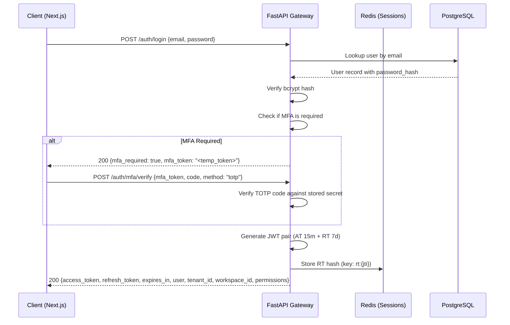
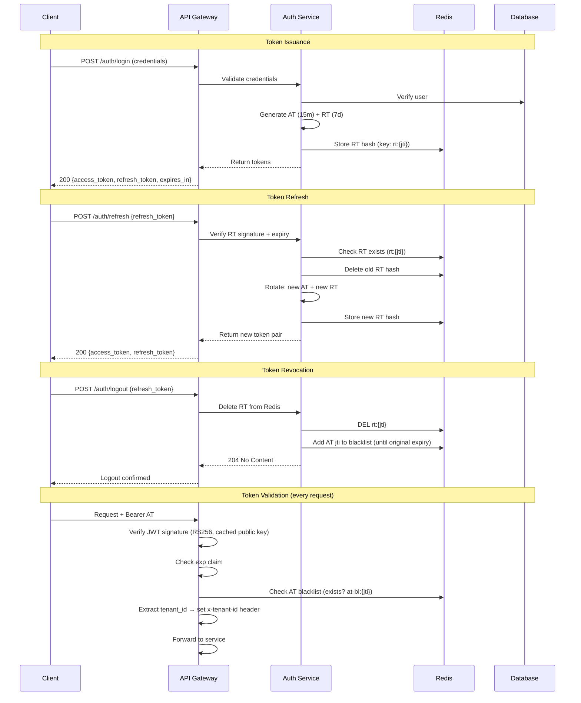
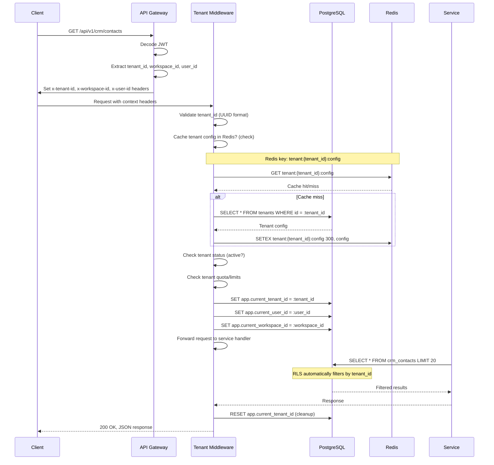
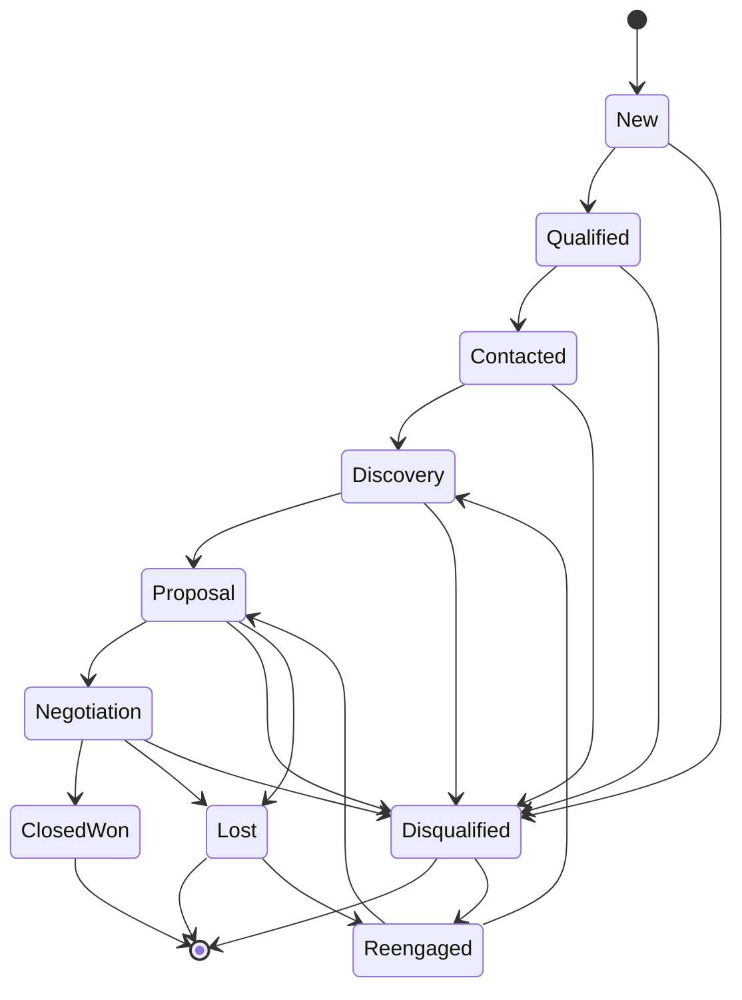
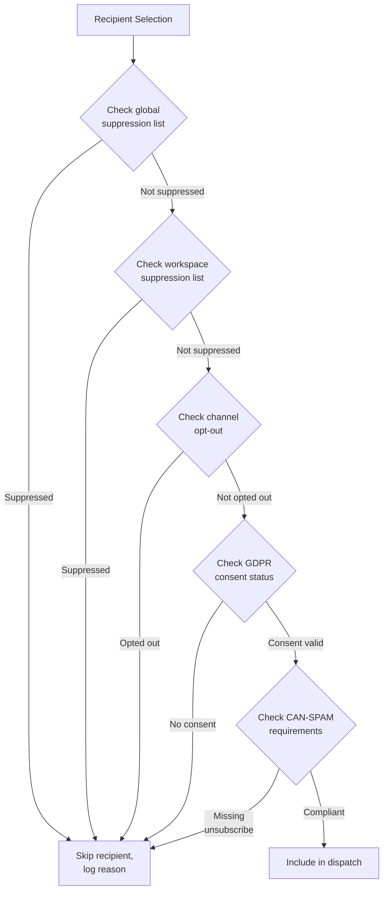
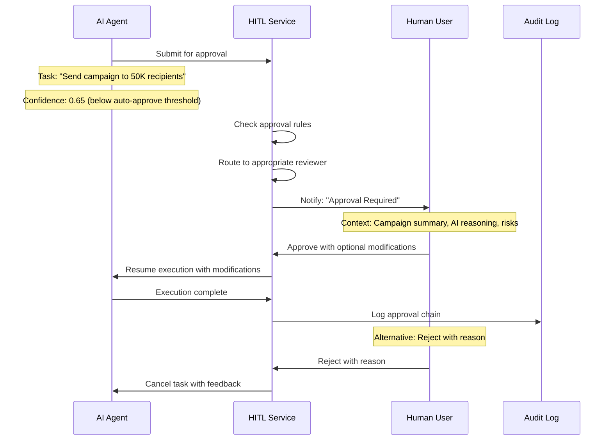

# Volume 3: Software Requirements Specification (SRS)

## Aegis Marketing Cloud (AMC)

> **Document Version:** 1.0  
> **Classification:** Internal — Engineering & Product  
> **Date:** June 2026  
> **Author:** Product & Engineering Team  
> **Status:** Draft  
> **Volume:** 3 of 15

---

## Table of Contents

1. [Introduction](#1-introduction)
   - 1.1 [Purpose](#11-purpose)
   - 1.2 [Scope](#12-scope)
   - 1.3 [Definitions, Acronyms, and Abbreviations](#13-definitions-acronyms-and-abbreviations)
   - 1.4 [References](#14-references)
   - 1.5 [Document Organization](#15-document-organization)
2. [Overall Description](#2-overall-description)
   - 2.1 [Product Perspective](#21-product-perspective)
   - 2.2 [Product Functions](#22-product-functions)
   - 2.3 [User Characteristics](#23-user-characteristics)
   - 2.4 [Constraints](#24-constraints)
   - 2.5 [Assumptions and Dependencies](#25-assumptions-and-dependencies)
3. [System Features & Requirements](#3-system-features--requirements)
   - 3.1 [Authentication & Authorization Subsystem](#31-authentication--authorization-subsystem)
   - 3.2 [Multi-Tenancy Subsystem](#32-multi-tenancy-subsystem)
   - 3.3 [CRM Subsystem](#33-crm-subsystem)
   - 3.4 [Marketing Campaign Subsystem](#34-marketing-campaign-subsystem)
   - 3.5 [AI Agent Subsystem](#35-ai-agent-subsystem)
   - 3.6 [Workflow Automation Subsystem](#36-workflow-automation-subsystem)
   - 3.7 [Billing Subsystem](#37-billing-subsystem)
   - 3.8 [Notification Subsystem](#38-notification-subsystem)
   - 3.9 [Analytics Subsystem](#39-analytics-subsystem)
4. [External Interface Requirements](#4-external-interface-requirements)
   - 4.1 [User Interfaces](#41-user-interfaces)
   - 4.2 [Hardware Interfaces](#42-hardware-interfaces)
   - 4.3 [Software Interfaces](#43-software-interfaces)
   - 4.4 [Communications Interfaces](#44-communications-interfaces)
5. [Database Requirements](#5-database-requirements)
   - 5.1 [Overview](#51-overview)
   - 5.2 [Key Tables per Module](#52-key-tables-per-module)
   - 5.3 [Row-Level Security Policies](#53-row-level-security-policies)
6. [Performance Requirements](#6-performance-requirements)
   - 6.1 [Response Time Requirements](#61-response-time-requirements)
   - 6.2 [Throughput Requirements](#62-throughput-requirements)
   - 6.3 [Concurrency Requirements](#63-concurrency-requirements)
   - 6.4 [Capacity Planning](#64-capacity-planning)
7. [Design Constraints](#7-design-constraints)
   - 7.1 [Technology Stack](#71-technology-stack)
   - 7.2 [Architectural Constraints](#72-architectural-constraints)
   - 7.3 [Deployment Constraints](#73-deployment-constraints)
8. [Software System Attributes](#8-software-system-attributes)
   - 8.1 [Reliability](#81-reliability)
   - 8.2 [Availability](#82-availability)
   - 8.3 [Security](#83-security)
   - 8.4 [Maintainability](#84-maintainability)
   - 8.5 [Portability](#85-portability)
   - 8.6 [Scalability](#86-scalability)
9. [Logical Database Requirements](#9-logical-database-requirements)
   - 9.1 [Entity Summaries per Module](#91-entity-summaries-per-module)
10. [Appendices](#10-appendices)
    - 10.1 [Glossary](#101-glossary)
    - 10.2 [Acronyms](#102-acronyms)
    - 10.3 [References](#103-references)

---

## 1. Introduction

### 1.1 Purpose

This document constitutes the **Software Requirements Specification (SRS)** for **Aegis Marketing Cloud (AMC)**, a multi-tenant AI-native Digital Marketing Operating System. It provides a comprehensive description of the functional and non-functional requirements for all subsystems within the AMC platform.

The intended audience includes:

| Role | Relevance |
|------|-----------|
| **Engineering Team** | Primary consumers — implements all requirements herein |
| **QA / Test Engineering** | Derives test plans, test cases, and acceptance criteria |
| **Product Management** | Validates that implementation matches product intent |
| **DevOps / SRE** | Designs infrastructure to meet performance and availability targets |
| **Security Team** | Reviews authentication, authorization, and data isolation requirements |
| **Technical Writers** | Produces documentation based on system behavior specifications |
| **Executive Leadership** | Understands technical scope and resource requirements |

### 1.2 Scope

This SRS covers the complete AMC platform as a **Software-as-a-Service (SaaS)** product comprising the following subsystems:

1. **Authentication & Authorization** — Identity management, SSO, MFA, RBAC, API keys, rate limiting
2. **Multi-Tenancy** — Workspace isolation, row-level security, tenant context propagation
3. **CRM** — Contact management, pipeline management, activity tracking, lead scoring
4. **Marketing Campaigns** — Multi-channel campaign orchestration, templates, A/B testing, compliance
5. **AI Agents** — Multi-agent orchestration, tool calling, memory tiers, guardrails, HITL
6. **Workflow Automation** — n8n-based workflow engine, triggers, actions, error handling
7. **Billing** — Subscription management, metered billing, invoicing, payment gateway
8. **Notifications** — Multi-channel delivery, template rendering, preference management
9. **Analytics** — Event pipeline, real-time/batch processing, metric definitions, dashboards

**Out of Scope:**

- Third-party marketplace plugin development (covered in Volume 8: Marketplace SDK Specification)
- Mobile native applications (PWA coverage only)
- On-premise deployment (cloud-only; covered in Volume 14: Deployment & DevOps Guide)
- Training and onboarding materials (covered in Volume 13: User Training & Onboarding)
- Detailed database schemas (covered in Volume 5: Database Architecture & Schemas)

### 1.3 Definitions, Acronyms, and Abbreviations

| Term | Definition |
|------|------------|
| **AMC** | Aegis Marketing Cloud |
| **Tenant** | A customer organization; may own multiple workspaces |
| **Workspace** | An isolated environment within a tenant containing its own data, users, and settings |
| **AI Agent** | An autonomous AI-powered entity with a defined role, tool access, and memory |
| **Hermes Agent** | The AI agent framework used to build and orchestrate AMC agents |
| **NVIDIA NIM** | NVIDIA Inference Microservice — the primary AI inference provider |
| **n8n** | Open-source workflow automation engine embedded within AMC |
| **Qdrant** | Vector database for AI long-term memory storage and semantic search |
| **MinIO** | S3-compatible object storage for media assets and documents |
| **RabbitMQ** | Message broker for asynchronous event-driven communication |
| **RLS** | Row-Level Security — PostgreSQL feature for tenant data isolation |
| **RBAC** | Role-Based Access Control |
| **HITL** | Human-In-The-Loop |
| **OIDC** | OpenID Connect |
| **JWT** | JSON Web Token |
| **MFA** | Multi-Factor Authentication |
| **TOTP** | Time-based One-Time Password |
| **SDK** | Software Development Kit |
| **API** | Application Programming Interface |
| **PWA** | Progressive Web Application |
| **SCIM** | System for Cross-domain Identity Management |
| **SLA** | Service Level Agreement |

### 1.4 References

| Reference | Document | Location |
|-----------|----------|----------|
| [V1] | Volume 1: Vision, Mission & Business Goals | `docs/volume-1/01-vision-mission-business-goals.md` |
| [V2] | Volume 2: Product Requirements Document (PRD) | `docs/volume-2/01-prd.md` |
| [V4] | Volume 4: System Architecture & Design | `docs/volume-4/01-architecture.md` |
| [V5] | Volume 5: Database Architecture & Schemas | `docs/volume-5/01-database.md` |
| [V6] | Volume 6: API Specification | `docs/volume-6/01-api-spec.md` |
| [V7] | Volume 7: Security Architecture | `docs/volume-7/01-security.md` |
| [V10] | Volume 10: Compliance & Governance | `docs/volume-10/01-compliance.md` |
| [V14] | Volume 14: Deployment & DevOps Guide | `docs/volume-14/01-devops.md` |
| [RFC7519] | JSON Web Token (JWT) Standard | https://tools.ietf.org/html/rfc7519 |
| [RFC6749] | OAuth 2.0 Authorization Framework | https://tools.ietf.org/html/rfc6749 |
| [RFC7512] | OpenID Connect Core 1.0 | https://openid.net/specs/openid-connect-core-1_0.html |
| [CAN-SPAM] | CAN-SPAM Act of 2003 (US) | https://www.ftc.gov/legal-library/browse/rules/can-spam-act-compliance-guide-business |
| [GDPR] | General Data Protection Regulation (EU) | https://gdpr.eu/ |
| [SOC2] | SOC 2 Type II Compliance Framework | https://www.aicpa.org/soc |

### 1.5 Document Organization

The SRS is organized into the following major sections:

- **Section 1 (Introduction):** Purpose, scope, definitions, and references
- **Section 2 (Overall Description):** Product context, user profiles, constraints, assumptions
- **Section 3 (System Features & Requirements):** Detailed functional requirements for all nine subsystems — this is the core of the document
- **Section 4 (External Interface Requirements):** User, hardware, software, and communications interfaces
- **Section 5 (Database Requirements):** Summary of data requirements per module (cross-reference to Volume 5)
- **Section 6 (Performance Requirements):** Response times, throughput, concurrency, capacity
- **Section 7 (Design Constraints):** Technology stack decisions and architectural constraints
- **Section 8 (Software System Attributes):** Quality attributes — reliability, availability, security, maintainability, portability
- **Section 9 (Logical Database Requirements):** Entity-relationship summaries per module
- **Section 10 (Appendices):** Glossary, acronyms, references

---

## 2. Overall Description

### 2.1 Product Perspective

#### 2.1.1 System Context

Aegis Marketing Cloud is a **new, self-contained product** that replaces the traditional fragmented martech stack. It is not a component of a larger system, nor is it an extension of an existing product. However, it integrates with external services for specific functions:

```
┌─────────────────────────────────────────────────────────────────────┐
│                        Aegis Marketing Cloud                         │
│                                                                       │
│  ┌──────────┐  ┌──────────┐  ┌──────────┐  ┌──────────┐            │
│  │   Next.js  │  │  FastAPI  │  │  GraphQL │  │  n8n      │            │
│  │  Frontend  │◄─┤  API      │◄─┤  Gateway │◄─┤  Worker   │            │
│  └─────┬────┘  └─────┬────┘  └─────┬────┘  └─────┬────┘            │
│        │              │              │              │                  │
│        └──────────────┴──────────────┴──────────────┘                  │
│                           │                                             │
│                    ┌──────▼──────┐                                    │
│                    │  Hermes     │                                    │
│                    │  Agent      │                                    │
│                    │  Orchestrator│                                   │
│                    └──────┬──────┘                                    │
│                           │                                             │
│              ┌────────────┼────────────┐                              │
│              ▼            ▼            ▼                                │
│        ┌─────────┐ ┌─────────┐ ┌─────────┐                           │
│        │  Agent   │ │  Agent  │ │  Agent   │                           │
│        │  CEO     │ │  Writer │ │  SEO     │  ...                      │
│        └────┬────┘ └────┬────┘ └────┬────┘                           │
│             │            │            │                                 │
│             └────────────┴────────────┘                                 │
│                          │                                              │
│                    ┌─────▼──────┐                                      │
│                    │  NVIDIA    │                                      │
│                    │  NIM       │                                      │
│                    └────────────┘                                      │
│                                                                         │
│  ════════════════════════════════════════════════════════════════════  │
│                                                                         │
│  Infrastructure Layer:                                                  │
│  ┌──────────┐ ┌──────┐ ┌────────┐ ┌───────┐ ┌──────────┐ ┌──────────┐│
│  │PostgreSQL│ │Redis │ │ Qdrant │ │MinIO  │ │RabbitMQ  │ │Prometheus││
│  └──────────┘ └──────┘ └────────┘ └───────┘ └──────────┘ └──────────┘│
└─────────────────────────────────────────────────────────────────────┘
         │                    │                    │
         ▼                    ▼                    ▼
   Stripe (Payments)    SendGrid (Email)    Twilio (SMS/WhatsApp)
```

#### 2.1.2 System Interfaces

AMC interfaces with the following external systems:

| External System | Interface Type | Purpose | Protocol |
|-----------------|---------------|---------|----------|
| **Stripe** | REST API | Payment processing, subscription management, invoicing | HTTPS/REST |
| **SendGrid** | REST API / SMTP | Email delivery (campaign and transactional) | HTTPS/REST + SMTP |
| **Twilio** | REST API | SMS and WhatsApp message delivery | HTTPS/REST |
| **NVIDIA NIM** | gRPC / REST | AI inference for agent reasoning and content generation | gRPC (primary) + REST (fallback) |
| **Google APIs** | REST API / OAuth 2.0 | Google Ads, Google Analytics 4, Google Workspace integrations | HTTPS/REST + OAuth 2.0 |
| **Meta APIs** | REST API / OAuth 2.0 | Facebook/Instagram Ads, Messenger integration | HTTPS/REST + OAuth 2.0 |
| **LinkedIn API** | REST API / OAuth 2.0 | LinkedIn Ads, content publishing | HTTPS/REST + OAuth 2.0 |
| **GitHub** | REST API | Plugin marketplace source hosting | HTTPS/REST |
| **Docker Registry** | HTTPS | Container image distribution for n8n worker nodes | HTTPS |

#### 2.1.3 User Interfaces

The system provides the following user interface surfaces:

1. **Primary Web Application** — Next.js-based single-page application (SPA) with server-side rendering (SSR) for SEO-critical pages. Responsive design supporting desktop (1920×1080 primary), tablet (768×1024), and mobile (375×667) viewports.
2. **PWA (Progressive Web Application)** — Offline-capable version with service worker caching, push notifications, and home-screen installation support for iOS and Android.
3. **Embeddable Widgets** — JavaScript widgets for client portal, lead capture forms, and chatbot integration on external websites.
4. **Admin Dashboard** — System administration interface for cross-tenant management (enterprise and internal AMC staff).

### 2.2 Product Functions

A high-level summary of the primary functions of AMC:

| ID | Function | Subsystem | Priority |
|----|----------|-----------|----------|
| F-001 | User registration, login, SSO, MFA, session management | Auth | Critical |
| F-002 | RBAC with roles, permissions, and scope-based access control | Auth | Critical |
| F-003 | API key management (generation, rotation, revocation, audit) | Auth | High |
| F-004 | Rate limiting per user, tenant, API key, and endpoint | Auth | Critical |
| F-005 | Tenant-aware data isolation via PostgreSQL RLS | Multi-Tenancy | Critical |
| F-006 | Tenant context propagation through request pipeline | Multi-Tenancy | Critical |
| F-007 | Cross-tenant admin and impersonation (enterprise only) | Multi-Tenancy | High |
| F-008 | Contact, organization, and deal management with custom fields | CRM | Critical |
| F-009 | Pipeline state machine with configurable stages | CRM | Critical |
| F-010 | Activity feed with timeline view and event aggregation | CRM | High |
| F-011 | Full-text search and filtered queries across CRM entities | CRM | High |
| F-012 | AI lead scoring integration via Hermes agents | CRM | High |
| F-013 | Campaign lifecycle management (draft → archived) | Marketing | Critical |
| F-014 | Multi-channel dispatch engine (email, SMS, WhatsApp, push) | Marketing | Critical |
| F-015 | Template system with drag-and-drop editor and variables | Marketing | Critical |
| F-016 | A/B testing with statistical significance calculation | Marketing | High |
| F-017 | Suppression list and compliance enforcement | Marketing | Critical |
| F-018 | AI agent lifecycle (idle → thinking → executing → completed) | AI Agent | Critical |
| F-019 | Agent communication protocol (inter-agent messaging) | AI Agent | High |
| F-020 | Tool registry with typed inputs/outputs and versioning | AI Agent | Critical |
| F-021 | Multi-tier memory (short-term Redis, long-term Qdrant) | AI Agent | Critical |
| F-022 | Guardrails and content safety constraints | AI Agent | Critical |
| F-023 | HITL approval workflows for high-risk actions | AI Agent | High |
| F-024 | Agent audit trail (every action logged, replayable) | AI Agent | Critical |
| F-025 | n8n integration as embedded worker with remote API fallback | Workflow | Critical |
| F-026 | Workflow triggers (webhook, schedule, event, manual) | Workflow | Critical |
| F-027 | Action types (CRUD, AI invoke, notification, HTTP, transform) | Workflow | Critical |
| F-028 | Error handling, retry policies, dead-letter queues | Workflow | High |
| F-029 | Execution history, monitoring, and debugging | Workflow | High |
| F-030 | Subscription lifecycle management (trial → active → cancelled) | Billing | Critical |
| F-031 | Metered billing calculation and credit consumption tracking | Billing | Critical |
| F-032 | Invoice generation and payment history | Billing | High |
| F-033 | Stripe payment gateway integration | Billing | Critical |
| F-034 | Wallet/credit system for prepaid usage | Billing | High |
| F-035 | Multi-channel notification delivery (email, SMS, WhatsApp, push) | Notifications | High |
| F-036 | Slack, Discord, Telegram, and webhook notification channels | Notifications | Medium |
| F-037 | Template rendering with Handlebars/Jinja-like syntax | Notifications | High |
| F-038 | At-least-once delivery guarantees with deduplication | Notifications | High |
| F-039 | User preference center for notification channels | Notifications | High |
| F-040 | Event pipeline (collect → process → store → aggregate → serve) | Analytics | Critical |
| F-041 | Real-time streaming and batch processing modes | Analytics | Critical |
| F-042 | Predefined and custom metric definitions | Analytics | High |
| F-043 | Dashboard rendering with chart library integration | Analytics | High |
| F-044 | Export formats (CSV, JSON, PDF, Excel, PNG) | Analytics | Medium |

### 2.3 User Characteristics

#### 2.3.1 User Roles and Personas

| Role | Description | Technical Proficiency | Module Access | Expected Count |
|------|-------------|----------------------|---------------|----------------|
| **Workspace Owner** | Full administrative control over a workspace | Moderate | All modules | 1 per workspace |
| **Workspace Admin** | Administrative user with configurable scope | High | Configurable | 1-5 per workspace |
| **Marketing Manager** | Plans and executes campaigns | Moderate | CRM, Marketing, Analytics, AI Agents | 1-20 per workspace |
| **Content Creator** | Creates content for campaigns | Low-Moderate | Marketing (Content), AI Agents (Writer) | 1-50 per workspace |
| **Sales Rep** | Manages pipeline and contacts | Low | CRM | 1-100 per workspace |
| **Analyst** | Views dashboards and exports reports | Moderate | Analytics, CRM (read-only) | 1-10 per workspace |
| **Agency Client** | End-client with restricted view of their data | Low | Limited read-only portal | 5-500 per agency workspace |
| **System Admin** | AMC internal staff; cross-tenant management | Expert | All (including admin tools) | 1-10 (AMC internal) |

#### 2.3.2 User Environment

- **Primary Access:** Modern web browsers (Chrome 120+, Firefox 120+, Safari 17+, Edge 120+)
- **Secondary Access:** PWA on iOS 16+ and Android 12+
- **Network:** Broadband internet (minimum 5 Mbps); offline mode for limited functionality
- **Screen Sizes:** 375px – 4K; primary design target is 1440px
- **Input Methods:** Keyboard + mouse, touch, stylus (for annotations)

### 2.4 Constraints

#### 2.4.1 Technical Constraints

| Constraint | Rationale |
|------------|-----------|
| Must use PostgreSQL 16+ with Row-Level Security | RLS is the chosen multi-tenancy strategy; no per-database isolation |
| Must use Next.js 14+ (App Router) for frontend | Team expertise, SSR performance, React Server Components |
| Must use FastAPI + GraphQL (Strawberry) for backend | Async performance, type safety, native GraphQL support |
| Must use Hermes Agents framework for AI orchestration | Core strategic decision; AI-native architecture pillar |
| Must embed n8n as a sub-process worker | Latency-sensitive workflow execution; remote API fallback for complex cases |
| Must use RabbitMQ for async message passing | Durable delivery guarantees, competing consumer pattern for n8n |
| Must use Qdrant as the vector database | Performance, self-hosted, no external dependency |
| Must use MinIO for S3-compatible object storage | Self-hosted, cost-effective, S3 API compatibility |
| Must use Prometheus + Grafana + Loki for observability | Open-source, Kubernetes-native, scalable |
| Must deploy on Docker / Kubernetes (K8s) | Portability, auto-scaling, self-healing |
| Must support CI/CD via GitHub Actions | Team workflow, infrastructure-as-code |
| Must achieve <500ms P99 API response for read operations | User experience target defined in PRD |
| Must support at minimum 10,000 concurrent API connections | Scale target for Year 1 |

#### 2.4.2 Business Constraints

| Constraint | Rationale |
|------------|-----------|
| Must achieve SOC 2 Type II compliance within 18 months of GA | Enterprise customer requirement |
| Must achieve GDPR compliance at launch | EU market access |
| Must support 5 pricing tiers with metered usage billing | Business model defined in Volume 1 |
| Must support white-label (custom domain, branding) for Agency+ tiers | Competitive differentiator |
| Must maintain 99.9% availability from Month 6 of operation | SLA commitment |
| Must have a free tier to drive top-of-funnel acquisition | Business model defined in Volume 1 |

#### 2.4.3 Regulatory Constraints

| Regulation | Scope | Requirements |
|------------|-------|--------------|
| **GDPR** (EU) | All users in EU/EEA | Right to erasure, data portability, consent management, DPA |
| **CAN-SPAM** (US) | All email campaigns | Unsubscribe mechanism, accurate headers, opt-out honoring within 10 days |
| **CCPA** (California) | California residents | Right to know, right to delete, opt-out of sale |
| **LGPD** (Brazil) | Brazilian users | Similar to GDPR; consent and data subject rights |
| **PCI-DSS** (if applicable) | Payment processing | Handled by Stripe (Stripe is PCI-DSS compliant); AMC never stores raw card data |
| **SOC 2 Type II** | Enterprise customers | Security, availability, processing integrity, confidentiality, privacy |

### 2.5 Assumptions and Dependencies

#### 2.5.1 Assumptions

1. **AI inference costs** will decrease by at least 25% YoY, consistent with industry trends observed from 2022–2026.
2. **NVIDIA NIM** will maintain competitive pricing vs. cloud AI providers (OpenAI, Anthropic, Google) and will continue to support the required model architectures (Llama 3, Nemotron, etc.).
3. **Hermes Agent framework** will continue to be maintained and will support the orchestration patterns described in this document, including inter-agent communication and tool-calling standards.
4. **n8n** will remain open-source (Fair-code license) and API-stable; breaking changes will be communicated with sufficient notice.
5. **PostgreSQL** with Row-Level Security will continue to perform adequately up to 10M+ rows per tenant; partitioning strategies will be employed if performance degrades.
6. **SMB SaaS adoption** continues at or above current growth rates in the marketing technology category.
7. **Browser technology** (PWA support, Web Push API, WebSocket, Service Workers) continues to be supported and improved by major browser vendors.
8. **Cloud infrastructure costs** (compute, storage, network) remain stable ±20% of current pricing.

#### 2.5.2 Dependencies

| Dependency | Type | Risk Level | Mitigation |
|------------|------|------------|------------|
| Stripe API (v2024+) | External service | Low | Webhook fallback, retry logic, local invoice generation as backup |
| SendGrid API | External service | Low | Multi-provider email strategy (SendGrid primary, AWS SES fallback) |
| Twilio API | External service | Low | Multi-provider SMS (Twilio primary, Vonage fallback) |
| NVIDIA NIM API | External service | Medium | Fallback to OpenAI / Anthropic / local models via same abstraction layer |
| Docker / K8s infrastructure | Infrastructure | Low | Multi-cloud strategy (AWS primary, GCP failover) |
| GitHub Actions | CI/CD | Low | Self-hosted runner fallback |
| npm / PyPI registries | Package management | Low | Private mirror, vendored dependencies for critical packages |

---

## 3. System Features & Requirements

### 3.1 Authentication & Authorization Subsystem

#### 3.1.1 Overview

The Authentication & Authorization subsystem is the gateway to all AMC functionality. It provides identity management, secure authentication flows, fine-grained access control, API security, and abuse prevention. The subsystem is designed to support both human users and machine-to-machine (M2M) communication.

```
┌─────────────────────────────────────────────────────────────────┐
│                  Auth & Authorization Subsystem                    │
│                                                                     │
│  ┌──────────────────┐    ┌──────────────────────┐                  │
│  │  Identity Layer    │    │  Authorization Layer  │                  │
│  │  ┌──────────────┐ │    │  ┌────────────────┐ │                  │
│  │  │ Registration  │ │    │  │ RBAC Engine     │ │                  │
│  │  │ Login/Logout  │ │    │  │ Permission       │ │                  │
│  │  │ SSO (OIDC)    │ │    │  │ Resolution       │ │                  │
│  │  │ MFA (TOTP/SMS)│ │    │  │ Scope Validation │ │                  │
│  │  │ Passwordless  │ │    │  │ Policy Evaluation│ │                  │
│  │  └──────────────┘ │    │  └────────────────┘ │                  │
│  └──────────────────┘    └──────────────────────┘                  │
│                                                                     │
│  ┌──────────────────┐    ┌──────────────────────┐                  │
│  │  Session Layer     │    │  API Security Layer   │                  │
│  │  ┌──────────────┐ │    │  ┌────────────────┐ │                  │
│  │  │ JWT Lifecycle  │ │    │  │ API Key Mgmt   │ │                  │
│  │  │ Refresh        │ │    │  │ Rate Limiting   │ │                  │
│  │  │ Rotation       │ │    │  │ Request Signing │ │                  │
│  │  │ Revocation     │ │    │  │ IP Filtering   │ │                  │
│  │  └──────────────┘ │    │  └────────────────┘ │                  │
│  └──────────────────┘    └──────────────────────┘                  │
└─────────────────────────────────────────────────────────────────┘
```

#### 3.1.2 Authentication Flows

##### 3.1.2.1 Primary Authentication Flow (Email + Password)



**Specification:**

| Parameter | Value |
|-----------|-------|
| Access Token (AT) Lifetime | 15 minutes |
| Refresh Token (RT) Lifetime | 7 days (sliding, max 30 days absolute) |
| JWT Algorithm | RS256 (asymmetric; RSA 2048-bit key pair) |
| JWT Header | `{ "alg": "RS256", "typ": "JWT", "kid": "<key-id>" }` |
| JWT Payload (Access Token) | `{ "sub": "<user_id>", "tenant_id": "<tenant_id>", "workspace_id": "<workspace_id>", "roles": ["role1", "role2"], "scopes": ["scope1", "scope2"], "iat": <issued_at>, "exp": <expires_at>, "jti": "<unique_token_id>" }` |
| Refresh Token Storage | Redis hashed (SHA-256); never stored in plaintext |
| Password Hashing | bcrypt with cost factor 12 |
| Maximum Failed Attempts | 5 within 15-minute window → 30-minute account lockout |
| Concurrent Sessions | Configurable per workspace (default: unlimited for Enterprise, 5 for Starter) |

##### 3.1.2.2 JWT Token Lifecycle



**Requirements:**

| ID | Requirement | Priority | Verification |
|----|------------|----------|-------------|
| AUTH-001 | The system SHALL support RS256 JWT signing with automatic key rotation every 30 days | Critical | Key rotation test, JWT validation test |
| AUTH-002 | Access tokens SHALL expire after 15 minutes and SHALL NOT be stored server-side | Critical | Integration test |
| AUTH-003 | Refresh tokens SHALL implement rotation: each refresh invalidates the previous RT and issues a new pair | Critical | Security test |
| AUTH-004 | Refresh token reuse detection SHALL revoke all tokens for the user and require re-authentication | High | Security test |
| AUTH-005 | The system SHALL support token revocation by blacklisting the JWT ID (jti) in Redis for the token's remaining lifetime | High | Integration test |
| AUTH-006 | The system SHALL enforce session limits per pricing tier | Medium | Integration test |
| AUTH-007 | JWTs SHALL include `jti`, `sub`, `tenant_id`, `workspace_id`, `roles`, `scopes`, `iat`, `exp` claims | Critical | Validation test |

##### 3.1.2.3 OAuth 2.0 / OIDC Flows

**Supported OAuth 2.0 Grant Types:**

| Grant Type | Use Case | Client Type |
|------------|----------|-------------|
| Authorization Code + PKCE | User login via third-party IdP (Google, Microsoft, GitHub) | Public (SPA) |
| Client Credentials | M2M communication (workflow automation, API integrations) | Confidential (backend) |
| Refresh Token | Session maintenance without re-authentication | Public + Confidential |
| Device Authorization Grant | CLI / headless environments | Public |

**Supported OIDC Providers:**

| Provider | Configurable? | Default Enabled? |
|----------|---------------|------------------|
| Google Workspace | Yes | Yes |
| Microsoft Entra ID (Azure AD) | Yes | Yes |
| GitHub | Yes | No |
| Okta | Yes | No |
| Any generic OIDC provider | Yes (manual config) | No |

**Requirements:**

| ID | Requirement | Priority |
|----|------------|----------|
| AUTH-008 | The system SHALL support OAuth 2.0 Authorization Code flow with PKCE (RFC 7636) for SPA clients | Critical |
| AUTH-009 | The system SHALL support OIDC Discovery URL (`.well-known/openid-configuration`) | Critical |
| AUTH-010 | The system SHALL support automatic IdP-initiated SSO (IdP sends SAML/OIDC assertion) | High |
| AUTH-011 | The system SHALL map IdP groups to AMC workspace roles during first login | High |
| AUTH-012 | M2M client credentials SHALL be rate-limited separately from user tokens | Critical |
| AUTH-013 | The system SHALL support SCIM (RFC 7643) for user provisioning/deprovisioning (Enterprise tier) | High |

##### 3.1.2.4 MFA Implementation

**Supported MFA Methods:**

| Method | Security Level | User Experience | Implementation |
|--------|---------------|-----------------|----------------|
| TOTP (Authenticator App) | High | Medium (setup + code entry) | RFC 6238, 30-second window, 6 digits |
| SMS | Medium | High (no app needed) | Twilio Verify API, 6-digit code, 2-minute expiry |
| Email | Medium | High (no app needed) | SendGrid, 6-digit code, 5-minute expiry |
| Hardware Security Key (WebAuthn) | Very High | High (tap key) | WebAuthn API (FIDO2; Enterprise tier) |
| Recovery Codes | N/A | N/A | 10 one-time recovery codes, regeneratable |

**MFA Flow (TOTP example):**

```
1. User completes primary authentication (email+password or SSO)
2. Server checks if MFA is required for this user/workspace
3. If MFA required, server returns 200 with { mfa_required: true, mfa_token: "<temp_token>" }
   - temp_token: short-lived (2 min), single-use, signed JWT containing user_id and session context
4. Client presents MFA challenge UI
5. User enters TOTP code from authenticator app
6. POST /auth/mfa/verify { mfa_token, code, method: "totp" }
7. Server verifies code against user's stored TOTP secret
8. On success: issue AT+RT pair
9. On failure (5 attempts): lock MFA for 5 minutes, notify user via email
```

**MFA Enrollment Flow:**

```
1. User navigates to Security Settings → MFA
2. POST /auth/mfa/enroll { method: "totp" }
3. Server generates TOTP secret (32 bytes, base32-encoded)
4. Server returns { secret, qr_code_uri, recovery_codes }
5. User scans QR code with authenticator app
6. User confirms by entering current TOTP code
7. POST /auth/mfa/confirm { mfa_token, code }
8. On success: MFA enabled, recovery codes displayed (user must acknowledge)
```

**Requirements:**

| ID | Requirement | Priority |
|----|------------|----------|
| AUTH-014 | MFA SHALL be configurable at the workspace level (required, optional, disabled) | Critical |
| AUTH-015 | Individual users SHALL be able to enable/disable MFA unless workspace mandates it | Critical |
| AUTH-016 | TOTP SHALL use 30-second time step, 6-digit codes, SHA-1 (RFC 4226 compliant) | Critical |
| AUTH-017 | SMS MFA SHALL rate-limit to 3 attempts per phone number per hour | High |
| AUTH-018 | Recovery codes SHALL be one-time use, SHA-256 hashed in storage, 10 codes per user | Critical |
| AUTH-019 | MFA status SHALL be re-evaluated on every primary authentication, not cached | Critical |
| AUTH-020 | WebAuthn/FIDO2 SHALL be supported for Enterprise tier | Medium |

#### 3.1.3 Authorization Model (RBAC)

##### 3.1.3.1 RBAC Architecture

The AMC authorization model uses a hierarchical RBAC system with scope-based access control:

```
User
 ├── Has one or more Roles (at workspace level)
 └── Roles contain Permissions
      └── Permissions are grouped by Module → Action → Scope

Workspace
 ├── Has a set of Roles (system-defined + custom)
 └── Each Role defines:
      ├── Module access (CRM, Marketing, etc.)
      ├── Action level (create, read, update, delete, admin)
      └── Scope (own, team, workspace)
```

**Predefined Roles:**

| Role Name | Level | Description |
|-----------|-------|-------------|
| `workspace_owner` | Workspace | Full access including billing, settings, user management |
| `workspace_admin` | Workspace | Full access except billing and workspace deletion |
| `marketing_manager` | Module (Marketing) | Full marketing module access, campaign creation |
| `marketing_viewer` | Module (Marketing) | Read-only access to marketing module |
| `sales_manager` | Module (CRM) | Full CRM access, pipeline management, team assignment |
| `sales_rep` | Module (CRM) | Own contacts and deals, read team pipeline |
| `content_creator` | Module (Content) | Create and edit content, cannot publish or schedule |
| `analyst` | Module (Analytics) | Read-only access to all dashboards and reports |
| `agency_client` | Workspace (restricted) | Limited read-only access to assigned workspace data |
| `system_admin` | Global (AMC internal) | Cross-tenant admin access |

**Permission Structure:**

```json
{
  "module": "crm",
  "resource": "contact",
  "actions": ["create", "read", "update", "delete", "export", "assign"],
  "scope": "workspace"  // "own" | "team" | "workspace"
}
```

**Permission Resolution Algorithm (Pseudocode):**

```python
def check_permission(user: User, module: str, resource: str, action: str, resource_owner_id: UUID) -> bool:
    # 1. Super-admin bypass
    if 'system_admin' in user.roles:
        return True

    # 2. Resolve effective scopes from all roles
    effective_scopes = set()
    for role in user.workspace_roles:
        for perm in role.permissions:
            if perm.module == module and perm.resource == resource and action in perm.actions:
                effective_scopes.add(perm.scope)

    if not effective_scopes:
        return False

    # 3. Evaluate scope
    resource_tenant = get_resource_tenant(resource, resource_owner_id)
    if resource_tenant != user.tenant_id:
        return False  # Cross-tenant access denied (except system_admin)

    if 'workspace' in effective_scopes:
        return True  # Can access any resource in workspace

    if 'team' in effective_scopes:
        return user.team_id == get_resource_team(resource, resource_owner_id)

    if 'own' in effective_scopes:
        return user.id == resource_owner_id

    return False
```

##### 3.1.3.2 Requirements

| ID | Requirement | Priority |
|----|------------|----------|
| AUTH-021 | The system SHALL support role assignment at the workspace level with user-role binding | Critical |
| AUTH-022 | The system SHALL support custom role creation with user-defined permission combinations | High |
| AUTH-023 | Permission evaluation SHALL use a deny-by-default model | Critical |
| AUTH-024 | Permission changes SHALL take effect immediately without requiring re-login | Critical |
| AUTH-025 | The system SHALL support scope-based access (own, team, workspace) within each role | Critical |
| AUTH-026 | The system SHALL provide an audit log of all role and permission changes | High |
| AUTH-027 | Maximum role inheritance depth SHALL NOT exceed 3 levels (workspace role → team role → custom) | Medium |
| AUTH-028 | The system SHALL support 100+ custom roles per workspace without performance degradation | High |

#### 3.1.4 API Key Management

##### 3.1.4.1 API Key Lifecycle

```
┌──────────┐    ┌──────────┐    ┌──────────┐    ┌──────────┐
│  Generated │──►│   Active  │──►│  Expired  │──►│  Rotated  │
│            │    │            │    │            │    │            │
└──────────┘    └──────────┘    └──────────┘    └──────────┘
                      │
                      ▼
                 ┌──────────┐
                 │ Revoked   │
                 └──────────┘
```

**Specification:**

| Property | Value |
|----------|-------|
| Key Format | `amc_` prefix + 40 alphanumeric characters (CSPRNG-generated) |
| Key Storage | bcrypt hash (never stored in plaintext) |
| Display | Last 4 characters only; full key shown once at creation |
| Default Expiry | 90 days (configurable: 1–365 days) |
| Maximum Keys per User | 10 (configurable per workspace) |
| Permissions | Scoped to specific module + action (fine-grained) |
| Audit | Every key usage logged (timestamp, IP, endpoint, status code) |

**Requirements:**

| ID | Requirement | Priority |
|----|------------|----------|
| AUTH-029 | API keys SHALL be generated using cryptographically secure random number generators (CSPRNG) | Critical |
| AUTH-030 | API keys SHALL be hashed with bcrypt before storage; the plaintext key SHALL only be displayed once at creation | Critical |
| AUTH-031 | API key rotation SHALL NOT invalidate the current key until the new key is confirmed working | High |
| AUTH-032 | API key revocation SHALL take effect within 30 seconds (Redis TTL propagation) | Critical |
| AUTH-033 | The system SHALL support granular API key scoping to specific modules and actions | High |
| AUTH-034 | The system SHALL maintain a complete audit log of API key creation, rotation, and revocation | High |
| AUTH-035 | Expired API keys SHALL be automatically rotated (admin notified) or revoked after grace period | Medium |

#### 3.1.5 Rate Limiting

**Rate Limiting Strategy:**

```
┌─────────────────────────────────────────────────────────────────┐
│                      Rate Limiting Pipeline                        │
│                                                                     │
│  Request → IP Check → User Check → API Key Check → Endpoint Check │
│              │            │              │               │         │
│              ▼            ▼              ▼               ▼         │
│         ┌────────┐  ┌────────┐   ┌────────┐    ┌────────┐        │
│         │  Global │  │  User   │   │API Key │    │Endpoint│        │
│         │  IP     │  │  Level  │   │ Level  │    │ Level  │        │
│         └────────┘  └────────┘   └────────┘    └────────┘        │
│              │            │              │               │         │
│              └────────────┴──────────────┴───────────────┘         │
│                              │                                      │
│                              ▼                                      │
│                    ┌──────────────────┐                            │
│                    │  MIN(all limits)  │                            │
│                    │  → 429 if exceeded│                            │
│                    └──────────────────┘                            │
└─────────────────────────────────────────────────────────────────┘
```

**Rate Limit Tiers:**

| Tier | Global IP | Per-User | Per-API-Key | Per-Endpoint (Sensitive) | Per-Endpoint (Read) |
|------|-----------|----------|-------------|--------------------------|---------------------|
| Starter | 100/min | 60/min | N/A | 10/min | 120/min |
| Pro | 500/min | 120/min | 60/min | 30/min | 300/min |
| Business | 2000/min | 300/min | 120/min | 60/min | 600/min |
| Agency | 5000/min | 600/min | 300/min | 120/min | 1200/min |
| Enterprise | Custom | Custom | Custom | Custom | Custom |

**Rate Limit Algorithm:** Sliding Window (Redis sorted sets)

```python
# Pseudocode for Sliding Window Rate Limiter
def check_rate_limit(key: str, limit: int, window_seconds: int = 60) -> bool:
    now = time.time()
    window_start = now - window_seconds

    # Redis Sorted Set with score = timestamp
    redis.zremrangebyscore(f"ratelimit:{key}", 0, window_start)
    current_count = redis.zcard(f"ratelimit:{key}")

    if current_count >= limit:
        return False  # Rate limited

    redis.zadd(f"ratelimit:{key}", {str(now): now})
    redis.expire(f"ratelimit:{key}", window_seconds)
    return True
```

**Rate Limit Response:**

```json
{
  "error": {
    "code": "RATE_LIMIT_EXCEEDED",
    "message": "Rate limit exceeded. Please wait before making additional requests.",
    "retry_after_seconds": 45
  }
}
```

**Headers (Rate Limit Information):**

| Header | Description |
|--------|-------------|
| `X-RateLimit-Limit` | Max requests per window |
| `X-RateLimit-Remaining` | Remaining requests in current window |
| `X-RateLimit-Reset` | Unix timestamp when the window resets |
| `Retry-After` | Seconds to wait before retrying (when 429 returned) |

**Requirements:**

| ID | Requirement | Priority |
|----|------------|----------|
| AUTH-036 | The system SHALL implement multi-layer rate limiting: IP, user, API key, and endpoint | Critical |
| AUTH-037 | Rate limits SHALL be tier-aware and configurable per workspace | Critical |
| AUTH-038 | Rate limit counters SHALL use sliding windows with Redis sorted sets | Critical |
| AUTH-039 | All rate limit violations SHALL be logged and tracked for abuse detection | High |
| AUTH-040 | The system SHALL return standard rate limit headers on all API responses | High |
| AUTH-041 | Rate limit configuration changes SHALL take effect within 60 seconds | Medium |
| AUTH-042 | Suspicious rate limit patterns (bursts from multiple keys/IPs) SHALL trigger abuse alerts | High |

---

### 3.2 Multi-Tenancy Subsystem

#### 3.2.1 Overview

Multi-tenancy in AMC is implemented via **Row-Level Security (RLS)** in PostgreSQL, augmented by application-layer tenant context propagation. Every table in the database (except system-level reference data) has a `tenant_id` column, and RLS policies enforce that queries only return records belonging to the current tenant context.

```
┌─────────────────────────────────────────────────────────────────┐
│                    Multi-Tenancy Architecture                      │
│                                                                     │
│  ┌────────────┐    ┌────────────┐    ┌────────────┐               │
│  │  Tenant A   │    │  Tenant B   │    │  Tenant C   │               │
│  │  (Acme Inc) │    │  (Beta LLC) │    │  (Gamma SA) │               │
│  └──────┬──────┘    └──────┬──────┘    └──────┬──────┘               │
│         │                  │                  │                        │
│         └──────────────────┼──────────────────┘                        │
│                            ▼                                           │
│              ┌─────────────────────────┐                              │
│              │     API Gateway          │                              │
│              │   Extracts x-tenant-id   │                              │
│              │   from JWT / header      │                              │
│              └────────────┬────────────┘                              │
│                           │                                            │
│                           ▼                                            │
│              ┌─────────────────────────┐                              │
│              │   PostgreSQL + RLS       │                              │
│              │                          │                              │
│              │  ┌─────────────────────┐ │                              │
│              │  │ Tenant A rows        │ │                              │
│              │  │ (tenant_id = '...a') │ │                              │
│              │  │ Tenant B rows        │ │                              │
│              │  │ (tenant_id = '...b') │ │                              │
│              │  │ Tenant C rows        │ │                              │
│              │  │ (tenant_id = '...c') │ │                              │
│              │  └─────────────────────┘ │                              │
│              └─────────────────────────┘                              │
└─────────────────────────────────────────────────────────────────┘
```

#### 3.2.2 Row-Level Security (RLS) Implementation

##### 3.2.2.1 RLS Policy Template

```sql
-- Enable RLS on table
ALTER TABLE crm_contacts ENABLE ROW LEVEL SECURITY;

-- Create tenant isolation policy
CREATE POLICY tenant_isolation ON crm_contacts
    FOR ALL
    USING (tenant_id = current_setting('app.current_tenant_id')::UUID)
    WITH CHECK (tenant_id = current_setting('app.current_tenant_id')::UUID);

-- Create admin override policy (for system admins)
CREATE POLICY tenant_admin_override ON crm_contacts
    FOR SELECT
    USING (current_setting('app.is_admin')::BOOLEAN = TRUE);

-- Create cross-tenant query policy (for Enterprise, limited)
CREATE POLICY tenant_cross_query ON crm_contacts
    FOR SELECT
    USING (tenant_id = ANY(
        SELECT unnest(current_setting('app.allowed_tenant_ids')::UUID[])
    ));
```

##### 3.2.2.2 Tenant Context Propagation

```
Request Flow:
1. Client sends request with JWT in Authorization header
2. API Gateway validates JWT and extracts tenant_id from claims
3. API Gateway sets:
   - Header: x-tenant-id: <tenant_id>
   - Header: x-workspace-id: <workspace_id>
   - Header: x-user-id: <user_id>
4. FastAPI middleware captures these headers
5. For each database session:
   a. SET app.current_tenant_id = '<tenant_id>'
   b. SET app.current_user_id = '<user_id>'
   c. SET app.current_workspace_id = '<workspace_id>'
   d. SET app.is_admin = '<true|false>'
   e. SET app.allowed_tenant_ids = '<array>' (for cross-tenant queries)
6. All queries within that session are automatically filtered by RLS
```

**Tenant Context Middleware (Pseudocode):**

```python
# FastAPI Middleware for Tenant Context
@app.middleware("http")
async def tenant_context_middleware(request: Request, call_next):
    # Extract tenant context
    tenant_id = request.headers.get("x-tenant-id")
    workspace_id = request.headers.get("x-workspace-id")
    user_id = request.headers.get("x-user-id")

    if not tenant_id:
        return JSONResponse(
            status_code=400,
            content={"error": "MISSING_TENANT", "message": "x-tenant-id header is required"}
        )

    # Validate tenant_id format
    try:
        UUID(tenant_id)
    except ValueError:
        return JSONResponse(
            status_code=400,
            content={"error": "INVALID_TENANT", "message": "Invalid tenant_id format"}
        )

    # Set PostgreSQL session parameters
    async with get_db_session() as session:
        await session.execute(
            text("SELECT set_config('app.current_tenant_id', :tid, true)"),
            {"tid": tenant_id}
        )
        # ... set other session parameters

    # Process request
    response = await call_next(request)

    # Clear session parameters
    async with get_db_session() as session:
        await session.execute(
            text("SELECT set_config('app.current_tenant_id', '', true)")
        )

    return response
```

#### 3.2.3 Data Isolation Guarantees

| Isolation Level | Mechanism | Description |
|----------------|-----------|-------------|
| **Database Level** | RLS Policies | Every query implicitly filtered by `tenant_id` |
| **Application Level** | Tenant Context Middleware | Prevents cross-tenant data leakage at API layer |
| **Cache Level** | Namespaced Redis Keys | All Redis keys prefixed with `{tenant_id}:` |
| **Queue Level** | RabbitMQ Virtual Hosts | Separate vhosts per tenant (optional, Enterprise) or routing key isolation |
| **Storage Level** | MinIO Bucket Prefixes | Objects stored under `/{tenant_id}/...` prefix |
| **Vector Store** | Qdrant Collection Filtering | All queries filtered by `tenant_id` payload field |
| **Backup Level** | Per-tenant Backup Streams | Enterprise: separate logical backups per tenant |
| **Encryption Level** | Per-tenant Encryption Keys | Enterprise: tenant-specific KMS keys for field-level encryption |

#### 3.2.4 Tenant Hierarchy

```
AMC Platform
 ├── Tenant (Organization)
 │    ├── Workspace A
 │    │    ├── User 1 (Owner)
 │    │    ├── User 2 (Admin)
 │    │    └── User 3 (Member)
 │    ├── Workspace B
 │    │    ├── User 1 (Admin)
 │    │    └── User 4 (Member)
 │    └── Billing Profile
 ├── Tenant (Organization)
 │    └── ...
 └── System Administration
      └── System Admin Users (cross-tenant access)
```

**Tenant Types:**

| Type | Max Workspaces | Max Users (per workspace) | Features |
|------|----------------|---------------------------|----------|
| Free | 1 | 1 | Basic CRM, 100 contacts |
| Starter | 1 | 1 | Full CRM, 1K contacts |
| Pro | 1 | 3 | All modules, 10K contacts |
| Business | 3 | 10 | Advanced features |
| Agency | 25 | 25 | White-label, client portals |
| Enterprise | Unlimited | Unlimited | Dedicated infra, SSO, SCIM |

#### 3.2.5 Cross-Tenant Admin Capabilities

**System Admin Functions:**

| Function | Description | Scope |
|----------|-------------|-------|
| Tenant Impersonation | Log in as any tenant user with audit trail | Any tenant |
| Cross-Tenant Reports | Aggregate analytics across tenants (anonymized) | Enterprise |
| Tenant Configuration | Modify tenant settings, feature flags | Any tenant |
| Usage Monitoring | View resource consumption per tenant | Any tenant |
| Compliance Queries | GDPR data subject access requests | Any tenant |
| Support Access | Read-only access to tenant data for support | With tenant consent |

**Requirements:**

| ID | Requirement | Priority |
|----|------------|----------|
| MTN-001 | Every table containing tenant data SHALL have a `tenant_id` column of type `UUID` | Critical |
| MTN-002 | RLS policies SHALL be enabled on all tenant-scoped tables with no exceptions | Critical |
| MTN-003 | Tenant context SHALL be propagated via PostgreSQL session parameters on every connection | Critical |
| MTN-004 | The system SHALL use Redis key namespacing (`{tenant_id}:key`) for cache isolation | Critical |
| MTN-005 | Cross-tenant data access SHALL be prohibited by default and SHALL require explicit `system_admin` role | Critical |
| MTN-006 | Tenant impersonation SHALL require 2FA for the admin and SHALL be fully audited | Critical |
| MTN-007 | Tenant deletion SHALL cascade to all tenant data with a 30-day soft-delete grace period | Critical |
| MTN-008 | The system SHALL support tenant data portability (export all tenant data in standard formats) | High |
| MTN-009 | RLS policies SHALL be tested as part of CI/CD pipeline with automated security scanning | Critical |
| MTN-010 | The system SHALL enforce that `tenant_id` cannot be changed after record creation | Critical |



---

### 3.3 CRM Subsystem

#### 3.3.1 Overview

The CRM subsystem is the core data hub of AMC, managing contacts, organizations, deals, pipelines, activities, and interactions. It provides a 360-degree view of customer relationships and serves as the data foundation for marketing campaigns, analytics, and AI agent operations.

```
┌─────────────────────────────────────────────────────────────────┐
│                      CRM Subsystem                                  │
│                                                                     │
│  ┌─────────────┐  ┌─────────────┐  ┌─────────────┐                │
│  │   Contacts    │  │Organizations│  │    Deals     │                │
│  │              │  │             │  │              │                │
│  │ • Custom     │  │ • Hierarchy │  │ • Pipeline   │                │
│  │   Fields     │  │ • Industry  │  │ • Stages     │                │
│  │ • Tags       │  │ • Domain    │  │ • Amount     │                │
│  │ • Lifecycle  │  │ • Contacts  │  │ • Close Date │                │
│  └──────┬───────┘  └──────┬──────┘  └──────┬───────┘                │
│         │                 │                 │                         │
│         └─────────────────┼─────────────────┘                         │
│                           │                                           │
│                    ┌──────▼──────┐                                   │
│                    │  Activities   │                                   │
│                    │  (Timeline)   │                                   │
│                    │              │                                   │
│                    │ • Notes     │                                   │
│                    │ • Emails    │                                   │
│                    │ • Calls     │                                   │
│                    │ • Meetings  │                                   │
│                    │ • Tasks     │                                   │
│                    │ • AI Actions│                                   │
│                    └─────────────┘                                   │
│                                                                     │
│  ┌─────────────┐  ┌─────────────┐  ┌─────────────┐                │
│  │  Search &    │  │  AI Lead    │  │  Import/     │                │
│  │  Filters     │  │  Scoring    │  │  Export      │                │
│  └─────────────┘  └─────────────┘  └─────────────┘                │
└─────────────────────────────────────────────────────────────────┘
```

#### 3.3.2 Data Models and Relationships

##### 3.3.2.1 Core Entities

```mermaid
erDiagram
    CONTACT {
        uuid id PK
        uuid tenant_id FK
        uuid organization_id FK "nullable"
        uuid owner_id FK "user_id"
        string first_name
        string last_name
        string email
        string phone
        string mobile_phone
        string job_title
        string lifecycle_stage "subscriber|lead|mql|sql|opportunity|customer|churned"
        string source "web|referral|import|api|ai_scored|manual"
        jsonb custom_fields
        text[] tags
        jsonb address
        string timezone
        string preferred_language
        boolean is_do_not_call
        boolean is_do_not_email
        timestamp last_contacted_at
        timestamp created_at
        timestamp updated_at
        timestamp deleted_at "soft delete"
    }

    ORGANIZATION {
        uuid id PK
        uuid tenant_id FK
        uuid owner_id FK
        string name
        string domain
        string industry
        string size "1-10|11-50|51-200|201-1000|1001-5000|5001+"
        string revenue_range
        jsonb custom_fields
        text[] tags
        jsonb address
        string phone
        string website
        string linkedin_url
        uuid parent_organization_id FK "nullable, self-referential"
        timestamp created_at
        timestamp updated_at
        timestamp deleted_at
    }

    DEAL {
        uuid id PK
        uuid tenant_id FK
        uuid contact_id FK "nullable"
        uuid organization_id FK "nullable"
        uuid owner_id FK
        uuid pipeline_id FK
        uuid stage_id FK
        string name
        numeric amount
        string currency "default: USD"
        date expected_close_date
        numeric probability "0-100"
        string stage_name "denormalized for query perf"
        int stage_order "denormalized"
        jsonb custom_fields
        text[] tags
        string loss_reason "nullable, set when stage=lost"
        timestamp won_at "nullable"
        timestamp lost_at "nullable"
        timestamp created_at
        timestamp updated_at
        timestamp deleted_at
    }

    PIPELINE {
        uuid id PK
        uuid tenant_id FK
        string name "e.g. Sales Pipeline"
        string description
        boolean is_default
        int stage_count
        jsonb settings "routing, assignment rules"
        timestamp created_at
        timestamp updated_at
        timestamp deleted_at
    }

    PIPELINE_STAGE {
        uuid id PK
        uuid pipeline_id FK
        string name "e.g. Discovery, Proposal, Negotiation"
        int order
        string category "active|won|lost" "determines funnel behavior"
        numeric probability_default "default probability for deals in this stage"
        jsonb settings "auto-assignment, SLA, notifications"
        timestamp created_at
        timestamp updated_at
    }

    ACTIVITY {
        uuid id PK
        uuid tenant_id FK
        uuid contact_id FK "nullable"
        uuid deal_id FK "nullable"
        uuid organization_id FK "nullable"
        uuid user_id FK "performer"
        string activity_type "note|email|call|meeting|task|sms|system|ai_action|webhook"
        string subject
        text body
        jsonb metadata "event-specific data"
        timestamp activity_date
        boolean is_done "for tasks"
        timestamp created_at
    }

    CONTACT_ORGANIZATION {
        uuid contact_id FK
        uuid organization_id FK
        string role "employee|decision_maker|influencer|partner|customer"
        boolean is_primary
        timestamp created_at
    }
```

**Entity Relationships:**

| Relationship | Type | Cardinality | Description |
|-------------|------|-------------|-------------|
| Contact ↔ Organization | Many-to-Many | *:* | Contact can belong to multiple orgs; org has many contacts |
| Contact ↔ Deals | One-to-Many | 1:* | Contact can have multiple deals |
| Organization ↔ Deals | One-to-Many | 1:* | Organization can have multiple deals |
| Pipeline ↔ Stages | One-to-Many | 1:* | Pipeline has ordered stages |
| Deal ↔ Pipeline_Stage | Many-to-One | *:1 | Deal is at one stage in one pipeline |
| Contact ↔ Activity | One-to-Many | 1:* | Contact activity feed |
| Deal ↔ Activity | One-to-Many | 1:* | Deal activity feed |
| User ↔ Contacts (Owner) | One-to-Many | 1:* | User owns contacts |
| User ↔ Deals (Owner) | One-to-Many | 1:* | User owns deals |

#### 3.3.3 Pipeline State Machine



**Stage Transition Rules:**

| From Stage | To Stage | Conditions | Side Effects |
|------------|----------|------------|-------------|
| New | Qualified | AI score >= 50 OR manual qualification | Log activity, assign owner if rule-based |
| New | Disqualified | Manual action with reason | Log reason, suppress from future campaigns |
| Qualified | Contacted | Manual action or workflow trigger | Log activity, increment contact count |
| Contacted | Discovery | Positive response OR meeting booked | Log activity, update expected close date |
| Proposal | Negotiation | Proposal sent | Log activity, update probability to 70% |
| Negotiation | Closed Won | Signed contract / payment received | Set `won_at`, update probability to 100%, trigger post-sale workflow |
| Any | Lost | Manual action with reason | Set `lost_at`, update probability to 0%, trigger re-engagement after N days |
| Lost | Reengaged | Campaign interaction OR manual | Log activity, reset probability |
| Disqualified | Reengaged | Criteria changes OR manual override | Log activity, clear reason |

**Requirements:**

| ID | Requirement | Priority |
|----|------------|----------|
| CRM-001 | Pipelines SHALL be configurable with custom stages, order, and transition rules | Critical |
| CRM-002 | Stage transitions SHALL enforce allowed paths as defined in pipeline configuration | Critical |
| CRM-003 | Stage transitions SHALL trigger configurable side effects (activities, notifications, webhooks) | High |
| CRM-004 | The system SHALL support simultaneous deals across multiple pipelines | High |
| CRM-005 | Pipeline analytics SHALL provide conversion rates, velocity, and stage duration metrics | High |
| CRM-006 | The system SHALL enforce a maximum of 20 stages per pipeline | Medium |
| CRM-007 | Stage reordering SHALL update stage_order for all affected stages | Medium |
| CRM-008 | Deal probability SHALL auto-calculate based on stage default probability unless overridden | High |

#### 3.3.4 Activity Feed Design

**Activity Aggregation Strategy:**

Activity items are stored as discrete events but aggregated for display:

```
Raw Events (individual):
  - Call logged  (duration: 5m, outcome: left_voicemail)
  - Email sent   (subject: "Proposal", campaign_id: x)
  - Email opened (campaign_id: x, timestamp: ...)
  - Email clicked (campaign_id: x, link: "pricing", timestamp: ...)
  - Note added   (content: "Client interested in enterprise tier")

Aggregated Timeline Display:
  1. Call: Left voicemail (5m) - John Doe - 2 hours ago
  2. Email Sequence "Proposal Follow-up" (3 of 5 steps complete)
     ├── Sent: "Introduction" - 3 days ago
     ├── Opened: "Introduction" - 3 days ago
     ├── Clicked: "Pricing Page" - 3 days ago
     └── Sent: "Case Study" - 1 day ago
  3. Note: "Client interested in enterprise tier" - Sarah - 2 hours ago
```

**Activity Types and Metadata:**

| Activity Type | Metadata Schema | Display Template |
|---------------|----------------|------------------|
| `note` | `{ "content_type": "text|markdown", "pinned": bool }` | "{{user}} added a note" |
| `email` | `{ "message_id", "subject", "from", "to", "cc", "direction": "inbound|outbound", "campaign_id" }` | "{{user}} sent email: {{subject}}" |
| `call` | `{ "duration_seconds", "direction": "inbound|outbound", "outcome": "connected|voicemail|no_answer|busy", "recording_url" }` | "{{user}} called ({{outcome}}, {{duration}}m)" |
| `meeting` | `{ "start_time", "end_time", "meeting_type": "zoom|google_meet|phone|in_person", "outcome" }` | "{{user}} met with {{contact}}" |
| `task` | `{ "due_date", "priority": "low|medium|high|urgent", "is_completed", "completed_at" }` | "Task: {{subject}}" |
| `sms` | `{ "direction", "body_preview", "character_count" }` | "SMS sent to {{contact}}" |
| `system` | `{ "action": "stage_change|field_update|merge|import|export", "changes": {} }` | "System: {{contact}} moved to {{stage}}" |
| `ai_action` | `{ "agent_id", "agent_name", "action": "scored|classified|drafted|analyzed", "details": {} }` | "AI Agent {{name}}: scored lead at {{score}}" |
| `webhook` | `{ "source", "event_type", "payload_preview" }` | "Webhook: {{event_type}} from {{source}}" |

**Requirements:**

| ID | Requirement | Priority |
|----|------------|----------|
| CRM-009 | Activities SHALL be mutable records linked to contacts, deals, and/or organizations | Critical |
| CRM-010 | Activity feed SHALL support infinite scroll with cursor-based pagination | High |
| CRM-011 | Activity feed SHALL support filtering by activity type, date range, and user | High |
| CRM-012 | Related activities SHALL be grouped and displayed as aggregated timeline items | Medium |
| CRM-013 | Activity creation via API SHALL be real-time (sub-second propagation to UI) | High |
| CRM-014 | The system SHALL support 10,000+ activities per contact without performance degradation | High |

#### 3.3.5 Search & Filter Specifications

**Search Capabilities:**

| Feature | Technology | Description |
|---------|------------|-------------|
| Full-Text Search | PostgreSQL tsvector + GIN index | Searches name, email, phone, custom fields |
| Fuzzy Search | pg_trgm + GIST index | Handles typos and partial matches |
| Semantic Search | Qdrant vector search | "Find contacts similar to this lead" (AI-powered) |
| Advanced Filtering | JSON query language | Compound AND/OR conditions on any field |

**Filter Query Language (Example):**

```json
{
  "logic": "AND",
  "conditions": [
    { "field": "lifecycle_stage", "operator": "IN", "value": ["lead", "mql"] },
    { "field": "tags", "operator": "CONTAINS", "value": "hot-lead" },
    { "field": "owner_id", "operator": "EQUALS", "value": "user-uuid-here" },
    { "field": "custom_fields.industry", "operator": "EQUALS", "value": "SaaS" },
    {
      "logic": "OR",
      "conditions": [
        { "field": "last_contacted_at", "operator": "GT", "value": "2026-01-01" },
        { "field": "created_at", "operator": "GT", "value": "2026-06-01" }
      ]
    }
  ],
  "sort": { "field": "created_at", "direction": "DESC" },
  "pagination": { "cursor": "base64-encoded-cursor", "limit": 50 }
}
```

**Supported Operators:**

| Operator | Applicable Types | Description |
|----------|------------------|-------------|
| `EQUALS` | All | Exact match |
| `NOT_EQUALS` | All | Negation |
| `CONTAINS` | Text, Array | Substring or element in array |
| `IN` | All | Value in list |
| `NOT_IN` | All | Value not in list |
| `GT` | Number, Date, Timestamp | Greater than |
| `GTE` | Number, Date, Timestamp | Greater than or equal |
| `LT` | Number, Date, Timestamp | Less than |
| `LTE` | Number, Date, Timestamp | Less than or equal |
| `BETWEEN` | Number, Date, Timestamp | Range |
| `IS_NULL` | All | Field is null |
| `IS_NOT_NULL` | All | Field is not null |
| `LIKE` | Text | SQL LIKE pattern match |
| `MATCH` | Text | Full-text search match |

**Requirements:**

| ID | Requirement | Priority |
|----|------------|----------|
| CRM-015 | Full-text search SHALL return results in <200ms P50 for up to 1M contacts per tenant | Critical |
| CRM-016 | Search SHALL support partial/prefix matching on name and email fields | High |
| CRM-017 | Advanced filters SHALL support compound conditions with arbitrary nesting (AND/OR) | Critical |
| CRM-018 | Filter queries SHALL support custom fields (JSONB) with dynamic schema discovery | High |
| CRM-019 | Search results SHALL use keyset (cursor-based) pagination for stable ordering | Critical |
| CRM-020 | Saved searches SHALL be persistable, shareable, and usable in campaigns and workflows | High |

#### 3.3.6 AI Lead Scoring Integration Points

**Integration Architecture:**

```
┌──────────────┐     ┌──────────────────┐     ┌──────────────────────┐
│  CRM Module   │────►│  AI Lead Scorer   │────►│  Hermes Agent (SEO/  │
│  (Contact     │     │  (Service)        │     │  Marketing Director) │
│   Change)     │     │                   │     │                      │
└──────────────┘     │  Input: Contact    │     │  • Behavioral scoring│
                     │    + Firmographic  │     │  • Intent detection  │
                     │  Output: Score     │     │  • Predictive LTV    │
                     │    (0-100) +       │     │  • Next best action  │
                     │    Explanation     │     └──────────────────────┘
                     └──────────────────┘
```

**Scoring Factors:**

| Factor | Weight | Description | Data Source |
|--------|--------|-------------|-------------|
| Email Engagement | 25% | Open rate, click rate, reply rate | Campaign analytics |
| Website Behavior | 20% | Page visits, time on site, form fills | Tracking pixel / JS widget |
| Demographic Fit | 20% | Industry match, company size, job title | Contact + Firmographic data |
| Recency | 15% | Last interaction date (decay function) | Activity feed |
| Social Signals | 10% | LinkedIn engagement, social mentions | Integration APIs |
| Pipeline Velocity | 10% | Speed through stages, deal amount | Pipeline analytics |

**Requirements:**

| ID | Requirement | Priority |
|----|------------|----------|
| CRM-021 | The system SHALL provide an AI lead scoring service that evaluates contacts and returns a 0-100 score | High |
| CRM-022 | Lead scoring SHALL be triggerable manually, on schedule, or on contact property change | High |
| CRM-023 | Scoring factors and weights SHALL be configurable per workspace | High |
| CRM-024 | Score explanation SHALL be provided in natural language (AI-generated) | Medium |
| CRM-025 | Lead score SHALL be stored as a contact field and trackable over time (score history) | High |
| CRM-026 | Threshold-based actions SHALL be configurable (e.g., "when score > 80, assign to senior rep") | Medium |

---

### 3.4 Marketing Campaign Subsystem

#### 3.4.1 Overview

The Marketing Campaign subsystem orchestrates multi-channel customer communications throughout the campaign lifecycle. It provides a unified campaign builder, template management, dispatch engine, A/B testing, and compliance enforcement.

#### 3.4.2 Campaign Lifecycle

```mermaid
stateDiagram-v2
    [*] --> Draft
    Draft --> Scheduled
    Draft --> Archived
    Scheduled --> Active
    Scheduled --> Draft
    Active --> Paused
    Active --> Completed
    Paused --> Active
    Paused --> Completed
    Completed --> Archived
    Archived --> [*]
    Active --> Archived "cancelled"
```

**Lifecycle States:**

| State | Description | Allowed Actions |
|-------|-------------|-----------------|
| **Draft** | Campaign is being created; not ready to send | Edit all settings, preview, test send, delete |
| **Scheduled** | Campaign configured with send time; awaiting dispatch | Edit (limited), unschedule, preview |
| **Active** | Campaign is actively dispatching messages | Pause, view real-time stats, cancel (→ archived) |
| **Paused** | Dispatch has been temporarily halted | Resume (→ active), view stats, cancel |
| **Completed** | All dispatches finished; no further sends | View stats, clone, archive |
| **Archived** | Campaign is hidden from active views | Unarchive, clone, permanently delete (after 90 days) |

**State Transition Rules:**

| Transition | Preconditions | Side Effects |
|------------|---------------|--------------|
| Draft → Scheduled | Minimum 1 channel configured, valid template, valid audience | Schedule job in n8n at `scheduled_at` time |
| Scheduled → Active | `scheduled_at` time reached OR manual start | Begin dispatch, create campaign analytics records |
| Active → Paused | User action | Pause all active dispatch jobs, queue remaining |
| Paused → Active | User action | Resume dispatch from queue |
| Active → Completed | All messages dispatched | Generate campaign report, trigger post-campaign workflow |
| Any → Archived | User action | Soft delete, hide from active lists |

#### 3.4.3 Multi-Channel Dispatch Engine

**Supported Channels:**

| Channel | Delivery Mechanism | Rate Limits (default) | Tracking |
|---------|-------------------|-----------------------|----------|
| Email | SendGrid API / SMTP | 10K/hour (Starter), 100K/hour (Business) | Open, click, bounce, unsubscribe |
| SMS | Twilio API | 100/hour (Starter), 10K/hour (Business) | Delivery, read (where available) |
| WhatsApp | Twilio WhatsApp API | 1K/day (Pro), 50K/day (Business) | Delivered, read, reply |
| Push Notification | Web Push API (PWA) | Configurable per campaign | Delivered, clicked, dismissed |
| In-App Notification | AMC notification center | Unlimited | Viewed, clicked, dismissed |

**Dispatch Architecture:**

```
┌──────────────┐     ┌──────────────┐     ┌──────────────┐
│  Campaign      │────►│  Dispatch      │────►│  Channel      │
│  Scheduler     │     │  Orchestrator  │     │  Router       │
│  (n8n cron)    │     │  (RabbitMQ)    │     │  (Service)    │
└──────────────┘     └──────────────┘     └──────┬───────┘
                                                  │
                        ┌─────────────────────────┼──────────────────┐
                        │                         │                  │
                        ▼                         ▼                  ▼
                   ┌─────────┐              ┌─────────┐        ┌──────────┐
                   │ SendGrid │              │ Twilio   │        │ Web Push │
                   │ (Email)  │              │(SMS, WA) │        │  (PWA)   │
                   └─────────┘              └─────────┘        └──────────┘
```

**Dispatch Algorithm (Pseudocode):**

```python
async def dispatch_campaign(campaign_id: UUID):
    campaign = await get_campaign(campaign_id)
    audience = await get_campaign_audience(campaign_id)  # Paginated cursor

    # Apply suppression list before dispatch
    suppressed = await get_suppression_list(campaign.workspace_id, campaign.channels)

    async for batch in audience.iter_batches(size=500):
        # Filter suppressed contacts
        eligible = [c for c in batch if c.id not in suppressed]

        # Apply channel-specific rate limits
        rate_limited = await rate_limiter.check_and_decrement(
            key=f"campaign:{campaign_id}:{channel}",
            limit=campaign.channel_rate_limits[channel],
            batch_size=len(eligible)
        )

        # Enqueue for dispatch
        for contact in eligible[:rate_limited.allowed]:
            message = await render_template(campaign.template_id, contact)
            await dispatch_queue.enqueue(
                channel=campaign.channel,
                message=message,
                contact_id=contact.id,
                campaign_id=campaign_id,
                tracking_id=str(uuid4())
            )

        # Update campaign progress
        await update_campaign_progress(campaign_id, sent=len(eligible))
```

**Requirements:**

| ID | Requirement | Priority |
|----|------------|----------|
| CAMP-001 | The system SHALL support campaign dispatch across Email, SMS, WhatsApp, and Push channels | Critical |
| CAMP-002 | Dispatch SHALL use RabbitMQ for asynchronous processing with at-least-once delivery | Critical |
| CAMP-003 | Campaign audience size SHALL be unlimited (pagination + streaming dispatch) | High |
| CAMP-004 | Rate limits SHALL be enforced at the channel, campaign, and workspace level | Critical |
| CAMP-005 | In-flight dispatch pause SHALL complete in-flight messages but not start new ones | High |
| CAMP-006 | The dispatch engine SHALL support batch sizes of 500 recipients per iteration | High |
| CAMP-007 | Real-time campaign progress SHALL be available (sent, opened, clicked, bounced, unsubscribed) | Critical |

#### 3.4.4 Template System

**Template Engine Capabilities:**

| Feature | Description |
|---------|-------------|
| Rendering Engine | Handlebars (JavaScript) compatible syntax |
| Variable Substitution | `{{contact.first_name}}`, `{{contact.last_name}}`, `{{company.name}}`, etc. |
| Conditional Blocks | `{{#if contact.job_title}}...{{/if}}` |
| Loop Blocks | `{{#each products}}...{{/each}}` |
| Custom Helpers | `{{formatDate contact.birthday "MMMM d"}}`, `{{uppercase contact.name}}` |
| Dynamic Content | Personalization blocks based on segment criteria |
| Media Embedding | `{{image "https://cdn.amc.com/banner.jpg"}}` with responsive fallbacks |
| Preview/Send Test | Send test email to specific address; render preview with sample data |

**Template Types:**

| Type | Description | Channels |
|------|-------------|----------|
| **Email (HTML)** | Full HTML email with inline CSS | Email |
| **Email (Text)** | Plain text fallback | Email |
| **SMS** | 160-character limit with Unicode support | SMS |
| **WhatsApp** | WhatsApp message with optional media | WhatsApp |
| **Push** | Title + body + icon + action URL | Push |
| **In-App** | Rich notification with optional CTA | In-app |

**Requirements:**

| ID | Requirement | Priority |
|----|------------|----------|
| CAMP-008 | Templates SHALL support Handlebars-compatible syntax for variable substitution | Critical |
| CAMP-009 | Templates SHALL be versioned with full history and rollback capability | High |
| CAMP-010 | The template editor SHALL provide drag-and-drop layout editing (for email) | High |
| CAMP-011 | Templates SHALL support responsive design for mobile and desktop email clients | High |
| CAMP-012 | Templates SHALL support A/B test variants with allocation percentages | Critical |
| CAMP-013 | Template preview SHALL render with real or sample data | High |
| CAMP-014 | The system SHALL support import/export of templates (HTML + metadata) | Medium |

#### 3.4.5 A/B Testing Specifications

**A/B Test Configuration:**

| Parameter | Default | Range | Description |
|-----------|---------|-------|-------------|
| Number of Variants | 2 | 2–5 | Including control |
| Split Percentage | 50/50 | Configurable | Percentage per variant |
| Sample Size | 10% of audience | 1%–50% | % of audience used for test |
| Test Duration | 4 hours | 1–72 hours | Time window for test |
| Winning Metric | Open Rate | Open Rate, Click Rate, Conversion, Revenue | Metric used to determine winner |
| Minimum Significance | 95% | 90%–99% | Statistical significance threshold |
| Winner Dispatch | Auto | Auto, Manual | Action after test completes |
| Traffic Allocation | 50/50 | Configurable | How remaining traffic is sent to winner |

**Statistical Model:**

```
Test: Variant A (Control) vs Variant B (Treatment)
Metric: Open Rate

Null Hypothesis (H0): open_rate_A = open_rate_B
Alternative (H1): open_rate_A ≠ open_rate_B

Test: Two-proportion z-test

z = (p_A - p_B) / sqrt(p * (1-p) * (1/n_A + 1/n_B))

where p = (x_A + x_B) / (n_A + n_B)
      x = successes (opens)
      n = sample size

Decision:
- If |z| > z_critical(alpha=0.05): Reject H0 → significant difference
- If significant AND p_B > p_A: Variant B wins
- If not significant after max_duration: No winner (use control)
```

**Requirements:**

| ID | Requirement | Priority |
|----|------------|----------|
| CAMP-015 | The system SHALL support A/B testing with 2–5 variants (1 control + N treatments) | Critical |
| CAMP-016 | A/B tests SHALL support split-by-subject, content, sender name, send time, or channel | High |
| CAMP-017 | Statistical significance SHALL be calculated using two-proportion z-test with configurable alpha | Critical |
| CAMP-018 | When significance is reached before test duration ends, the system SHALL optionally auto-declare winner | High |
| CAMP-019 | The winning variant SHALL be automatically dispatched to the remaining audience | High |
| CAMP-020 | A/B test results SHALL be displayed with confidence intervals and sample sizes | High |
| CAMP-021 | The system SHALL support holdout groups (random 5% not receiving any variant) for incrementality measurement | Medium |

#### 3.4.6 Suppression List and Compliance

##### 3.4.6.1 Suppression Types

| Suppression Type | Source | Scope | Duration |
|------------------|--------|-------|----------|
| **Unsubscribe** | User click (unsubscribe link in email) | Workspace | Permanent |
| **Complaint (Spam)** | ISP feedback loop (SendGrid) | Workspace | Permanent |
| **Hard Bounce** | Invalid/non-existent email | Workspace | 30 days (3 bounces → permanent) |
| **Do Not Contact** | Manual (sales rep marks contact) | Workspace | Configurable (default: 90 days) |
| **GDPR Withdrawal** | Data subject request | Global | Permanent |
| **Litigation Hold** | Legal request | Workspace | Hold duration specified |
| **Channel-Specific Opt-Out** | User preference (SMS opt-out) | Workspace | Permanent |
| **Global Suppression** | AMC admin action | Global | Configurable |

##### 3.4.6.2 Compliance Checks



##### 3.4.6.3 CAN-SPAM Compliance

| Requirement | Implementation |
|-------------|---------------|
| Accurate From/To/Reply-To headers | Auto-populated from campaign config; validated before send |
| Clear subject line (not deceptive) | AI-powered subject line audit (optional, configurable) |
| Physical postal address | Required in campaign settings; rendered in email footer |
| Clear opt-out mechanism | Unsubscribe link in every email; `List-Unsubscribe` header |
| Opt-out honored within 10 business days | Instant via API; 24-hour batch processing for sync-based removals |
| Sender identification | Sender name + email address verified before first send |

##### 3.4.6.4 GDPR Compliance

| Requirement | Implementation |
|-------------|---------------|
| Consent record | `consent_records` table with timestamp, source, scope, expiration |
| Right to erasure | "Delete me" action: `anonymize_contact()` function preserves analytics but removes PII |
| Data portability | Contact export in JSON/CSV includes all stored data |
| Withdrawal of consent | One-click unsubscribe; consent status updated in real-time |
| Data Processing Agreement (DPA) | Available via billing portal; signed at account creation for EU tenants |
| Lawful basis for processing | Recorded per-contact in `consent_records.lawful_basis` |

**Requirements:**

| ID | Requirement | Priority |
|----|------------|----------|
| CAMP-022 | Every marketing email SHALL include a one-click unsubscribe link and `List-Unsubscribe` header | Critical |
| CAMP-023 | The suppression list SHALL be checked before every individual message dispatch | Critical |
| CAMP-024 | Suppression SHALL be near-real-time (within 60 seconds of opt-out action) | Critical |
| CAMP-025 | Hard bounces SHALL be automatically suppressed after 3 occurrences | High |
| CAMP-026 | Spam complaints SHALL trigger immediate permanent suppression | Critical |
| CAMP-027 | GDPR data erasure requests SHALL be processed within 72 hours | Critical |
| CAMP-028 | The system SHALL maintain a complete consent audit trail with timestamps | High |
| CAMP-029 | All compliance checks SHALL be logged for audit purposes | High |

---

### 3.5 AI Agent Subsystem

#### 3.5.1 Overview

The AI Agent subsystem is the intelligence layer of AMC. It provides a multi-agent system where specialized AI agents (CEO, Marketing Director, Content Writer, SEO Specialist, etc.) collaborate autonomously to execute marketing tasks. Built on the Hermes Agent framework with NVIDIA NIM for inference.

```
┌─────────────────────────────────────────────────────────────────┐
│                     AI Agent Subsystem                              │
│                                                                     │
│  ┌──────────────────────────────────────────────────────────────┐  │
│  │                    Agent Orchestrator                          │  │
│  │  • Agent lifecycle management                                  │  │
│  │  • Task decomposition & delegation                              │  │
│  │  • Inter-agent communication (pub/sub)                         │  │
│  │  • Memory management                                            │  │
│  │  • Guardrail enforcement                                        │  │
│  └──────────────────────────────────────────────────────────────┘  │
│                           │                                          │
│       ┌───────────────────┼───────────────────┐                    │
│       ▼                   ▼                   ▼                      │
│  ┌──────────┐     ┌──────────┐     ┌──────────┐                    │
│  │  Agent A  │     │  Agent B  │     │  Agent C  │    ...            │
│  │  CEO      │◄───►│  Mktg    │◄───►│  Writer   │                    │
│  │           │     │  Director│     │           │                    │
│  └──────────┘     └──────────┘     └──────────┘                    │
│       │               │               │                              │
│       └───────────────┼───────────────┘                              │
│                       ▼                                              │
│           ┌─────────────────────┐                                   │
│           │   Tool Registry      │                                   │
│           │  • CRM Tools         │                                   │
│           │  • Campaign Tools    │                                   │
│           │  • Analytics Tools   │                                   │
│           │  • Content Tools     │                                   │
│           │  • Workflow Tools    │                                   │
│           │  • HTTP Tools        │                                   │
│           └─────────────────────┘                                   │
│                       │                                              │
│           ┌───────────┴───────────┐                                 │
│           ▼                       ▼                                   │
│   ┌──────────────┐      ┌──────────────┐                            │
│   │  Short-term   │      │  Long-term    │                            │
│   │  Memory       │      │  Memory       │                            │
│   │  (Redis)      │      │  (Qdrant)     │                            │
│   └──────────────┘      └──────────────┘                            │
│                                                                     │
│   ┌──────────────────────────────────────────────────────────────┐  │
│   │              NVIDIA NIM (Inference Engine)                     │  │
│   │   • Llama 3 70B (primary reasoning)                            │  │
│   │   • Nemotron-4 340B (complex tasks)                            │  │
│   │   • Specialized models (classification, embedding, etc.)      │  │
│   └──────────────────────────────────────────────────────────────┘  │
└─────────────────────────────────────────────────────────────────┘
```

#### 3.5.2 Agent Lifecycle

```mermaid
stateDiagram-v2
    [*] --> Idle
    Idle --> Thinking
    Thinking --> Executing
    Thinking --> Idle "task cancelled"
    Executing --> Thinking "more reasoning needed"
    Executing --> Reviewing
    Reviewing --> Blocked "needs human input"
    Reviewing --> Completed
    Blocked --> Executing "human provided input"
    Blocked --> Completed "human overrides"
    Completed --> Idle
    Completed --> [*] "agent shutdown"
```

**Lifecycle States:**

| State | Description | Max Duration | Exit Conditions |
|-------|-------------|-------------|-----------------|
| **Idle** | Agent is available but has no active task | Unlimited | Task assigned → Thinking |
| **Thinking** | Agent is reasoning (LLM call in progress) | 60 seconds | Reasoning complete → Executing |
| **Executing** | Agent is calling tools or taking actions | 300 seconds | Tool returns → Thinking (if more reasoning needed) or Reviewing |
| **Reviewing** | Agent has produced output requiring validation | 30 seconds (auto) / 24h (HITL) | Auto-approved → Completed; Needs input → Blocked |
| **Blocked** | Agent is waiting for human input | 72 hours (max) | Input received → Executing |
| **Completed** | Agent has finished its task | — | Cleanup → Idle |

#### 3.5.3 Agent Communication Protocol

**Message Format:**

```json
{
  "protocol_version": "1.0",
  "message_id": "msg_abc123",
  "correlation_id": "task_xyz789",
  "source_agent_id": "agent_ceo_001",
  "target_agent_id": "agent_writer_001",
  "message_type": "request | response | event | error",
  "timestamp": "2026-06-19T12:00:00Z",
  "ttl_seconds": 300,
  "payload": {
    "action": "draft_content",
    "parameters": {
      "content_type": "blog_post",
      "topic": "AI in Marketing",
      "tone": "professional",
      "word_count": 1500,
      "brand_voice_id": "brand_001"
    }
  },
  "context": {
    "tenant_id": "tenant_001",
    "workspace_id": "workspace_001",
    "campaign_id": "campaign_123",
    "session_id": "session_abc"
  },
  "metadata": {
    "priority": "normal",
    "retry_count": 0,
    "max_retries": 3
  }
}
```

**Communication Patterns:**

| Pattern | Description | Use Case |
|---------|-------------|----------|
| **Request-Response** | Agent A sends request → Agent B processes → returns response | Content writer drafting for campaign |
| **Publish-Subscribe** | Agent publishes event → subscribed agents receive | CEO announces campaign → Marketing Director, Writer, SEO subscribe |
| **Broadcast** | Agent sends to all agents | "Emergency: compliance policy updated" |
| **Delegation** | Agent delegates sub-task to specialized agent | Marketing Director delegates content writing to Content Writer |
| **Supervision** | Senior agent reviews junior agent's output | CEO reviews Marketing Director's campaign plan |

**Requirements:**

| ID | Requirement | Priority |
|----|------------|----------|
| AIA-001 | Agents SHALL communicate via an internal message bus (RabbitMQ) | Critical |
| AIA-002 | All messages SHALL include correlation IDs for traceability | Critical |
| AIA-003 | Messages SHALL have a TTL; expired messages SHALL be discarded silently | Critical |
| AIA-004 | Inter-agent communication SHALL support request-response, pub-sub, broadcast, and delegation patterns | High |
| AIA-005 | The protocol SHALL support message priority (low, normal, high, critical) | High |
| AIA-006 | Messages SHALL be persisted until acknowledged or expired | Critical |

#### 3.5.4 Tool Registry Specification

**Tool Definition Schema:**

```json
{
  "tool_id": "crm_create_contact",
  "name": "Create Contact",
  "description": "Creates a new contact in the CRM",
  "version": "1.2.0",
  "category": "crm",
  "visibility": "public | workspace | agent",
  "auth_required": true,
  "rate_limit": "60/min",
  "input_schema": {
    "type": "object",
    "required": ["first_name", "last_name", "email"],
    "properties": {
      "first_name": { "type": "string", "description": "Contact's first name", "max_length": 100 },
      "last_name": { "type": "string", "description": "Contact's last name", "max_length": 100 },
      "email": { "type": "string", "format": "email", "description": "Contact's email address" },
      "phone": { "type": "string", "pattern": "^\\\\+?[1-9]\\\\d{1,14}$", "description": "Phone number in E.164 format" },
      "tags": { "type": "array", "items": { "type": "string" }, "description": "Tags to assign to contact" }
    }
  },
  "output_schema": {
    "type": "object",
    "required": ["contact_id", "status"],
    "properties": {
      "contact_id": { "type": "string", "format": "uuid" },
      "status": { "type": "string", "enum": ["created", "duplicate_merged"] }
    }
  },
  "error_schema": {
    "type": "object",
    "properties": {
      "error_code": { "type": "string" },
      "error_message": { "type": "string" },
      "retryable": { "type": "boolean" }
    }
  },
  "cost_estimate": {
    "credits": 1,
    "type": "fixed | per_result"
  }
}
```

**Built-in Tool Categories:**

| Category | Example Tools | Permission Required |
|----------|---------------|-------------------|
| CRM | `crm_search_contacts`, `crm_get_contact`, `crm_create_contact`, `crm_update_contact`, `crm_create_deal`, `crm_update_pipeline_stage` | CRM:read, CRM:write |
| Marketing | `campaign_create`, `campaign_get_stats`, `template_render`, `campaign_send_test` | Marketing:write, Marketing:read |
| Analytics | `analytics_get_metric`, `analytics_get_dashboard`, `analytics_query` | Analytics:read |
| Content | `content_generate`, `content_rewrite`, `content_translate`, `content_summarize` | AI:write |
| Media | `media_upload`, `media_get_url`, `media_search` | Media:read, Media:write |
| Workflow | `workflow_trigger`, `workflow_get_status`, `workflow_list` | Automation:write |
| Knowledge | `knowledge_search`, `knowledge_store`, `knowledge_delete` | Knowledge:read, Knowledge:write |
| HTTP | `http_get`, `http_post` (webhook/integration) | HTTP:* |

**Requirements:**

| ID | Requirement | Priority |
|----|------------|----------|
| AIA-007 | Every tool SHALL be defined with a JSON Schema input and output specification | Critical |
| AIA-008 | Tools SHALL be versioned; breaking changes SHALL increment major version | Critical |
| AIA-009 | Tools SHALL have visibility controls (public, workspace-scoped, agent-specific) | High |
| AIA-010 | Tool execution SHALL be subject to the calling agent's permission scope | Critical |
| AIA-011 | Tool calls SHALL be rate-limited and metered for billing purposes | Critical |
| AIA-012 | Tool execution SHALL be fully audited (agent, tool, input, output, duration, success/fail) | Critical |
| AIA-013 | Custom tools SHALL be registerable via the SDK or plugin marketplace | High |
| AIA-014 | Tool execution timeout SHALL be configurable per tool (default: 30s) | Medium |

#### 3.5.5 Memory Tiers

##### 3.5.5.1 Memory Architecture

```
┌─────────────────────────────────────────────────────────────────┐
│                    Agent Memory Architecture                        │
│                                                                     │
│  ┌──────────────────────────────────────────────────────────────┐  │
│  │                   Agent Context Window (LLM)                   │  │
│  │  • Current reasoning state (last N messages + tool results)   │  │
│  │  • Limited to model context window (32K-128K tokens)         │  │
│  └──────────────────────┬───────────────────────────────────────┘  │
│                         │                                            │
│                         ▼                                            │
│  ┌──────────────────────────────────────────────────────────────┐  │
│  │              Short-Term Memory (Redis)                         │  │
│  │  • Session state (current task, intermediate results)         │  │
│  │  • TTL: 30 minutes (configurable)                             │  │
│  │  • Key format: memory:st:{tenant}:{agent}:{session}:{key}     │  │
│  │  • Max size: 1MB per session                                  │  │
│  └──────────────────────┬───────────────────────────────────────┘  │
│                         │                                            │
│                         ▼                                            │
│  ┌──────────────────────────────────────────────────────────────┐  │
│  │              Long-Term Memory (Qdrant Vector DB)               │  │
│  │  • Semantic memory (past conversations, learned patterns)     │  │
│  │  • Episodic memory (past task executions, outcomes)           │  │
│  │  • Procedural memory (learned workflows, best practices)      │  │
│  │  • Collection: {tenant_id}_agent_{agent_id}_memory            │  │
│  │  • Vector dimension: 1536 (NVIDIA NIM embedding)             │  │
│  │  • Distance metric: Cosine                                   │  │
│  │  • Retention: 90 days (configurable)                          │  │
│  └──────────────────────┬───────────────────────────────────────┘  │
│                         │                                            │
│                         ▼                                            │
│  ┌──────────────────────────────────────────────────────────────┐  │
│  │              Knowledge Base (Qdrant + MinIO)                   │  │
│  │  • Brand documents (guidelines, style guides, logos)          │  │
│  │  • Strategy documents (campaign plans, personas)             │  │
│  │  • Process documents (SOPs, workflows)                        │  │
│  │  • Uploaded via Knowledge module → chunked → embedded → stored│  │
│  └──────────────────────────────────────────────────────────────┘  │
└─────────────────────────────────────────────────────────────────┘
```

##### 3.5.5.2 Memory Operations

| Operation | Tier | Latency | Implementation |
|-----------|------|---------|----------------|
| Write | Short-term | <5ms | `SET memory:st:{tenant}:{agent}:{session}:{key} {value} EX 1800` |
| Read | Short-term | <5ms | `GET memory:st:{tenant}:{agent}:{session}:{key}` |
| Write | Long-term | <50ms | `qdrant.upsert(collection, point_id, vector, payload)` |
| Semantic Search | Long-term | <100ms | `qdrant.search(collection, query_vector, limit=10, filter=...)` |
| Delete | Short-term | <5ms | `DEL memory:st:{tenant}:{agent}:{session}:{key}` |
| Delete | Long-term | <50ms | `qdrant.delete(collection, filter=...)` |
| Flush Session | Both | <100ms | Bulk delete by session prefix |

**Memory Retrieval Strategy (Pseudocode):**

```python
async def build_agent_context(
    agent_id: str,
    tenant_id: str,
    task: str,
    session_id: str
) -> AgentContext:
    context = AgentContext()

    # 1. Retrieve short-term session memory
    session_keys = await redis.keys(f"memory:st:{tenant_id}:{agent_id}:{session_id}:*")
    for key in session_keys:
        value = await redis.get(key)
        context.short_term[key] = value

    # 2. Semantic search in long-term memory
    task_embedding = await get_embedding(task)
    similar_memories = await qdrant.search(
        collection=f"{tenant_id}_agent_{agent_id}_memory",
        query_vector=task_embedding,
        limit=10,
        score_threshold=0.75
    )
    context.long_term = similar_memories

    # 3. Search knowledge base for relevant documents
    relevant_docs = await qdrant.search(
        collection=f"{tenant_id}_knowledge_base",
        query_vector=task_embedding,
        limit=5,
        score_threshold=0.7,
        filter=Filter(must=[
            FilterField(key="scope", match=MatchValue(value="workspace")),
            FilterField(key="agent_accessible", match=MatchValue(value=True))
        ])
    )
    context.knowledge_base = relevant_docs

    # 4. Truncate to fit within context window
    return truncate_to_context_window(context, max_tokens=32000)
```

**Requirements:**

| ID | Requirement | Priority |
|----|------------|----------|
| AIA-015 | Short-term memory SHALL use Redis with 30-minute TTL and 1MB per-session limit | Critical |
| AIA-016 | Long-term memory SHALL use Qdrant with 1536-dimension vector embeddings | Critical |
| AIA-017 | Memory SHALL be tenant-scoped; agents from one tenant SHALL NOT access another tenant's memory | Critical |
| AIA-018 | Memory SHALL have configurable retention policies (default: 90 days for LTM, 30 min for STM) | High |
| AIA-019 | Memory compaction SHALL run daily: deduplicate, consolidate, archive cold data | Medium |
| AIA-020 | Agents SHALL be able to explicitly recall specific memories by ID | High |
| AIA-021 | Memory writes SHALL include metadata (timestamp, source, confidence, context) | High |

#### 3.5.6 Guardrails and Safety Constraints

**Guardrail Architecture:**

```
┌──────────────┐     ┌──────────────────┐     ┌──────────────┐
│  Input        │────►│  Guardrail        │────►│  LLM          │
│  (User/Agent) │     │  Layer            │     │  (NVIDIA NIM) │
└──────────────┘     └──────┬───────────┘     └──────┬───────┘
                            │                         │
                            ▼                         ▼
                      ┌──────────────────┐     ┌──────────────┐
                      │  Output           │     │  Output       │
                      │  Guardrail        │◄────│  Guardrail    │
                      │  Layer            │     │  (same checks)│
                      └──────────────────┘     └──────────────┘
```

**Guardrail Categories:**

| Category | Checks | Action |
|----------|--------|--------|
| **Content Safety** | Profanity, hate speech, self-harm, violence, sexual content | Block with error message |
| **PII Leakage** | Credit card numbers, SSN, API keys, passwords in agent output | Redact or block |
| **Brand Safety** | Competitor mentions without approval, trademark violation | Flag for review |
| **Permission** | Agent attempting unauthorized tool call | Block, log security event |
| **Cost Control** | Agent exceeding credit budget for task | Warn, ask for confirmation |
| **Compliance** | Email content missing unsubscribe link | Auto-insert or block |
| **Factual Accuracy** | Statistical claims without source, hallucination detection | Flag for review |
| **Data Isolation** | Cross-tenant data access attempt | Block, alert security team |

**Guardrail Configuration (Per Agent):**

```json
{
  "agent_id": "agent_writer_001",
  "guardrails": {
    "content_safety": {
      "enabled": true,
      "action": "block",
      "categories": ["profanity", "hate_speech", "violence", "sexual"]
    },
    "pii_leakage": {
      "enabled": true,
      "action": "redact",
      "patterns": ["credit_card", "ssn", "email", "phone", "api_key"]
    },
    "brand_safety": {
      "enabled": true,
      "action": "flag",
      "competitors": ["competitor_1", "competitor_2"],
      "approved_mentions": ["comparison_whitepaper"]
    },
    "cost_control": {
      "enabled": true,
      "max_credits_per_task": 100,
      "action": "warn"
    },
    "compliance": {
      "enabled": true,
      "require_unsubscribe": true,
      "require_postal_address": true,
      "action": "auto_fix"
    }
  }
}
```

**Requirements:**

| ID | Requirement | Priority |
|----|------------|----------|
| AIA-022 | Every agent input and output SHALL pass through the guardrail layer | Critical |
| AIA-023 | Content safety guardrails SHALL use a dedicated classification model (NVIDIA NIM) | Critical |
| AIA-024 | PII detection SHALL use regex patterns + ML model for sensitive data identification | Critical |
| AIA-025 | Guardrails SHALL be configurable per agent with enable/disable, action, and severity settings | High |
| AIA-026 | Guardrail violations SHALL be logged with full context (agent, input, output, action taken) | Critical |
| AIA-027 | Cost control guardrails SHALL prevent runaway agent spending beyond configurable limits | Critical |
| AIA-028 | Guardrails SHALL be bypassable by workspace owners with written justification (audit logged) | Medium |

#### 3.5.7 Human-in-the-Loop (HITL) Approval Workflows

**HITL Flow:**



**Approval Rules:**

| Condition | Auto-Approve | Requires Review | Requires Admin Approval |
|-----------|-------------|-----------------|------------------------|
| Campaign: <100 recipients | Yes | — | — |
| Campaign: 100-10K recipients | If confidence >85% | If confidence 50-85% | If confidence <50% |
| Campaign: >10K recipients | Never | If confidence >85% | Always |
| Contact deletion: <10 contacts | Yes | — | — |
| Contact deletion: >=10 contacts | Never | Yes | — |
| Pipeline stage change (any) | Yes | — | — |
| Content creation | Yes | — | — |
| Content publishing | If confidence >90% | If confidence 70-90% | If confidence <70% |
| Billing change (any) | Never | Never | Always |
| API key revocation | Never | Yes | If affecting production |
| Template modifications | Yes | — | — |
| Global suppression list change | Never | Yes | If >100 contacts |

**Requirements:**

| ID | Requirement | Priority |
|----|------------|----------|
| AIA-029 | Agents SHALL submit tasks for HITL approval when confidence is below auto-approve threshold | Critical |
| AIA-030 | HITL requests SHALL include full context: task description, agent reasoning, risk assessment | Critical |
| AIA-031 | HITL approvals SHALL be time-bounded (max 72-hour wait, then escalate) | High |
| AIA-032 | HITL responses SHALL support approve, approve-with-modifications, and reject-with-reason | Critical |
| AIA-033 | Admin escalation SHALL route to next available reviewer if primary reviewer doesn't respond within N hours | High |
| AIA-034 | All HITL decisions SHALL be logged with full audit trail | Critical |

#### 3.5.8 Agent Audit Trail

**Audit Record Schema:**

```json
{
  "audit_id": "audit_001",
  "tenant_id": "tenant_001",
  "agent_id": "agent_writer_001",
  "session_id": "session_abc",
  "task_id": "task_xyz",
  "event_type": "tool_call | llm_call | memory_read | memory_write | guardrail_violation | hitl_request | hitl_decision | error",
  "timestamp": "2026-06-19T12:00:00Z",
  "sequence_number": 42,
  "input": { "tool": "crm_search_contacts", "parameters": { "filter": { "lifecycle_stage": "lead" } } },
  "output": { "contacts_count": 150, "success": true, "duration_ms": 234 },
  "metadata": {
    "model": "llama3-70b",
    "tokens_used": 1234,
    "cost_credits": 5,
    "guardrail_result": "passed",
    "error": null
  },
  "parent_audit_id": "audit_040"
}
```

**Requirements:**

| ID | Requirement | Priority |
|----|------------|----------|
| AIA-035 | Every agent action SHALL be recorded in the audit trail | Critical |
| AIA-036 | Audit records SHALL be immutable (append-only) | Critical |
| AIA-037 | Audit records SHALL include input, output, timestamps, and all metadata | Critical |
| AIA-038 | The audit trail SHALL be queryable by agent, session, task, event type, and time range | High |
| AIA-039 | Audit retention SHALL be 7 years for compliance (configurable per workspace) | High |
| AIA-040 | Audio logs SHALL support replay of agent decision chain for debugging | High |

```mermaid
sequenceDiagram
    participant C as Client / System
    participant O as Agent Orchestrator
    participant A as AI Agent (e.g., Marketing Director)
    participant M as Memory (Redis/Qdrant)
    participant T as Tool Registry
    participant L as LLM (NVIDIA NIM)
    participant G as Guardrails

    C->>O: Request: "Create Q4 campaign plan"
    O->>O: Task decomposition
    O->>A: Assign task to Marketing Director agent
    A->>M: Retrieve short-term session memory
    A->>M: Semantic search in long-term memory
    A->>M: Query knowledge base (brand guidelines)
    Note over A: Build context window
    A->>G: Input guardrail check
    G-->>A: Passed
    A->>L: LLM call: reasoning step
    L-->>A: Response: "Need to research customer segments"
    A->>T: Tool: crm_search_contacts(segment="all")
    T-->>A: Results: 25K contacts, 3 segments
    A->>L: LLM call: plan generation
    L-->>A: Campaign plan draft
    A->>G: Output guardrail check
    G-->>A: Passed
    A->>M: Store plan in long-term memory
    A->>O: Task result: campaign plan
    O->>O: Check approval rules
    Note over O: Campaign >10K recipients → requires HITL
    O->>C: Request approval (campaign plan + AI reasoning)
    C-->>O: Approved (human user)
    O->>A: Execute with approval
    A->>L: LLM call: refine with feedback
    L-->>A: Final campaign plan
    A->>T: Tool: campaign_create(plan)
    T-->>A: Campaign created (id: camp_456)
    A->>O: Task completed
    O-->>C: Campaign created: camp_456
```



---

### 3.6 Workflow Automation Subsystem

#### 3.6.1 Overview

The Workflow Automation subsystem provides visual workflow creation and execution, powered by n8n as the embedded workflow engine. It enables users (and AI agents) to automate multi-step processes across all AMC modules and external services.

#### 3.6.2 n8n Integration Pattern

**Architecture Options:**

```
┌─────────────────────────────────────────────────────────────────┐
│                    n8n Integration Architecture                     │
│                                                                     │
│  ┌──────────────────────────────────────────────────────────────┐  │
│  │                    AMC Backend (FastAPI)                        │  │
│  │                                                                  │  │
│  │  ┌──────────────┐    ┌──────────────────┐                     │  │
│  │  │ Workflow API   │    │  n8n Integration   │                     │  │
│  │  │ (CRUD + exec)  │───►│  Layer              │                     │  │
│  │  └──────────────┘    └─────────┬──────────┘                     │  │
│  └─────────────────────────────────┼────────────────────────────────┘  │
│                                    │                                    │
│                    ┌───────────────┴───────────────┐                  │
│                    ▼                               ▼                    │
│  ┌────────────────────────────┐    ┌──────────────────────────────┐  │
│  │  Embedded Worker (default)  │    │  Remote API (fallback)        │  │
│  │                             │    │                               │  │
│  │  • n8n runs as sub-process  │    │  • n8n runs as separate       │  │
│  │  • Shared RabbitMQ queue    │    │    service / K8s deployment   │  │
│  │  • Lower latency (<50ms)    │    │  • Standard n8n REST API      │  │
│  │  • No network overhead      │    │  • Higher latency (network)   │  │
│  │  • Best for <100 workflows  │    │  • Best for >100 workflows    │  │
│  │  • Auto-scales with app     │    │  • Independent scaling        │  │
│  └────────────────────────────┘    └──────────────────────────────┘  │
└─────────────────────────────────────────────────────────────────┘
```

**Integration Specification:**

| Aspect | Embedded Worker | Remote API |
|--------|----------------|------------|
| n8n Deployment | Node.js child process | Docker container / K8s pod |
| Communication | In-process RabbitMQ queue | REST API + WebSocket |
| Authentication | n/a (same process) | n8n API key (rotated) |
| Workflow Storage | PostgreSQL (same DB) | n8n internal DB or AMC DB |
| Scaling | Scales with FastAPI workers | Independent HPA |
| Latency | <10ms overhead | 50-200ms overhead |
| Default for | Standard + Pro tiers | Business + Agency + Enterprise |

**Requirements:**

| ID | Requirement | Priority |
|----|------------|----------|
| WFA-001 | The system SHALL support both embedded worker and remote API n8n integration modes | Critical |
| WFA-002 | The embedded worker mode SHALL be the default for latency-sensitive workflows | Critical |
| WFA-003 | n8n workflow definitions SHALL be stored in PostgreSQL with tenant isolation | Critical |
| WFA-004 | The system SHALL automatically failover from embedded to remote mode if embedded unavailable | High |
| WFA-005 | n8n version upgrades SHALL be managed by the AMC deployment pipeline | High |
| WFA-006 | Custom n8n nodes SHALL be installable via the plugin marketplace | High |

#### 3.6.3 Trigger Types

| Trigger Type | Configuration | Use Case |
|-------------|---------------|----------|
| **Webhook** | URL path, HTTP method, validation expression | Inbound integrations, form submissions |
| **Schedule (Cron)** | Cron expression, timezone | Daily reports, weekly campaigns |
| **Event** | AMC event name, filter expression | Contact created, deal stage changed, campaign completed |
| **Manual** | n/a (user clicks "Run") | One-off operations, testing |
| **Form Trigger** | Form fields mapped to workflow variables | Lead capture forms |
| **AI Agent Trigger** | Agent event or explicit agent invocation | AI-initiated workflows |
| **Composite Trigger** | AND/OR combination of above triggers | Complex activation conditions |

**Event Triggers (Supported Events):**

| Event Source | Events | Payload |
|-------------|--------|---------|
| **CRM** | `contact.created`, `contact.updated`, `contact.deleted`, `deal.created`, `deal.stage_changed`, `deal.won`, `deal.lost` | Contact/Deal object |
| **Marketing** | `campaign.completed`, `campaign.started`, `email.opened`, `email.clicked`, `email.bounced`, `email.unsubscribed` | Campaign/Event data |
| **AI Agent** | `agent.task_completed`, `agent.task_failed`, `agent.hitl_required`, `agent.guardrail_violation` | Agent + Task data |
| **Billing** | `subscription.created`, `subscription.updated`, `subscription.cancelled`, `invoice.paid`, `payment.failed` | Subscription/Invoice data |
| **System** | `workspace.user_added`, `workspace.user_removed`, `integration.connected`, `integration.disconnected` | User/Integration data |

#### 3.6.4 Action Types

| Action Type | Parameters | Description |
|-------------|------------|-------------|
| **CRUD: Create Record** | Module, entity type, data | Create record in any AMC module |
| **CRUD: Update Record** | Module, entity type, record ID, data | Update existing record |
| **CRUD: Get Record** | Module, entity type, record ID | Retrieve record data |
| **CRUD: Search Records** | Module, entity type, filter query | Search records with filter |
| **CRUD: Delete Record** | Module, entity type, record ID | Soft delete record |
| **AI Invoke** | Agent ID, task description, parameters | Invoke AI agent to complete task |
| **Send Notification** | Channel, recipient, template, data | Send via notification subsystem |
| **HTTP Request** | Method, URL, headers, body, auth | Make external API call |
| **Code / Script** | Language (JS/Python), code | Execute custom script |
| **Transform** | Input mapping, transformation rules | Transform data between steps |
| **Condition / Branch** | Expression, true branch, false branch | Conditional branching |
| **Loop / Iterate** | Items array, loop body | Iterate over items |
| **Wait / Delay** | Duration or timestamp | Pause execution |
| **Error Handler** | Error type, retry config, fallback action | Handle errors gracefully |
| **Sub-Workflow** | Workflow ID, input mapping | Execute another workflow (with result) |

**Requirements:**

| ID | Requirement | Priority |
|----|------------|----------|
| WFA-007 | The system SHALL support a minimum of 15 action types covering CRUD, AI, notification, HTTP, transform, and control flow | Critical |
| WFA-008 | CRUD actions SHALL respect the caller's RBAC permissions | Critical |
| WFA-009 | HTTP Request actions SHALL support JSON, form-data, and binary payloads | High |
| WFA-010 | Code/Script actions SHALL execute in a sandboxed environment (no filesystem, no network except API) | Critical |
| WFA-011 | Sub-workflow actions SHALL support synchronous (wait for result) and asynchronous (fire-and-forget) modes | High |

#### 3.6.5 Error Handling and Retry Policies

**Retry Configuration:**

```json
{
  "retry_policy": {
    "max_retries": 3,
    "retry_interval_seconds": 60,
    "backoff_multiplier": 2.0,
    "max_retry_interval_seconds": 3600,
    "retryable_errors": ["timeout", "rate_limited", "service_unavailable", "internal_error"],
    "non_retryable_errors": ["invalid_input", "permission_denied", "not_found"],
    "on_max_retries_exceeded": "dead_letter_queue | fail_workflow | continue_next"
  }
}
```

**Error Handling Patterns:**

| Pattern | Description | Implementation |
|---------|-------------|----------------|
| **Retry with Backoff** | Exponential backoff for transient errors | Built-in retry policy |
| **Dead Letter Queue (DLQ)** | Failed executions stored for manual inspection | RabbitMQ DLQ + AMC admin UI |
| **Error Branch** | Alternative workflow path on error | Visual workflow editor |
| **Fallback Action** | Execute fallback if primary action fails | Workflow node configuration |
| **Notification on Failure** | Notify human on repeated failures | Built-in workflow failure notification |
| **Circuit Breaker** | Stop executing to a failing service temporarily | Configurable per action |
| **Compensation** | Rollback previous actions on failure (Saga pattern) | Workflow definition |

**Requirements:**

| ID | Requirement | Priority |
|----|------------|----------|
| WFA-012 | Every workflow action SHALL have a configurable retry policy with exponential backoff | Critical |
| WFA-013 | The system SHALL support dead-letter queues for persistently failing workflows | High |
| WFA-014 | Error branches SHALL allow alternative execution paths on failure | High |
| WFA-015 | Execution timeout SHALL be configurable per workflow (default: 30 minutes, max: 24 hours) | Critical |
| WFA-016 | Workflow failure notifications SHALL be sent to the workflow owner by default | High |
| WFA-017 | Compensation actions SHALL be supported for distributed transaction rollback | Medium |

#### 3.6.6 Execution History and Monitoring

**Execution Record Schema:**

```json
{
  "execution_id": "exec_001",
  "workflow_id": "wf_001",
  "tenant_id": "tenant_001",
  "trigger_type": "event | webhook | schedule | manual",
  "trigger_event": { "source": "crm", "event": "deal.won", "payload": {} },
  "status": "running | succeeded | failed | cancelled | timed_out",
  "started_at": "2026-06-19T12:00:00Z",
  "finished_at": null,
  "duration_ms": null,
  "node_executions": [
    {
      "node_id": "node_1",
      "node_name": "Get Contact",
      "type": "crm_get_record",
      "status": "succeeded",
      "started_at": "2026-06-19T12:00:01Z",
      "finished_at": "2026-06-19T12:00:02Z",
      "duration_ms": 145,
      "input": { "record_id": "contact_123" },
      "output": { "first_name": "John", "last_name": "Doe" },
      "error": null,
      "retry_count": 0
    }
  ],
  "error": null,
  "triggered_by": "user:user_001 | ai:agent_001 | system"
}
```

**Monitoring Features:**

| Feature | Description |
|---------|-------------|
| Execution List | Paginated list of all executions with status, duration, trigger |
| Execution Detail | Full DAG view with per-node input/output, timing, errors |
| Real-time Logs | Streaming logs for in-progress executions (WebSocket) |
| Execution Replay | Re-run a past execution with same input data |
| Status Dashboard | Aggregate metrics: success rate, avg duration, failure count |
| Alerts | Configurable alerts on workflow failure patterns |
| Search | Search executions by workflow, status, date range, trigger event |

**Requirements:**

| ID | Requirement | Priority |
|----|------------|----------|
| WFA-018 | Every workflow execution SHALL be recorded with full per-node input/output and timing | Critical |
| WFA-019 | Execution history SHALL be retained for 90 days (configurable, max 7 years) | High |
| WFA-020 | Real-time execution logs SHALL be available via WebSocket for active executions | High |
| WFA-021 | Execution replay SHALL re-run the workflow with identical input data | High |
| WFA-022 | The monitoring dashboard SHALL display success rate, average duration, and failure trends | Medium |
| WFA-023 | Workflow execution search SHALL support filtering by workflow, status, date, and trigger type | Medium |

---

### 3.7 Billing Subsystem

#### 3.7.1 Overview

The Billing subsystem manages subscription plans, metered usage, invoicing, payment processing, and the credit/wallet system. It integrates with Stripe for payment processing while maintaining a local billing state for resilience.

#### 3.7.2 Subscription Lifecycle

```mermaid
stateDiagram-v2
    [*] --> Trial
    Trial --> Active
    Trial --> Cancelled "during trial"
    Active --> PastDue
    Active --> Cancelled
    Active --> Frozen
    Active --> Trial "downgrade to free"
    PastDue --> Active "payment successful"
    PastDue --> Frozen "7+ days past due"
    PastDue --> Cancelled "14+ days past due"
    Frozen --> Active "payment successful"
    Frozen --> Cancelled "30+ days frozen"
    Cancelled --> [*] "after data retention period"
    Cancelled --> Active "re-subscribe within 90 days"

    note right of Trial
        Duration: 14 days
        All features of paid tier
        No credit card required (Starter)
        CC required (Pro+)
    end note

    note right of Frozen
        Read-only access
        No campaigns, no AI
        Data preserved for 30 days
    end note
```

**Subscription States:**

| State | Billing Status | Feature Access | Data Retention |
|-------|---------------|----------------|----------------|
| **Trial** | Not billing | Full access for trial period | — |
| **Active** | Current | Full access | — |
| **Past Due** | Failed payment (1-14 days) | Full access (grace period) | — |
| **Frozen** | Failed payment (14+ days) | Read-only, no campaigns/AI | 30 days before deletion |
| **Cancelled** | Stopped | Read-only for 30 days | 90 days before permanent deletion |
| **Trial (downgrade)** | Not billing | Free tier features | — |

**Tier Transition Matrix:**

| From → To | Starter | Pro | Business | Agency | Enterprise | Free |
|-----------|---------|-----|----------|--------|------------|------|
| **Starter** | — | Prorated upgrade | Prorated upgrade | Prorated upgrade | Sales | Immediate |
| **Pro** | Prorated (end of period) | — | Prorated upgrade | Prorated upgrade | Sales | Immediate |
| **Business** | End of period | End of period | — | Prorated upgrade | Sales | End of period |
| **Agency** | End of period | End of period | End of period | — | Sales | End of period |
| **Enterprise** | End of period | End of period | End of period | End of period | — | End of period |

#### 3.7.3 Metered Billing Calculation

**Metered Components:**

| Component | Unit | Calculation | Billing Period |
|-----------|------|-------------|----------------|
| AI Credits | Per credit | `∑(credits_consumed)` | Monthly |
| Contacts | Per contact | `max(contact_count_at_end_of_month, tier_limit)` × rate over tier limit | Monthly |
| Storage | Per GB | `max(storage_used_gb, tier_limit)` × rate over tier limit | Monthly |
| API Calls | Per 10K calls | `max(api_calls / 10000, tier_limit)` × rate over tier limit | Monthly |
| SMS (US) | Per message | `∑(sms_messages_sent)` | Monthly |
| SMS (International) | Per message | `∑(sms_messages_sent)` | Monthly |
| WhatsApp | Per message | `∑(whatsapp_messages_sent)` | Monthly |

**Credit Calculation (Example):**

```python
def calculate_monthly_bill(tenant_id: UUID, billing_period: tuple[datetime, datetime]) -> Invoice:
    subscription = get_subscription(tenant_id)
    tier = subscription.tier
    tier_config = TIER_CONFIGS[tier]

    line_items = []

    # 1. Base subscription
    line_items.append({
        "description": f"{tier.title()} Plan - {billing_period[0].strftime('%B %Y')}",
        "unit_price": tier_config.base_price,
        "quantity": 1,
        "total": tier_config.base_price
    })

    # 2. AI Credits overage
    ai_credits_used = get_credit_consumption(tenant_id, billing_period)
    ai_overage = max(0, ai_credits_used - tier_config.ai_credits_included)
    if ai_overage > 0:
        line_items.append({
            "description": f"Additional AI Credits ({ai_overage} @ $0.01/credit)",
            "unit_price": Decimal("0.01"),
            "quantity": ai_overage,
            "total": ai_overage * Decimal("0.01")
        })

    # 3. Contacts overage
    contact_count = get_contact_count(tenant_id)
    contact_overage = max(0, contact_count - tier_config.contacts_included)
    if contact_overage > 0:
        line_items.append({
            "description": f"Additional Contacts ({contact_overage} @ $0.001/contact)",
            "unit_price": Decimal("0.001"),
            "quantity": contact_overage,
            "total": contact_overage * Decimal("0.001")
        })

    # 4. SMS/WhatsApp usage
    sms_usage = get_sms_usage(tenant_id, billing_period)
    if sms_usage > 0:
        line_items.append({
            "description": f"SMS Messages ({sms_usage} @ $0.0075/message)",
            "unit_price": Decimal("0.0075"),
            "quantity": sms_usage,
            "total": sms_usage * Decimal("0.0075")
        })

    total = sum(item["total"] for item in line_items)
    return Invoice(tenant_id=tenant_id, period_start=billing_period[0], period_end=billing_period[1],
                   line_items=line_items, total=total, status="pending")
```

**Requirements:**

| ID | Requirement | Priority |
|----|------------|----------|
| BILL-001 | Metered billing SHALL be calculated daily (incremental) and finalized at end of billing period | Critical |
| BILL-002 | AI credit consumption SHALL be tracked per-request with millisecond granularity | Critical |
| BILL-003 | Usage over tier limits SHALL trigger notifications at 80%, 90%, and 100% consumption | High |
| BILL-004 | The system SHALL support prorated charges for mid-period tier changes | Critical |
| BILL-005 | Metered billing calculations SHALL be idempotent (re-runnable without double-counting) | Critical |

#### 3.7.4 Invoice Generation

**Invoice Schema:**

```json
{
  "invoice_id": "inv_202606_001",
  "tenant_id": "tenant_001",
  "workspace_id": "workspace_001",
  "billing_period": { "start": "2026-06-01T00:00:00Z", "end": "2026-06-30T23:59:59Z" },
  "issued_at": "2026-07-01T00:00:00Z",
  "due_at": "2026-07-15T00:00:00Z",
  "status": "paid | pending | overdue | cancelled | refunded",
  "line_items": [
    { "description": "Business Plan - June 2026", "unit_price": 199.00, "quantity": 1, "total": 199.00 },
    { "description": "Additional AI Credits (2,500 @ $0.01)", "unit_price": 0.01, "quantity": 2500, "total": 25.00 }
  ],
  "subtotal": 224.00,
  "tax": { "rate": 0.0, "amount": 0.0, "type": "none | vat | sales_tax | gst" },
  "total": 224.00,
  "currency": "USD",
  "stripe_invoice_id": "in_abc123",
  "stripe_payment_intent_id": "pi_def456",
  "paid_at": null,
  "payment_method": "card | bank_transfer | wallet | none"
}
```

**Invoice Delivery:**

| Method | Trigger | Template |
|--------|---------|----------|
| Email (PDF) | On issuance | HTML email with PDF attachment |
| In-App Notification | On issuance | Notification with link to invoice |
| Webhook | On issuance, on payment, on overdue | JSON payload to configured URL |
| Portal Download | On demand | Invoice list with download button |

**Requirements:**

| ID | Requirement | Priority |
|----|------------|----------|
| BILL-006 | Invoices SHALL be generated automatically at the end of each billing period | Critical |
| BILL-007 | Invoices SHALL include line-item breakdown of base subscription and all overage charges | Critical |
| BILL-008 | Invoice PDFs SHALL be stored in MinIO for 7 years (compliance requirement) | High |
| BILL-009 | The system SHALL support tax calculation via Stripe Tax or manual configuration | High |
| BILL-010 | Invoices SHALL be downloadable from the billing portal in PDF format | High |
| BILL-011 | Invoice numbering SHALL be sequential per tenant | Medium |

#### 3.7.5 Payment Gateway Integration (Stripe)

**Integration Architecture:**

```
┌──────────────┐     ┌──────────────┐     ┌──────────────┐
│  AMC Billing   │────►│  Stripe API    │────►│  Stripe       │
│  Service       │     │                │     │  Infrastructure│
│                │◄────│                │◄────│                │
│  • Local state  │     │  • Customers   │     │  • Card        │
│  • Invoice sync │     │  • Subscriptions│     │    Processing  │
│  • Webhook      │     │  • Invoices    │     │  • Bank        │
│    handler      │     │  • Payment     │     │    Transfers   │
│                 │     │    Intents     │     │  • SEPA, etc.  │
└──────────────┘     └──────────────┘     └──────────────┘
```

**Stripe Objects Mapping:**

| AMC Entity | Stripe Object | Sync Direction | Notes |
|------------|---------------|----------------|-------|
| Workspace | Customer | AMC → Stripe | Created on first payment |
| Subscription | Subscription | Bidirectional | Tier mapped to Stripe price |
| Invoice | Invoice | Bidirectional | AMC generates → Stripe finalizes |
| Payment | Payment Intent | Stripe → AMC | Webhook notification |
| Refund | Refund | AMC → Stripe | Admin-initiated |

**Webhook Events Handled:**

| Stripe Event | AMC Action |
|-------------|------------|
| `invoice.paid` | Mark invoice paid, set subscription active |
| `invoice.payment_failed` | Mark invoice past_due, notify tenant, increment dunning counter |
| `customer.subscription.updated` | Sync subscription state changes |
| `customer.subscription.deleted` | Cancel subscription, initiate data retention countdown |
| `payment_intent.succeeded` | Record payment, send receipt |
| `payment_intent.payment_failed` | Log failure, update dunning state |
| `charge.refunded` | Process refund, update invoice |

**Requirements:**

| ID | Requirement | Priority |
|----|------------|----------|
| BILL-012 | The system SHALL integrate with Stripe for payment processing (cards, bank transfers, wallets) | Critical |
| BILL-013 | AMC SHALL maintain a local billing state independent of Stripe (eventually consistent) | Critical |
| BILL-014 | Stripe webhooks SHALL be idempotent (idempotency key on all webhook processing) | Critical |
| BILL-015 | The system SHALL NEVER store raw credit card numbers; all payment data is handled by Stripe | Critical |
| BILL-016 | Payment failures SHALL trigger a 3-step dunning process (day 1, 3, 7) before freezing | High |
| BILL-017 | The system SHALL support multiple payment methods per workspace (default, backup) | High |
| BILL-018 | Refunds SHALL be processed within 5-10 business days (Stripe processing time) | Medium |

#### 3.7.6 Credit/Wallet System

**Wallet Schema:**

```json
{
  "wallet_id": "wallet_001",
  "tenant_id": "tenant_001",
  "balance": 25000,
  "currency": "credits",
  "auto_reload": {
    "enabled": true,
    "threshold": 5000,
    "reload_amount": 50000,
    "payment_method_id": "pm_abc123"
  },
  "last_transaction_at": "2026-06-19T12:00:00Z",
  "created_at": "2026-01-01T00:00:00Z"
}
```

**Wallet Transaction Types:**

| Type | Description | Effect on Balance |
|------|-------------|-------------------|
| `purchase` | User buys credit pack | +N credits |
| `usage` | AI agent or API call | -N credits |
| `refund` | Credit refund (admin) | +N credits |
| `expiry` | Credit expiration (12-month expiry) | -N credits |
| `promotion` | Promotional credit grant | +N credits |
| `rollover` | Monthly unused credits (limited rollover) | +N credits |
| `transfer` | Transfer between workspaces (same tenant) | -N (source) / +N (destination) |

**Credit Expiry Policy:**

| Credit Source | Expiry | Rollover |
|---------------|--------|----------|
| Monthly included credits | End of month | No (use-it-or-lose-it) |
| Purchased credit packs | 12 months from purchase | Yes (full amount) |
| Promotional credits | Per promotion terms | Per promotion terms |
| Rollover credits | End of next month | No |

**Requirements:**

| ID | Requirement | Priority |
|----|------------|----------|
| BILL-019 | The system SHALL maintain a credit wallet per workspace for AI and usage billing | High |
| BILL-020 | Credit purchases SHALL be in predefined packs (1K, 5K, 25K, 100K, 1M) | High |
| BILL-021 | Auto-reload SHALL be configurable with threshold and reload amount | Medium |
| BILL-022 | All wallet transactions SHALL be recorded with immutable audit trail | Critical |
| BILL-023 | Credit expiry SHALL follow first-in-first-out (FIFO) consumption | High |
| BILL-024 | Users SHALL be able to view wallet balance, transaction history, and projected usage | High |

---

### 3.8 Notification Subsystem

#### 3.8.1 Overview

The Notification subsystem provides a unified, multi-channel notification delivery platform. It abstracts the complexity of different delivery channels behind a common interface, providing template rendering, delivery guarantees, and user preference management.

#### 3.8.2 Channel Abstraction

**Architecture:**

```
┌─────────────────────────────────────────────────────────────────┐
│                   Notification Subsystem                           │
│                                                                     │
│  ┌──────────────────────────────────────────────────────────────┐  │
│  │                    Notification Service                         │  │
│  │                                                                  │  │
│  │  ┌──────────────┐  ┌──────────────┐  ┌──────────────┐         │  │
│  │  │ Template      │  │ Channel       │  │ Delivery      │         │  │
│  │  │ Engine        │  │ Router        │  │ Manager       │         │  │
│  │  └──────────────┘  └──────┬───────┘  └──────┬───────┘         │  │
│  └───────────────────────────┼──────────────────┼──────────────────┘  │
│                               │                  │                     │
│                               ▼                  ▼                     │
│  ┌──────────────────────────────────────────────────────────────┐  │
│  │                      Channel Adapters                           │  │
│  │                                                                  │  │
│  │  ┌──────┐ ┌──────┐ ┌────────┐ ┌──────┐ ┌──────┐ ┌────────┐   │  │
│  │  │Email  │ │ SMS  │ │WhatsApp│ │ Push │ │Slack │ │Discord  │   │  │
│  │  │Adapter│ │Adapter│ │Adapter │ │Adapt.│ │Adapt.│ │Adapter  │   │  │
│  │  └──┬───┘ └──┬───┘ └───┬────┘ └──┬───┘ └──┬───┘ └────┬───┘   │  │
│  │     │        │         │         │        │          │          │  │
│  │     ▼        ▼         ▼         ▼        ▼          ▼          │  │
│  │  ┌──────┐ ┌──────┐ ┌────────┐ ┌──────┐ ┌──────┐ ┌────────┐   │  │
│  │  │SendG.│ │Twilio│ │ Twilio  │ │Web   │ │Slack │ │Discord  │   │  │
│  │  │      │ │(SMS) │ │(WA API)│ │Push  │ │API   │ │Webhook  │   │  │
│  │  └──────┘ └──────┘ └────────┘ └──────┘ └──────┘ └────────┘   │  │
│  └──────────────────────────────────────────────────────────────┘  │
└─────────────────────────────────────────────────────────────────┘
```

**Channel Interface (Pseudocode):**

```python
class ChannelAdapter(ABC):
    """Abstract base class for all notification channel adapters."""

    @abstractmethod
    async def send(self, recipient: Recipient, content: NotificationContent,
                   tracking: NotificationTracking, config: ChannelConfig) -> DeliveryResult:
        """Send a notification through this channel."""
        pass

    @abstractmethod
    async def validate_recipient(self, recipient: Recipient) -> bool:
        """Validate that the recipient is reachable on this channel."""
        pass

    @abstractmethod
    async def get_delivery_status(self, message_id: str) -> DeliveryStatus:
        """Check delivery status of a previously sent message."""
        pass

    @property
    @abstractmethod
    def channel_type(self) -> NotificationChannel:
        """Return the channel type identifier."""
        pass

    @property
    @abstractmethod
    def rate_limits(self) -> RateLimits:
        """Return channel-specific rate limits."""
        pass
```

**Supported Channels:**

| Channel | Provider | Rate Limit (default) | Max Message Size | Supported Content |
|---------|----------|---------------------|------------------|-------------------|
| Email | SendGrid | 10K/hour | 5MB (including attachments) | HTML + Plain text + Attachments |
| SMS | Twilio | 100/hour (US), 10/hour (Intl) | 1600 chars (segmented) | Plain text |
| WhatsApp | Twilio WA API | 1K/day | 4096 chars | Text + Media + Interactive |
| Push (Web) | Web Push API / VAPID | Configurable | 4KB | Title + Body + Icon + URL |
| In-App | AMC Internal | Unlimited | 10KB | Rich text + CTA buttons |
| Slack | Slack Webhook API | 10/min per workspace | 3001 chars | Blocks + Attachments |
| Discord | Discord Webhook API | 30/min per webhook | 2000 chars | Embeds + Attachments |
| Telegram | Telegram Bot API | 30/sec | 4096 chars | Text + Media + Inline keyboards |
| Webhook | HTTP POST to URL | Configurable | 1MB | JSON payload |

**Requirements:**

| ID | Requirement | Priority |
|----|------------|----------|
| NOT-001 | The system SHALL support a minimum of 9 notification channels via pluggable adapters | Critical |
| NOT-002 | Channel adapters SHALL implement a common abstract interface | Critical |
| NOT-003 | New channels SHALL be addable via the plugin marketplace | High |
| NOT-004 | Channel delivery SHALL have per-channel rate limiting | High |
| NOT-005 | Channel failures SHALL be isolated; one channel failure SHALL NOT affect others | Critical |

#### 3.8.3 Template Rendering

**Template Engine:**

The notification subsystem uses Handlebars-compatible templates with channel-specific rendering:

```handlebars

<html>
<body>
  <h1>Hello {{user.first_name}}!</h1>
  <p>{{body}}</p>
  {{#if action_url}}
    <a href="{{action_url}}" class="button">{{action_text}}</a>
  {{/if}}
</body>
</html>



Hi {{user.first_name}}, {{body}} {{#if action_url}} {{action_url}}{{/if}}



{
  "title": "{{title}}",
  "body": "{{body}}",
  "icon": "{{icon_url}}",
  "data": { "url": "{{action_url}}", "type": "{{notification_type}}" }
}

```

**Requirements:**

| ID | Requirement | Priority |
|----|------------|----------|
| NOT-006 | The notification template engine SHALL support multi-channel templates (different content per channel) | Critical |
| NOT-007 | Templates SHALL support conditional blocks, loops, and variable substitution | Critical |
| NOT-008 | Variable values SHALL be escaped per channel (HTML escaping for email, markdown for Slack/Discord) | Critical |
| NOT-009 | Templates SHALL be versioned and previewable before sending | High |
| NOT-010 | Template rendering failures SHALL fall back to plain-text version | High |

#### 3.8.4 Delivery Guarantees

**Delivery Model: At-Least-Once**

```
┌──────────────┐     ┌──────────────┐     ┌──────────────┐
│  Notification  │────►│  Outbox Queue  │────►│  Channel       │
│  Service       │     │  (PostgreSQL)  │     │  Adapter       │
│                │     │                │     │                │
│  • Persist to  │     │  • Status:     │     │  • Send via    │
│    outbox      │     │    pending     │     │    provider    │
│  • Return OK   │     │  • Message +   │     │  • Update      │
│    immediately │     │    payload     │     │    outbox      │
│                │     │  • Retry if    │     │    status      │
│                │     │    fails       │     │    → sent/fail │
└────────────────┘     └────────────────┘     └────────────────┘
```

**Deduplication:**

```sql
CREATE TABLE notification_outbox (
    id UUID PRIMARY KEY DEFAULT gen_random_uuid(),
    idempotency_key VARCHAR(255) NOT NULL,
    tenant_id UUID NOT NULL,
    channel notification_channel NOT NULL,
    recipient JSONB NOT NULL,
    template_id UUID NOT NULL,
    template_data JSONB NOT NULL,
    status delivery_status NOT NULL DEFAULT 'pending',
    created_at TIMESTAMPTZ NOT NULL DEFAULT NOW(),
    sent_at TIMESTAMPTZ,
    error_message TEXT,
    retry_count INT NOT NULL DEFAULT 0,
    next_retry_at TIMESTAMPTZ,
    UNIQUE(tenant_id, idempotency_key)  -- prevents duplicate sends
);
```

**Retry Logic:**

| Attempt | Delay | Backoff |
|---------|-------|---------|
| 1 | 0 (immediate) | — |
| 2 | 30 seconds | 30s |
| 3 | 2 minutes | 4× |
| 4 | 10 minutes | 5× |
| 5 | 1 hour | 6× |
| 6 | 6 hours | 6× |
| Max (6) | — | — |

**Requirements:**

| ID | Requirement | Priority |
|----|------------|----------|
| NOT-011 | The system SHALL provide at-least-once delivery guarantees for all notification channels | Critical |
| NOT-012 | Deduplication SHALL be enforced via idempotency keys with a UNIQUE constraint | Critical |
| NOT-013 | Failed notifications SHALL be retried with exponential backoff (max 6 attempts) | Critical |
| NOT-014 | After max retries, notifications SHALL be moved to a dead-letter queue for manual review | High |
| NOT-015 | Delivery status SHALL be trackable per notification (pending, sent, delivered, failed, bounced) | High |
| NOT-016 | The outbox pattern SHALL ensure no notification is lost on service restart | Critical |

#### 3.8.5 Preference Center

**Preference Model:**

```json
{
  "user_id": "user_001",
  "workspace_id": "workspace_001",
  "global_opt_out": false,
  "channels": {
    "email": {
      "enabled": true, "address": "user@example.com", "verified": true,
      "categories": { "campaigns": true, "product_updates": true, "billing": true, "security": true, "ai_agent_alerts": false }
    },
    "sms": {
      "enabled": false, "phone": "+123****7890", "verified": false,
      "categories": { "security": true, "campaigns": false }
    },
    "push": {
      "enabled": true,
      "subscriptions": [{ "endpoint": "https://...", "p256dh_key": "...", "auth_key": "...", "user_agent": "Chrome 120 on Windows" }],
      "categories": { "campaigns": false, "product_updates": true, "ai_agent_alerts": true }
    }
  },
  "digest_frequency": "immediate | hourly | daily | weekly",
  "quiet_hours": { "enabled": true, "start": "22:00", "end": "08:00", "timezone": "America/New_York" },
  "updated_at": "2026-06-19T12:00:00Z"
}
```

**Preference Center API:**

| Endpoint | Method | Description |
|----------|--------|-------------|
| `/api/v1/notifications/preferences` | GET | Get current user preferences |
| `/api/v1/notifications/preferences` | PUT | Update preferences |
| `/api/v1/notifications/preferences/channels/{channel}` | PUT | Update specific channel |
| `/api/v1/notifications/preferences/global-opt-out` | POST | Global opt-out of all non-critical notifications |
| `/api/v1/notifications/preferences/verify/{channel}` | POST | Request verification code |
| `/api/v1/notifications/preferences/verify/{channel}/confirm` | POST | Confirm verification code |

**Requirements:**

| ID | Requirement | Priority |
|----|------------|----------|
| NOT-017 | The system SHALL provide a user-facing preference center accessible from the main UI | Critical |
| NOT-018 | Preferences SHALL support per-channel and per-category opt-in/opt-out | Critical |
| NOT-019 | Security and billing notifications SHALL NOT be opt-out-able (mandatory) | Critical |
| NOT-020 | The system SHALL respect quiet hours (no non-critical notifications during configured window) | High |
| NOT-021 | Digest frequency SHALL be configurable (immediate, hourly, daily, weekly) | Medium |
| NOT-022 | Global opt-out SHALL disable all non-mandatory notifications with a single action | High |

---

### 3.9 Analytics Subsystem

#### 3.9.1 Overview

The Analytics subsystem provides a complete event pipeline for collecting, processing, storing, aggregating, and serving marketing and operational analytics data. It supports both real-time streaming and batch processing to serve dashboards, reports, and AI-powered insights.

#### 3.9.2 Event Pipeline

```
┌─────────────────────────────────────────────────────────────────┐
│                    Analytics Event Pipeline                         │
│                                                                     │
│  ┌──────────┐    ┌──────────┐    ┌──────────┐    ┌──────────┐    │
│  │  Collect   │───►│  Process  │───►│  Store    │───►│ Aggregate │───►
│  │            │    │            │    │            │    │            │    │
│  │ • REST API │    │ • Validate │    │ • Raw      │    │ • Material│    │
│  │ • Track    │    │ • Enrich   │    │   Events   │    │   Views   │    │
│  │   Pixel    │    │ • Filter   │    │   (Parquet)│    │ • Rollups │    │
│  │ • WebSocket│    │ • Transfor │    │ • Timescale│    │ • Cubes   │    │
│  │ • SDK      │    │ • Route    │    │   DB       │    │   (pre-   │    │
│  │ • Webhooks │    │            │    │ • Redis    │    │   agg)    │    │
│  └──────────┘    └──────────┘    └──────────┘    └──────┬───────┘    │
│                                                           │           │
│                                                           ▼           │
│                                                    ┌──────────┐      │
│                                                    │   Serve   │      │
│                                                    │           │      │
│                                                    │ • GraphQL │      │
│                                                    │ • REST    │      │
│                                                    │ • Export  │      │
│                                                    │ • Webhook │      │
│                                                    └──────────┘      │
└─────────────────────────────────────────────────────────────────┘
```

**Event Schema:**

```json
{
  "event_id": "evt_001",
  "event_type": "email.opened | email.clicked | page_viewed | form_submitted | deal.won | campaign.completed",
  "tenant_id": "tenant_001",
  "workspace_id": "workspace_001",
  "user_id": "user_001",
  "contact_id": "contact_001",
  "session_id": "session_xyz",
  "timestamp": "2026-06-19T12:00:00.123Z",
  "properties": { "campaign_id": "campaign_001", "email_id": "email_001", "link_url": "https://example.com/pricing" },
  "context": {
    "ip": "203.0.113.1", "user_agent": "Mozilla/5.0 ...", "referrer": "https://mail.google.com/",
    "device": "desktop | mobile | tablet", "browser": "Chrome 120", "os": "Windows 10",
    "country": "US", "city": "San Francisco"
  },
  "metadata": { "source": "sdk | pixel | webhook | api", "ingested_at": "2026-06-19T12:00:00.456Z", "schema_version": "1.0" }
}
```

**Collection Methods:**

| Method | Protocol | Latency | Use Case |
|--------|----------|---------|----------|
| REST API | HTTPS POST | <100ms | Server-side event tracking |
| Tracking Pixel | GET with query params | <50ms | Email open tracking |
| WebSocket | WSS | <10ms | Real-time user interaction events |
| JavaScript SDK | POST (batch) | <200ms | Website/page view tracking |
| Webhook | POST from external system | <500ms | Third-party event ingestion |
| Batch Import | S3 file (JSON/Parquet) | 1-5 min | Historical data import |

**Requirements:**

| ID | Requirement | Priority |
|----|------------|----------|
| ANA-001 | The event pipeline SHALL support collection via REST API, tracking pixel, WebSocket, SDK, and webhook | Critical |
| ANA-002 | Events SHALL be validated and enriched (IP geo, user-agent parsing, device detection) before storage | Critical |
| ANA-003 | Raw events SHALL be stored in Parquet format for long-term analytics (MinIO/Cold Storage) | High |
| ANA-004 | The pipeline SHALL process a minimum of 10,000 events/second per tenant | Critical |
| ANA-005 | Event ingestion SHALL return HTTP 202 (Accepted) immediately without blocking on processing | Critical |
| ANA-006 | Events SHALL be timestamped on the client and server; clock drift > 60s SHALL be flagged | High |

#### 3.9.3 Real-Time vs Batch Processing

**Processing Modes:**

| Feature | Real-Time (Stream) | Batch |
|---------|-------------------|-------|
| Processing Engine | Kafka Streams / Flink (if needed) or RabbitMQ consumer | Airflow / Scheduled n8n / PostgreSQL materialized views |
| Latency | <1 second | 1 minute – 1 hour |
| Throughput | 10K events/sec | 1M events/sec |
| Storage | Redis (counters, latest) + TimescaleDB (hypertables) | PostgreSQL (materialized views) + Parquet (S3/MinIO) |
| Use Cases | Live dashboards, active user counts, rate monitoring | Daily/Monthly reports, trend analysis, ML training data |
| Retention | 7 days (Redis counters), 30 days (TimescaleDB raw) | 2 years (aggregated), 7 years (raw in Parquet) |

**Stream Processing Pipeline:**

```
Event → RabbitMQ → Consumer (validate/enrich) → TimescaleDB (raw) → Redis Counter (real-time) → Materialized View (periodic refresh)
```

**Batch Processing Pipeline:**

```
Parquet Files (MinIO) → Scheduled Job → PostgreSQL Materialized View → Served via GraphQL
```

**Requirements:**

| ID | Requirement | Priority |
|----|------------|----------|
| ANA-007 | The system SHALL support both real-time (streaming) and batch processing modes | Critical |
| ANA-008 | Real-time dashboards SHALL update within 1 second of event ingestion | Critical |
| ANA-009 | Batch aggregations SHALL be computed no later than 1 hour after the batch window closes | High |
| ANA-010 | Real-time counters SHALL be backed by Redis with 7-day TTL | High |
| ANA-011 | Batch processing SHALL use materialized views in PostgreSQL with scheduled refresh | High |

#### 3.9.4 Metric Definitions and Calculations

**Standard Metrics:**

| Metric | Type | Definition | Calculation |
|--------|------|------------|-------------|
| **Open Rate** | email | `(unique_opens / delivered) × 100` | `COUNT(DISTINCT contact_id WHERE event=opened) / COUNT(DISTINCT contact_id WHERE event=delivered)` |
| **Click-Through Rate (CTR)** | email | `(unique_clicks / delivered) × 100` | `COUNT(DISTINCT contact_id WHERE event=clicked) / COUNT(DISTINCT contact_id WHERE event=delivered)` |
| **Click-to-Open Rate (CTOR)** | email | `(unique_clicks / unique_opens) × 100` | `COUNT(DISTINCT contact_id WHERE event=clicked) / COUNT(DISTINCT contact_id WHERE event=opened)` |
| **Bounce Rate** | email | `(bounces / sent) × 100` | `COUNT(DISTINCT contact_id WHERE event=bounced) / COUNT(DISTINCT contact_id WHERE event=sent)` |
| **Unsubscribe Rate** | email | `(unsubscribes / delivered) × 100` | `COUNT(DISTINCT contact_id WHERE event=unsubscribed) / COUNT(DISTINCT contact_id WHERE event=delivered)` |
| **Conversion Rate** | campaign | `(conversions / reached) × 100` | `COUNT(DISTINCT contact_id WHERE event=converted) / COUNT(DISTINCT contact_id in campaign)` |
| **Pipeline Velocity** | crm | `(value_of_won_deals) / (avg_days_to_close)` | `SUM(deal.amount WHERE deal.won) / AVG(DATEDIFF(day, deal.created_at, deal.won_at))` |
| **Lead-to-Customer Rate** | crm | `(customer_count / lead_count) × 100` | `COUNT(DISTINCT contact_id WHERE lifecycle_stage=customer) / COUNT(DISTINCT contact_id WHERE lifecycle_stage=lead)` |
| **Campaign ROI** | campaign | `((revenue - cost) / cost) × 100` | `(attributed_revenue - campaign_cost) / campaign_cost` |
| **Agent Success Rate** | ai | `(successful_tasks / total_tasks) × 100` | `COUNT(task_id WHERE status=completed) / COUNT(task_id)` |
| **Average Response Time** | system | Average API response time | `AVG(duration_ms)` of all API requests |
| **DAU/MAU** | system | Daily active users / Monthly active users | `COUNT(DISTINCT user_id WHERE last_active=today) / COUNT(DISTINCT user_id WHERE last_active=this_month)` |

**Custom Metrics:**

| Feature | Description |
|---------|-------------|
| Metric Builder | Define custom metrics using SQL-like expressions |
| Dimensions | Slice by any event property (campaign, channel, segment, date, etc.) |
| Filters | Filter metric calculation by conditions |
| Functions | SUM, COUNT, AVG, MIN, MAX, DISTINCT_COUNT, PERCENTILE, RATE |
| Time Windows | Fixed (daily, weekly, monthly) or rolling (last 7d, last 30d) |
| Comparisons | Period-over-period (WoW, MoM, YoY) comparisons |

**Requirements:**

| ID | Requirement | Priority |
|----|------------|----------|
| ANA-012 | The system SHALL provide predefined standard metrics for each module | Critical |
| ANA-013 | The system SHALL support custom metric creation with SQL-like expressions | High |
| ANA-014 | Metrics SHALL support dimensional breakdowns (by campaign, channel, segment, date, etc.) | Critical |
| ANA-015 | Metrics SHALL support period-over-period comparison (WoW, MoM, YoY) | High |
| ANA-016 | Metric calculations SHALL be idempotent (same data → same result regardless of when computed) | Critical |

#### 3.9.5 Dashboard Rendering Specification

**Dashboard Architecture:**

```
┌──────────────┐     ┌──────────────┐     ┌──────────────┐
│  Dashboard     │────►│  GraphQL API   │────►│  Materialized  │
│  Config (JSON) │     │  (analytics)   │     │  Views         │
│                │     │                │     │                │
│  • Layout      │     │  • Query       │     │  • Pre-aggreg. │
│  • Widgets     │     │    resolution  │     │  • Cached      │
│  • Filters     │     │  • Cache check │     │  • Fast reads  │
│  • Refresh     │     │  • Data fetch  │     │                │
│    interval    │     └────────────────┘     └────────────────┘
└────────────────┘
```

**Widget Types:**

| Widget Type | Data Source | Rendering Library | Refresh |
|-------------|-------------|-------------------|---------|
| **Line Chart** | Time-series metric | Chart.js (canvas) / D3.js | Real-time / 30s |
| **Bar Chart** | Categorical metric | Chart.js | 60s |
| **Pie/Doughnut** | Proportional metric | Chart.js | 5 min |
| **Funnel** | Conversion funnel | Custom SVG | 5 min |
| **Table** | Tabular data | AG Grid | 30s |
| **Stat Card** | Single KPIs | HTML + CSS | Real-time |
| **Heatmap** | 2D metric grid | D3.js | 5 min |
| **Map** | Geographic data | Mapbox GL | 1 hour |
| **Timeline** | Event stream | Custom | Real-time |
| **AI Insight** | AI-generated text | Markdown renderer | On demand |

**Dashboard Configuration Schema:**

```json
{
  "dashboard_id": "dash_001",
  "name": "Q4 Campaign Performance",
  "description": "Real-time dashboard for Q4 marketing campaigns",
  "layout": "grid",
  "grid_columns": 12,
  "widgets": [
    {
      "widget_id": "w_001", "type": "stat_card", "title": "Total Revenue",
      "metric_id": "campaign_revenue", "filters": { "campaign_tags": ["q4-2026"] },
      "comparison": "previous_period",
      "position": { "x": 0, "y": 0, "width": 3, "height": 1 },
      "refresh_interval_seconds": 30
    },
    {
      "widget_id": "w_002", "type": "line_chart", "title": "Daily Email Opens",
      "metric_id": "email_opens", "dimensions": ["date"],
      "filters": { "campaign_tags": ["q4-2026"] },
      "position": { "x": 3, "y": 0, "width": 6, "height": 2 },
      "refresh_interval_seconds": 60
    }
  ],
  "global_filters": { "date_range": "last_30_days", "workspace_id": "workspace_001" },
  "auto_refresh": true,
  "refresh_interval_seconds": 60,
  "created_by": "user_001",
  "created_at": "2026-06-19T12:00:00Z"
}
```

**Requirements:**

| ID | Requirement | Priority |
|----|------------|----------|
| ANA-017 | Dashboards SHALL be configurable with drag-and-drop widget layout | Critical |
| ANA-018 | Each widget SHALL support configurable metric, dimensions, filters, and refresh interval | Critical |
| ANA-019 | Dashboards SHALL support auto-refresh at configurable intervals (min: 10 seconds) | High |
| ANA-020 | Dashboard data SHALL be cached at the API layer with configurable TTL | Critical |
| ANA-021 | Dashboards SHALL be shareable (view-only link, role-based access) | High |
| ANA-022 | The system SHALL support embedding dashboards in external websites via iframe | Medium |
| ANA-023 | Dashboards SHALL render in <2 seconds for up to 20 widgets | Critical |

#### 3.9.6 Export Formats

| Format | Use Case | Maximum Size | Features |
|--------|----------|-------------|----------|
| **CSV** | Data import into spreadsheets, ETL | 100MB | UTF-8, header row, quoted strings |
| **JSON** | API integration, programmatic consumption | 100MB | Paginated, standardized schema |
| **PDF** | Client reports, presentations | 20MB | Branded template, charts rendered as images |
| **Excel (.xlsx)** | Business analysis, pivot tables | 50MB | Multiple sheets, auto-column-width, frozen headers |
| **PNG** | Chart/image export for presentations | 5MB | High-DPI (2×), transparent background option |

**Requirements:**

| ID | Requirement | Priority |
|----|------------|----------|
| ANA-024 | The system SHALL support export to CSV, JSON, PDF, Excel, and PNG formats | High |
| ANA-025 | Exports SHALL respect the same filters and dimensions as the source widget/dashboard | High |
| ANA-026 | Large exports (>10K rows) SHALL be processed asynchronously with email notification on completion | High |
| ANA-027 | Exported files SHALL be stored in MinIO with time-limited download URLs (default: 24 hours) | Medium |
| ANA-028 | PDF exports SHALL support branded templates (workspace logo, colors, fonts) | Medium |

---

## 4. External Interface Requirements

### 4.1 User Interfaces

#### 4.1.1 Web Application

| Requirement | Specification |
|-------------|---------------|
| Framework | Next.js 14+ (App Router) |
| Rendering | SSR for public pages, CSR for authenticated app |
| State Management | React Query (server state) + Zustand (client state) |
| Styling | Tailwind CSS 4 + Radix UI primitives |
| Charts | Chart.js (lightweight) + D3.js (complex visualizations) |
| Data Grid | AG Grid Community (tables, spreadsheets) |
| Drag & Drop | dnd-kit (sortable, draggable) |
| Form Validation | React Hook Form + Zod |
| PWA | next-pwa with service worker, offline page |
| WebSocket | Socket.IO client for real-time updates |
| Accessibility | WCAG 2.1 AA compliance |
| i18n | next-intl (internationalization framework) |
| Bundle Size | <500KB initial JS (code-split by route) |
| Core Web Vitals | LCP <2.5s, FID <100ms, CLS <0.1 |

#### 4.1.2 PWA (Offline)

| Requirement | Specification |
|-------------|---------------|
| Service Worker | Workbox (precache static assets, runtime cache API responses) |
| Offline Capabilities | View cached contacts, campaigns, dashboards; queue actions for sync |
| Push Notifications | VAPID-based Web Push API |
| Install Prompt | Custom install button for iOS (before PWA prompt API) |
| Background Sync | Sync queued actions when connectivity restored |
| Storage Limit | 50MB (Cache API) + IndexedDB for structured data |

### 4.2 Hardware Interfaces

AMC is a cloud-native SaaS platform with no direct hardware interface requirements. The following hardware considerations apply at the infrastructure level:

| Component | Specification | Notes |
|-----------|---------------|-------|
| **Web Server** | x86_64 / ARM64 | Docker containers on Kubernetes |
| **Database Server** | x86_64, 8+ cores, 32GB+ RAM | PostgreSQL instance (cloud RDS) |
| **Redis** | 4+ cores, 16GB+ RAM | ElastiCache or self-managed |
| **Qdrant** | 8+ cores, 32GB+ RAM, SSD storage | Vector index in memory + disk |
| **MinIO** | x86_64, 4+ cores, large SSD | Object storage, S3-compatible |
| **NVIDIA NIM** | NVIDIA GPU (A100/H100/B200/RTX 6000) | AI inference; cloud GPU instances |
| **CDN** | Edge nodes globally | Static assets, tracking pixel |

### 4.3 Software Interfaces

| External System | Interface Technology | Data Format | Authentication |
|----------------|---------------------|-------------|----------------|
| **Stripe** | REST API (HTTPS) | JSON | API Key (secret) |
| **SendGrid** | REST API + SMTP | JSON + MIME | API Key |
| **Twilio** | REST API (HTTPS) | JSON | Account SID + Auth Token |
| **NVIDIA NIM** | gRPC + REST | Protobuf / JSON | API Key + JWT |
| **Google APIs** | REST + gRPC | JSON | OAuth 2.0 |
| **Meta APIs** | REST | JSON | OAuth 2.0 + Access Token |
| **LinkedIn API** | REST | JSON | OAuth 2.0 + Access Token |
| **Slack** | Webhook + REST | JSON | Webhook URL + OAuth |
| **Discord** | Webhook | JSON | Webhook URL |
| **Telegram** | REST (HTTPS) | JSON | Bot Token |
| **SMTP** | TCP/587 (STARTTLS) | MIME | Username + Password |
| **Docker Hub / Registry** | HTTPS | OCI Image | Docker Token |
| **GitHub** | REST + GraphQL | JSON | OAuth 2.0 + PAT |

### 4.4 Communications Interfaces

| Interface | Protocol | Port | Encryption | Purpose |
|-----------|----------|------|------------|---------|
| **HTTPS** | HTTP/2, HTTP/1.1 | 443 | TLS 1.3 | All external API communications |
| **WSS** | WebSocket Secure | 443 | TLS 1.3 | Real-time updates, live dashboards |
| **gRPC** | HTTP/2 | 443 | TLS 1.3 | NVIDIA NIM inference |
| **RabbitMQ** | AMQP 0-9-1 | 5671 | TLS 1.3 | Internal message broker |
| **PostgreSQL** | PostgreSQL protocol | 5432 | TLS 1.3 | Database connections |
| **Redis** | Redis Serialization Protocol | 6380 | TLS 1.3 | Cache + session store |
| **SMTP** | SMTP / STARTTLS | 587 | TLS 1.2+ | Outbound email delivery |
| **MinIO S3** | HTTPS | 443 | TLS 1.3 | Object storage API |

---

## 5. Database Requirements

### 5.1 Overview

Detailed database schemas are provided in **Volume 5: Database Architecture & Schemas**. This section summarizes the key tables, relationships, and data access patterns per module.

**Database Technology:**

| Component | Technology | Purpose |
|-----------|------------|---------|
| **Primary Database** | PostgreSQL 16+ with RLS | All transactional data |
| **Time-Series** | TimescaleDB (PostgreSQL extension) | Analytics events |
| **Cache** | Redis 7+ | Session store, rate limits, real-time counters, short-term agent memory |
| **Vector Database** | Qdrant 1.8+ | AI long-term memory, semantic search, knowledge base |
| **Object Storage** | MinIO 2024+ | Media assets, exports, backups, Parquet analytics files |

### 5.2 Key Tables per Module

#### 5.2.1 Authentication & Authorization

| Table | Description | Key Columns | RLS |
|-------|-------------|-------------|-----|
| `users` | User accounts | `id, email, password_hash, mfa_secret, mfa_method` | None (system-wide) |
| `workspaces` | Tenant workspaces | `id, tenant_id, name, tier, settings` | `tenant_id` |
| `workspace_members` | User-workspace assignments | `id, user_id, workspace_id, role_id` | `workspace_id` |
| `roles` | Role definitions | `id, workspace_id, name, is_system` | `workspace_id` |
| `role_permissions` | Permission bindings | `id, role_id, module, resource, actions, scope` | Via role → workspace |
| `api_keys` | API key records | `id, user_id, workspace_id, key_hash, scopes, expires_at` | `workspace_id` |

#### 5.2.2 CRM

| Table | Description | Key Columns | RLS |
|-------|-------------|-------------|-----|
| `crm_contacts` | Contact records | `id, tenant_id, email, first_name, last_name, custom_fields, tags` | `tenant_id` |
| `crm_organizations` | Company records | `id, tenant_id, name, domain, industry` | `tenant_id` |
| `crm_deals` | Deal records | `id, tenant_id, contact_id, pipeline_id, stage_id, amount` | `tenant_id` |
| `crm_pipelines` | Pipeline definitions | `id, tenant_id, name, is_default` | `tenant_id` |
| `crm_pipeline_stages` | Pipeline stage definitions | `id, pipeline_id, name, order, category` | Via pipeline |
| `crm_activities` | Activity feed records | `id, tenant_id, contact_id, type, subject, metadata` | `tenant_id` |
| `crm_lead_scores` | Lead score history | `id, contact_id, score, factors, agent_id` | `tenant_id` |

#### 5.2.3 Marketing Campaigns

| Table | Description | Key Columns | RLS |
|-------|-------------|-------------|-----|
| `campaigns` | Campaign records | `id, tenant_id, name, status, type, schedule` | `tenant_id` |
| `campaign_templates` | Message templates | `id, tenant_id, name, channel, content, variables` | `tenant_id` |
| `suppression_list` | Suppressed contacts | `id, tenant_id, contact_id, channel, reason, source` | `tenant_id` |
| `consent_records` | GDPR/campaign consent | `id, contact_id, campaign_id, consent_type, lawful_basis` | `tenant_id` |

#### 5.2.4 AI Agents

| Table | Description | Key Columns | RLS |
|-------|-------------|-------------|-----|
| `agents` | Agent definitions | `id, tenant_id, name, role, model_config, guardrails` | `tenant_id` |
| `agent_tools` | Tool registry | `id, name, version, category, input_schema, output_schema` | None (system-wide) |
| `agent_sessions` | Agent task sessions | `id, agent_id, task_id, status, started_at` | `tenant_id` |
| `agent_audit_log` | Immutable agent audit trail | `id, tenant_id, agent_id, event_type, input, output, metadata` | `tenant_id` |
| `agent_hitl_requests` | HITL approval requests | `id, agent_id, task_id, status, requested_by, approved_by` | `tenant_id` |

#### 5.2.5 Workflow Automation

| Table | Description | Key Columns | RLS |
|-------|-------------|-------------|-----|
| `workflows` | Workflow definitions | `id, tenant_id, name, n8n_definition, active` | `tenant_id` |
| `workflow_executions` | Execution records | `id, workflow_id, status, trigger_type, started_at` | Via workflow |

#### 5.2.6 Billing

| Table | Description | Key Columns | RLS |
|-------|-------------|-------------|-----|
| `subscriptions` | Subscription records | `id, tenant_id, tier, status, current_period_start, current_period_end` | `tenant_id` |
| `invoices` | Invoice records | `id, tenant_id, subscription_id, period, total, status` | `tenant_id` |
| `wallet_transactions` | Credit wallet transactions | `id, tenant_id, type, amount, balance_after, description` | `tenant_id` |
| `metered_usage` | Daily usage records | `id, tenant_id, date, component, usage_count` | `tenant_id` |

#### 5.2.7 Notifications

| Table | Description | Key Columns | RLS |
|-------|-------------|-------------|-----|
| `notification_outbox` | Outgoing notification queue | `id, tenant_id, channel, recipient, template_id, status` | `tenant_id` |
| `notification_preferences` | User notification preferences | `id, user_id, workspace_id, channels, digest_frequency` | `workspace_id` |

#### 5.2.8 Analytics

| Table | Description | Key Columns | RLS |
|-------|-------------|-------------|-----|
| `analytics_events` (TimescaleDB) | Raw event data | `event_id, tenant_id, event_type, timestamp, properties, context` | `tenant_id` |
| `analytics_materialized_views` | Pre-aggregated metrics | `id, tenant_id, metric_name, dimensions, value, period_start, period_end` | `tenant_id` |
| `analytics_dashboards` | Dashboard configurations | `id, tenant_id, name, layout, widgets` | `tenant_id` |

### 5.3 Row-Level Security Policies

All tenant-scoped tables SHALL have the following RLS policies applied:

```sql
-- 1. Tenant Isolation Policy (all operations)
CREATE POLICY tenant_isolation ON {table_name}
    FOR ALL
    USING (tenant_id = current_setting('app.current_tenant_id')::UUID)
    WITH CHECK (tenant_id = current_setting('app.current_tenant_id')::UUID);

-- 2. System Admin Read Policy
CREATE POLICY system_admin_read ON {table_name}
    FOR SELECT
    USING (current_setting('app.is_admin')::BOOLEAN = TRUE);

-- 3. Insert Enforcement (prevent tenant_id spoofing)
CREATE POLICY tenant_insert_enforce ON {table_name}
    FOR INSERT
    WITH CHECK (tenant_id = current_setting('app.current_tenant_id')::UUID);
```

---

## 6. Performance Requirements

### 6.1 Response Time Requirements

| Operation | P50 | P95 | P99 | Measurement Notes |
|-----------|-----|-----|-----|-------------------|
| **Static Asset Delivery** (CDN) | <50ms | <100ms | <200ms | From CDN edge |
| **API: Authentication** (login) | <500ms | <1s | <2s | Includes password hash verification |
| **API: Simple Read** (GET single record) | <50ms | <100ms | <200ms | With RLS, no joins |
| **API: Complex Read** (list with filters) | <100ms | <300ms | <500ms | With RLS, joins, pagination |
| **API: Write** (POST/PUT single record) | <100ms | <200ms | <400ms | With RLS, validation |
| **API: Search** (full-text) | <200ms | <500ms | <1s | Up to 1M contacts |
| **GraphQL Query** (dashboard, 10 widgets) | <500ms | <1s | <2s | With caching |
| **Campaign Dispatch** (per 1000 recipients) | <10s | <30s | <60s | Including template render + queue |
| **AI Agent: Simple Task** | <3s | <5s | <10s | LLM call + tool execution |
| **AI Agent: Complex Task** | <15s | <30s | <60s | Multi-step reasoning + multiple tools |
| **Notification Delivery** (queue → provider) | <1s | <3s | <10s | From outbox to provider API call |
| **Analytics Event Ingestion** | <100ms | <200ms | <500ms | From HTTP request to queue acknowledgment |
| **Dashboard Render** (page load) | <1s | <2s | <3s | Full page with 10 widgets |
| **Report Generation** (PDF, 20 pages) | <10s | <20s | <30s | Server-side rendering |

### 6.2 Throughput Requirements

| Operation | Year 1 Target | Year 3 Target | Year 5 Target |
|-----------|---------------|---------------|---------------|
| **API Requests** (peak) | 500 req/s | 5,000 req/s | 25,000 req/s |
| **Concurrent Users** (peak) | 1,000 | 10,000 | 50,000 |
| **Campaign Emails Sent** (per day) | 500K | 10M | 100M |
| **SMS Sent** (per day) | 10K | 500K | 5M |
| **Analytics Events Ingested** (peak) | 1K events/s | 10K events/s | 100K events/s |
| **AI Agent Tasks** (per day) | 10K | 100K | 1M |
| **Workflow Executions** (per day) | 5K | 50K | 500K |
| **File Uploads** | 100 GB/day | 1 TB/day | 10 TB/day |
| **DB Queries** (peak) | 2,000 qps | 20,000 qps | 100,000 qps |

### 6.3 Concurrency Requirements

| Resource | Year 1 | Year 3 | Year 5 |
|----------|--------|--------|--------|
| **FastAPI Workers** | 4–8 | 16–32 | 64–128 |
| **n8n Workers** | 2–4 | 8–16 | 32–64 |
| **PostgreSQL Connections** | 50–100 (pooled) | 200–500 (pooled) | 500–1,000 (pooled) |
| **PgBouncer Connections** | 200 | 1,000 | 5,000 |
| **Redis Connections** | 50 | 200 | 500 |
| **RabbitMQ Channels** | 50 | 200 | 500 |
| **WebSocket Connections** | 1,000 | 10,000 | 50,000 |
| **AI Agent Concurrent Tasks** | 50 | 500 | 2,000 |

### 6.4 Capacity Planning

#### 6.4.1 Data Volume Estimates

| Data Type | Year 1 | Year 3 | Year 5 |
|-----------|--------|--------|--------|
| **PostgreSQL (transactional)** | 500 GB | 5 TB | 25 TB |
| **TimescaleDB (analytics)** | 2 TB | 20 TB | 100 TB |
| **Redis (cache + sessions)** | 10 GB | 50 GB | 200 GB |
| **Qdrant (vectors)** | 100 GB | 1 TB | 5 TB |
| **MinIO (objects)** | 5 TB | 50 TB | 250 TB |
| **Parquet (cold analytics)** | 5 TB | 50 TB | 250 TB |
| **Backups** | 5 TB | 50 TB | 250 TB |

#### 6.4.2 Compute Resources

| Service | Year 1 (per instance) | Year 3 | Year 5 |
|---------|----------------------|--------|--------|
| **FastAPI** | 2 vCPU, 4 GB RAM | 4 vCPU, 8 GB RAM | 8 vCPU, 16 GB RAM |
| **PostgreSQL** | 8 vCPU, 32 GB RAM | 16 vCPU, 64 GB RAM | 32 vCPU, 256 GB RAM |
| **Redis** | 4 vCPU, 16 GB RAM | 8 vCPU, 32 GB RAM | 16 vCPU, 64 GB RAM |
| **Qdrant** | 8 vCPU, 32 GB RAM, GPU | 16 vCPU, 64 GB RAM, GPU | 32 vCPU, 256 GB RAM, GPU |
| **n8n** | 2 vCPU, 4 GB RAM | 4 vCPU, 8 GB RAM | 8 vCPU, 16 GB RAM |
| **RabbitMQ** | 2 vCPU, 4 GB RAM | 4 vCPU, 8 GB RAM | 8 vCPU, 16 GB RAM |
| **NVIDIA NIM (GPU)** | 1× A100 80GB | 4× A100 80GB | 8× H100 80GB |

---

## 7. Design Constraints

### 7.1 Technology Stack

| Layer | Technology | Version Constraint | Justification |
|-------|------------|-------------------|---------------|
| **Frontend Framework** | Next.js | 14+ (App Router) | SSR, RSC, team expertise |
| **Frontend Language** | TypeScript | 5.3+ | Type safety, ecosystem |
| **Backend Framework** | FastAPI | 0.109+ | Async Python, OpenAPI generation |
| **Backend Language** | Python | 3.12+ | AI/ML ecosystem, async support |
| **API Layer** | GraphQL (Strawberry) | 0.227+ | Type-safe, flexible queries |
| **Primary Database** | PostgreSQL | 16+ | RLS support, JSONB, extensions |
| **Time-Series DB** | TimescaleDB (PG ext.) | 2.14+ | Hypertables for analytics |
| **Cache / Session Store** | Redis | 7+ | Performance, data structures |
| **Vector Database** | Qdrant | 1.8+ | Self-hosted, performance |
| **Object Storage** | MinIO | 2024+ | S3-compatible, self-hosted |
| **Message Broker** | RabbitMQ | 3.12+ | Durable delivery, competing consumers |
| **Workflow Engine** | n8n | 1.30+ | Embedded/remote modes |
| **AI Agent Framework** | Hermes Agents | Latest | Multi-agent orchestration |
| **AI Inference** | NVIDIA NIM | Latest | Primary inference provider |
| **Container Runtime** | Docker | 24+ | Standard containerization |
| **Orchestration** | Kubernetes | 1.28+ | Auto-scaling, self-healing |
| **Monitoring** | Prometheus + Grafana + Loki | Latest | CNCF standard |
| **CI/CD** | GitHub Actions | Latest | Team workflow |
| **IaC** | Terraform | 1.6+ | Infrastructure as Code |

### 7.2 Architectural Constraints

1. **Multi-Tenancy via RLS**: All tenant data isolation MUST be enforced through PostgreSQL Row-Level Security. No application-layer filtering is acceptable as the sole isolation mechanism.

2. **API-First Design**: Every user action MUST go through a documented API endpoint. The web application is a consumer of the API, not the primary interface.

3. **Event-Driven Communication**: Cross-module communication MUST use asynchronous events via RabbitMQ. Direct inter-module function calls are prohibited except within the same bounded context.

4. **Tenant Context Propagation**: Every service call MUST carry tenant context (`x-tenant-id`, `x-workspace-id`, `x-user-id`). No service should infer tenant context from data alone.

5. **Immutable Audit Trail**: Agent actions, billing transactions, and compliance-related events MUST be written to append-only audit tables. No updates or deletes on audit records.

6. **Graceful Degradation**: If NVIDIA NIM is unavailable, the system SHALL fall back to a secondary AI provider (OpenAI, Anthropic) via the same abstraction layer. If all AI providers are down, AI features SHALL return clear error messages; non-AI features MUST continue working.

7. **Idempotency**: All payment, notification, and campaign dispatch operations MUST be idempotent via idempotency keys.

8. **No Direct Database Access**: External consumers (including n8n workflows) MUST NOT access the database directly. All data access SHALL go through the API gateway.

### 7.3 Deployment Constraints

| Constraint | Specification |
|------------|---------------|
| **Cloud Provider** | AWS (primary), GCP (DR failover) |
| **Region** | us-east-1 (primary), eu-west-1 (EU data residency) |
| **Container Registry** | AWS ECR or Docker Hub |
| **Secrets Management** | AWS Secrets Manager or HashiCorp Vault |
| **Database Hosting** | AWS RDS for PostgreSQL (Multi-AZ) |
| **Redis Hosting** | AWS ElastiCache for Redis (Cluster mode) |
| **CI/CD Pipeline** | GitHub Actions → Docker build → ECR → K8s deploy |
| **Environment Strategy** | dev, staging, production (separate K8s namespaces) |
| **SSL/TLS Termination** | AWS ALB + AWS Certificate Manager |
| **DDoS Protection** | AWS Shield Standard (Advanced for Enterprise) |
| **WAF** | AWS WAF (rate limiting, IP filtering, SQL injection protection) |
| **Backup Strategy** | Daily automated, 30-day retention, cross-region for production |
| **Disaster Recovery** | RPO: 1 hour, RTO: 4 hours (Year 1); RPO: 5 min, RTO: 1 hour (Year 3+) |

---

## 8. Software System Attributes

### 8.1 Reliability

| Metric | Year 1 Target | Year 3 Target | Year 5 Target |
|--------|---------------|---------------|---------------|
| **API Uptime** (monthly) | 99.9% | 99.95% | 99.99% |
| **Campaign Dispatch Reliability** | 99.9% | 99.95% | 99.99% |
| **Data Durability** | 99.9999999% (11 9s) | 99.9999999% | 99.9999999% |
| **MTBF** | 720 hours (30 days) | 2,160 hours (90 days) | 8,760 hours (1 year) |
| **MTTR** | <4 hours (P1) | <1 hour (P1) | <15 minutes (P1) |
| **DR RPO** | 1 hour | 15 minutes | 5 minutes |
| **DR RTO** | 4 hours | 2 hours | 1 hour |

### 8.2 Availability

**Availability SLA by Tier:**

| Tier | API Uptime | Campaign Dispatch | Support Response (P1) |
|------|-----------|-------------------|----------------------|
| Free | 99.5% (best effort) | 99.5% | 48 hours |
| Starter | 99.9% | 99.9% | 24 hours |
| Pro | 99.9% | 99.9% | 12 hours |
| Business | 99.95% | 99.95% | 4 hours |
| Agency | 99.95% | 99.95% | 2 hours |
| Enterprise | 99.99% | 99.995% | 1 hour (24/7/365) |

### 8.3 Security

| Requirement | Specification |
|-------------|---------------|
| Password Policy | Minimum 12 characters, complexity required, no common passwords |
| Password Hashing | bcrypt, cost factor 12 |
| Session Management | JWT access tokens (15min) + refresh tokens (7d, rotating) |
| MFA | TOTP (primary), SMS/Email (secondary), WebAuthn (Enterprise) |
| SSO | OIDC (Google, Microsoft, Okta, generic) |
| API Authentication | JWT (human) or API Key (M2M) |
| Rate Limiting | Multi-layer (IP, user, API key, endpoint) |
| Encryption at Rest | AES-256 (RDS encryption, S3 server-side encryption) |
| Encryption in Transit | TLS 1.3 minimum |
| Input Validation | Pydantic (backend) + Zod (frontend) |
| SQL Injection Prevention | Parameterized queries (SQLAlchemy ORM) |
| XSS Prevention | React's default escaping, Content-Security-Policy header |
| CSRF Protection | SameSite=Strict cookies, CSRF tokens |
| Dependency Scanning | pip-audit, npm audit in CI/CD |
| SAST | Semgrep or SonarQube in CI/CD |
| DAST | OWASP ZAP scan before each release |
| Penetration Testing | Quarterly (Year 1), bi-annual (Year 3+) |

### 8.4 Maintainability

| Requirement | Specification |
|-------------|---------------|
| Code Standards | ESLint (TS), Ruff (Python), Black formatter |
| Testing | Unit tests (80%+ coverage), integration tests, E2E tests (Cypress/Playwright) |
| Documentation | OpenAPI (auto-generated), README per service, ADRs for major decisions |
| Logging | Structured JSON logs (stdout), Loki aggregation, 30-day retention |
| Tracing | OpenTelemetry instrumentation |
| Metrics | Prometheus metrics on all services |
| Feature Flags | LaunchDarkly or custom flag service |
| Config Management | Environment variables via K8s ConfigMaps + Secrets |
| Database Migrations | Alembic (Python); backward-compatible |
| API Versioning | URI-based (`/api/v1/...`); 12-month minimum support |

### 8.5 Portability

| Requirement | Specification |
|-------------|---------------|
| Containerization | All services Dockerized; Docker Compose for local development |
| Cloud Agnostic | Core services use cloud-agnostic open-source components |
| Provider Abstraction | Cloud-specific services abstracted behind generic interfaces |
| Local Development | `docker-compose up` starts all services; no cloud dependencies |
| CI/CD Portability | GitHub Actions → can migrate to GitLab CI or CircleCI |
| Import/Export | All data importable/exportable in standard formats |

### 8.6 Scalability

**Auto-scaling Policies:**

| Service | Metric | Min Replicas | Max Replicas | Scale-Up | Scale-Down |
|---------|--------|-------------|-------------|----------|------------|
| FastAPI | CPU > 70% | 3 | 50 | 70% for 2 min | <30% for 10 min |
| n8n Worker | Queue depth > 100 | 2 | 20 | Depth > 100 for 1 min | Depth < 10 for 5 min |
| Campaign Dispatcher | Queue depth > 500 | 2 | 30 | Depth > 500 for 1 min | Depth < 50 for 5 min |
| Analytics Ingest | Request count > 1000/s | 2 | 20 | >1000/s for 1 min | <300/s for 5 min |
| AI Agent Workers | Pending tasks > 50 | 2 | 20 | Pending > 50 for 1 min | Pending < 10 for 5 min |

---

## 9. Logical Database Requirements

### 9.1 Entity Summaries per Module

#### 9.1.1 Authentication & Authorization Entities

```
User (id, email, password_hash, first_name, last_name, avatar_url, 
       is_active, is_superadmin, mfa_secret, mfa_method, last_login_at,
       created_at, updated_at)

Workspace (id, tenant_id, name, slug, domain, tier, is_active,
           settings(JSONB), created_at, updated_at, deleted_at)

WorkspaceMember (id, user_id, workspace_id, role_id, is_default,
                 invited_by, invited_at, joined_at, created_at)

Role (id, workspace_id, name, description, is_system, created_at, updated_at)

RolePermission (id, role_id, module, resource, actions(ARRAY), scope, created_at)

ApiKey (id, workspace_id, user_id, name, key_hash(SHA-256), scopes(JSONB),
        expires_at, last_used_at, created_at, revoked_at)
```

#### 9.1.2 Multi-Tenancy Entities

```
Tenant (id, name, slug, tier, status, settings(JSONB),
        stripe_customer_id, created_at, updated_at, deleted_at)

TenantFeatureFlag (id, tenant_id, feature_name, enabled, config(JSONB), created_at, updated_at)

TenantAuditLog (id, tenant_id, admin_id, action, resource_type, resource_id, details(JSONB), created_at)
```

#### 9.1.3 CRM Entities

```
Contact (id, tenant_id, organization_id(FK nullable), owner_id(FK),
         first_name, last_name, email, phone, mobile_phone, job_title,
         lifecycle_stage, source, custom_fields(JSONB), tags(TEXT[]),
         address(JSONB), timezone, preferred_language, 
         is_do_not_call, is_do_not_email, last_contacted_at,
         lead_score, ai_lead_score, created_at, updated_at, deleted_at)

Organization (id, tenant_id, owner_id(FK), name, domain, industry,
              size, revenue_range, custom_fields(JSONB), tags(TEXT[]),
              address(JSONB), phone, website, linkedin_url,
              parent_organization_id(FK), created_at, updated_at, deleted_at)

Deal (id, tenant_id, contact_id(FK), organization_id(FK), owner_id(FK),
      pipeline_id(FK), stage_id(FK), name, amount, currency,
      expected_close_date, probability, custom_fields(JSONB), tags(TEXT[]),
      won_at, lost_at, created_at, updated_at, deleted_at)

Pipeline (id, tenant_id, name, description, is_default, stage_count,
          settings(JSONB), created_at, updated_at, deleted_at)

PipelineStage (id, pipeline_id(FK), name, order, category, 
               probability_default, settings(JSONB), created_at, updated_at)

Activity (id, tenant_id, contact_id(FK), deal_id(FK), organization_id(FK),
          user_id(FK), activity_type, subject, body(TEXT),
          metadata(JSONB), activity_date, is_done, created_at)
```

#### 9.1.4 Marketing Campaign Entities

```
Campaign (id, tenant_id, workspace_id, name, description, status,
          campaign_type, channels(TEXT[]), schedule_config(JSONB),
          ab_test_config(JSONB), tags(TEXT[]), created_by(FK),
          started_at, completed_at, created_at, updated_at, deleted_at)

CampaignTemplate (id, tenant_id, workspace_id, name, channel, 
                  subject, content(TEXT), plain_text_content(TEXT),
                  variables(JSONB), is_draft, version,
                  created_by(FK), created_at, updated_at, deleted_at)

SuppressionList (id, tenant_id, contact_id(FK), channel, reason,
                 source, created_by(FK), expires_at, created_at)

ConsentRecord (id, contact_id(FK), campaign_id(FK), consent_type,
               lawful_basis, source, ip_address, user_agent,
               granted_at, expires_at, revoked_at)
```

#### 9.1.5 AI Agent Entities

```
Agent (id, tenant_id, name, role, description, model_config(JSONB),
       guardrails(JSONB), status, version, created_by(FK), created_at, updated_at)

AgentTool (id, name, description, version, category, visibility,
           input_schema(JSONB), output_schema(JSONB), cost_credits,
           timeout_seconds, created_at, updated_at)

AgentSession (id, agent_id(FK), tenant_id, task_id, status,
              task_description, context(JSONB), started_at, completed_at)

AgentAuditLog (id, tenant_id, agent_id(FK), session_id(FK), 
               event_type, sequence_number, input(JSONB), output(JSONB),
               metadata(JSONB), parent_audit_id(FK), created_at)

AgentHITLRequest (id, agent_id(FK), session_id(FK), task_id,
                  status, request_data(JSONB), response_data(JSONB),
                  assigned_to(FK), approved_by(FK), 
                  requested_at, responded_at, expires_at)
```

#### 9.1.6 Workflow Automation Entities

```
Workflow (id, tenant_id, name, description, n8n_definition(JSONB),
          active, version, tags(TEXT[]), created_by(FK), created_at, updated_at)

WorkflowExecution (id, workflow_id(FK), tenant_id, 
                   trigger_type, trigger_event(JSONB),
                   status, started_at, finished_at, duration_ms,
                   error_message, triggered_by, created_at)

WorkflowExecutionNode (id, execution_id(FK), node_id, node_name,
                       type, status, started_at, finished_at,
                       duration_ms, input(JSONB), output(JSONB),
                       error(JSONB), retry_count)
```

#### 9.1.7 Billing Entities

```
Subscription (id, tenant_id, tier, status, 
              current_period_start, current_period_end,
              trial_end, canceled_at, stripe_subscription_id,
              settings(JSONB), created_at, updated_at)

Invoice (id, tenant_id, subscription_id(FK), 
         period_start, period_end, subtotal, tax_amount, total,
         currency, status, stripe_invoice_id, pdf_url,
         issued_at, due_at, paid_at, created_at)

Wallet (id, tenant_id, balance, currency(credits),
        auto_reload_config(JSONB), created_at, updated_at)

WalletTransaction (id, wallet_id(FK), type, amount, balance_before,
                   balance_after, description, created_at)

MeteredUsage (id, tenant_id, date, component, usage_count, created_at)
```

#### 9.1.8 Notification Entities

```
NotificationOutbox (id, tenant_id, idempotency_key(UNIQUE),
                    channel, recipient(JSONB), template_id(FK),
                    template_data(JSONB), rendered_content(TEXT),
                    status, provider_message_id, sent_at,
                    error_message, retry_count, next_retry_at, created_at)

NotificationPreference (id, user_id(FK), workspace_id(FK),
                        channels(JSONB), categories(JSONB),
                        digest_frequency, quiet_hours(JSONB),
                        global_opt_out, updated_at)
```

#### 9.1.9 Analytics Entities

```
AnalyticsEvent (TimescaleDB Hypertable)
    (event_id(UUID), tenant_id(UUID), workspace_id(UUID),
     event_type(VARCHAR(100)), timestamp(TIMESTAMPTZ),
     properties(JSONB), context(JSONB),
     session_id(VARCHAR(100)), user_id(UUID), contact_id(UUID),
     campaign_id(UUID), ingested_at(TIMESTAMPTZ))

AnalyticsMaterializedView (id, tenant_id, metric_name, 
                           dimensions(JSONB), value(FLOAT),
                           period_start, period_end, created_at)

AnalyticsDashboard (id, tenant_id, workspace_id, name, description,
                    layout(JSONB), widgets(JSONB), 
                    global_filters(JSONB), auto_refresh,
                    refresh_interval_seconds, created_by(FK), created_at)
```

---

## 10. Appendices

### 10.1 Glossary

| Term | Definition |
|------|------------|
| **A/B Testing** | Methodology comparing two or more variants of a marketing asset to determine which performs better |
| **AI Agent** | An autonomous AI entity with a defined role, tool access, memory, and communication capabilities |
| **AMC** | Aegis Marketing Cloud |
| **At-Least-Once Delivery** | Delivery guarantee ensuring each message is delivered at least once |
| **CAN-SPAM** | US law regulating commercial email |
| **Dead Letter Queue (DLQ)** | A queue for messages that could not be processed after maximum retries |
| **GDPR** | General Data Protection Regulation — EU regulation on data protection and privacy |
| **Guardrails** | Safety constraints applied to AI agent inputs and outputs |
| **Hermes Agent** | AI agent framework used within AMC |
| **HITL** | Human-In-The-Loop — workflow requiring human approval before execution |
| **Hypertable** | TimescaleDB abstraction for automatically partitioned time-series tables |
| **Idempotency Key** | Unique identifier ensuring an operation is performed only once |
| **JWT** | JSON Web Token — compact, URL-safe token format |
| **Knowledge Base** | Centralized repository of brand, strategy, and process documents |
| **M2M** | Machine-to-Machine communication |
| **MFA** | Multi-Factor Authentication |
| **MinIO** | S3-compatible object storage |
| **n8n** | Open-source workflow automation engine |
| **NIM** | NVIDIA Inference Microservice |
| **OIDC** | OpenID Connect |
| **PWA** | Progressive Web Application |
| **Qdrant** | Vector database for AI memory and semantic search |
| **RabbitMQ** | Open-source message broker |
| **RBAC** | Role-Based Access Control |
| **RLS** | Row-Level Security — PostgreSQL feature |
| **SCIM** | System for Cross-domain Identity Management |
| **SLA** | Service Level Agreement |
| **SSO** | Single Sign-On |
| **Tenant** | A customer organization within the multi-tenant system |
| **TOTP** | Time-based One-Time Password |
| **VAPID** | Voluntary Application Server Identification |
| **WebAuthn** | Web Authentication API for passwordless authentication |
| **Workspace** | An isolated environment within a tenant |

### 10.2 Acronyms

| Acronym | Expansion |
|---------|-----------|
| ADR | Architecture Decision Record |
| ALB | Application Load Balancer |
| AMC | Aegis Marketing Cloud |
| API | Application Programming Interface |
| ARR | Annual Recurring Revenue |
| AT | Access Token |
| CCPA | California Consumer Privacy Act |
| CDN | Content Delivery Network |
| CI/CD | Continuous Integration / Continuous Deployment |
| CLS | Cumulative Layout Shift |
| CRM | Customer Relationship Management |
| CSPRNG | Cryptographically Secure Pseudo-Random Number Generator |
| CSR | Client-Side Rendering |
| DAU | Daily Active Users |
| DAST | Dynamic Application Security Testing |
| DDoS | Distributed Denial of Service |
| DLQ | Dead Letter Queue |
| DPA | Data Processing Agreement |
| E2E | End-to-End (testing) |
| FID | First Input Delay |
| FIDO2 | Fast IDentity Online 2 |
| GA | General Availability |
| GDPR | General Data Protection Regulation |
| GIN | Generalized Inverted Index (PostgreSQL) |
| GIST | Generalized Search Tree (PostgreSQL) |
| HITL | Human-In-The-Loop |
| HPA | Horizontal Pod Autoscaler |
| IaC | Infrastructure as Code |
| IdP | Identity Provider |
| JSONB | JSON Binary (PostgreSQL type) |
| JWT | JSON Web Token |
| KMS | Key Management Service |
| KPI | Key Performance Indicator |
| K8s | Kubernetes |
| LCP | Largest Contentful Paint |
| LGPD | Lei Geral de Proteção de Dados (Brazil) |
| LLM | Large Language Model |
| LTM | Long-Term Memory |
| LTV | Lifetime Value |
| M2M | Machine-to-Machine |
| MAU | Monthly Active Users |
| MFA | Multi-Factor Authentication |
| MTBF | Mean Time Between Failures |
| MTTR | Mean Time To Recover |
| NIM | NVIDIA Inference Microservice |
| OIDC | OpenID Connect |
| ORM | Object-Relational Mapping |
| PII | Personally Identifiable Information |
| PKCE | Proof Key for Code Exchange |
| PRD | Product Requirements Document |
| PWA | Progressive Web Application |
| RDS | Relational Database Service |
| RBAC | Role-Based Access Control |
| RLS | Row-Level Security |
| RPO | Recovery Point Objective |
| RT | Refresh Token |
| RTO | Recovery Time Objective |
| SAST | Static Application Security Testing |
| SCIM | System for Cross-domain Identity Management |
| SDK | Software Development Kit |
| SLA | Service Level Agreement |
| SMB | Small and Medium Business |
| SOC 2 | Service Organization Control 2 |
| SPA | Single Page Application |
| SRS | Software Requirements Specification |
| SSR | Server-Side Rendering |
| SSO | Single Sign-On |
| STM | Short-Term Memory |
| TOTP | Time-based One-Time Password |
| TTL | Time To Live |
| UUID | Universally Unique Identifier |
| VAPID | Voluntary Application Server Identification |
| WAF | Web Application Firewall |
| WCAG | Web Content Accessibility Guidelines |
| WSS | WebSocket Secure |

### 10.3 References

| ID | Reference | Source |
|----|-----------|--------|
| [V1] | Volume 1: Vision, Mission & Business Goals | `docs/volume-1/01-vision-mission-business-goals.md` |
| [V2] | Volume 2: Product Requirements Document | `docs/volume-2/01-prd.md` |
| [V4] | Volume 4: System Architecture & Design | `docs/volume-4/01-architecture.md` |
| [V5] | Volume 5: Database Architecture & Schemas | `docs/volume-5/01-database.md` |
| [V6] | Volume 6: API Specification | `docs/volume-6/01-api-spec.md` |
| [V7] | Volume 7: Security Architecture | `docs/volume-7/01-security.md` |
| [V10] | Volume 10: Compliance & Governance | `docs/volume-10/01-compliance.md` |
| [V14] | Volume 14: Deployment & DevOps Guide | `docs/volume-14/01-devops.md` |
| [RFC2119] | Key words for use in RFCs to Indicate Requirement Levels | https://tools.ietf.org/html/rfc2119 |
| [RFC6749] | The OAuth 2.0 Authorization Framework | https://tools.ietf.org/html/rfc6749 |
| [RFC7519] | JSON Web Token (JWT) | https://tools.ietf.org/html/rfc7519 |
| [RFC7512] | OpenID Connect Core 1.0 | https://openid.net/specs/openid-connect-core-1_0.html |
| [RFC7636] | Proof Key for Code Exchange (PKCE) | https://tools.ietf.org/html/rfc7636 |
| [RFC7643] | System for Cross-domain Identity Management (SCIM) | https://tools.ietf.org/html/rfc7643 |
| [RFC6238] | TOTP: Time-Based One-Time Password Algorithm | https://tools.ietf.org/html/rfc6238 |
| [CAN-SPAM] | CAN-SPAM Act Compliance Guide | https://www.ftc.gov/legal-library/browse/rules/can-spam-act-compliance-guide-business |
| [GDPR] | General Data Protection Regulation | https://gdpr.eu/ |
| [CCPA] | California Consumer Privacy Act | https://oag.ca.gov/privacy/ccpa |
| [SOC2] | SOC 2 Type II Compliance Framework | https://www.aicpa.org/soc |
| [WCAG21] | Web Content Accessibility Guidelines 2.1 | https://www.w3.org/TR/WCAG21/ |
| [12FACTOR] | The Twelve-Factor App | https://12factor.net/ |

---

> **End of Volume 3: Software Requirements Specification (SRS)**  
>  
> Next → **Volume 4: System Architecture & Design**  
>  
> **Change History:**  
> | Version | Date | Author | Changes |  
> |---------|------|--------|---------|  
> | 1.0 | June 2026 | Product & Engineering Team | Initial SRS |
