# Volume 9: Workflow & Automation Library (n8n Templates and Orchestration)

> **Document Version:** 1.0  
> **Classification:** Internal — Engineering  
> **Date:** June 2026  
> **Author:** Automation Engineering Team  
> **Status:** ✅ Complete

---

## Table of Contents

1. [Automation Philosophy](#1-automation-philosophy)
2. [n8n Integration Architecture](#2-n8n-integration-architecture)
3. [Custom AMC n8n Nodes](#3-custom-amc-n8n-nodes)
4. [Workflow Triggers](#4-workflow-triggers)
5. [Workflow Template Library](#5-workflow-template-library)
6. [Workflow Template Specification Format](#6-workflow-template-specification-format)
7. [Workflow Best Practices](#7-workflow-best-practices)
8. [AI Agent ⇄ Workflow Integration](#8-ai-agent-workflow-integration)
9. [Workflow Management Dashboard](#9-workflow-management-dashboard)
10. [Event Catalog](#10-event-catalog)

---

> **Related Volumes:** Volume 4 (System Architecture), Volume 5 (AI Agent Framework), Volume 8 (Integration Ecosystem)  
> **Reference Implementation:** `packages/automation-service/`, `packages/n8n-custom-nodes/`

---

## 1. Automation Philosophy

### 1.1 Core Tenets

Aegis Marketing Cloud is built on the belief that **automation is not a feature — it is the operating model**. Every module, every agent, every integration exists to be orchestrated. The n8n workflow engine is the central nervous system that connects every part of the platform.

| Tenet | Principle | Implication |
|-------|-----------|-------------|
| **Automate Everything** | If a task can be described as a sequence of steps, it can be automated | No manual repetitive work; workflows replace human toil |
| **Humans on Strategy, Machines on Execution** | AI agents and workflows handle tactical execution; humans focus on creative direction, strategic decisions, and exceptions | Platform measures success by how much strategic time it unlocks |
| **Reusable Templates** | Every workflow is a parameterized template, never a one-off script | Templates are discoverable, forkable, and shareable across the marketplace |
| **No-Code Integration** | Workflows connect modules without a single line of code | Drag, drop, configure — the n8n editor is the integration surface |
| **Bidirectional AI** | AI agents trigger workflows, and workflows trigger AI agents | Autonomous marketing loops where AI agents orchestrate campaigns through workflows |

### 1.2 The Automation Pyramid

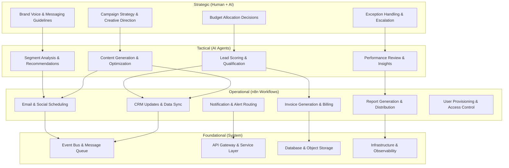

### 1.3 Automation Decision Framework

Every capability in AMC is evaluated against a decision matrix to determine its automation strategy:

| Criteria | Fully Automated | AI-Assisted | Human-Required |
|----------|----------------|-------------|----------------|
| **Repetitiveness** | Runs identically every time | Varies slightly per run | Unique every time |
| **Error tolerance** | Low (zero tolerance for mistakes) | Medium (AI review catches errors) | High (human judgment) |
| **Speed requirement** | Sub-second to minutes | Minutes to hours | Hours to days |
| **Compliance impact** | No compliance exposure | Documented AI oversight | Legal/financial liability |
| **Creativity needed** | None | Some (AI generates, human approves) | High (original creative) |
| **Cost of failure** | Low | Medium | High |

**Default posture:** Automate to the highest level possible. If a workflow fails, it falls back to AI-assisted. If AI cannot resolve, it escalates to human.

---

## 2. n8n Integration Architecture

### 2.1 Deployment Topology

AMC embeds n8n as its internal workflow engine using a hybrid deployment model. Rather than exposing n8n's built-in editor directly to end users, AMC wraps and extends it while maintaining full compatibility with the n8n API and node ecosystem.

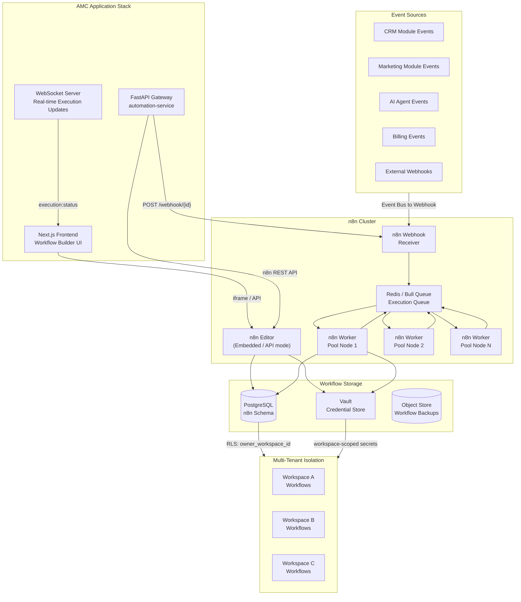

### 2.2 Component Breakdown

| Component | Deployment Mode | Purpose | Scaling |
|-----------|----------------|---------|---------|
| **n8n Editor** | Embedded via n8n API (headless mode) | Workflow design, testing, debugging surfaced through AMC UI | 2-3 replicas (low traffic, design-time only) |
| **n8n Worker Pool** | Standalone service cluster | Execute workflow steps — CPU-heavy operations | Horizontal: 5-20 workers based on queue depth (>200 = scale up) |
| **n8n Webhook Receiver** | Standalone service | Accept incoming webhook triggers from AMC events and external sources | 3-5 replicas behind load balancer |
| **n8n Database** | Shared PostgreSQL cluster (separate schema `n8n_*`) | Workflow definitions, execution logs, credentials (encrypted) | Managed via PgBouncer + read replicas |
| **Bull Queue (Redis)** | Shared Redis cluster | Workflow execution queue, job scheduling, delayed jobs | Redis cluster with 6 shards |

### 2.3 Multi-Tenancy Architecture

Every n8n workflow is **workspace-isolated** through a combination of database-level row-level security and application-level middleware:

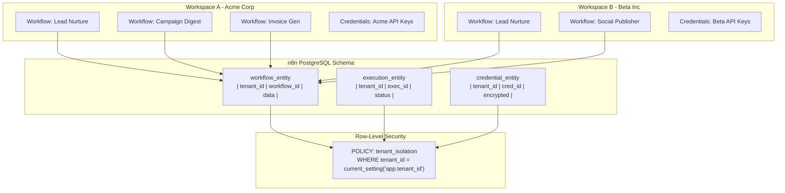

**Key isolation mechanisms:**

| Mechanism | How It Works | Enforced At |
|-----------|-------------|-------------|
| **RLS on n8n tables** | `workflow_entity`, `execution_entity`, `credential_entity` have `tenant_id` column with RLS policy scoping access | Database |
| **Workspace-scoped API keys** | Each workspace's n8n API calls include `X-Workspace-Id` header; automation-service middleware injects it | Application |
| **Credential namespacing** | Credential store keys are prefixed with `workspace:{id}:` — Vault paths are workspace-isolated | Vault |
| **Webhook URL signing** | Webhook URLs include a workspace-specific signature to prevent cross-tenant spoofing | Application |
| **Execution context isolation** | Worker environment variables set `WORKSPACE_ID` per execution — all AMC node calls use it | Runtime |

### 2.4 Workflow Execution Lifecycle

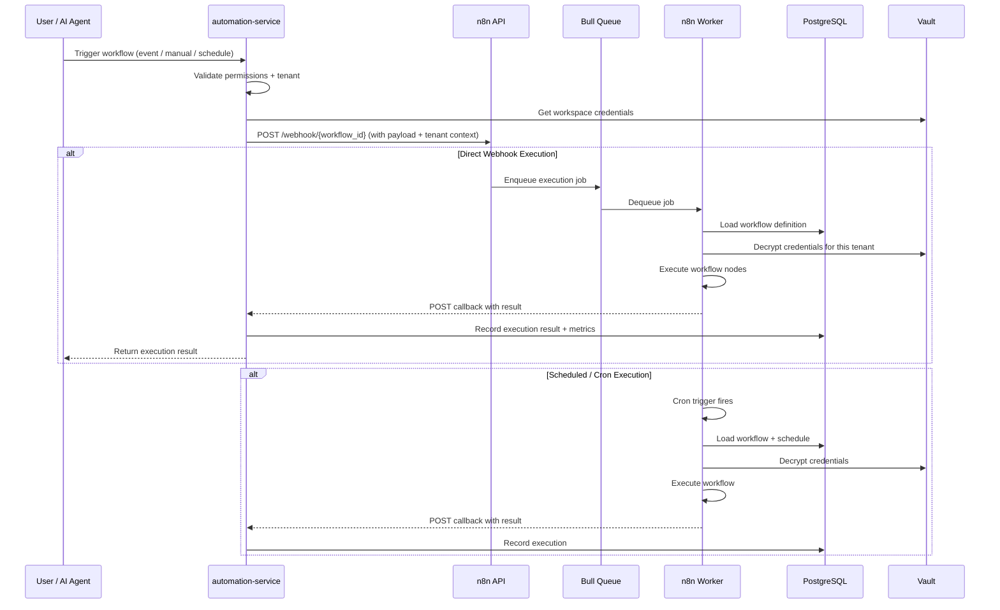

### 2.5 Horizontal Worker Scaling Strategy

n8n workers scale horizontally based on queue depth and execution demand:

| Scaling Trigger | Action | Cooldown |
|----------------|--------|----------|
| Queue depth > 200 for > 30s | Launch 2 additional workers | 5 min |
| Queue depth > 500 for > 60s | Launch 5 additional workers | 5 min |
| Worker CPU > 80% for > 120s | Launch 3 additional workers | 5 min |
| Queue depth < 50 for > 300s | Remove 1 worker (min: 3) | 10 min |
| Execution error rate > 5% | Pause scaling, alert operations | Manual |

**Worker configuration:**

```yaml
# docker-compose.n8n-worker.yml
n8n-worker:
  image: n8nio/n8n:latest
  command: worker --concurrency=10
  environment:
    - N8N_MODE=worker
    - N8N_ENCRYPTION_KEY=${N8N_ENCRYPTION_KEY}
    - QUEUE_BULL_REDIS_HOST=redis-cluster
    - QUEUE_BULL_REDIS_PORT=6379
    - EXECUTIONS_DATA_PRUNE=true
    - EXECUTIONS_DATA_MAX_AGE=168  # 7 days
    - N8N_METRICS=true
    - N8N_METRICS_INCLUDE_DEFAULT_METRICS=true
  volumes:
    - /mnt/n8n/custom-nodes:/home/node/.n8n/custom
  deploy:
    replicas: 5
    resources:
      limits:
        cpus: '2.0'
        memory: 4G
      reservations:
        cpus: '1.0'
        memory: 2G
```

### 2.6 n8n API Integration

The `automation-service` communicates with n8n's REST API to manage workflows programmatically:

| Endpoint | Method | Purpose | Used By |
|----------|--------|---------|---------|
| `/api/v1/workflows` | `GET` | List workflows (filtered by workspace) | Workflow dashboard |
| `/api/v1/workflows` | `POST` | Create a new workflow | Template installer |
| `/api/v1/workflows/:id` | `GET` | Get workflow details | Editor |
| `/api/v1/workflows/:id` | `PUT` | Update workflow | Editor save |
| `/api/v1/workflows/:id` | `DELETE` | Delete workflow | Workflow management |
| `/api/v1/workflows/:id/activate` | `POST` | Activate workflow (enable triggers) | Toggle activation |
| `/api/v1/workflows/:id/deactivate` | `POST` | Deactivate workflow | Toggle deactivation |
| `/api/v1/executions` | `GET` | List executions (filtered by workspace, status) | Execution history |
| `/api/v1/executions/:id` | `GET` | Get execution details | Debug/audit |
| `/api/v1/executions/:id/retry` | `POST` | Retry a failed execution | Error recovery |
| `/api/v1/credentials` | `GET` | List credentials | Credential manager |
| `/api/v1/credentials` | `POST` | Store encrypted credential | Credential setup |
| `/api/v1/credentials/:id` | `DELETE` | Remove credential | Credential cleanup |
| `/webhook/:id` | `POST` | Trigger workflow execution | Events, AI agents |
| `/webhook-wait/:id` | `POST` | Trigger + wait for completion | Synchronous automation |

**Automation-service wrapper:**

```typescript
// services/automation/n8n-client.ts
class N8NClient {
  private baseUrl: string;
  private apiKey: string;

  constructor(workspaceId: string) {
    this.baseUrl = getN8nUrl();
    this.apiKey = getWorkspaceApiKey(workspaceId);
  }

  async executeWorkflow(
    workflowId: string,
    payload: Record<string, any>,
    options?: { waitForCompletion?: boolean; timeout?: number }
  ): Promise<ExecutionResult> {
    const endpoint = options?.waitForCompletion
      ? `/webhook-wait/${workflowId}`
      : `/webhook/${workflowId}`;

    const response = await fetch(`${this.baseUrl}${endpoint}`, {
      method: 'POST',
      headers: {
        'Content-Type': 'application/json',
        'X-Workspace-Id': this.workspaceId,
        'X-Execution-Source': 'automation-service',
      },
      body: JSON.stringify({
        ...payload,
        _meta: {
          triggered_by: payload._triggerSource || 'api',
          workspace_id: this.workspaceId,
          correlation_id: crypto.randomUUID(),
        },
      }),
    });

    return response.json();
  }

  async installTemplate(template: WorkflowTemplate): Promise<Workflow> {
    const n8nWorkflow = this.templateToN8N(template);
    n8nWorkflow.tags = [template.category, template.id];
    n8nWorkflow.owner_workspace_id = this.workspaceId;

    const response = await fetch(`${this.baseUrl}/api/v1/workflows`, {
      method: 'POST',
      headers: { 'Authorization': `Bearer ${this.apiKey}` },
      body: JSON.stringify(n8nWorkflow),
    });

    return response.json();
  }

  private templateToN8N(template: WorkflowTemplate): N8NWorkflow {
    return {
      name: template.name,
      nodes: template.steps.map((step, index) => ({
        id: uuid4(),
        name: step.name,
        type: step.nodeType,
        typeVersion: 1,
        position: [250 * (index + 1), 300],
        parameters: step.parameters,
      })),
      connections: this.buildConnections(template.steps),
      settings: {
        timezone: 'UTC',
        saveManualExecutions: true,
        callerPolicy: 'workflowsFromSameOwner',
      },
      staticData: null,
      tags: [template.category, template.subcategory, `v${template.version}`],
    };
  }
}
```

### 2.7 Credential Store Integration

Credentials are managed through AMS (Aegis Marketing Cloud Secrets Management), a Vault-backed encrypted store. n8n's credential system is extended via a custom credential store backend:

```typescript
// credential-backends/AMSCredentialStore.ts
class AMSCredentialStore implements ICredentialStore {
  async getCredential(credentialId: string, workspaceId: string): Promise<ICredentials> {
    const vaultPath = `workspace/${workspaceId}/n8n/${credentialId}`;
    const secret = await vault.read(vaultPath);
    const decrypted = await this.decrypt(secret.data, workspaceId);
    return decrypted;
  }

  async setCredential(
    credential: ICredentials,
    workspaceId: string
  ): Promise<string> {
    const encrypted = await this.encrypt(credential, workspaceId);
    const credentialId = credential.id || uuid4();
    const vaultPath = `workspace/${workspaceId}/n8n/${credentialId}`;
    await vault.write(vaultPath, { data: encrypted });
    return credentialId;
  }

  async deleteCredential(credentialId: string, workspaceId: string): Promise<void> {
    const vaultPath = `workspace/${workspaceId}/n8n/${credentialId}`;
    await vault.delete(vaultPath);
  }
}
```

**Supported credential types:**

| Credential Type | Stores | Encryption |
|----------------|--------|------------|
| `amcApi` | AMC API key, workspace ID, base URL | AES-256-GCM with workspace-derived key |
| `smtp` | SMTP host, port, username, password | AES-256-GCM |
| `slack` | Slack bot token, channel ID | AES-256-GCM |
| `openAi` | OpenAI API key, org ID | AES-256-GCM |
| `googleSheets` | OAuth 2.0 token, refresh token | AES-256-GCM + OAuth rotation |
| `http` | Custom headers, basic auth | AES-256-GCM |
| `oAuth2` | OAuth client ID, secret, tokens | AES-256-GCM + automatic refresh |
| `webhook` | HMAC secret, signature format | AES-256-GCM |

---

## 3. Custom AMC n8n Nodes

### 3.1 Node Architecture Overview

AMC provides a comprehensive set of custom n8n nodes that wrap every module's API. These nodes are the **primary integration surface** for workflow builders — they allow users to interact with any AMC module without writing code.

```mermaid
graph TB
    subgraph NODES["AMC Custom Nodes"]
        CRM["AMC CRM\nContact, Deal, Org, Pipeline"]
        MKT["AMC Marketing\nCampaign, Email, Segment, LP"]
        AI_NODE["AMC AI\nGenerate, Analyze, Score, Classify"]
        SEO["AMC SEO\nRankings, Suggestions, Audit"]
        SOCIAL["AMC Social\nPost, Schedule, Analytics"]
        ANALYTICS["AMC Analytics\nQuery, Report, Dashboard"]
        BILLING["AMC Billing\nUsage, Invoice, Credits"]
        NOTIFY["AMC Notify\nEmail, SMS, Push, Slack, Webhook"]
        ADMIN["AMC Admin\nUser, Workspace, Permission"]
        AGENT_TRIGGER["AI Agent Trigger\nApproval Webhook"]
    end

    subgraph MODULES["AMC Modules"]
        CRM_SVC["CRM Service"]
        MKT_SVC["Marketing Service"]
        AI_SVC["AI Service"]
        SEO_SVC["SEO Service"]
        SOCIAL_SVC["Social Service"]
        ANALYTICS_SVC["Analytics Service"]
        BILLING_SVC["Billing Service"]
        NOTIF_SVC["Notification Service"]
        ADMIN_SVC["Admin Service"]
    end

    CRM --> CRM_SVC
    MKT --> MKT_SVC
    AI_NODE --> AI_SVC
    SEO --> SEO_SVC
    SOCIAL --> SOCIAL_SVC
    ANALYTICS --> ANALYTICS_SVC
    BILLING --> BILLING_SVC
    NOTIFY --> NOTIF_SVC
    ADMIN --> ADMIN_SVC
    AGENT_TRIGGER --> AI_SVC
```

### 3.2 CRM Nodes

#### AMC CRM Node

| Property | Value |
|----------|-------|
| **Node Type** | `n8n-nodes-base.amcCrm` |
| **Icon** | Contacts |
| **Color** | `#2196F3` (Blue) |
| **Version** | 1 |
| **Credentials** | `amcApi` |
| **Output** | JSON object with result data |

**Operations:**

| Operation | Resource | Endpoint Called | Description |
|-----------|----------|----------------|-------------|
| `Create` | Contact | `POST /api/v1/crm/contacts` | Create a new contact record |
| `Update` | Contact | `PATCH /api/v1/crm/contacts/:id` | Update contact fields |
| `Get` | Contact | `GET /api/v1/crm/contacts/:id` | Retrieve a single contact |
| `Find` | Contact | `GET /api/v1/crm/contacts` | Search/filter contacts |
| `Delete` | Contact | `DELETE /api/v1/crm/contacts/:id` | Soft-delete a contact |
| `Create` | Deal | `POST /api/v1/crm/deals` | Create a new deal |
| `Update` | Deal | `PATCH /api/v1/crm/deals/:id` | Update deal fields |
| `Get` | Deal | `GET /api/v1/crm/deals/:id` | Retrieve a single deal |
| `Find` | Deal | `GET /api/v1/crm/deals` | Search/filter deals |
| `Delete` | Deal | `DELETE /api/v1/crm/deals/:id` | Soft-delete a deal |
| `Create` | Organization | `POST /api/v1/crm/organizations` | Create an organization |
| `Update` | Organization | `PATCH /api/v1/crm/organizations/:id` | Update organization |
| `Get` | Organization | `GET /api/v1/crm/organizations/:id` | Get organization details |
| `Find` | Organization | `GET /api/v1/crm/organizations` | Search organizations |
| `Delete` | Organization | `DELETE /api/v1/crm/organizations/:id` | Soft-delete organization |

**Node parameter schema (partial):**

```typescript
interface AMCCrmNodeParameters {
  resource: 'contact' | 'deal' | 'organization';
  operation: 'create' | 'update' | 'get' | 'find' | 'delete';

  // Create/Update fields
  fields?: {
    // Contact fields
    email?: string;
    firstName?: string;
    lastName?: string;
    phone?: string;
    jobTitle?: string;
    organizationId?: string;
    ownerId?: string;
    segments?: string[];
    customFields?: Record<string, any>;

    // Deal fields
    title?: string;
    value?: number;
    currency?: string;
    stage?: string;
    pipelineId?: string;
    contactId?: string;
    organizationId?: string;
    expectedCloseDate?: string;

    // Organization fields
    name?: string;
    domain?: string;
    industry?: string;
    size?: string;
    phone?: string;
    address?: Record<string, string>;
  };

  // Find filters
  filters?: {
    query?: string;
    limit?: number;
    offset?: number;
    sortBy?: string;
    sortOrder?: 'asc' | 'desc';
    stage?: string;
    ownerId?: string;
    createdAfter?: string;
    createdBefore?: string;
  };
}
```

#### AMC Pipeline Node

| Property | Value |
|----------|-------|
| **Node Type** | `n8n-nodes-base.amcPipeline` |
| **Icon** | Pipeline |
| **Color** | `#9C27B0` (Purple) |
| **Version** | 1 |
| **Credentials** | `amcApi` |

**Operations:**

| Operation | Description |
|-----------|-------------|
| `Move Deal Stage` | Move a deal to a different pipeline stage |
| `Get Pipeline` | Retrieve pipeline structure (stages, order) |
| `Get Pipelines` | List all pipelines in workspace |

#### AMC Activity Node

| Property | Value |
|----------|-------|
| **Node Type** | `n8n-nodes-base.amcActivity` |
| **Icon** | Activity |
| **Color** | `#4CAF50` (Green) |
| **Version** | 1 |
| **Credentials** | `amcApi` |

**Operations:**

| Operation | Description |
|-----------|-------------|
| `Create Activity` | Log a call, meeting, or task completion |
| `Log Note` | Add a note to a contact, deal, or organization timeline |
| `Schedule Task` | Create a follow-up task with due date and assignee |
| `Get Activities` | Retrieve activity timeline for a contact or deal |

### 3.3 Marketing Nodes

#### AMC Campaign Node

| Property | Value |
|----------|-------|
| **Node Type** | `n8n-nodes-base.amcCampaign` |
| **Icon** | Campaign |
| **Color** | `#FF5722` (Deep Orange) |
| **Version** | 1 |
| **Credentials** | `amcApi` |

**Operations:**

| Operation | Description | Key Parameters |
|-----------|-------------|----------------|
| `Create` | Create a campaign draft | `name`, `type` (email/social/landing), `audienceId` |
| `Activate` | Activate/publish a campaign | `campaignId`, `scheduledDate` |
| `Pause` | Pause an active campaign | `campaignId` |
| `Get` | Get campaign details and stats | `campaignId` |
| `Find` | Search campaigns | `status`, `type`, `dateRange` |
| `Duplicate` | Clone an existing campaign | `campaignId`, `newName` |

#### AMC Email Node

| Property | Value |
|----------|-------|
| **Node Type** | `n8n-nodes-base.amcEmail` |
| **Icon** | Email |
| **Color** | `#E91E63` (Pink) |
| **Version** | 1 |
| **Credentials** | `amcApi` |

**Operations:**

| Operation | Description | Key Parameters |
|-----------|-------------|----------------|
| `Send Email` | Send a one-off email immediately | `to`, `from`, `subject`, `body`, `templateId?` |
| `Add to Queue` | Add email to campaign send queue | `campaignId`, `contactId`, `sendAt` |
| `Get Stats` | Get email performance stats | `emailId` or `campaignId`, `metric` (opens/clicks/bounces) |
| `Test Send` | Send test to preview recipients | `campaignId`, `testEmails[]` |

#### AMC Segment Node

| Property | Value |
|----------|-------|
| **Node Type** | `n8n-nodes-base.amcSegment` |
| **Icon** | Segment |
| **Color** | `#00BCD4` (Cyan) |
| **Version** | 1 |
| **Credentials** | `amcApi` |

**Operations:**

| Operation | Description |
|-----------|-------------|
| `Find Contacts in Segment` | List all contacts belonging to a segment |
| `Add to Segment` | Add one or more contacts to a segment |
| `Remove from Segment` | Remove contacts from a segment |
| `Create Segment` | Create a new segment with rules |
| `Get Segment Stats` | Get segment size and composition |

#### AMC Landing Page Node

| Property | Value |
|----------|-------|
| **Node Type** | `n8n-nodes-base.amcLandingPage` |
| **Icon** | Landing Page |
| **Color** | `#FF9800` (Amber) |
| **Version** | 1 |
| **Credentials** | `amcApi` |

**Operations:**

| Operation | Description |
|-----------|-------------|
| `Publish` | Publish a landing page draft to production |
| `Unpublish` | Take a landing page offline |
| `Get Stats` | Get page views, conversions, bounce rate |
| `Create` | Create a new landing page from template |
| `Update` | Update landing page content |

### 3.4 AI Nodes

#### AMC AI Node

| Property | Value |
|----------|-------|
| **Node Type** | `n8n-nodes-base.amcAi` |
| **Icon** | AI |
| **Color** | `#9C27B0` (Purple) |
| **Version** | 1 |
| **Credentials** | `amcApi` |

**Operations:**

| Operation | Description | Key Parameters |
|-----------|-------------|----------------|
| `Generate Content` | Generate marketing copy, email body, social posts | `prompt`, `tone`, `length`, `format` |
| `Analyze Sentiment` | Analyze sentiment of text (positive/negative/neutral) | `text` |
| `Score Lead` | AI-powered lead scoring based on profile + behavior | `contactId`, `model?` |
| `Classify` | Classify content into categories | `text`, `categories[]` |
| `Summarize` | Summarize long text into key points | `text`, `maxLength` |
| `Translate` | Translate text to target language | `text`, `targetLanguage` |

**Example - Lead Scoring configuration:**

```json
{
  "operation": "Score Lead",
  "contactId": "{{ $json.contactId }}",
  "model": "default",
  "factors": {
    "emailEngagement": "{{ $json.emailOpenRate }}",
    "websiteVisits": 12,
    "downloadCount": 3,
    "companySize": "enterprise",
    "industry": "saas",
    "budgetRange": "50k-100k"
  }
}
```

#### AMC Agent Node

| Property | Value |
|----------|-------|
| **Node Type** | `n8n-nodes-base.amcAgent` |
| **Icon** | Agent |
| **Color** | `#673AB7` (Deep Purple) |
| **Version** | 1 |
| **Credentials** | `amcApi` |

**Operations:**

| Operation | Description | Key Parameters |
|-----------|-------------|----------------|
| `Invoke Agent` | Start an AI agent with a defined task | `agentId`, `task`, `context` |
| `Chat with Agent` | Send a message to an active agent session | `sessionId`, `message` |
| `Get Agent Status` | Check if agent is running, idle, or completed | `sessionId` or `agentId` |
| `List Agents` | List available agents in workspace | — |
| `Get Agent Result` | Retrieve completed agent's output | `sessionId` |

#### AMC Knowledge Node

| Property | Value |
|----------|-------|
| **Node Type** | `n8n-nodes-base.amcKnowledge` |
| **Icon** | Knowledge |
| **Color** | `#3F51B5` (Indigo) |
| **Version** | 1 |
| **Credentials** | `amcApi` |

**Operations:**

| Operation | Description |
|-----------|-------------|
| `Search KB` | Search knowledge base articles by query |
| `Add to KB` | Add a new article or document to KB |
| `Update KB` | Update an existing KB article |
| `Get Article` | Retrieve a specific KB article |
| `Delete Article` | Remove an article from KB |

### 3.5 SEO Nodes

#### AMC SEO Node

| Property | Value |
|----------|-------|
| **Node Type** | `n8n-nodes-base.amcSeo` |
| **Icon** | SEO |
| **Color** | `#4CAF50` (Green) |
| **Version** | 1 |
| **Credentials** | `amcApi` |

**Operations:**

| Operation | Description | Key Parameters |
|-----------|-------------|----------------|
| `Check Rankings` | Get keyword rankings for a domain | `domain`, `keywords[]`, `searchEngine` |
| `Get Suggestions` | Get SEO improvement suggestions for a URL | `url` |
| `Run Audit` | Run a full SEO audit on a domain | `domain`, `depth`, `checks[]` |
| `Track Competitor` | Add competitor domain for tracking | `domain`, `competitorDomain` |
| `Get Keyword Ideas` | Generate keyword ideas from seed | `seedKeywords[]`, `market` |

### 3.6 Social Nodes

#### AMC Social Node

| Property | Value |
|----------|-------|
| **Node Type** | `n8n-nodes-base.amcSocial` |
| **Icon** | Social |
| **Color** | `#E91E63` (Pink) |
| **Version** | 1 |
| **Credentials** | `amcApi` + social network credentials |

**Operations:**

| Operation | Description | Key Parameters |
|-----------|-------------|----------------|
| `Create Post` | Create a social post (draft) | `platform`, `content`, `media[]` |
| `Schedule Post` | Schedule a post for publishing | `postId`, `publishAt` |
| `Publish Now` | Immediately publish a post | `postId` |
| `Get Analytics` | Get post or account analytics | `platform`, `metric`, `dateRange` |
| `Get Engagement` | Get likes, shares, comments on a post | `postId`, `platform` |

**Supported platforms:** LinkedIn, Twitter/X, Facebook, Instagram, TikTok, YouTube, Pinterest

### 3.7 Analytics Nodes

#### AMC Analytics Node

| Property | Value |
|----------|-------|
| **Node Type** | `n8n-nodes-base.amcAnalytics` |
| **Icon** | Analytics |
| **Color** | `#FF9800` (Amber) |
| **Version** | 1 |
| **Credentials** | `amcApi` |

**Operations:**

| Operation | Description | Key Parameters |
|-----------|-------------|----------------|
| `Query Metrics` | Run an analytics query and get results | `metric`, `dimensions[]`, `filters`, `dateRange` |
| `Generate Report` | Generate a full report PDF/CSV | `reportTemplateId`, `format`, `schedule?` |
| `Update Dashboard` | Push data to a live dashboard widget | `dashboardId`, `widgetId`, `data` |
| `Get Insight` | Get AI-generated insight on data | `query`, `context` |
| `Export Data` | Export raw data in specified format | `query`, `format` (csv/json/xlsx) |

**Available metrics (depending on module):**

| Module | Metrics Available |
|--------|------------------|
| CRM | `contacts.total`, `contacts.new`, `deals.created`, `deals.won`, `deals.lost`, `pipeline.value`, `avg.deal.size` |
| Marketing | `campaigns.sent`, `emails.opened`, `emails.clicked`, `emails.bounced`, `campaigns.conversion`, `landing.page.views` |
| Social | `posts.published`, `engagement.rate`, `followers.growth`, `impressions`, `clicks` |
| SEO | `rankings.avg`, `traffic.organic`, `backlinks.total`, `audit.score` |
| AI | `generations.total`, `agent.runs`, `inference.cost`, `lead.scores.avg` |
| Billing | `revenue.mrr`, `invoices.total`, `payments.collected`, `usage.credits` |

### 3.8 Billing Nodes

#### AMC Billing Node

| Property | Value |
|----------|-------|
| **Node Type** | `n8n-nodes-base.amcBilling` |
| **Icon** | Billing |
| **Color** | `#4CAF50` (Green) |
| **Version** | 1 |
| **Credentials** | `amcApi` |

**Operations:**

| Operation | Description | Key Parameters |
|-----------|-------------|----------------|
| `Get Usage` | Get current workspace usage metrics | `period`, `module` |
| `Create Invoice` | Generate a new invoice | `clientId`, `lineItems[]`, `dueDate` |
| `Check Credits` | Check remaining AI/API credits | — |
| `Get Subscription` | Get current subscription details | — |
| `Record Payment` | Record a payment against an invoice | `invoiceId`, `amount`, `method` |

### 3.9 Notifications Nodes

#### AMC Notify Node

| Property | Value |
|----------|-------|
| **Node Type** | `n8n-nodes-base.amcNotify` |
| **Icon** | Notifications |
| **Color** | `#FF5722` (Deep Orange) |
| **Version** | 1 |
| **Credentials** | `amcApi` + channel-specific credentials |

**Operations:**

| Operation | Description | Key Parameters |
|-----------|-------------|----------------|
| `Send Email` | Send a transactional/notification email | `to`, `subject`, `body`, `priority` |
| `Send SMS` | Send an SMS via Twilio | `to`, `message`, `from?` |
| `Send Push` | Send push notification to mobile/web | `userId`, `title`, `body`, `data` |
| `Send Slack Message` | Send a message to Slack channel | `channel`, `text`, `blocks?` |
| `Send Webhook` | Send a payload to an external webhook | `url`, `method`, `headers`, `body` |
| `Send Teams Message` | Send to Microsoft Teams channel | `webhookUrl`, `title`, `message` |
| `Send Discord Message` | Send to Discord channel | `webhookUrl`, `content`, `embeds` |

### 3.10 Admin Nodes

#### AMC Admin Node

| Property | Value |
|----------|-------|
| **Node Type** | `n8n-nodes-base.amcAdmin` |
| **Icon** | Admin |
| **Color** | `#607D8B` (Blue Grey) |
| **Version** | 1 |
| **Credentials** | `amcApi` (requires admin scope) |

**Operations:**

| Operation | Description | Key Parameters |
|-----------|-------------|----------------|
| `Get User` | Get user profile by ID or email | `userId` or `email` |
| `Get Workspace` | Get workspace details and settings | `workspaceId` |
| `Check Permission` | Check if user has a specific permission | `userId`, `permission` |
| `List Users` | List users in workspace | `role?`, `status?` |
| `Update User` | Update user role or profile | `userId`, `fields` |
| `Audit Log` | Retrieve audit log entries | `dateRange`, `action`, `userId` |

### 3.11 AI Agent Trigger Node

#### Webhook Node: AI Agent Requires Approval

| Property | Value |
|----------|-------|
| **Node Type** | `n8n-nodes-base.amcAiAgentTrigger` |
| **Icon** | Approval |
| **Color** | `#F44336` (Red) |
| **Version** | 1 |
| **Credentials** | `amcApi` |
| **Type** | Trigger Node |

This is a special **trigger** node that creates a webhook endpoint. When an AI agent reaches a decision point requiring human approval (e.g., "Should we send this campaign to 50,000 contacts?"), it fires this webhook, pausing the agent workflow until a human responds.

**Webhook payload (incoming from AI agent):**

```typescript
interface AIApprovalRequest {
  approvalId: string;
  agentName: string;
  agentSessionId: string;
  task: string;
  context: {
    description: string;
    data: Record<string, any>;
    options?: ApprovalOption[];
    risk?: 'low' | 'medium' | 'high';
    deadline?: string;
  };
  workspaceId: string;
  requestedBy: string;
  createdAt: string;
}

interface ApprovalOption {
  id: string;
  label: string;
  description: string;
  action: Record<string, any>;
}
```

**Workflow that follows this trigger typically:**

1. Formats the approval request into a Slack message / email / in-app notification
2. Waits for a webhook response (approve/reject) — via the **Wait** node or a second webhook
3. If approved: calls the agent's `/approve` endpoint with the chosen option
4. If rejected: calls the agent's `/reject` endpoint with feedback
5. Logs the decision to the audit trail

---

## 4. Workflow Triggers

### 4.1 Trigger Overview

AMC supports six categories of workflow triggers, each serving different automation patterns:

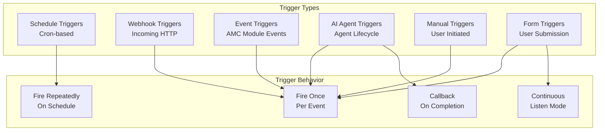

### 4.2 Schedule Triggers

| Property | n8n Implementation | Configuration |
|----------|-------------------|---------------|
| **Cron Trigger** | `n8n-nodes-base.scheduleTrigger` | Standard cron expression |
| **Interval Trigger** | `n8n-nodes-base.intervalTrigger` | Seconds/minutes/hours between runs |
| **Advanced Schedule** | Custom `amcScheduleTrigger` | Calendar integration, business hours only |

**Predefined schedule presets:**

| Preset | Cron Expression | Use Case |
|--------|----------------|----------|
| Every hour | `0 * * * *` | Digest emails, status checks |
| Every 4 hours | `0 */4 * * *` | Data syncs, batch processing |
| Daily at 8 AM | `0 8 * * *` | Morning digests, report delivery |
| Daily at midnight | `0 0 * * *` | End-of-day processing, billing |
| Weekly Monday 9 AM | `0 9 * * 1` | Weekly reports, campaign review |
| Monthly 1st at 6 AM | `0 6 1 * *` | Invoice generation, usage reports |
| Business hours only | `0 9-17 * * 1-5` | Customer-facing notifications |
| Custom | User-defined cron | Any specific pattern |

### 4.3 Webhook Triggers

| Property | n8n Implementation |
|----------|-------------------|
| **Node** | `n8n-nodes-base.webhookTrigger` |
| **Method** | `GET`, `POST`, `PUT`, `PATCH`, `DELETE` |
| **Path** | Auto-generated or custom `/webhook/{workflowId}` |
| **Auth** | HMAC signature, API key, or none (internal only) |
| **CORS** | Configurable allowed origins |

**Webhook security levels:**

| Level | Authentication | Use Case |
|-------|---------------|----------|
| **Internal** | Signed HMAC + IP whitelist | AMC module events to internal webhooks |
| **Partner** | API key (header `X-AMC-Webhook-Key`) | Partner integrations |
| **Public** | HMAC signature only | External services (Zapier, Make) |
| **Open** | No auth (rate-limited) | Public incoming data (lead forms) |

### 4.4 Event Triggers

Event triggers are the most powerful trigger type — they listen for domain events emitted by any AMC module and automatically fire workflows.

**Registration flow:**

1. Workflow is created with an event trigger node configured for specific event type(s)
2. Workflow is activated → `automation-service` registers a subscription in the event bus
3. When an event of that type is published, RabbitMQ fanout exchange delivers it to the matching webhook endpoint
4. n8n webhook receiver accepts the payload and enqueues the execution

```typescript
interface EventTriggerConfig {
  workflowId: string;
  workspaceId: string;
  events: string[];
  filters?: {
    field: string;
    operator: 'eq' | 'neq' | 'in' | 'gt' | 'lt';
    value: any;
  }[];
  webhookUrl: string;
}

async function registerEventTrigger(config: EventTriggerConfig): Promise<void> {
  for (const eventType of config.events) {
    await rabbitmq.bindQueue({
      exchange: 'amc.events',
      queue: `workflow:${config.workspaceId}:${config.workflowId}`,
      routingKey: eventType,
    });
  }
}
```

### 4.5 AI Agent Triggers

These triggers fire based on AI agent lifecycle events:

| Trigger Event | Fires When | Payload Contains |
|--------------|------------|------------------|
| `agent.task.completed` | An AI agent finishes a task | `agentId`, `taskId`, `result`, `duration` |
| `agent.escalation` | Agent requires human intervention | `agentId`, `reason`, `context`, `options` |
| `agent.needs_input` | Agent needs data to proceed | `agentId`, `requiredData`, `prompt` |
| `agent.error` | Agent encountered an unrecoverable error | `agentId`, `error`, `traceId` |
| `agent.workflow.completed` | Agent finished executing a workflow | `agentId`, `workflowId`, `result` |

### 4.6 Manual Triggers

| Property | n8n Implementation |
|----------|-------------------|
| **Node** | `n8n-nodes-base.manualTrigger` |
| **Invocation** | User clicks "Execute Workflow" button in editor |
| **Input** | User can provide JSON input parameters |
| **Use Case** | Testing, ad-hoc automation, one-off operations |

### 4.7 Form Triggers

AMC provides an embedded form builder that creates submission endpoints. When a user submits data through an AMC form (e.g., "Contact Us", "Request Demo", "Survey"), it triggers a workflow with the form data as input.

| Property | n8n Implementation |
|----------|-------------------|
| **Node** | Custom `amcFormTrigger` |
| **Form Source** | AMC Form Builder, embedded widget, or API |
| **Data** | All form fields as JSON payload |
| **Files** | Uploaded files as base64 or S3 references |
| **Spam Protection** | reCAPTCHA v3 + honeypot field |

---

## 5. Workflow Template Library

### 5.1 Template Catalog Overview

AMC ships with a curated library of **32+ workflow templates** organized by business function. Each template is a production-ready workflow that users can install in one click, customize to their needs, and activate.

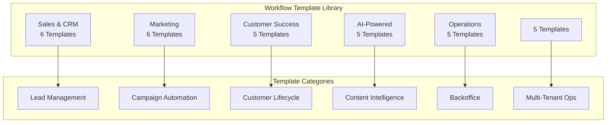

### 5.2 Sales & CRM Templates

| # | Template Name | ID | Description |
|---|--------------|----|-------------|
| 1 | Lead Qualification & Assignment | `sales-lead-qualify` | Score incoming leads, assign to the best sales rep based on territory, expertise, and round-robin |
| 2 | Lead Nurture Sequence | `sales-lead-nurture` | 5-email drip sequence triggered when a lead is qualified but not ready to buy |
| 3 | Deal Stage Change Notification | `sales-deal-stage-notify` | Send a Slack message to the deal owner and channel when a deal moves stages |
| 4 | Contract Expiry Reminder | `sales-contract-expiry` | 90/60/30/7 day reminders before a contract expires, with auto-assignment to renew |
| 5 | Cross-sell Opportunity Detection | `sales-cross-sell` | Analyze existing customer portfolio and detect cross-sell opportunities |
| 6 | Lost Deal Analysis Request | `sales-lost-analysis` | When a deal is marked lost, create a task for rep to log reason and send survey |

### 5.3 Marketing Templates

| # | Template Name | ID | Description |
|---|--------------|----|-------------|
| 1 | New Blog Post Auto-Promotion | `mktg-blog-promo` | When a blog post is published, auto-share to social channels and send email alert to subscribers |
| 2 | Campaign Performance Daily Digest | `mktg-campaign-digest` | Every morning at 8 AM, compile and send campaign performance stats to stakeholders |
| 3 | A/B Test Winner → Auto-Send Winner | `mktg-ab-test-winner` | After A/B test completes, identify winner and auto-send to remaining audience |
| 4 | Abandoned Cart Recovery | `mktg-abandoned-cart` | Send 3-email sequence when cart is abandoned: 1h reminder, 24h discount, 72h last chance |
| 5 | Event Registration → Follow-up | `mktg-event-followup` | Confirmation + 48h reminder + thank-you with recording |
| 6 | Webinar Reminder Sequence | `mktg-webinar-reminder` | Reminders at 24h and 1h before webinar with calendar attachment and join link |

### 5.4 Customer Success Templates

| # | Template Name | ID | Description |
|---|--------------|----|-------------|
| 1 | New User Onboarding Sequence | `cs-onboarding` | Day 1 (welcome), Day 3 (tips), Day 7 (check-in), Day 14 (advanced), Day 30 (success review) |
| 2 | Low Engagement Alert to CS Task | `cs-low-engagement` | Detect <2 logins in 14 days, create CS task, alert CSM |
| 3 | Renewal Reminder 90/60/30 Days | `cs-renewal-reminder` | Automated reminders at 90/60/30 days before subscription renewal |
| 4 | NPS Survey → Respond by Score | `cs-nps-respond` | Promoter → review request; Passive → tips; Detractor → alert CSM |
| 5 | Support Ticket → Follow-up | `cs-support-followup` | 24h after resolution: survey; negative → reopen ticket |

### 5.5 AI-Powered Templates

| # | Template Name | ID | Description |
|---|--------------|----|-------------|
| 1 | Lead Score Update → Re-prioritize Pipeline | `ai-lead-score-pipeline` | Nightly AI re-scoring; high scorers moved to top of pipeline, rep alerted |
| 2 | Content Idea → Research → Draft → Review → Publish | `ai-content-pipeline` | Full pipeline: AI researches, drafts, sends for human review, publishes on approval |
| 3 | Social Listening → Trend Alert → Content Suggestion | `ai-social-listening` | Monitor trends, alert team, generate content suggestions |
| 4 | Weekly AI Performance Review | `ai-weekly-review` | AI compiles weekly metrics, detects anomalies, generates recommendations |
| 5 | Auto-generate Monthly Client Report | `ai-monthly-report` | Gathers data from all modules, generates PDF report with AI executive summary |

### 5.6 Operations Templates

| # | Template Name | ID | Description |
|---|--------------|----|-------------|
| 1 | Invoice Generation → Send to Client | `ops-invoice-send` | Generate monthly invoice, PDF, email to client, log in CRM |
| 2 | Payment Received → Update CRM → Thank You | `ops-payment-received` | On payment webhook, update deal, send thank-you, create receipt |
| 3 | Subscription Expiry → Grace → Downgrade | `ops-sub-expiry` | Trial ends → 7-day grace → reminders → auto-downgrade |
| 4 | Daily Backup Verification | `ops-backup-verify` | Verify DB backups, report to DevOps Slack |
| 5 | Usage Report → Billing Adjustment | `ops-usage-billing` | Calculate usage vs plan, adjust billing |

### 5.7 Agency Templates

| # | Template Name | ID | Description |
|---|--------------|----|-------------|
| 1 | New Client Onboarding | `agency-client-onboard` | Create workspace, invite users, set permissions, copy campaigns, welcome |
| 2 | Multi-client Campaign Duplication | `agency-campaign-dupe` | Clone master campaign to multiple client workspaces with overrides |
| 3 | White-label Client Report Auto-generation | `agency-white-label-report` | Generate branded monthly reports per client |
| 4 | Agency Revenue Dashboard Update | `agency-revenue-dashboard` | Aggregate revenue across clients, update ops dashboard |
| 5 | Client Health Score Calculation | `agency-health-score` | Composite health score (engagement, spend, sentiment, tickets) |

---

## 6. Workflow Template Specification Format

### 6.1 Template Specification Schema

Every workflow template in the library follows a strict specification format. Below is the complete schema with full specifications for each template.

#### Template Metadata

| Field | Type | Required | Description |
|-------|------|----------|-------------|
| `id` | string | Yes | Unique identifier (kebab-case) |
| `name` | string | Yes | Human-readable name |
| `version` | string | Yes | Semver version (e.g., "1.0.0") |
| `category` | string | Yes | Primary category (sales, marketing, cs, ai, ops, agency) |
| `subcategory` | string | Yes | Subcategory within primary |
| `description` | string | Yes | What the template does |
| `whenToUse` | string | Yes | Recommended scenarios |
| `triggerType` | string | Yes | Trigger type identifier |
| `estimatedExecutionTime` | string | Yes | e.g., "~30 seconds", "~5 minutes" |
| `complexity` | string | Yes | "Beginner", "Intermediate", "Advanced" |
| `requiredPermissions` | string[] | Yes | List of required AMC permissions |

### 6.2 Template 1: Lead Qualification & Assignment

| Field | Value |
|-------|-------|
| **ID** | `sales-lead-qualify` |
| **Name** | Lead Qualification & Assignment |
| **Version** | `1.0.0` |
| **Category** | Sales & CRM |
| **Subcategory** | Lead Management |
| **Description** | Automatically score incoming leads using AI, qualify them against predefined criteria (budget, authority, need, timeline), and assign the highest-scoring leads to the most appropriate sales representative based on territory, product expertise, and current workload. |
| **When to Use** | When your sales team receives leads from multiple sources (web forms, chatbots, imported lists) and needs intelligent routing rather than round-robin or manual assignment. |
| **Trigger Type** | Event (`contact.created`) or Webhook (from form submission) |
| **Estimated Execution Time** | ~10-30 seconds |
| **Complexity** | Intermediate |
| **Required Permissions** | `crm:contact:read`, `crm:contact:write`, `crm:deal:write`, `ai:leadscore:execute`, `admin:user:read`, `notify:slack:send` |

**Required Nodes & Configuration:**

| Step | Node Type | Configuration |
|------|-----------|---------------|
| 1 | Event Trigger (`contact.created`) | Filter: `source !== 'import'` (skip bulk imports) |
| 2 | AMC AI: Score Lead | Use `default` model; pass contact data as context |
| 3 | IF Node | Branch: `score >= 70` → Qualified; `score < 70` → Nurture |
| 4 | AMC CRM: Update Contact | Set `leadStatus: 'qualified'`, `leadScore: {{score}}` |
| 5 | AMC CRM: Create Deal | Create deal with contact as primary, estimated value from scoring |
| 6 | AMC Admin: Find Users | Filter by `role: 'sales_rep'`, `territory: {{contact.territory}}` |
| 7 | Code Node (Round-Robin Assign) | Simple round-robin across matching reps using workload counter |
| 8 | AMC CRM: Update Deal | Set `ownerId` to assigned rep |
| 9 | AMC Notify: Send Slack | DM the rep: "New qualified lead: {{contact.name}} (Score: {{score}})" |
| 10 | AMC Activity: Log Note | Add note to contact: "Lead qualified (score: {{score}}), assigned to {{rep.name}}" |

**Flow Diagram:**

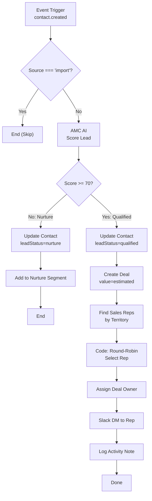

**Variables/Inputs Required:**

| Variable | Type | Source | Example |
|----------|------|--------|---------|
| `{{contact.id}}` | string | Event payload | `cont_abc123` |
| `{{contact.name}}` | string | Event payload | `John Smith` |
| `{{contact.email}}` | string | Event payload | `john@acme.com` |
| `{{contact.territory}}` | string | Event payload or lookup | `EMEA` |
| `{{contact.companySize}}` | string | Event payload | `50-200` |
| `{{leadScore}}` | number | AI node output | `85` |
| `{{assignedRep}}` | object | Code node output | `{id: 'usr_456', name: 'Alice'}` |

**Output/Deliverable:**

- Contact updated with `leadStatus` and `leadScore`
- Deal created in pipeline with assigned owner
- Slack notification sent to assigned rep
- Activity note logged on contact timeline

**Example Use Case:**

A marketing agency using AMC runs LinkedIn lead gen forms. When a prospect fills out "Get a Free Marketing Audit," the form creates a contact with company size and industry. This workflow scores the lead (88/100 for a SaaS company with 200+ employees), qualifies them, creates a deal worth $5,000, and assigns it to the EMEA sales rep who specializes in SaaS. The rep gets a Slack DM within 15 seconds of the form submission.

### 6.3 Template 2: Lead Nurture Sequence

| Field | Value |
|-------|-------|
| **ID** | `sales-lead-nurture` |
| **Name** | Lead Nurture Sequence |
| **Version** | `1.0.0` |
| **Category** | Sales & CRM |
| **Subcategory** | Lead Nurturing |
| **Description** | A 5-email automated drip sequence triggered when a lead is qualified but not yet ready to buy (score 40-69). Emails spaced 3 days apart with progressively stronger CTAs. Engagement tracking pauses the sequence if the lead becomes active. |
| **When to Use** | For mid-funnel leads that need education before they're ready to talk to sales. |
| **Trigger Type** | Event (`contact.updated` where `leadStatus = 'nurture'`) |
| **Estimated Execution Time** | ~15 seconds (per email send) |
| **Complexity** | Intermediate |
| **Required Permissions** | `crm:contact:read`, `crm:contact:write`, `marketing:email:send`, `marketing:segment:write` |

**Email Content Strategy:**

| Email | Day | Subject Line Approach | Content | CTA |
|-------|-----|----------------------|---------|-----|
| 1 | 1 | Welcome & value | "Here's what you get" — resource links | Explore KB |
| 2 | 4 | Case study | Customer success story with metrics | Read case study |
| 3 | 7 | Feature deep-dive | Top 3 features for industry | Watch demo |
| 4 | 10 | Social proof | Customer logos, testimonials, ratings | See stories |
| 5 | 13 | Final CTA | "Ready to talk?" — limited-time offer | Book a call |

### 6.4 Template 3: Deal Stage Change Notification

| Field | Value |
|-------|-------|
| **ID** | `sales-deal-stage-notify` |
| **Name** | Deal Stage Change Notification to Slack |
| **Version** | `1.0.0` |
| **Category** | Sales & CRM |
| **Subcategory** | Notifications |
| **Description** | When a deal moves to a new pipeline stage, send a formatted Slack message to the deal owner and the #deals channel with deal details, time in previous stage, and next steps. |
| **Trigger Type** | Event (`deal.stage_changed`) |
| **Estimated Execution Time** | ~5 seconds |
| **Complexity** | Beginner |
| **Required Permissions** | `crm:deal:read`, `notify:slack:send` |

### 6.5 Template 4: Contract Expiry Reminder

| Field | Value |
|-------|-------|
| **ID** | `sales-contract-expiry` |
| **Name** | Contract Expiry Reminder |
| **Version** | `1.0.0` |
| **Category** | Sales & CRM |
| **Subcategory** | Retention |
| **Description** | Automated reminders at 90, 60, 30, and 7 days before contract expiry. Each reminder escalates in urgency and includes relevant renewal data, usage stats, and a personalized renewal proposal. |
| **Trigger Type** | Schedule (Daily at 6 AM) |
| **Estimated Execution Time** | ~2 minutes (for batch check) |
| **Complexity** | Advanced |
| **Required Permissions** | `crm:deal:read`, `crm:contact:read`, `billing:subscription:read`, `notify:email:send`, `notify:slack:send` |

### 6.6 Template 5: Cross-sell Opportunity Detection

| Field | Value |
|-------|-------|
| **ID** | `sales-cross-sell` |
| **Name** | Cross-sell Opportunity Detection |
| **Version** | `1.0.0` |
| **Category** | Sales & CRM |
| **Subcategory** | Revenue Growth |
| **Description** | Weekly analysis of existing customer accounts to detect cross-sell opportunities based on product usage gaps, industry benchmarks, and account profile. Creates leads for the sales team with personalized recommendations. |
| **Trigger Type** | Schedule (Weekly Monday at 7 AM) |
| **Estimated Execution Time** | ~5-10 minutes (depends on account volume) |
| **Complexity** | Advanced |
| **Required Permissions** | `crm:organization:read`, `crm:deal:write`, `ai:insights:execute`, `analytics:query:execute` |

### 6.7 Template 6: Lost Deal Analysis Request

| Field | Value |
|-------|-------|
| **ID** | `sales-lost-analysis` |
| **Name** | Lost Deal Analysis Request |
| **Version** | `1.0.0` |
| **Category** | Sales & CRM |
| **Subcategory** | Deal Analytics |
| **Description** | When a deal is marked as lost, automatically create a task for the sales rep to log the loss reason, send a brief exit survey to the prospect, and generate a lost-deal analysis report for the sales manager. |
| **Trigger Type** | Event (`deal.lost`) |
| **Estimated Execution Time** | ~15 seconds |
| **Complexity** | Intermediate |
| **Required Permissions** | `crm:deal:read`, `crm:deal:write`, `crm:activity:write`, `notify:email:send` |

### 6.8 Template 7: New Blog Post Auto-Promotion

| Field | Value |
|-------|-------|
| **ID** | `mktg-blog-promo` |
| **Name** | New Blog Post Auto-Promotion |
| **Version** | `1.0.0` |
| **Category** | Marketing |
| **Subcategory** | Content Distribution |
| **Description** | When a blog post is published, this workflow (1) shares to social channels (LinkedIn, Twitter, Facebook) with platform-optimized copy, (2) sends email alert to subscribers, and (3) updates CRM with tracking links. |
| **When to Use** | Every time you publish a blog post. |
| **Trigger Type** | Event (`content.published`) |
| **Estimated Execution Time** | ~30-60 seconds |
| **Complexity** | Intermediate |
| **Required Permissions** | `content:article:read`, `social:post:write`, `marketing:email:send`, `analytics:tracking:write` |

**Flow Diagram:**

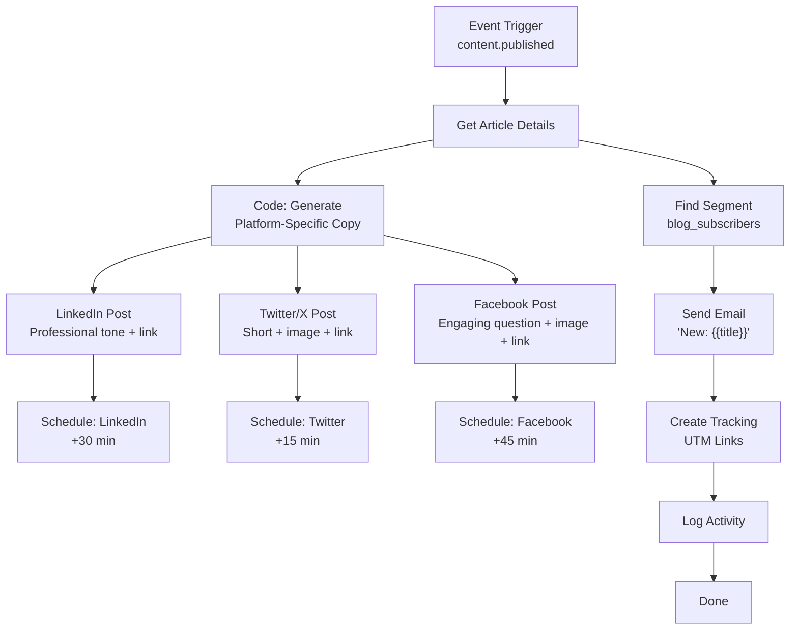

**Example Use Case:**

A B2B SaaS company publishes a blog post "How to Reduce Churn by 40%." The moment it goes live, this workflow shares a professional version on LinkedIn, a snappy thread on Twitter, and an engaging post on Facebook. Simultaneously, 5,000 blog subscribers receive an email with the first paragraph and a "Read More" CTA. The marketing team saves 2 hours per post.

### 6.9 Template 8: Campaign Performance Daily Digest

| Field | Value |
|-------|-------|
| **ID** | `mktg-campaign-digest` |
| **Name** | Campaign Performance Daily Digest |
| **Version** | `1.0.0` |
| **Category** | Marketing |
| **Subcategory** | Reporting |
| **Description** | Every morning at 8 AM, compile key metrics from all active campaigns (opens, clicks, conversions, spend, ROI) and send a formatted digest email to stakeholders with a Slack summary. |
| **Trigger Type** | Schedule (`0 8 * * *`) |
| **Estimated Execution Time** | ~1 minute |
| **Complexity** | Intermediate |
| **Required Permissions** | `marketing:campaign:read`, `analytics:query:execute`, `notify:email:send`, `notify:slack:send` |

### 6.10 Template 9: A/B Test Winner - Auto-Send Winner

| Field | Value |
|-------|-------|
| **ID** | `mktg-ab-test-winner` |
| **Name** | A/B Test Winner - Auto-Send Winner |
| **Version** | `1.0.0` |
| **Category** | Marketing |
| **Subcategory** | Campaign Optimization |
| **Description** | When an A/B test reaches statistical significance (95% confidence) or max duration (7 days), automatically identify the winning variant and send it to the remaining 50% of the audience segment. |
| **Trigger Type** | Schedule (Hourly) or Event (`campaign.ab_test.completed`) |
| **Estimated Execution Time** | ~30 seconds |
| **Complexity** | Advanced |
| **Required Permissions** | `marketing:campaign:read`, `marketing:campaign:write`, `analytics:query:execute`, `marketing:email:send` |

### 6.11 Template 10: Abandoned Cart Recovery

| Field | Value |
|-------|-------|
| **ID** | `mktg-abandoned-cart` |
| **Name** | Abandoned Cart Recovery |
| **Version** | `1.0.0` |
| **Category** | Marketing |
| **Subcategory** | E-commerce |
| **Description** | 3-email sequence: 1h (reminder), 24h (discount offer), 72h (last chance urgency). Track recovery rate. |
| **Trigger Type** | Event (`cart.abandoned`) |
| **Estimated Execution Time** | ~10 seconds per email |
| **Complexity** | Intermediate |
| **Required Permissions** | `ecommerce:cart:read`, `marketing:email:send`, `crm:contact:read` |

### 6.12 Template 11: Event Registration Follow-up

| Field | Value |
|-------|-------|
| **ID** | `mktg-event-followup` |
| **Name** | Event Registration Follow-up |
| **Version** | `1.0.0` |
| **Category** | Marketing |
| **Subcategory** | Events |
| **Description** | Confirmation immediately, reminder 48h before, thank-you with recording link after event. |
| **Trigger Type** | Event (`event.registered`) |
| **Estimated Execution Time** | ~10 seconds per email |
| **Complexity** | Intermediate |
| **Required Permissions** | `marketing:event:read`, `marketing:email:send` |

### 6.13 Template 12: Webinar Reminder

| Field | Value |
|-------|-------|
| **ID** | `mktg-webinar-reminder` |
| **Name** | Webinar Reminder Sequence |
| **Version** | `1.0.0` |
| **Category** | Marketing |
| **Subcategory** | Events |
| **Description** | Reminders 24h (calendar attachment) and 1h (join link) before webinar. No-shows get recording link 2h after. |
| **Trigger Type** | Event (`webinar.scheduled`) or Schedule |
| **Estimated Execution Time** | ~10 seconds per batch |
| **Complexity** | Intermediate |
| **Required Permissions** | `marketing:event:read`, `marketing:email:send`, `crm:segment:read` |

### 6.14 Template 13: New User Onboarding

| Field | Value |
|-------|-------|
| **ID** | `cs-onboarding` |
| **Name** | New User Onboarding Sequence |
| **Version** | `1.0.0` |
| **Category** | Customer Success |
| **Subcategory** | Onboarding |
| **Description** | 5-touch onboarding over 30 days: Day 1 (welcome), Day 3 (tips video), Day 7 (CSM check-in), Day 14 (advanced workshop), Day 30 (success review). |
| **Trigger Type** | Event (`user.joined`) or Event (`subscription.activated`) |
| **Estimated Execution Time** | ~10 seconds per touchpoint |
| **Complexity** | Intermediate |
| **Required Permissions** | `crm:contact:read`, `crm:activity:write`, `notify:email:send`, `notify:slack:send`, `admin:user:read` |

**Onboarding Schedule:**

| Touch | Day | Channel | Content | Owner |
|-------|-----|---------|---------|-------|
| 1 | 1 | Email | Welcome + platform overview + first action guide | Automated |
| 2 | 3 | Email | Tips & tricks video + power user shortcuts | Automated |
| 3 | 7 | Email + Slack | CSM intro + personalized check-in | CSM |
| 4 | 14 | Email | Advanced features workshop invite | Automated |
| 5 | 30 | Email + Call | Success review + usage report + expansion offer | CSM |

### 6.15 Template 14: Low Engagement Alert

| Field | Value |
|-------|-------|
| **ID** | `cs-low-engagement` |
| **Name** | Low Engagement Alert |
| **Version** | `1.0.0` |
| **Category** | Customer Success |
| **Subcategory** | Health Monitoring |
| **Description** | Daily check: if user has <2 logins in 14 days, flag at-risk, create CS task, alert CSM, add to re-engagement sequence. |
| **Trigger Type** | Schedule (Daily at 6 AM) |
| **Estimated Execution Time** | ~2 minutes per 1,000 users |
| **Complexity** | Advanced |
| **Required Permissions** | `analytics:usage:read`, `crm:activity:write`, `notify:slack:send`, `notify:email:send` |

### 6.16 Template 15: Renewal Reminder

| Field | Value |
|-------|-------|
| **ID** | `cs-renewal-reminder` |
| **Name** | Renewal Reminder Sequence |
| **Version** | `1.0.0` |
| **Category** | Customer Success |
| **Subcategory** | Retention |
| **Description** | Reminders at 90/60/30 days with usage stats, ROI summary, renewal proposal. Escalates to CSM if no response in 7 days. |
| **Trigger Type** | Schedule (Daily at 7 AM) |
| **Estimated Execution Time** | ~3 minutes per 100 subscriptions |
| **Complexity** | Advanced |
| **Required Permissions** | `billing:subscription:read`, `analytics:usage:read`, `crm:contact:read`, `notify:email:send`, `notify:slack:send` |

### 6.17 Template 16: NPS Survey Response Handler

| Field | Value |
|-------|-------|
| **ID** | `cs-nps-respond` |
| **Name** | NPS Survey Response Handler |
| **Version** | `1.0.0` |
| **Category** | Customer Success |
| **Subcategory** | Feedback |
| **Description** | Promoter (9-10): ask for review. Passive (7-8): send tips. Detractor (0-6): alert CSM, create recovery task. |
| **Trigger Type** | Event (`survey.nps.submitted`) |
| **Estimated Execution Time** | ~5 seconds |
| **Complexity** | Intermediate |
| **Required Permissions** | `crm:contact:read`, `crm:activity:write`, `notify:email:send`, `notify:slack:send` |

### 6.18 Template 17: Support Ticket Follow-up

| Field | Value |
|-------|-------|
| **ID** | `cs-support-followup` |
| **Name** | Support Ticket Follow-up |
| **Version** | `1.0.0` |
| **Category** | Customer Success |
| **Subcategory** | Support |
| **Description** | 24h after ticket resolved: send satisfaction survey. Positive → log success. Negative → reopen ticket + alert manager. |
| **Trigger Type** | Event (`ticket.resolved`) |
| **Estimated Execution Time** | ~5 seconds |
| **Complexity** | Beginner |
| **Required Permissions** | `support:ticket:read`, `support:ticket:write`, `notify:email:send` |

### 6.19 Template 18: Lead Score Reprioritize Pipeline

| Field | Value |
|-------|-------|
| **ID** | `ai-lead-score-pipeline` |
| **Name** | Lead Score Update - Re-prioritize Pipeline |
| **Version** | `1.0.0` |
| **Category** | AI-Powered |
| **Subcategory** | Lead Scoring |
| **Description** | Nightly AI re-scoring of all leads. Leads scoring +20 points are moved to top of pipeline; rep receives SMS alert with updated score and recommended next action. |
| **Trigger Type** | Schedule (Daily at 2 AM) |
| **Estimated Execution Time** | ~5-15 minutes |
| **Complexity** | Advanced |
| **Required Permissions** | `crm:contact:read`, `crm:contact:write`, `crm:deal:write`, `ai:leadscore:execute`, `notify:sms:send` |

### 6.20 Template 19: AI Content Pipeline

| Field | Value |
|-------|-------|
| **ID** | `ai-content-pipeline` |
| **Name** | AI Content Pipeline |
| **Version** | `1.0.0` |
| **Category** | AI-Powered |
| **Subcategory** | Content Generation |
| **Description** | End-to-end: AI researches topic, drafts article with brand voice, sends for human review via Slack approval, publishes on approval, initiates promotion. |
| **Trigger Type** | Manual or Webhook (from content calendar) |
| **Estimated Execution Time** | ~2-5 min (AI) + human review time |
| **Complexity** | Advanced |
| **Required Permissions** | `ai:agent:invoke`, `ai:knowledge:search`, `content:article:write`, `notify:slack:send`, `content:article:publish` |

### 6.21 Template 20: Social Listening & Trend Alert

| Field | Value |
|-------|-------|
| **ID** | `ai-social-listening` |
| **Name** | Social Listening & Trend Alert |
| **Version** | `1.0.0` |
| **Category** | AI-Powered |
| **Subcategory** | Social Intelligence |
| **Description** | Monitors social channels for trending industry topics. On detection with sufficient volume, alerts marketing team and generates content suggestions (blog topic, social post, email angle). |
| **Trigger Type** | Schedule (Every 4 hours) |
| **Estimated Execution Time** | ~3-5 minutes |
| **Complexity** | Advanced |
| **Required Permissions** | `ai:agent:invoke`, `social:monitor:read`, `notify:slack:send`, `ai:knowledge:write` |

### 6.22 Template 21: Weekly AI Performance Review

| Field | Value |
|-------|-------|
| **ID** | `ai-weekly-review` |
| **Name** | Weekly AI Performance Review |
| **Version** | `1.0.0` |
| **Category** | AI-Powered |
| **Subcategory** | Analytics |
| **Description** | AI compiles weekly performance report across all modules: campaign metrics, pipeline changes, customer health, AI agent usage. Includes anomaly detection and recommendations. |
| **Trigger Type** | Schedule (Weekly Monday at 6 AM) |
| **Estimated Execution Time** | ~5 minutes |
| **Complexity** | Advanced |
| **Required Permissions** | `analytics:query:execute`, `ai:insights:generate`, `notify:email:send`, `notify:slack:send` |

### 6.23 Template 22: Auto-generate Monthly Client Report

| Field | Value |
|-------|-------|
| **ID** | `ai-monthly-report` |
| **Name** | Auto-generate Monthly Client Report |
| **Version** | `1.0.0` |
| **Category** | AI-Powered |
| **Subcategory** | Reporting |
| **Description** | Gathers data from all modules (campaigns, pipeline, social, SEO, billing), generates comprehensive PDF with AI executive summary and recommendations, emails to client. |
| **Trigger Type** | Schedule (Monthly 1st at 8 AM) or Manual |
| **Estimated Execution Time** | ~3-8 minutes |
| **Complexity** | Advanced |
| **Required Permissions** | `analytics:query:execute`, `ai:insights:generate`, `analytics:report:generate`, `notify:email:send`, `crm:contact:read` |

### 6.24 Template 23: Invoice Generation & Send

| Field | Value |
|-------|-------|
| **ID** | `ops-invoice-send` |
| **Name** | Invoice Generation & Send |
| **Version** | `1.0.0` |
| **Category** | Operations |
| **Subcategory** | Billing |
| **Description** | On 1st of month, calculate usage billing per client, generate invoice PDF, attach to email, send to billing contact, log in CRM. |
| **Trigger Type** | Schedule (`0 6 1 * *`) |
| **Estimated Execution Time** | ~10 minutes (for 100 clients) |
| **Complexity** | Advanced |
| **Required Permissions** | `billing:usage:read`, `billing:invoice:write`, `crm:contact:read`, `crm:deal:read`, `notify:email:send` |

### 6.25 Template 24: Payment Received Handler

| Field | Value |
|-------|-------|
| **ID** | `ops-payment-received` |
| **Name** | Payment Received Handler |
| **Version** | `1.0.0` |
| **Category** | Operations |
| **Subcategory** | Billing |
| **Description** | On payment webhook (Stripe): update invoice status, mark deal "Paid," send thank-you email, notify finance team in Slack. |
| **Trigger Type** | Webhook (from Stripe/Billing) |
| **Estimated Execution Time** | ~10 seconds |
| **Complexity** | Intermediate |
| **Required Permissions** | `billing:invoice:read`, `billing:invoice:write`, `crm:deal:write`, `notify:email:send`, `notify:slack:send` |

### 6.26 Template 25: Subscription Lifecycle Management

| Field | Value |
|-------|-------|
| **ID** | `ops-sub-expiry` |
| **Name** | Subscription Lifecycle Management |
| **Version** | `1.0.0` |
| **Category** | Operations |
| **Subcategory** | Subscription |
| **Description** | Trial ends → 7-day grace period with reminders on days 1/3/5/7. No payment → downgrade to free tier, notify owner, archive premium data. |
| **Trigger Type** | Event (`subscription.trial_ending`) + Schedule |
| **Estimated Execution Time** | ~30 seconds per subscription |
| **Complexity** | Advanced |
| **Required Permissions** | `billing:subscription:read`, `billing:subscription:write`, `admin:workspace:write`, `notify:email:send` |

### 6.27 Template 26: Daily Backup Verification

| Field | Value |
|-------|-------|
| **ID** | `ops-backup-verify` |
| **Name** | Daily Backup Verification |
| **Version** | `1.0.0` |
| **Category** | Operations |
| **Subcategory** | DevOps |
| **Description** | Verify latest DB backup: restore snapshot to staging, run integrity checks, report to DevOps Slack. |
| **Trigger Type** | Schedule (Daily at 5 AM) |
| **Estimated Execution Time** | ~15-30 minutes |
| **Complexity** | Intermediate |
| **Required Permissions** | `infra:backup:read`, `infra:backup:verify`, `notify:slack:send` |

### 6.28 Template 27: Usage-Based Billing Adjustment

| Field | Value |
|-------|-------|
| **ID** | `ops-usage-billing` |
| **Name** | Usage-Based Billing Adjustment |
| **Version** | `1.0.0` |
| **Category** | Operations |
| **Subcategory** | Billing |
| **Description** | Calculate monthly usage per client (API calls, storage, AI credits), compare against plan limits, generate overage/credits, update invoices, notify clients. |
| **Trigger Type** | Schedule (Monthly last day at 11 PM) |
| **Estimated Execution Time** | ~5-15 minutes |
| **Complexity** | Advanced |
| **Required Permissions** | `billing:usage:read`, `billing:invoice:write`, `analytics:query:execute`, `notify:email:send` |

### 6.29 Template 28: New Client Onboarding (Agency)

| Field | Value |
|-------|-------|
| **ID** | `agency-client-onboard` |
| **Name** | New Client Onboarding |
| **Version** | `1.0.0` |
| **Category** | Agency |
| **Subcategory** | Client Management |
| **Description** | Create dedicated workspace, configure white-label branding, invite client users with permissions, duplicate starter campaign template, set up billing, send welcome email. |
| **Trigger Type** | Manual (agency admin triggers after contract signed) |
| **Estimated Execution Time** | ~3-5 minutes |
| **Complexity** | Advanced |
| **Required Permissions** | `admin:workspace:create`, `admin:user:invite`, `admin:branding:write`, `marketing:campaign:create`, `billing:subscription:create`, `notify:email:send` |

### 6.30 Template 29: Multi-client Campaign Duplication

| Field | Value |
|-------|-------|
| **ID** | `agency-campaign-dupe` |
| **Name** | Multi-client Campaign Duplication |
| **Version** | `1.0.0` |
| **Category** | Agency |
| **Subcategory** | Campaign Management |
| **Description** | Clone a master campaign (email sequence, social posts, landing page) into multiple client workspaces with client-specific variable overrides (brand name, logo, links). |
| **Trigger Type** | Manual |
| **Estimated Execution Time** | ~2 min + 30 sec per client |
| **Complexity** | Advanced |
| **Required Permissions** | `marketing:campaign:read`, `marketing:campaign:create`, `admin:workspace:read`, `admin:branding:read` |

### 6.31 Template 30: White-label Client Report

| Field | Value |
|-------|-------|
| **ID** | `agency-white-label-report` |
| **Name** | White-label Client Report Auto-generation |
| **Version** | `1.0.0` |
| **Category** | Agency |
| **Subcategory** | Reporting |
| **Description** | Generate branded monthly reports per client: iterate over client list, gather performance data, apply client branding (logo/colors/fonts), generate PDF, email to client contact. |
| **Trigger Type** | Schedule (Monthly 2nd at 7 AM) |
| **Estimated Execution Time** | ~5 min per 10 clients |
| **Complexity** | Advanced |
| **Required Permissions** | `analytics:query:execute`, `analytics:report:generate`, `admin:branding:read`, `crm:contact:read`, `notify:email:send` |

### 6.32 Template 31: Agency Revenue Dashboard Update

| Field | Value |
|-------|-------|
| **ID** | `agency-revenue-dashboard` |
| **Name** | Agency Revenue Dashboard Update |
| **Version** | `1.0.0` |
| **Category** | Agency |
| **Subcategory** | Operations |
| **Description** | Aggregate revenue across all clients (monthly retainers, campaign spend, overage fees, profitability). Update agency internal ops dashboard. |
| **Trigger Type** | Schedule (Daily at 6 AM) |
| **Estimated Execution Time** | ~3 minutes |
| **Complexity** | Intermediate |
| **Required Permissions** | `billing:invoice:read`, `analytics:query:execute`, `analytics:dashboard:write` |

### 6.33 Template 32: Client Health Score Calculation

| Field | Value |
|-------|-------|
| **ID** | `agency-health-score` |
| **Name** | Client Health Score Calculation |
| **Version** | `1.0.0` |
| **Category** | Agency |
| **Subcategory** | Client Management |
| **Description** | Calculate composite health score per client: engagement (login frequency, campaign activity), spend trend, sentiment (NPS, support), deliverability. Flag below-threshold clients for CSM intervention. |
| **Trigger Type** | Schedule (Weekly Sunday at 10 PM) |
| **Estimated Execution Time** | ~5 min per 100 clients |
| **Complexity** | Advanced |
| **Required Permissions** | `analytics:query:execute`, `crm:activity:read`, `billing:invoice:read`, `crm:contact:read`, `notify:slack:send` |

---

## 7. Workflow Best Practices

### 7.1 Error Handling Patterns

Proper error handling is critical for production workflows. AMC enforces a standard error handling architecture across all workflows.

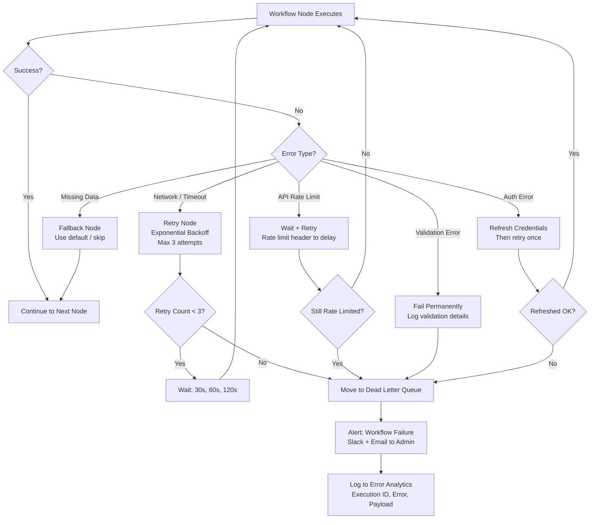

**Error handling implementation patterns:**

```typescript
// Pattern 1: Try/Catch with Error Workflow
// n8n supports an "Error Trigger" that fires when a workflow errors

{
  "errorWorkflow": {
    "enabled": true,
    "workflowId": "error_handler_workflow_id",
    "onError": "continueRegularOutput",
    "retryOnFail": true,
    "maxTries": 3,
    "waitBetweenTries": 30000
  }
}

// Pattern 2: Conditional error branching with IF node
const response = await amcApi.call();
if (response.error) {
  if (response.error.code === 'RATE_LIMITED') {
    return {
      wait: parseInt(response.headers['retry-after']) * 1000,
    };
  }
  if (response.error.code === 'VALIDATION_ERROR') {
    return { fallback: true, defaultData: getDefaults() };
  }
  throw new Error(response.error.message);
}
```

### 7.2 Idempotency

Running the same workflow twice with the same input must produce the same result — no duplicate contacts, no double charges, no double email sends.

| Idempotency Strategy | Implementation | Use Case |
|---------------------|----------------|----------|
| **Idempotency Key** | Pass hash of input in API calls; AMC modules deduplicate | Contact creation, invoice gen |
| **Check-Before-Create** | Look up existing record before creating | "Upsert" pattern for CRM |
| **State Machine** | Track execution state; skip if completed | Multi-step approvals |
| **Transactional Outbox** | Write intent to DB before executing | Payment processing |

```typescript
function generateIdempotencyKey(workflowId: string, payload: any): string {
  const hash = crypto.createHash('sha256');
  hash.update(workflowId);
  hash.update(JSON.stringify(payload, Object.keys(payload).sort()));
  return hash.digest('hex');
}

async function upsertContact(email: string, data: ContactData): Promise<Contact> {
  const existing = await amcCrm.findContacts({ email });
  if (existing.length > 0) {
    return amcCrm.updateContact(existing[0].id, data);
  }
  return amcCrm.createContact(data);
}
```

### 7.3 Rate Limiting

Workflows must respect API rate limits for both AMC internal APIs and external integrations.

| Strategy | Implementation | Configuration |
|----------|----------------|---------------|
| **Token Bucket** | Per-workspace token bucket; tokens refill at rate limit interval | `rateLimit: { bucketSize: 100, refillRate: 10, refillInterval: '1s' }` |
| **Queue Backpressure** | n8n worker queue backs up when rate limited | Automatic via HTTP 429 handling |
| **Batch Processing** | Group API calls into batches (max 50 per batch) | Loop Over Items + Batch mode |
| **Off-peak Scheduling** | Schedule heavy workflows during off-peak hours | Cron: `0 2-5 * * *` |

```javascript
const rateLimitState = $getWorkflowStaticData('global');

function checkRateLimit(key, maxPerMinute) {
  const now = Date.now();
  const window = 60 * 1000;

  if (!rateLimitState[key]) {
    rateLimitState[key] = { count: 0, windowStart: now };
  }

  const state = rateLimitState[key];
  if (now - state.windowStart > window) {
    state.count = 0;
    state.windowStart = now;
  }

  if (state.count >= maxPerMinute) {
    const waitTime = window - (now - state.windowStart);
    throw new Error(`Rate limit exceeded. Wait ${Math.ceil(waitTime / 1000)}s`);
  }

  state.count++;
}
```

### 7.4 Workflow Versioning

Every workflow change creates an immutable version record.

```typescript
interface WorkflowVersionRecord {
  versionId: string;
  workflowId: string;
  versionNumber: number;
  workflowData: object;
  checksum: string;
  createdBy: string;
  createdAt: string;
  changeNotes: string;
  status: 'active' | 'archived';
}
```

**Version management actions:**

| Action | Description | API Endpoint |
|--------|-------------|--------------|
| List versions | Show version history with change notes | `GET /api/v1/workflows/:id/versions` |
| Get version | Retrieve full workflow data for a version | `GET /api/v1/workflows/:id/versions/:v` |
| Rollback | Revert to previous version | `POST /api/v1/workflows/:id/rollback/:v` |
| Compare | Diff two versions | `GET /api/v1/workflows/:id/compare?v1=2&v2=3` |
| Tag version | Add semantic label ("production") | `POST /api/v1/workflows/:id/versions/:v/tag` |

### 7.5 Testing Workflows

| Environment | Purpose | How It Works |
|-------------|---------|--------------|
| **Test Mode** | Debug individual runs | Sandbox with mock data; no persistence |
| **Dry Run** | Validate without side effects | Read-only mode on AMC nodes |
| **Staging** | Full test against staging DB | Dedicated n8n instance on staging |
| **Canary** | 5% traffic first | Gradual rollout for trigger-based workflows |
| **Production** | Live execution | Real credentials, real side effects |

**Testing checklist:**

- Test mode execution completes without errors
- Dry run shows expected transformations
- All credential connections succeed
- Error paths are exercised (disconnect API, verify error handling)
- Idempotency verified (run twice, same result)
- Rate limits not exceeded in test
- Output data format matches downstream expectations

### 7.6 Workflow Monitoring

| Metric | Source | Alert Threshold | Action |
|--------|--------|-----------------|--------|
| Execution failure rate | n8n execution logs | > 5% in 1 hour | Alert Slack #workflow-alerts |
| Avg execution duration | n8n metrics | > 2x baseline | Investigate bottlenecks |
| Queue depth | Bull queue | > 500 for > 5 min | Scale up workers |
| Credential errors | Vault/n8n auth logs | Any | Alert engineering immediately |
| Idempotency violations | API gateway logs | > 0 | Investigate duplicate execution |
| Dead letter queue depth | RabbitMQ DLQ | > 10 | Review failed workflows |

```typescript
class WorkflowMonitor {
  async analyzeFailure(execution: ExecutionRecord): Promise<FailureAnalysis> {
    const recentExecutions = await this.getRecentExecutions(
      execution.workflowId,
      { hours: 1 }
    );

    const failureRate = recentExecutions.filter(e => e.status === 'failed').length
      / recentExecutions.length;

    return {
      workflowId: execution.workflowId,
      currentFailureRate: failureRate,
      threshold: 0.05,
      breached: failureRate > 0.05,
      failedNode: this.identifyFailedNode(execution),
      recommendedAction: this.getRecommendedAction(execution.error),
    };
  }

  private getRecommendedAction(error: ExecutionError): string {
    const actionMap: Record<string, string> = {
      'RATE_LIMITED': 'Increase retry delay or reduce batch size',
      'AUTH_EXPIRED': 'Refresh credentials in credential store',
      'TIMEOUT': 'Increase node timeout or split workflow',
      'VALIDATION': 'Check input data schema compliance',
      'MISSING_DATA': 'Add fallback/default data node before this step',
    };
    return actionMap[error.code] || 'Manual investigation required';
  }
}
```

### 7.7 Performance Optimization

| Pattern | Description | When to Use |
|---------|-------------|-------------|
| **Parallel Branches** | Run independent steps concurrently | Fan-out operations (multi-channel sends) |
| **Batch Processing** | Process items in batches of 50-100 | Bulk data operations |
| **Loop with Splitting** | Split large datasets across workers | > 10,000 items |
| **Lazy Loading** | Fetch data only when needed | Conditional branches |
| **Caching** | Cache reference data in static data | Repeated lookups |
| **Pre-filtering** | Filter data as early as possible | Reduce downstream processing |
| **Compression** | Compress large payloads | > 1 MB data transfers |

### 7.8 Security Best Practices

| Practice | Implementation | Enforcement |
|----------|----------------|-------------|
| **Credential encryption** | AES-256-GCM at rest, TLS 1.3 in transit | Vault + n8n credential store |
| **Input sanitization** | Strip HTML, SQL-injectable characters | Node-level validation |
| **Least privilege** | Minimum required scopes per workflow | API key scoping |
| **Audit logging** | Every execution logged with correlation ID | Automatic |
| **Secrets rotation** | Auto-rotate every 90 days | Vault + automation-service |
| **IP whitelisting** | Webhook endpoints limited to known IPs | Network policy |
| **Webhook signing** | HMAC-SHA256 signature validation | Middleware |

**Credential security checklist:**

- Plaintext secrets never appear in workflow logs
- Secrets never passed as query parameters
- OAuth tokens auto-refreshed before expiry
- Credential access logged with user ID + timestamp
- Deactivated users have credentials revoked within 1 hour
- Workspace credentials isolated from other workspaces

---

## 8. AI Agent - Workflow Integration

### 8.1 Integration Architecture

The relationship between AI agents and n8n workflows is **bidirectional and symbiotic**. Agents can trigger workflows, workflows can invoke agents, and agents can monitor workflow execution in real time.

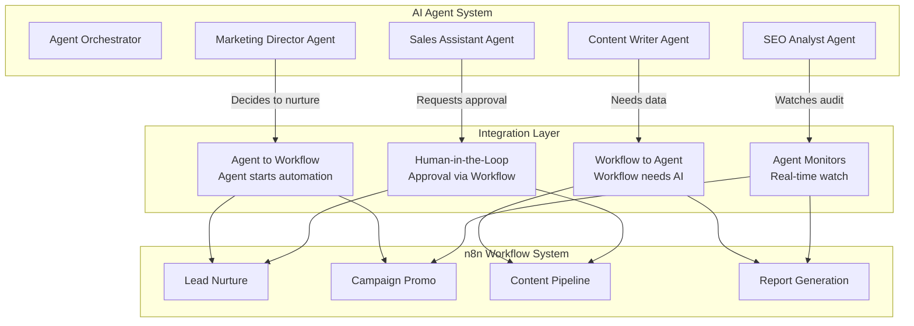

### 8.2 Agent Triggers Workflow

An AI agent can decide to start a workflow as part of its autonomous decision-making process.

**Flow:**

1. Agent determines a course of action (e.g., "This lead should be nurtured")
2. Agent calls `automation-service` API to trigger workflow
3. `automation-service` validates agent has permission
4. Workflow executes asynchronously
5. Agent receives callback with execution result

```typescript
class MarketingAgent {
  async handleNewLead(lead: Lead): Promise<void> {
    const score = await this.scoreLead(lead);

    if (score > 70) {
      await this.triggerWorkflow('sales-lead-qualify', {
        contactId: lead.id,
        score,
        source: lead.source,
      });
    } else if (score > 40) {
      const execution = await this.triggerWorkflow('sales-lead-nurture', {
        contactId: lead.id,
        score,
      });
      this.monitorNurtureSequence(execution.id, lead.id);
    }
  }

  private async triggerWorkflow(
    workflowId: string,
    payload: Record<string, any>
  ): Promise<ExecutionResult> {
    return await automationService.executeWorkflow(workflowId, {
      ...payload,
      _triggerSource: 'ai_agent',
      _agentId: this.agentId,
      _sessionId: this.sessionId,
    });
  }

  private async monitorNurtureSequence(
    executionId: string,
    leadId: string
  ): Promise<void> {
    const events = await this.subscribeToExecutionEvents(executionId);
    for await (const event of events) {
      if (event.type === 'email.opened' && event.data.engagement > 0.7) {
        await this.triggerWorkflow('sales-lead-qualify', {
          contactId: leadId,
          score: 85,
          reason: 'High email engagement detected',
        });
      }
    }
  }
}
```

### 8.3 Workflow Triggers Agent

A workflow can invoke an AI agent at any step, pausing execution until the agent returns a result.

**Flow:**

1. Workflow reaches a step requiring AI processing (e.g., "Generate email copy")
2. Workflow calls AMC AI Agent node with task description
3. n8n pauses execution and enqueues the agent invocation
4. AI agent processes the task
5. Agent returns result to waiting workflow
6. Workflow continues with agent's output

```typescript
const workflowStep = {
  name: 'Generate Email Content with AI',
  type: 'n8n-nodes-base.amcAgent',
  parameters: {
    operation: 'Invoke Agent',
    agentId: 'content-writer-v2',
    task: 'Write a 3-email nurture sequence for SaaS leads in trial period',
    context: {
      brandVoice: 'Professional, helpful, data-driven',
      targetSegment: 'Trial users in week 2',
      keyFeatures: ['Analytics dashboard', 'AI recommendations', 'API access'],
    },
    outputFormat: {
      type: 'json',
      schema: {
        emails: [
          { subject: 'string', body: 'string', cta: 'string', suggestedSendDay: 'number' },
        ],
      },
    },
    maxWaitTime: 120,
  },
};
```

### 8.4 Agent Monitors Workflow

Agents can monitor workflow execution in real time via WebSocket or event subscription and intervene when necessary.

| Monitoring Mode | Description | Use Case |
|----------------|-------------|----------|
| **Passive** | Watch logs and metrics; no intervention | Performance analysis, audit |
| **Reactive** | Receive events at milestones; may adjust | "If open rate < 10%, change subject" |
| **Proactive** | Analyze patterns and suggest optimizations | "Reschedule to Tuesday — faster" |
| **Intervention** | Pause, modify, or cancel running workflow | "Stop — negative feedback detected" |

```typescript
class WorkflowMonitorAgent {
  async monitorExecution(executionId: string): Promise<void> {
    const subscription = await this.eventBus.subscribe(
      `execution.${executionId}.*`,
      async (event) => {
        switch (event.type) {
          case 'execution.node.completed':
            await this.analyzeNodeOutput(event.data);
            break;
          case 'execution.node.error':
            await this.handleNodeError(event.data);
            break;
          case 'execution.completed':
            await this.analyzeFullExecution(event.data);
            break;
        }
      }
    );
  }

  private async analyzeNodeOutput(data: NodeOutput): Promise<void> {
    if (data.nodeType === 'amcEmail' && data.output.sentCount > 0) {
      const sentiment = await this.analyzeSentiment(data.output.emailBody);
      if (sentiment.negative) {
        await this.flagForReview(data.executionId, data.nodeId, {
          reason: 'Negative sentiment detected in email body',
          suggestion: sentiment.suggestedRewording,
        });
      }
    }
  }

  private async handleNodeError(data: NodeError): Promise<void> {
    if (data.error.code === 'RATE_LIMITED' && data.retryCount < 3) {
      await this.modifyWorkflowExecution(data.executionId, {
        adjustRetryDelay: data.error.suggestedDelay || 60000,
      });
    }
  }
}
```

### 8.5 Agent Workflow Delegation Patterns

| Pattern | Description | When to Use |
|---------|-------------|-------------|
| **Fire and Forget** | Agent triggers workflow, does not wait for result | Non-critical ops |
| **Fire and Monitor** | Agent triggers workflow, subscribes to events | Conditional follow-up |
| **Request-Response** | Workflow invokes agent, waits for response | AI decisions inline |
| **Parallel Delegation** | Agent triggers multiple workflows concurrently | Multi-channel launches |
| **Chain Delegation** | Workflow completion triggers agent, which triggers next workflow | Multi-step processes |
| **Approval Loop** | Agent → Workflow requests human approval → Agent resumes | Sensitive operations |

**Chain delegation example:**

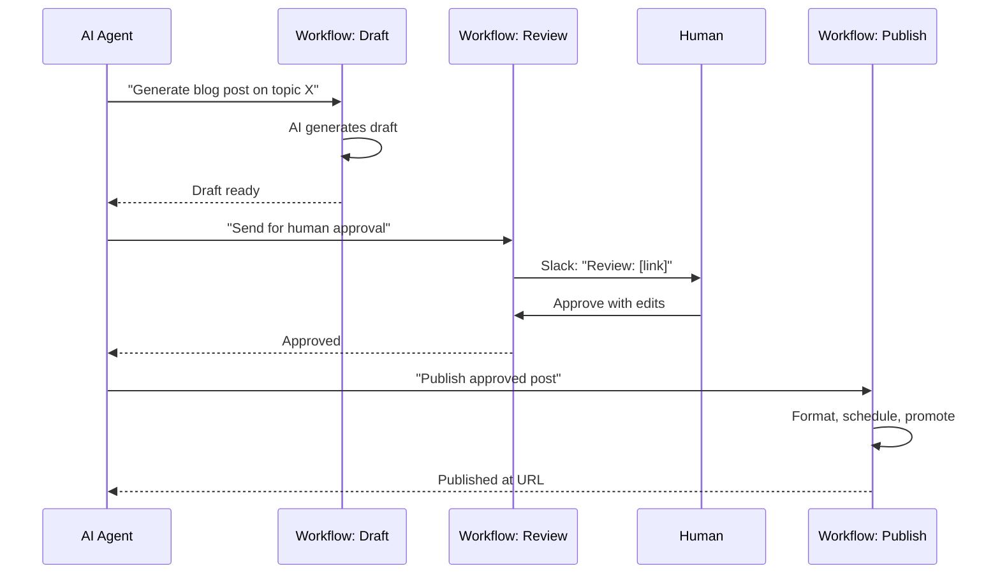

### 8.6 Human-in-the-Loop via Workflow

The most critical integration pattern is the **human-in-the-loop (HITL)** approval workflow. AI agents make recommendations, but humans approve high-stakes actions.

**HITL workflow structure:**

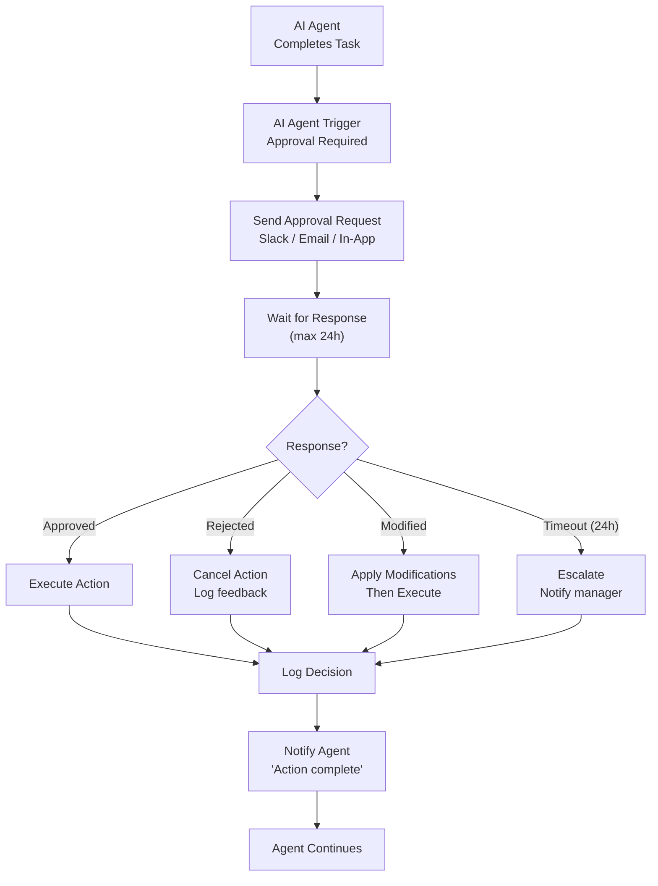

```typescript
interface ApprovalRequest {
  id: string;
  type: 'campaign_launch' | 'email_send' | 'budget_spend' | 'content_publish' | 'deal_discount';
  title: string;
  description: string;
  risk: 'low' | 'medium' | 'high';
  requestedBy: string;
  expiresAt: string;
  data: {
    summary: string;
    metrics?: Record<string, number>;
    preview?: string;
    impact?: string;
    alternatives?: string[];
  };
  options: ApprovalOption[];
  metadata: {
    workflowId: string;
    executionId: string;
    workspaceId: string;
    correlationId: string;
  };
}

interface ApprovalOption {
  id: string;
  label: string;
  description: string;
  action: 'approve' | 'approve_with_changes' | 'reject';
  changes?: Record<string, any>;
}
```

---

## 9. Workflow Management Dashboard

### 9.1 Dashboard Overview

The Workflow Management Dashboard is the central hub for all workflow operations within AMC. It provides a comprehensive interface for discovering, configuring, executing, and monitoring workflows.

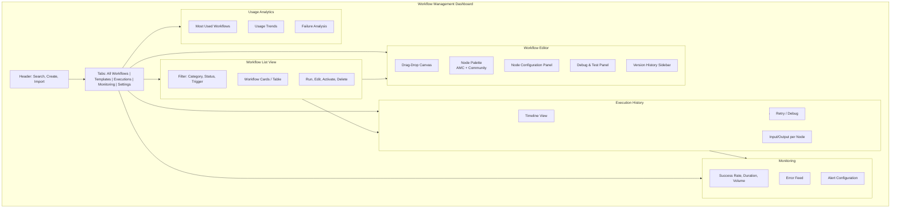

### 9.2 Workflow List View

| Feature | Description |
|---------|-------------|
| **Search** | Full-text across names, descriptions, node types |
| **Filters** | Category, status (Active/Inactive/Draft/Error), trigger type, last executed |
| **Sort** | Name, last modified, last executed, execution count, failure rate |
| **Columns** | Name, Status, Trigger, Category, Last Run, Success Rate, Avg Duration, Owner |
| **Bulk Actions** | Activate, deactivate, delete, export, duplicate selected |
| **Template Badge** | Marked with badge; installed templates show "Customized" or "Original" |

### 9.3 Workflow Editor

The editor is the embedded n8n editor, surfaced within AMC's UI for a seamless experience.

| Feature | Description |
|---------|-------------|
| **Drag-and-drop canvas** | Add, connect, and arrange nodes visually |
| **Node palette** | All AMC custom + n8n community + custom plugin nodes |
| **Node configuration** | Side panel with form fields for parameters |
| **Live preview** | Sample input/output data as you configure |
| **Test mode** | Execute with mock data; inspect intermediate outputs |
| **Debug panel** | Step-through execution, inspect node states |
| **Version sidebar** | Compare versions, rollback, tag releases |
| **Keyboard shortcuts** | Ctrl+S (save), Ctrl+Z (undo), Ctrl+Shift+E (execute) |

```typescript
class WorkflowEditor {
  private iframe: HTMLIFrameElement;
  private channel: MessageChannel;

  constructor(container: HTMLElement, workflowId: string) {
    this.iframe = document.createElement('iframe');
    this.iframe.src = `${N8N_EDITOR_URL}/workflow/${workflowId}?embed=true`;
    container.appendChild(this.iframe);

    this.channel = new MessageChannel();
    this.channel.port1.onmessage = this.handleMessage.bind(this);

    this.iframe.contentWindow.postMessage({
      type: 'init',
      payload: { apiKey: getWorkspaceApiKey(), workspaceId: getWorkspaceId() },
    }, '*', [this.channel.port2]);
  }

  private handleMessage(event: MessageEvent) {
    const { type, payload } = event.data;
    switch (type) {
      case 'workflow.saved': this.onWorkflowSaved(payload); break;
      case 'workflow.executed': this.onWorkflowExecuted(payload); break;
      case 'workflow.error': this.onWorkflowError(payload); break;
      case 'node.config.open': this.showNodeConfig(payload); break;
    }
  }

  private showNodeConfig(nodeData: NodeConfig) {
    if (nodeData.type.startsWith('n8n-nodes-base.amc')) {
      this.showEnhancedConfigPanel(nodeData);
    } else {
      this.showDefaultConfigPanel(nodeData);
    }
  }
}
```

### 9.4 Execution History

| Feature | Description |
|---------|-------------|
| **Timeline** | Chronological list with status indicators (Success/Failed/Running/Paused) |
| **Execution Details** | Drill-down: input/output for every node in execution |
| **Node Timeline** | Gantt-style view showing node execution duration |
| **Search** | By execution ID, workflow name, status, date range |
| **Export** | JSON or CSV for audit |
| **Retry** | From beginning or from failed node |
| **Compare** | Side-by-side comparison of two executions |

### 9.5 Error Monitoring

| Feature | Description |
|---------|-------------|
| **Error Feed** | Real-time stream with severity levels |
| **Error Details** | Full context: node, input, stack, execution ID |
| **Pattern Detection** | Auto-groups similar errors |
| **Suggested Fixes** | AI-generated recommendations |
| **Dead Letter Queue** | View workflows that exhausted retries; option to replay |
| **Alert Rules** | Configure thresholds (x failures in y minutes) |

### 9.6 Usage Analytics

| Metric | Description | Display |
|--------|-------------|---------|
| **Most Used Workflows** | Top 10 by execution count | Bar chart |
| **Failure Rate by Workflow** | % failed per workflow | Heatmap table |
| **Average Duration** | Mean execution time with trend | Line chart (7/30/90 day) |
| **Trigger Distribution** | Event vs schedule vs manual vs webhook | Pie chart |
| **Node Usage** | Most used node types | Bar chart |
| **Hourly Volume** | Peak hours for capacity planning | Heatmap calendar |
| **Workspace Comparison** | Cross-workspace metrics (agency) | Radar chart |

---

## 10. Event Catalog

### 10.1 Event System Architecture

AMC's event system is the backbone of workflow automation. Every module emits events when state changes occur, and these events can trigger workflows via event trigger nodes.

```typescript
interface DomainEvent {
  id: string;
  type: string;
  version: number;
  timestamp: string;
  workspaceId: string;
  correlationId: string;
  source: string;
  actor: {
    type: 'user' | 'agent' | 'workflow' | 'system';
    id: string;
    name?: string;
  };
  data: Record<string, any>;
  metadata: {
    ip?: string;
    userAgent?: string;
    requestId?: string;
  };
}
```

### 10.2 CRM Events

**`crm.contact.created`** — Emitted when a new contact is created.

```typescript
interface CrmContactCreatedEvent {
  type: 'crm.contact.created';
  workspaceId: string;
  data: {
    contactId: string;
    email: string;
    firstName: string;
    lastName: string;
    phone?: string;
    jobTitle?: string;
    organizationId?: string;
    organizationName?: string;
    ownerId?: string;
    segments: string[];
    source: string;
    customFields: Record<string, any>;
    createdAt: string;
  };
}
```

**`crm.contact.updated`** — Emitted when contact properties change.

```typescript
interface CrmContactUpdatedEvent {
  type: 'crm.contact.updated';
  data: {
    contactId: string;
    email: string;
    changes: { field: string; oldValue: any; newValue: any; }[];
    previousState: Partial<Contact>;
    currentState: Partial<Contact>;
  };
}
```

**`crm.deal.created`**

```typescript
interface CrmDealCreatedEvent {
  type: 'crm.deal.created';
  data: {
    dealId: string; title: string; value: number; currency: string;
    stage: string; pipelineId: string; contactId?: string;
    organizationId?: string; ownerId?: string;
    expectedCloseDate?: string; source: string;
  };
}
```

**`crm.deal.stage_changed`**

```typescript
interface CrmDealStageChangedEvent {
  type: 'crm.deal.stage_changed';
  data: {
    dealId: string; title: string; value: number;
    previousStage: string; currentStage: string;
    timeInPreviousStage: number;
    ownerId: string; ownerName: string;
    stageHistory: { stage: string; enteredAt: string; duration: number; }[];
  };
}
```

**`crm.deal.won`**

```typescript
interface CrmDealWonEvent {
  type: 'crm.deal.won';
  data: {
    dealId: string; title: string; value: number; currency: string;
    wonAt: string; ownerId: string;
    originalExpectedValue: number;
    discountApplied?: number; winReason?: string;
    campaignSource?: string; salesCycleDays: number;
  };
}
```

**`crm.deal.lost`**

```typescript
interface CrmDealLostEvent {
  type: 'crm.deal.lost';
  data: {
    dealId: string; title: string; value: number;
    lostAt: string; ownerId: string;
    lostReason: string; lostDetails?: string;
    competitorName?: string; stageWhenLost: string;
    salesCycleDays: number; nextSteps?: string;
  };
}
```

### 10.3 Marketing Events

**`marketing.campaign.sent`**

```typescript
interface MarketingCampaignSentEvent {
  type: 'marketing.campaign.sent';
  data: {
    campaignId: string; campaignName: string;
    campaignType: 'email' | 'social' | 'landing_page' | 'multi_channel';
    sentAt: string; totalRecipients: number;
    segments: string[]; channels: string[];
    templateId?: string; aBTestId?: string; variant?: string;
    contentSummary: {
      subject?: string; preview?: string;
      hasImages: boolean; hasLinks: boolean; hasAttachments: boolean;
    };
  };
}
```

**`marketing.campaign.completed`**

```typescript
interface MarketingCampaignCompletedEvent {
  type: 'marketing.campaign.completed';
  data: {
    campaignId: string; campaignName: string;
    completedAt: string; startedAt: string; duration: number;
    status: 'completed' | 'partially_sent' | 'cancelled';
    stats: {
      sent: number; delivered: number; opened: number;
      clicked: number; bounced: number; unsubscribed: number;
      complained: number; conversionRate: number; revenue: number; roi: number;
    };
    totalCost: number; segments: string[];
    aBTestResult?: { winner: string; metric: string; confidence: number; };
  };
}
```

**`marketing.email.opened`**

```typescript
interface MarketingEmailOpenedEvent {
  type: 'marketing.email.opened';
  data: {
    emailId: string; campaignId: string; contactId: string;
    openedAt: string; openCount: number;
    deviceType?: 'desktop' | 'mobile' | 'tablet';
    isFirstOpen: boolean;
  };
}
```

**`marketing.email.clicked`**

```typescript
interface MarketingEmailClickedEvent {
  type: 'marketing.email.clicked';
  data: {
    emailId: string; campaignId: string; contactId: string;
    clickedAt: string; linkUrl: string; linkText: string;
    linkType: 'cta' | 'social' | 'unsubscribe' | 'image' | 'other';
    clickCount: number; isFirstClick: boolean;
  };
}
```

**`marketing.email.bounced`**

```typescript
interface MarketingEmailBouncedEvent {
  type: 'marketing.email.bounced';
  data: {
    emailId: string; campaignId: string; contactId: string;
    bouncedAt: string; bounceType: 'hard' | 'soft';
    bounceReason: string; diagnosticCode?: string;
    action: 'mark_invalid' | 'retry' | 'suppress';
  };
}
```

### 10.4 AI Events

**`ai.agent.task.completed`**

```typescript
interface AiAgentTaskCompletedEvent {
  type: 'ai.agent.task.completed';
  data: {
    agentId: string; agentName: string; sessionId: string;
    taskId: string; task: string;
    completedAt: string; startedAt: string; duration: number;
    status: 'success' | 'partial' | 'error';
    result: { summary: string; outputData?: any; confidence?: number; tokensUsed: number; cost: number; };
    error?: { code: string; message: string; recoverable: boolean; };
  };
}
```

**`ai.agent.escalation`**

```typescript
interface AiAgentEscalationEvent {
  type: 'ai.agent.escalation';
  data: {
    agentId: string; agentName: string; sessionId: string;
    escalationReason: 'needs_approval' | 'uncertain' | 'error' | 'policy_violation';
    description: string; context: Record<string, any>;
    riskLevel: 'low' | 'medium' | 'high';
    suggestedActions?: { label: string; action: Record<string, any>; }[];
    deadline?: string;
  };
}
```

**`ai.generation.completed`**

```typescript
interface AiGenerationCompletedEvent {
  type: 'ai.generation.completed';
  data: {
    generationId: string;
    type: 'content' | 'image' | 'code' | 'analysis' | 'translation';
    model: string; prompt: string;
    result: { text?: string; imageUrl?: string; tokens: number; cost: number; };
    duration: number;
  };
}
```

### 10.5 Billing Events

**`billing.invoice.paid`**

```typescript
interface BillingInvoicePaidEvent {
  type: 'billing.invoice.paid';
  data: {
    invoiceId: string; invoiceNumber: string;
    amount: number; currency: string; paidAt: string;
    paymentMethod: 'card' | 'bank_transfer' | 'paypal' | 'credits' | 'other';
    clientId: string; clientName: string;
    subscriptionId?: string;
    periodStart: string; periodEnd: string;
    lineItems: { description: string; amount: number; quantity: number; }[];
    receiptUrl?: string;
  };
}
```

**`billing.invoice.overdue`**

```typescript
interface BillingInvoiceOverdueEvent {
  type: 'billing.invoice.overdue';
  data: {
    invoiceId: string; invoiceNumber: string;
    amount: number; currency: string; dueDate: string;
    daysOverdue: number; clientId: string; clientName: string;
    previousReminders: number; lateFee?: number; totalDue: number;
  };
}
```

**`billing.subscription.trial_ending`**

```typescript
interface BillingSubscriptionTrialEndingEvent {
  type: 'billing.subscription.trial_ending';
  data: {
    subscriptionId: string; workspaceId: string; workspaceName: string;
    plan: string; trialEndsAt: string; daysRemaining: number;
    autoRenew: boolean; priceAfterTrial: number; currency: string;
    ownerEmail: string; ownerName: string;
  };
}
```

**`billing.subscription.cancelled`**

```typescript
interface BillingSubscriptionCancelledEvent {
  type: 'billing.subscription.cancelled';
  data: {
    subscriptionId: string; workspaceId: string; workspaceName: string;
    previousPlan: string; cancelledAt: string; effectiveDate: string;
    reason: string; reasonDetail?: string; feedback?: string;
    isDowngrade: boolean; downgradePlan?: string;
    ownerEmail: string; ownerName: string;
    lifetimeValue: number; totalMonthsActive: number;
  };
}
```

### 10.6 Social Events

**`social.post.published`**

```typescript
interface SocialPostPublishedEvent {
  type: 'social.post.published';
  data: {
    postId: string; campaignId?: string;
    platform: 'linkedin' | 'twitter' | 'facebook' | 'instagram' | 'tiktok' | 'youtube';
    content: string; mediaUrls?: string[];
    publishedAt: string; url: string;
    authorId: string; authorName: string;
    tags: string[]; visibility: 'public' | 'followers' | 'private';
  };
}
```

**`social.post.engagement`**

```typescript
interface SocialPostEngagementEvent {
  type: 'social.post.engagement';
  data: {
    postId: string; platform: string;
    engagementType: 'like' | 'share' | 'comment' | 'mention' | 'retweet' | 'repost';
    userId: string; userName: string; userHandle: string;
    content?: string; timestamp: string;
    sentiment?: 'positive' | 'neutral' | 'negative';
    isInfluencer: boolean; followerCount?: number;
  };
}
```

**`social.mention.detected`**

```typescript
interface SocialMentionDetectedEvent {
  type: 'social.mention.detected';
  data: {
    mentionId: string; platform: string;
    mentionType: 'direct_mention' | 'brand_mention' | 'hashtag' | 'keyword';
    brandName: string; text: string;
    authorId: string; authorName: string; authorHandle: string;
    url: string; detectedAt: string;
    sentiment: 'positive' | 'neutral' | 'negative';
    urgency: 'low' | 'medium' | 'high';
    engagement: { likes: number; shares: number; replies: number; };
  };
}
```

### 10.7 User Events

**`user.joined`**

```typescript
interface UserJoinedEvent {
  type: 'user.joined';
  data: {
    userId: string; email: string; name: string; role: string;
    joinedAt: string; invitedBy: string; workspaceName: string;
    isFirstUser: boolean;
    source: 'invitation' | 'signup' | 'provisioned';
  };
}
```

**`user.left`**

```typescript
interface UserLeftEvent {
  type: 'user.left';
  data: {
    userId: string; email: string; name: string;
    previousRole: string; leftAt: string; reason?: string;
    wasLastAdmin: boolean; assetsTransferredTo?: string;
  };
}
```

**`permission.changed`**

```typescript
interface PermissionChangedEvent {
  type: 'permission.changed';
  data: {
    userId: string; userEmail: string; changedBy: string;
    changes: { permission: string; action: 'granted' | 'revoked' | 'modified'; }[];
    timestamp: string; reason?: string;
  };
}
```

### 10.8 Workflow Events

**`workflow.completed`**

```typescript
interface WorkflowCompletedEvent {
  type: 'workflow.completed';
  data: {
    workflowId: string; workflowName: string; executionId: string;
    completedAt: string; startedAt: string; duration: number;
    status: 'success' | 'partial_success';
    triggerType: string; triggeredBy: string;
    nodeCount: number; nodesExecuted: number; nodesSkipped: number;
    correlationId: string;
  };
}
```

**`workflow.failed`**

```typescript
interface WorkflowFailedEvent {
  type: 'workflow.failed';
  data: {
    workflowId: string; workflowName: string; executionId: string;
    failedAt: string; startedAt: string; duration: number;
    triggerType: string; triggeredBy: string;
    failedNode: { id: string; name: string; type: string; };
    error: { code: string; message: string; stack?: string; };
    retryCount: number; willRetry: boolean; nextRetryAt?: string;
    correlationId: string;
  };
}
```

**`workflow.paused`**

```typescript
interface WorkflowPausedEvent {
  type: 'workflow.paused';
  data: {
    workflowId: string; workflowName: string; executionId: string;
    pausedAt: string;
    pauseReason: 'waiting_for_approval' | 'waiting_for_input' | 'scheduled_resume' | 'manual_pause';
    resumeAt?: string;
    pausedNode: { id: string; name: string; type: string; };
    context: Record<string, any>;
    correlationId: string;
  };
}
```

### 10.9 Notification Events

**`notification.sent`**

```typescript
interface NotificationSentEvent {
  type: 'notification.sent';
  data: {
    notificationId: string;
    channel: 'email' | 'sms' | 'push' | 'slack' | 'webhook' | 'teams' | 'discord';
    recipientId?: string; recipientAddress: string;
    templateId?: string; subject?: string;
    sentAt: string; status: 'sent' | 'queued' | 'failed';
    provider: string; messageSize: number;
  };
}
```

**`notification.bounced`**

```typescript
interface NotificationBouncedEvent {
  type: 'notification.bounced';
  data: {
    notificationId: string;
    channel: 'email' | 'sms' | 'push';
    recipientId?: string; recipientAddress: string;
    bouncedAt: string; bounceType: 'hard' | 'soft' | 'blocked' | 'spam';
    bounceReason: string; provider: string; providerCode?: string;
    action: 'retry' | 'suppress' | 'flag_review';
  };
}
```

### 10.10 Event-to-Workflow Mapping Reference

| Event | Recommended Template(s) | Typical Action |
|-------|----------------------|----------------|
| `crm.contact.created` | Lead Qualification & Assignment, Onboarding Sequence | Score, qualify, assign |
| `crm.contact.updated` | Segment Re-evaluation, External CRM Sync | Re-evaluate segments |
| `crm.deal.created` | Deal Notification, Pipeline Update | Notify team |
| `crm.deal.stage_changed` | Deal Stage Notification, Forecast Update | Slack alert, update forecast |
| `crm.deal.won` | Invoice Generation, Handoff to CS | Create invoice, assign CSM |
| `crm.deal.lost` | Lost Deal Analysis, Re-engagement | Analysis request, nurture |
| `marketing.campaign.sent` | Campaign Tracking, Digest Update | Log metrics |
| `marketing.campaign.completed` | A/B Test Winner, Performance Digest | Analyze, report |
| `marketing.email.opened` | Engagement Scoring, Lead Re-prioritization | Update lead score |
| `marketing.email.clicked` | Engagement Scoring, Follow-up Trigger | Trigger follow-up |
| `marketing.email.bounced` | Contact Validation, Email Cleanup | Mark invalid, suppress |
| `ai.agent.task.completed` | Workflow Continuation, Result Processing | Continue chain |
| `ai.agent.escalation` | Approval Workflow, Human-in-the-Loop | Get human decision |
| `ai.generation.completed` | Content Pipeline, Review Notification | Send for review |
| `billing.invoice.paid` | Payment to CRM Update, Thank You | Update CRM, send receipt |
| `billing.invoice.overdue` | Dunning Sequence, Alert Finance | Send reminder, alert |
| `billing.subscription.trial_ending` | Conversion Campaign, CS Alert | Nudge conversion |
| `social.post.published` | Cross-promotion, Analytics Update | Share on other channels |
| `social.post.engagement` | Engagement Response, Sentiment Analysis | Reply, log, analyze |
| `social.mention.detected` | Brand Monitoring, Crisis Alert | Alert team, respond |
| `user.joined` | Onboarding Sequence, Welcome Email | Onboard, welcome |
| `user.left` | Access Revocation, Data Handoff | Revoke, reassign |
| `workflow.failed` | Error Alert, Dead Letter Processing | Alert, DLQ |
| `workflow.paused` | Approval Reminder, Status Update | Remind approver |
| `notification.bounced` | Contact Update, Channel Cleanup | Update, suppress |

---

## Appendix A: Node Reference Quick Index

| Node Name | Type ID | Category | Operations |
|-----------|---------|----------|------------|
| AMC CRM | `n8n-nodes-base.amcCrm` | CRM | Create, Update, Get, Find, Delete Contact/Deal/Org |
| AMC Pipeline | `n8n-nodes-base.amcPipeline` | CRM | Move Deal Stage, Get Pipeline |
| AMC Activity | `n8n-nodes-base.amcActivity` | CRM | Create Activity, Log Note, Schedule Task |
| AMC Campaign | `n8n-nodes-base.amcCampaign` | Marketing | Create, Activate, Pause, Get, Find |
| AMC Email | `n8n-nodes-base.amcEmail` | Marketing | Send, Add to Queue, Get Stats, Test Send |
| AMC Segment | `n8n-nodes-base.amcSegment` | Marketing | Find, Add, Remove, Create, Get Stats |
| AMC Landing Page | `n8n-nodes-base.amcLandingPage` | Marketing | Publish, Unpublish, Get Stats, Create, Update |
| AMC AI | `n8n-nodes-base.amcAi` | AI | Generate, Sentiment, Score, Classify, Summarize, Translate |
| AMC Agent | `n8n-nodes-base.amcAgent` | AI | Invoke, Chat, Status, List, Get Result |
| AMC Knowledge | `n8n-nodes-base.amcKnowledge` | AI | Search, Add, Update, Get, Delete |
| AMC SEO | `n8n-nodes-base.amcSeo` | SEO | Rankings, Suggestions, Audit, Track, Keywords |
| AMC Social | `n8n-nodes-base.amcSocial` | Social | Create, Schedule, Publish, Analytics, Engagement |
| AMC Analytics | `n8n-nodes-base.amcAnalytics` | Analytics | Query, Report, Dashboard, Insight, Export |
| AMC Billing | `n8n-nodes-base.amcBilling` | Billing | Usage, Invoice, Credits, Subscription, Payment |
| AMC Notify | `n8n-nodes-base.amcNotify` | Notifications | Email, SMS, Push, Slack, Webhook, Teams, Discord |
| AMC Admin | `n8n-nodes-base.amcAdmin` | Admin | User, Workspace, Permission, Audit |
| AI Agent Trigger | `n8n-nodes-base.amcAiAgentTrigger` | Triggers | Approval Webhook (trigger) |

## Appendix B: Common Workflow Patterns Cheat Sheet

| Pattern | Description | Typical Nodes Used |
|---------|-------------|-------------------|
| **Fan-Out** | Execute multiple branches in parallel | Trigger, IF, Multiple AMC nodes |
| **Sequential Batch** | Process items one at a time | Schedule, Loop, AMC CRM, Wait |
| **Approval Gate** | Pause for human approval | Webhook, IF, Wait, IF, Approve/Reject |
| **Dead Letter** | Route failures to dedicated handler | Error Trigger, Notify, Admin, Log |
| **Saga** | Multi-step with compensating rollback | Event, AMC Action, IF Error, Compensation |
| **Polling** | Check status until condition met | Schedule, HTTP, IF, Wait, Loop |
| **Scatter-Gather** | Query multiple sources, merge results | Schedule, HTTP (parallel), Merge, Code |
| **Idempotent Upsert** | Create or update based on existence check | Webhook, AMC Find, IF, AMC Create/Update |

## Appendix C: Error Codes Reference

| Code | Description | Retryable | Recommended Action |
|------|-------------|-----------|-------------------|
| `RATE_LIMITED` | API rate limit exceeded | Yes | Wait for `Retry-After` header |
| `AUTH_EXPIRED` | Credential token expired | Yes | Refresh token; if fails, alert admin |
| `TIMEOUT` | External API timeout | Yes | Increase timeout or split workflow |
| `NETWORK_ERROR` | Connection refused/dropped | Yes | Retry with exponential backoff |
| `NOT_FOUND` | Resource does not exist | No | Log and skip; check input data |
| `VALIDATION_ERROR` | Input fails schema validation | No | Fix input mapping; log payload |
| `PERMISSION_DENIED` | Insufficient API scopes | No | Check credential permissions |
| `DUPLICATE` | Idempotency key conflict | No | Verify duplicate check logic |
| `QUOTA_EXCEEDED` | Workspace resource limit hit | No | Upgrade plan or reduce batch |
| `INTERNAL_ERROR` | AMC service error | Yes | Retry; escalate if persistent |
| `PROVIDER_ERROR` | External provider error | Yes | Retry with backoff; check status |

---

> **Document Version:** 1.0  
> **Classification:** Internal — Engineering  
> **Last Updated:** June 2026  
> **Next Review:** December 2026  
> **Document Owner:** Automation Engineering Team
